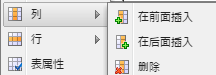
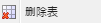

# 富文本编辑器{#rich-text-editor}

>[!CAUTION]
>
>AEM 6.4已结束扩展支持，本文档将不再更新。 有关更多详细信息，请参阅 [技术支助期](https://helpx.adobe.com/cn/support/programs/eol-matrix.html). 查找支持的版本 [此处](https://experienceleague.adobe.com/docs/).

富文本编辑器是将文本内容输入到AEM中的基本构建块。 它构成各种组件的基础，包括：

* 文本
* 文本图像
* 表

## 富文本编辑器 {#rich-text-editor-2}

所见即所得(WYSIWYG)编辑对话框提供多种功能：

>[!NOTE]
>
>可以为单个项目配置可用的功能，因此，在您的安装中可能会有所不同。

## 就地编辑 {#in-place-editing}

除了基于对话框的富文本编辑模式之外，AEM还提供就地编辑模式，当文本在页面布局中显示时，该模式允许直接编辑文本。

单击段落两次（缓慢双击）以进入就地编辑模式（组件边框现在为橙色）。

您将能够直接编辑页面上的文本，而不是在对话框窗口中编辑。 只需进行更改，系统便会自动保存这些更改。

>[!NOTE]
>
>如果内容查找器处于打开状态，则选项卡顶部将显示一个包含RTE格式选项的工具栏（如上所示）。
>
>如果内容查找器未打开，则不会显示工具栏。

当前，已为 **文本** 和 **标题** 组件。

>[!NOTE]
>
>的 **标题** 组件旨在包含不带换行符的短文本。 在就地编辑模式下编辑标题时，输入换行符将打开一个新标题 **文本** 组件。

## 富文本编辑器的功能 {#features-of-the-rich-text-editor}

富文本编辑器提供了一系列功能，这些功能 [取决于配置](/help/sites-administering/rich-text-editor.md) 的值。 这些功能同时适用于触屏优化UI和经典UI。

### 基本字符格式 {#basic-character-formats}

您可以在此对所选（高亮显示）的字符应用格式；某些选项还具有快捷键：

* 粗体(Ctrl-B)
* 斜体(Ctrl-I)
* 下划线(Ctrl-U)
* 下标
* 上标

所有选项都将作为切换开关运行，因此重新选择将删除格式。

### 预定义样式和格式 {#predefined-styles-and-formats}

您的安装可以包括预定义的样式和格式。 这些选项可在 **样式** 和 **格式** 下拉列表，并可应用于您选择的文本。

样式可以应用于特定字符串（样式与CSS关联）：

而格式应用于整个文本段落(格式基于HTML):

只能更改特定格式(默认为 **段落**)。

样式可以删除；将光标放在已应用样式的文本中，然后单击删除图标：

>[!CAUTION]
>
>实际上，请勿重新选择已应用样式的任何文本，否则将停用该图标。

### 剪切、复制、粘贴 {#cut-copy-paste}

的标准函数 **剪切** 和 **复制** 中。 多种 **粘贴** 以满足不同格式的需求。

* 剪切(**Ctrl-X**)
* 复制(**Ctrl-C**)
* 粘贴

   这是默认的粘贴机制(**Ctrl-V**);安装现成功能后，该功能将配置为“从Word粘贴”。

* 粘贴为文本

   去除所有样式和格式，仅粘贴纯文本。

* 从 Word 粘贴

   这会将内容粘贴为HTML（需要重新设置一些格式）。

### 撤消、重做 {#undo-redo}

AEM会按时间顺序保留您在当前组件中最近50次操作的记录。 如果需要，可以按严格顺序撤消（然后重做）这些操作。

>[!CAUTION]
>
>历史记录仅保留在当前编辑会话中。 每次打开组件进行编辑时，都会重新启动该组件。

>[!NOTE]
>
>50是默认的任务数。 对于您的安装，这可能会有所不同。

### 对齐方式 {#alignment}

您的文本可以左对齐、居中对齐或右对齐。

### 缩进 {#indentation}

段落缩进可以增加或减少。 将缩进所选段落，输入的任何新文本将保留当前的缩进级别。

### 列表 {#lists}

项目符号和编号列表均可在文本中创建。 选择列表类型并开始键入或突出显示要转换的文本。 在这两种情况下，行馈送都将开始新的列表项。

嵌套列表可通过缩进一个或多个列表项来实现。

只需将光标放在列表内，然后选择其他样式即可更改列表样式。 子列表还可以与容器列表有不同的样式。 创建子列表（通过缩进）后，即可应用此设置。

### 链接 {#links}

通过突出显示所需文本，然后单击 **超链接** 图标：

利用对话框，可指定目标URL;还有是否应在新窗口中打开该窗口。

您可以：

* 直接键入URI
* 使用站点地图在您的网站中选择页面
* 输入URI，然后附加目标锚点；例如 `www.TargetUri.org#AnchorName`
* 仅输入锚点（引用“当前页面”）；例如 `#anchor`
* 在内容查找器中搜索页面，然后将页面图标拖放到“超链接”对话框中

>[!NOTE]
>
>URI可以前面附加为您的安装配置的任何协议。 在标准安装中，这些 `https://`, `ftp://`和 `mailto:`. 未为安装配置的协议将被拒绝并标记为无效。

要中断链接，请将光标置于链接文本中的任意位置，然后单击 **取消链接** 图标：

### 锚点 {#anchors}

通过定位光标或选择某些文本，可在文本中的任意位置创建锚点。 然后，单击 **锚点** 图标以打开对话框。

输入锚点的名称，然后单击 **确定** 保存。

在编辑组件时会显示锚点，现在可以在链接的目标中使用锚点。

### 查找和替换 {#find-and-replace}

AEM提供 **查找** 和 **替换** （查找并替换）函数。

两者都有 **查找下一个** 按钮来搜索打开的组件以查找指定的文本。 您还可以指定是否需要匹配大小写（上/下）。

搜索将始终从文本中的当前光标位置开始。 当到达组件结尾时，将显示一条消息，通知您下一个搜索操作将从顶部开始。

的 **替换** 选项 **查找**，则 **替换** 具有指定文本的单个实例，或 **全部替换** 实例。

### 图像 {#images}

可以从内容查找器中拖动图像以将其添加到文本。

>[!NOTE]
>
>AEM还提供了专门的组件，用于进行更详细的图像配置。 例如， **图像** 和 **文本图像** 组件可用。

### 拼写检查 {#spelling-checker}

拼写检查器将检查当前组件中的所有文本。

任何不正确的拼写将突出显示：

>[!NOTE]
>
>拼写检查将通过获取子树的语言属性或从URL中提取语言来以网站的语言运行。 例如， `en` 将检查分支是否为英语，并且 `de` 德语分支。

### 表格 {#tables}

表格同时可用：

* 作为 **表** 组件

   

* 从 **文本** 组件

   

   >[!NOTE]
   >
   >尽管RTE中提供了表，但建议使用 **表** 组件。

在 **文本** 和 **表** 组件表功能可通过单击表格中的上下文菜单（通常是鼠标右键）来使用；例如：

>[!NOTE]
>
>在 **表** 组件中，还提供了专用工具栏，包括各种标准富文本编辑器功能，以及一部分特定于表的功能。

表特定的函数包括：

<table> 
 <tbody> 
  <tr> 
   <td><a href="#table-properties">表属性</a>  </td> 
  </tr> 
  <tr> 
   <td><a href="#cell-properties">单元格属性  </a></td> 
  </tr> 
  <tr> 
   <td><a href="#add-or-delete-rows">添加或删除行  </a></td> 
  </tr> 
  <tr> 
   <td><a href="#add-or-delete-columns">添加或删除列  </a></td> 
  </tr> 
  <tr> 
   <td><a href="#selecting-entire-rows-or-columns">选择整行或整列  </a></td> 
  </tr> 
  <tr> 
   <td><a href="#merge-cells">合并单元格  </a></td> 
  </tr> 
  <tr> 
   <td><a href="#split-cells">拆分单元格  </a></td> 
  </tr> 
  <tr> 
   <td><a href="#creating-nested-tables">嵌套表</a></td> 
  </tr> 
  <tr> 
   <td><a href="#remove-table">删除表</a> </td> 
  </tr> 
 </tbody> 
</table>

#### 表属性 {#table-properties}

在单击 **确定** 保存：

* **宽度**

   表的总宽度。

* **高度**

   表的总高度。

* **边框**

   表边框的大小。

* **单元格边距**

   这定义单元格内容与其边框之间的空白。

* **单元格间距**

   这定义单元格之间的距离。

>[!NOTE]
>
>**宽度**, **高度** 并且某些单元格属性可以在以下任一位置定义：
>
>* 像素
>* 百分比

>[!CAUTION]
>
>Adobe强烈建议您定义 **宽度** 你的桌子。

#### 单元格属性 {#cell-properties}

可以配置特定单元格或一系列单元格的属性：

* **宽度**
* **高度**
* **水平对齐**  — 左、中或右
* **垂直对齐**  — 顶部、中间、底部或基线
* **单元格类型**  — 数据或标题
* **应用于:**
   * 单一单元格
   * 整个行
   * 整个列

#### 添加或删除行 {#add-or-delete-rows}

行可以添加到当前行的上方或下方。

还可以删除当前行。

#### 添加或删除列 {#add-or-delete-columns}

列可以添加到当前列的左侧或右侧。

还可以删除当前列。

#### 选择整行或整列 {#selecting-entire-rows-or-columns}

选择整个当前行或列。 然后可以执行特定操作（例如合并）。

#### 合并单元格 {#merge-cells}

 

* 如果已选择一组单元格，则可以将这些单元格合并到一个单元格中。
* 如果只选择了一个单元格，则可以将其与右侧或下方的单元格合并。

#### 拆分单元格 {#split-cells}

选择单个单元格以将其拆分：

* 水平拆分单元格将在当前单元格右侧的当前列中生成一个新单元格。
* 垂直拆分单元格将在当前单元格下方，但在当前行内生成一个新单元格。

#### 创建嵌套表 {#creating-nested-tables}

创建嵌套表将在当前单元格中创建一个新的、自包含的表。

>[!NOTE]
>
>某些其他行为取决于浏览器：
>
>* Windows IE:按住Ctrl+主鼠标按钮并单击（通常为左键）可选择多个单元格。
>* Firefox:拖动鼠标以选择单元格范围。
>

#### 删除表 {#remove-table}

这将从 **文本** 组件。

### 特殊字符 {#special-characters}

富文本编辑器中可以使用特殊字符；这些值可能因您的安装而异。

使用鼠标悬停可查看字符的放大版本，然后单击以将其包含在文本的当前位置。

### 源编辑模式 {#source-editing-mode}

在源编辑模式下，您可以查看和编辑组件的基础HTML。

因此，文本：

在源模式下将如下所示（通常源的时间较长，因此您必须滚动）：

>[!CAUTION]
>
>离开源模式时，AEM会进行某些验证检查（例如，确保文本正确包含/嵌套在块中）。 这可能会导致对您所做的编辑进行更改。
