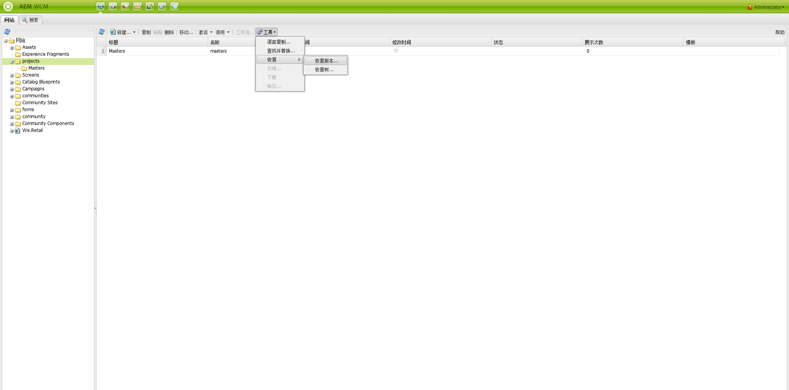
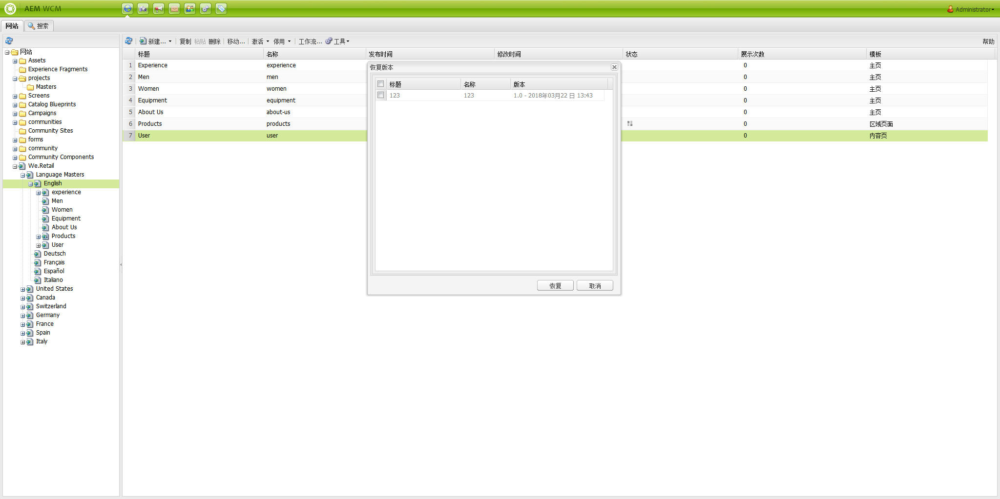
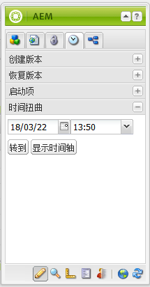
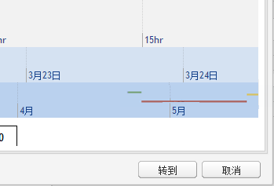

# 处理页面版本{#working-with-page-versions}

>[!CAUTION]
>
>AEM 6.4已结束扩展支持，本文档将不再更新。 有关更多详细信息，请参阅 [技术支助期](https://helpx.adobe.com/cn/support/programs/eol-matrix.html). 查找支持的版本 [此处](https://experienceleague.adobe.com/docs/).

版本控制可创建页面在特定时间点的“快照”。 通过版本控制，您可以执行以下操作：

* 创建页面版本。
* 将页面恢复到之前的版本，以撤消您对页面所做的更改，例如。
* 将页面的当前版本与之前版本进行比较，并突出显示文本和图像中的差异。

## 创建新版本 {#creating-a-new-version}

要创建页面的新版本，请执行以下操作：

1. 在浏览器中，打开要为其创建新版本的页面。
1. 在Sidekick中，选择 **版本控制** 选项卡，然后 **创建版本** 子选项卡。

   

1. 输入 **注释** （可选）。
1. 要将标签设置为版本（可选），请单击 **更多>>** 按钮并设置 **标签** 以命名版本。 如果未设置标签，则版本是自动递增的编号。
1. 单击 **创建版本**. 页面上显示一条灰显的消息；例如：

   版本1.2创建用于：衬衫。

>[!NOTE]
>
>激活页面时会自动创建版本。

## 从Sidekick恢复页面版本 {#restoring-a-page-version-from-sidekick}

要将页面恢复到以前的版本，请执行以下操作：

1. 打开要恢复其先前版本的页面。
1. 在Sidekick中，选择 **版本控制** 选项卡，然后 **还原版本** 子选项卡。

   

1. 选择要恢复的版本，然后选择 **还原**.

## 从控制台恢复页面版本 {#restoring-a-page-version-from-the-console}

此方法可用于恢复页面版本。 它还可用于恢复之前已删除的页面：

1. 在 **网站** 控制台中，导航到要恢复的页面并将其选中。
1. 从顶部菜单中，选择 **工具**，则 **还原**:

   

1. 选择**恢复版本……**列出当前文件夹中文档的版本。 即使页面已被删除，也会列出最后一个版本：

   

1. 选择要恢复的版本，然后单击 **还原**. AEM会恢复您选择的版本（或树）。

### 从控制台恢复树 {#restoring-a-tree-from-the-console}

此方法可用于恢复页面版本。 它还可用于恢复之前已删除的页面：

1. 在 **网站** 控制台中，导航到要恢复的文件夹并将其选中。
1. 从顶部菜单中，选择 **工具**，则 **还原**.
1. 选择 **还原树……** 打开用于选择要恢复的树的对话框：

   

1. 单击 **还原**. AEM会恢复您选择的树。

## 与以前的版本比较 {#comparing-with-a-previous-version}

要将页面的当前版本与之前的版本进行比较，请执行以下操作：

1. 在浏览器中，打开要与之前版本进行比较的页面。
1. 在Sidekick中，选择 **版本控制** 选项卡，然后 **恢复版本**&#x200B;子选项卡。

   

1. 选择要比较的版本，然后单击 **差异** 按钮。
1. 当前版本与选定版本之间的差异将如下所示：

   * 已删除的文本为红色并点进。
   * 添加的文本为绿色并突出显示。
   * 已添加或删除的图像将呈绿色边框。

   

1. 在Sidekick中，选择 **还原版本** 子选项卡，然后单击 **&lt;&lt;back span=&quot;&quot; id=&quot;3&quot; translate=&quot;no&quot; /> 按钮以显示当前版本。**

## 时间扭曲 {#timewarp}

时间扭曲是一项功能，旨在模拟过去特定时间某个页面的&#x200B;***已发布***&#x200B;状态。

其目的是允许您跟踪在选定时间点发布的网站。 它使用页面激活来确定发布环境的状态。

要执行此操作：

* 系统会查找在选定时间处于活动状态的页面版本。
* 这表示显示的版本已创建/激活 *之前* 在时间扭曲中选择的时间点。
* 当导航到已删除的页面时，也会呈现该页面 — 只要该页面的旧版本仍然位于存储库中即可。
* 如果未找到已发布的版本，则时间扭曲会还原到该页面在创作环境中的当前状态（这是为了防止出现错误/404页面，该页面意味着您不能再继续浏览）。

>[!NOTE]
>
>如果从存储库中删除了版本，则时间扭曲无法显示正确的视图。 此外，如果呈现网站的元素（如代码、css、图像等）发生更改，则视图将与它原来的样子不同，因为这些项目不在存储库中进行版本控制。

### 使用时间扭曲日历 {#using-the-timewarp-calendar}

时间扭曲可从Sidekick中使用。

如果要查看特定日期，则使用日历版本：

1. 打开 **版本控制** ，然后单击 **时间扭曲** （靠近Sidekick的底部）。 将显示以下对话框：

   

1. 使用日期和时间选择器指定所需的日期/时间并单击 **开始**.

   时间扭曲将显示页面在您选择的日期之前/当天处于发布状态的情况。

   >[!NOTE]
   >
   >仅当您之前已发布页面时，时间扭曲才会完全正常工作。 如果没有，时间扭曲将在创作环境显示当前页面。

   >[!NOTE]
   >
   >如果导航到已从存储库删除的页面，并且该页面的旧版本仍然位于存储库中，则该页面将正确呈现。

   >[!NOTE]
   >
   >您无法编辑页面的旧版本。 旧版本仅供查看。如果要恢复旧版本，则必须使用[恢复](/help/sites-classic-ui-authoring/classic-page-author-work-with-versions.md#restoring-a-page-version-from-sidekick)功能手动恢复。

1. 查看完页面后，单击：

   * **退出时间扭曲** 退出并返回到当前创作页面。
   * [显示时间轴](#using-the-timewarp-timeline) 查看时间轴。

   

### 使用时间扭曲时间轴 {#using-the-timewarp-timeline}

如果您想要在页面上查看发布活动的概述，请使用时间轴版本。

如果要查看文档的时间轴：

1. 要显示时间轴，您可以：

   1. 打开 **版本控制** ，然后单击 **时间扭曲** （靠近Sidekick的底部）。
   1. 使用在 [使用时间扭曲日历](#using-the-timewarp-calendar).

1. 单击 **显示时间轴**  — 将显示文档的时间表；例如：

   

1. 选择并移动（按住并拖动）时间轴，以在文档的时间轴中移动。

   * 所有行均指示已发布的版本。

      激活页面后，将开始一行新内容。 每次编辑文档时，都会显示一种新颜色。

      在以下示例中，红线表示页面是在初始绿色版本的时间段内编辑的，黄线表示页面在红色版本期间进行了编辑，等等。
   

1. 单击:

   1. **开始** 显示已发布页面在选定时间点的内容。
   1. 显示该内容时，请使用 **退出时间扭曲** 退出并返回到当前创作页面。

### 时间扭曲限制

时间扭曲会尽量在选定的时刻重现页面。但是，由于在 AEM 中连续创作内容的过程非常复杂，并非总能实现这一点。在使用时间扭曲时，应牢记以下限制。

* **时间扭曲基于已发布的页面工作** – 仅当您之前已发布页面时，时间扭曲才会完全正常工作。如果没有，时间扭曲将在创作环境显示当前页面。
* **时间扭曲使用页面版本** – 当您浏览到的页面已从存储库删除时，如果该页面的旧版本仍然位于存储库中，则该页面将会正常呈现。
* **已删除的版本会影响时间扭曲** – 如果从存储库从删除了版本，那么时间扭曲无法显示正确的视图。
* **时间扭曲为只读** – 您无法编辑页面的旧版本。旧版本仅供查看。如果要恢复旧版本，则必须使用恢复功能手动恢复。
* **时间扭曲仅基于页面内容** – 如果呈现网站的元素（如代码、css、资产/图像等）发生更改，则视图将与它原来的样子不同，因为这些项目不在存储库中进行版本控制。

>[!CAUTION]
>
>时间扭曲旨在作为一种工具，帮助作者理解和创建其内容。 而不是用作审查日志或用于法律目的。
