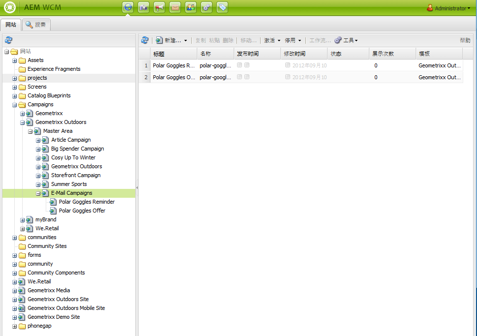
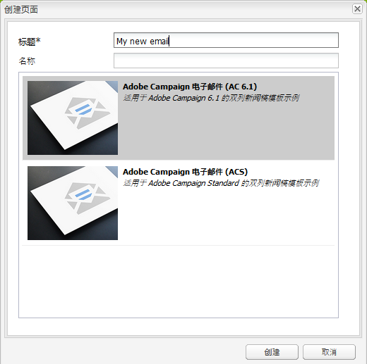
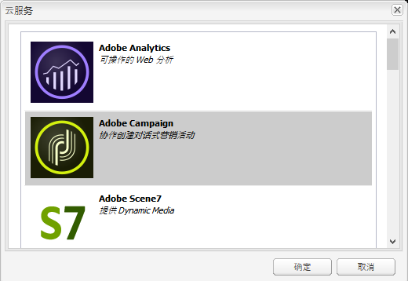
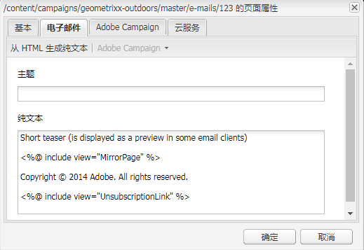
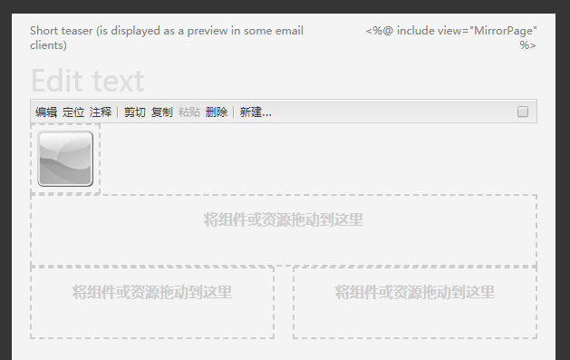
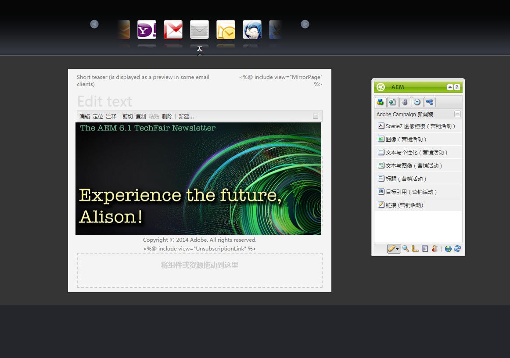
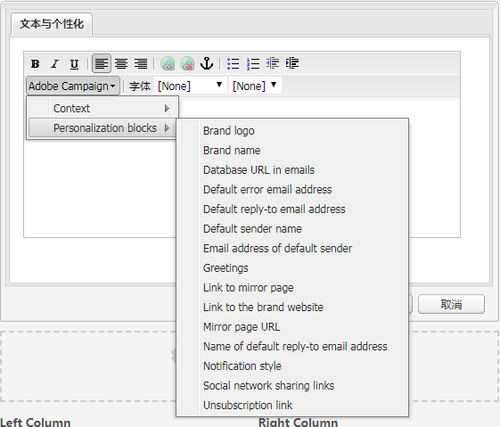
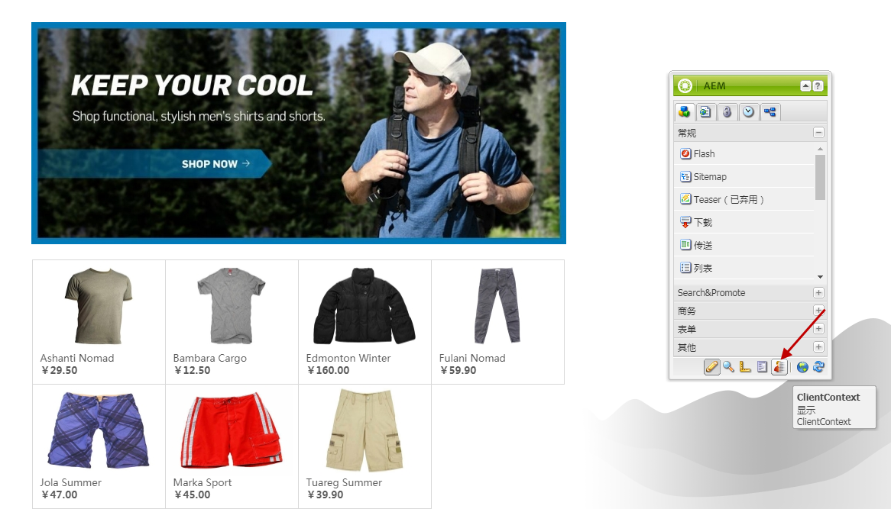
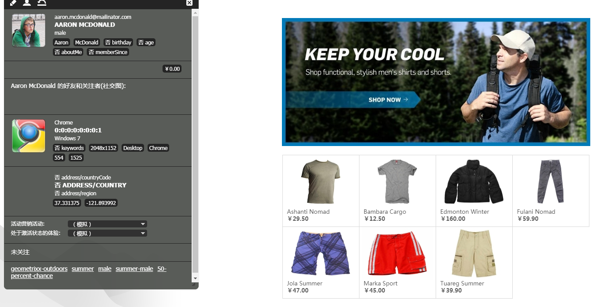
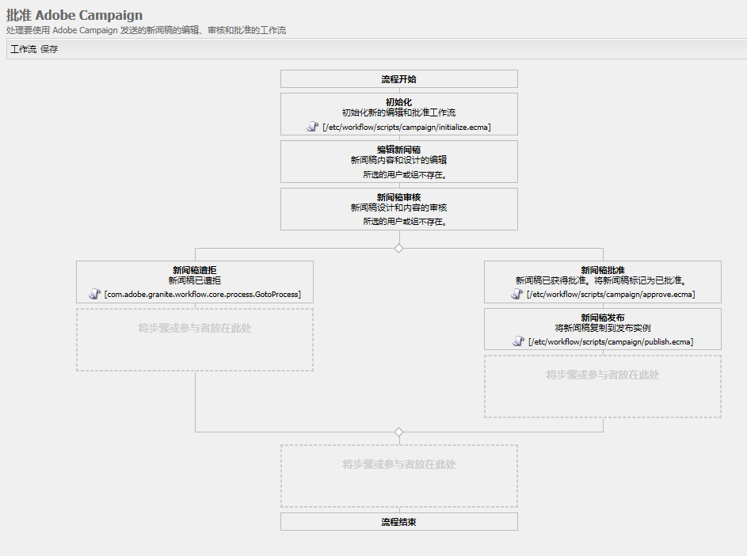

# 使用Adobe Campaign 6.1和Adobe Campaign Standard{#working-with-adobe-campaign-and-adobe-campaign-standard}

>[!CAUTION]
>
>AEM 6.4已结束扩展支持，本文档将不再更新。 有关更多详细信息，请参阅 [技术支助期](https://helpx.adobe.com/cn/support/programs/eol-matrix.html). 查找支持的版本 [此处](https://experienceleague.adobe.com/docs/).

您可以在AEM中创建电子邮件内容，然后在Adobe Campaign电子邮件中对其进行处理。 为此，您必须：

1. 在AEM中通过特定于Adobe Campaign的模板创建新闻稿。
1. 选择 [Adobe Campaign服务](#selectingtheadobecampaigncloudservice) 编辑内容以访问所有功能之前，请执行此操作。
1. 编辑内容。
1. 验证内容。

然后，可以在Adobe Campaign中将内容与分发同步。 本文档中对详细说明进行了描述。

>[!NOTE]
>
>在使用此功能之前，您必须配置AEM以与 [Adobe Campaign](/help/sites-administering/campaignonpremise.md) 或 [Adobe Campaign Standard](/help/sites-administering/campaignstandard.md).

## 通过Adobe Campaign发送电子邮件内容 {#sending-email-content-via-adobe-campaign}

配置AEM和Adobe Campaign后，您可以直接在AEM中创建电子邮件投放内容，然后在Adobe Campaign中对其进行处理。

在AEM中创建Adobe Campaign内容时，必须先链接到Adobe Campaign服务，然后才能编辑内容以访问所有功能。

可能有两种情况：

* 内容可以与来自Adobe Campaign的投放同步。 这允许您在投放中使用AEM内容。
* (仅限Adobe Campaign内部部署)内容可直接发送到Adobe Campaign，从而自动生成新的电子邮件投放。 此模式存在限制。

本文档中对详细说明进行了描述。

### 创建新电子邮件内容 {#creating-new-email-content}

>[!NOTE]
>
>添加电子邮件模板时，请确保在 **/content/campaigns** 以便提供。

1. 在AEM中，选择 **网站** 文件夹，然后浏览资源管理器以查找管理电子邮件促销活动的位置。 在以下示例中，相关节点是 **网站** > **促销活动** > **Geometrixx Outdoors** > **电子邮件营销活动**.

   >[!NOTE]
   >
   >[电子邮件示例仅在Geometrixx中可用](/help/sites-developing/we-retail.md#weretail). 请从包共享下载示例Geometrixx内容。

   

1. 选择 **新建** > **新页面** 创建新电子邮件内容。
1. 选择特定于Adobe Campaign的可用模板之一，然后填写页面的常规属性。 默认情况下，有三个模板可用：

   * **Adobe Campaign电子邮件(AC 6.1)**:允许您在将内容发送到Adobe Campaign 6.1进行交付之前，先将内容添加到预定义模板。
   * **Adobe Campaign电子邮件(ACS)**:允许您在将内容发送到Adobe Campaign Standard进行交付之前，先将内容添加到预定义模板。

   

1. 单击 **创建** 创建电子邮件或新闻稿。

### 选择Adobe Campaign云服务和模板 {#selecting-the-adobe-campaign-cloud-service-and-template}

要与Adobe Campaign集成，您需要将Adobe Campaign云服务添加到页面。 这样，您就可以访问个性化和其他Adobe Campaign信息。

此外，您还可能需要选择Adobe Campaign模板并更改主题，并为那些不会以HTML方式查看电子邮件的用户添加纯文本内容。

1. 选择 **页面** ，然后选择 **页面属性。**
1. 在 **云服务** ，请选择 **添加服务** 添加Adobe Campaign服务并单击 **确定**.

   

1. 从下拉列表中选择与您的Adobe Campaign实例匹配的配置，然后单击 **确定**.

   >[!NOTE]
   >
   >确保点按/单击 **确定** 或 **应用** 添加云服务之后。 这将启用 **Adobe Campaign** 选项卡。

1. 如果您要应用特定的电子邮件投放模板(来自Adobe Campaign)，而不是默认模板 **邮件** 模板，选择 **页面属性** 再次。 在 **Adobe Campaign** 选项卡，在相关的Adobe Campaign实例中输入电子邮件投放模板的内部名称。

   在Adobe Campaign Standard中，模板为 **使用AEM内容交付**. 在Adobe Campaign 6.1中，模板为 **包含AEM内容的电子邮件投放**.

   选择模板时，AEM会自动启用 **Adobe Campaign新闻稿** 组件。

### 编辑电子邮件内容 {#editing-email-content}

您可以在经典用户界面或触屏优化用户界面中编辑电子邮件内容。

1. 通过选择 **页面属性** > **电子邮件** 中。

   

1. 通过从Sidekick中可用的元素添加所需的元素来编辑电子邮件内容。 要执行此操作，请拖放它们。 然后，双击要编辑的元素。

   例如，您可以添加包含个性化字段的文本。

   

   请参阅 [Adobe Campaign组件](/help/sites-classic-ui-authoring/classic-personalization-ac-components.md) 有关可用于Adobe Campaign新闻稿/电子邮件营销活动的组件的描述。

   

### 插入个性化 {#inserting-personalization}

在编辑内容时，您可以插入：

* Adobe Campaign上下文字段。 这些字段可以插入到文本中，并根据收件人的数据（例如名字、姓氏或目标维度的任何数据）进行相应调整。
* Adobe Campaign个性化块。 这些是与收件人数据无关的预定义内容块，例如品牌徽标或指向镜像页面的链接。

请参阅 [Adobe Campaign组件](/help/sites-classic-ui-authoring/classic-personalization-ac-components.md) ，以获取营销活动组件的完整说明。

>[!NOTE]
>
>* 只有Adobe Campaign的字段 **用户档案** 定向维度被考虑在内。
>* 从查看属性时 **站点**，则您无权访问Adobe Campaign上下文字段。 您可以在编辑时直接从电子邮件中访问这些源代码。
>

1. 插入新 **新闻稿** > **文本与个性化（营销活动）** 组件。
1. 双击组件以打开该组件。 的 **编辑** 窗口中提供了用于插入个性化元素的功能。

   >[!NOTE]
   >
   >可用的上下文字段对应于 **用户档案** 定向维度。Adobe Campaign
   >
   >请参阅 [将AEM页面链接到Adobe Campaign电子邮件](/help/sites-classic-ui-authoring/classic-personalization-ac-campaign.md#linkinganaempagetoanadobecampaignemail).

   

1. 选择 **Client Context** ，以使用角色配置文件中的数据测试个性化字段。

   

1. 此时会出现一个窗口，允许您选择所需的角色。 个性化字段会自动替换为选定用户档案中的数据。

   

### 预览新闻稿 {#previewing-a-newsletter}

您可以预览新闻稿的外观，也可以预览个性化。

1. 打开要预览的新闻稿，然后单击预览（放大镜）以缩小Sidekick。
1. 单击其中一个电子邮件客户端图标可查看您的新闻稿在每个电子邮件客户端中的外观。

   

1. 展开Sidekick以再次开始编辑。

### 在AEM中批准内容 {#approving-content-in-aem}

内容完成后，您可以启动批准流程。 转到 **工作流** 选项卡，然后选择 **批准Adobe Campaign** 工作流。

此开箱即用的工作流包含两个步骤：修订后批准，或修订后拒绝。 但是，此工作流可以扩展并适应更复杂的流程。

要批准Adobe Campaign的内容，请通过选择 **工作流** 在Sidekick中选择 **批准Adobe Campaign** 单击 **启动工作流**. 完成这些步骤并批准内容。 您还可以通过选择 **拒绝** 而不是 **批准** 在最后一个工作流步骤中。

内容获得批准后，在Adobe Campaign中显示为已批准。 然后，即可发送该电子邮件。

在Adobe Campaign Standard:

在Adobe Campaign 6.1中：

>[!NOTE]
>
>未批准的内容可以与Adobe Campaign中的投放同步，但无法执行投放。 只能通过Campaign投放发送已批准的内容。

## 将AEM与Adobe Campaign Standard和Adobe Campaign 6.1关联 {#linking-aem-with-adobe-campaign-standard-and-adobe-campaign}

>[!NOTE]
>
>请参阅 [将AEM与Adobe Campaign Standard和Adobe Campaign 6.1关联](/help/sites-authoring/campaign.md#linking-aem-with-adobe-campaign-standard-and-adobe-campaign-classic) 在 [使用Adobe Campaign 6.1和Adobe Campaign Standard](/help/sites-authoring/campaign.md) 在标准创作文档中，以了解详细信息。
