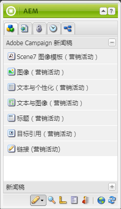
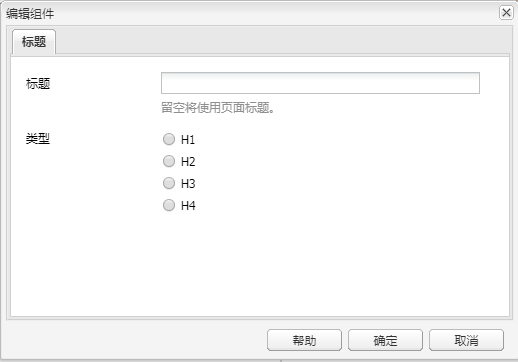
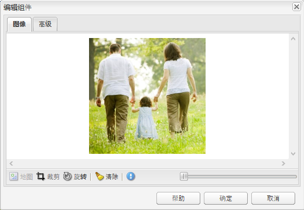
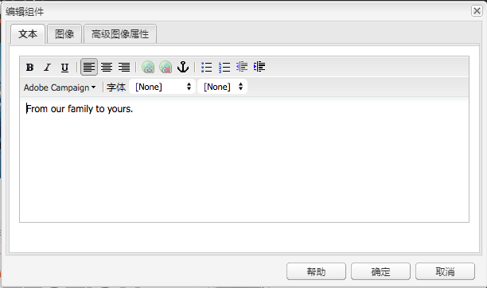
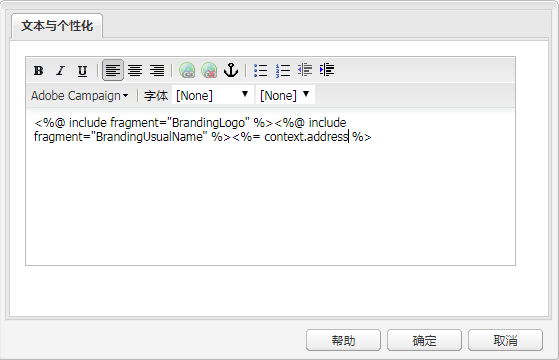

# Adobe Campaign组件{#adobe-campaign-components}

>[!CAUTION]
>
>AEM 6.4已结束扩展支持，本文档将不再更新。 有关更多详细信息，请参阅 [技术支助期](https://helpx.adobe.com/cn/support/programs/eol-matrix.html). 查找支持的版本 [此处](https://experienceleague.adobe.com/docs/).

与Adobe Campaign集成后，在使用新闻稿和表单时，您会有可用的组件。 本文档对这两种方法进行了描述。

## Adobe Campaign新闻稿组件 {#adobe-campaign-newsletter-components}

所有营销活动组件都遵循 [电子邮件模板最佳实践](/help/sites-administering/best-practices-for-email-templates.md) 和基于Adobe标记语言 [HTL](https://helpx.adobe.com/cn/experience-manager/htl/using/overview.html).

当您打开配置为与Adobe Campaign集成的新闻稿/电子邮件时，您应会在 **Adobe Campaign新闻稿** 部分：

* 标题（营销活动）
* 图像（营销活动）
* 链接 (营销活动)
* Scene7 图像模板（营销活动）
* 目标引用（营销活动）
* 文本与图像（营销活动）
* 文本与个性化（营销活动）

以下部分介绍了这些组件。

### 标题（营销活动） {#heading-campaign}

标题组件可以：

* 通过将 **标题** 字段。
* 显示您在 **标题** 字段。

您可以编辑 **标题（营销活动）** 组件。 留空将使用页面标题。

您可以配置以下内容：

* **标题**
如果要使用页面标题以外的名称，请在此处输入该名称。

* **标题级别(1、2、3、4)**
基于HTML标题大小1-4的标题级别。

以下示例显示正在显示的标题（营销活动）组件。

### 图像（营销活动） {#image-campaign}

图像（营销活动）组件根据指定的参数显示图像和随附文本。

您可以上传图像，然后对其进行编辑和处理（例如，裁剪、旋转、添加链接/标题/文本）。

您可以上传图像，然后对其进行编辑和处理（例如，裁剪、旋转、添加链接/标题/文本）。 您可以从 [内容查找器](/help/sites-authoring/author-environment-tools.md#thecontentfinderclassicui) 直接转到组件或其“编辑”对话框。 您还可以双击“编辑”对话框的中心区域，以浏览本地文件系统并上传图像。 “编辑”对话框的两个选项卡还控制图像的所有定义和操作：

加载图像后，您可以配置以下内容：

* **地图**
要映射图像，请选择“映射”。 您可以指定创建图像映射的方式（矩形、多边形等）以及区域应指向的位置。

* **裁切**
选择“裁剪”以裁剪图像。 使用鼠标裁剪图像。

* **旋转**
要旋转图像，请选择“旋转”。 反复使用，直到图像旋转到您想要的方式为止。

* **清除**
删除当前图像。

* 缩放栏（仅限经典）

   要放大和缩小图像，请使用图像下方的滑条（在“确定”和“取消”按钮上方）

* **标题**

   图像的标题。

* **替换文本**

   用于创建辅助内容时使用的替换文本。

* **链接到**

   创建指向资产或您网站中其他页面的链接。

* **描述**

   图像的描述。

* **大小**

   设置图像的高度和宽度。

>[!NOTE]
>
>您必须在 **替换文本** 字段 **高级** 选项卡，或者无法保存图像，并且会看到以下错误消息：
>
>`Validation failed. Verify the values of the marked fields.`

以下示例展示了所显示的图像（营销活动）组件。

### 链接 (营销活动) {#link-campaign}

链接（营销活动）组件允许您添加指向新闻稿的链接。 此组件仅在经典用户界面中可用，不过您可以在触屏优化用户界面中添加一个组件，然后在兼容模式下将其打开。

您可以在 **显示**, **URL信息**&#x200B;或 **高级** 选项卡：

* **链接标题**
链接的描述。 这是用户看到的文本。

* **链接工具提示**
添加有关如何使用链接的其他信息。

* **LinkType**
在下拉列表中，选择 
**自定义URL** 和 **自适应文档**. 此字段为必填字段. 如果选择自定义URL，则可以提供链接URL。 如果选择“自适应文档”，则可以提供文档路径。

* **其他URL参数**
添加任何其他URL参数。 单击添加项目可添加多个项目。

>[!NOTE]
>
>您必须在 **链接类型** 字段 **URL信息** 选项卡，或者无法保存组件，并且会看到以下错误消息：
>
>`Validation failed. Verify the values of the marked fields.`

以下示例展示了所显示的链接（营销活动）组件。

### 目标引用（营销活动） {#targeted-reference-campaign}

利用目标引用（营销活动）组件，可创建对目标段落的引用。

在此组件中，您导航到目标段落以将其选中。

单击下拉菜单，导航到要引用的段落。 完成后，单击 **确定**.

### 文本与图像（营销活动） {#text-image-campaign}

文本与图像（营销活动）组件可添加文本块和图像。

与文本与个性化（营销活动）和图像（营销活动）组件一样，您可以配置：

* **文本**
输入文本。 使用工具栏可修改格式、创建列表和添加链接。

* **图像**
从内容查找器中拖动图像，或单击以浏览到图像。 根据需要裁剪或旋转。

* **图像属性** (**高级图像属性**)

   用于指定以下内容：

   * **标题**

      块的标题；将由鼠标悬停显示。

   * **替换文本**

      无法显示图像时要显示的替换文本。

   * **链接到**

      创建指向资产或您网站中其他页面的链接。

   * **描述**

      图像的描述。

   * **大小**

      设置图像的高度和宽度。

>[!NOTE]
>
>的 **替换文本** 字段 **高级** 选项卡，或者组件无法保存，并且您会看到以下错误消息：
>
>`Validation failed. Verify the values of the marked fields.`

以下示例展示了所显示的文本与图像（营销活动）组件。

### 文本与个性化（营销活动） {#text-personalization-campaign}

通过文本与个性化（营销活动）组件，您可以使用所见即所得(WYSIWYG)编辑器输入文本块，该编辑器的功能由 [富文本编辑器](/help/sites-authoring/rich-text-editor.md). 此外，此组件还允许您使用Adobe Campaign提供的上下文字段和个性化块；另请参阅 [插入个性化](/help/sites-classic-ui-authoring/classic-personalization-ac-campaign.md#inserting-personalization).

利用所选图标，可设置文本格式，包括字体特性、对齐方式、链接、列表和缩进。

像在富文本编辑器中一样添加文本。 通过选择Adobe Campaign下拉列表并根据需要选择字段来添加个性化。

您可以添加文本和上下文字段或个性化块以创建内容。 接下来，选择Client Context以测试人物配置文件中的数据。 选择角色后，个性化字段会自动替换为选定用户档案中的数据。

>[!NOTE]
>
>仅在 **nms:seedMember** 架构或其某个扩展会被考虑在内。 链接到的表的属性 **nms:seedMember** 不可用。

## Adobe Campaign表单组件 {#adobe-campaign-form-components}

您可以使用Adobe Campaign组件创建用户填写的表单，以订阅新闻稿、取消订阅新闻稿，或更新其用户配置文件。

每个组件字段都可以链接到Adobe Campaign数据库字段。 可用字段因其包含的数据类型而异，如部分所述 [组件和数据类型](#components-and-data-type). 如果在Adobe Campaign中扩展收件人架构，则数据类型匹配的组件中将提供新字段。

当您打开配置为与Adobe Campaign集成的表单时，您会在 **Adobe Campaign** 部分：

* 复选框（营销活动）
* 日期字段（营销活动）和日期字段/HTML5（营销活动）
* 已加密的主要密钥（营销活动）
* 错误显示（营销活动）
* 隐藏的对帐密钥（营销活动）
* 数字字段（营销活动）
* 选项字段（营销活动）
* 订阅核对清单（营销活动）
* 文本字段（营销活动）

本节将详细介绍每个组件。

### 组件和数据类型 {#components-and-data-type}

下表介绍了可用于显示和修改Adobe Campaign配置文件数据的组件。 每个组件都可以映射到Adobe Campaign配置文件字段，以显示其值，并在提交表单时更新字段。 不同的组件只能匹配到相应数据类型的字段。

<table> 
 <tbody> 
  <tr> 
   <td>
<strong>组件</strong>
 </td> 
   <td>
<strong>Adobe Campaign字段的数据类型</strong>
 </td> 
   <td>
<strong>示例字段</strong>
 </td> 
  </tr> 
  <tr> 
   <td>
复选框（营销活动）
 </td> 
   <td>
布尔型
 </td> 
   <td>
不再联系（通过任何渠道）
 </td> 
  </tr> 
  <tr> 
   <td>
日期字段（营销活动）
 
日期字段/HTML 5（营销活动）
 </td> 
   <td>
日期
 </td> 
   <td>
出生日期
 </td> 
  </tr> 
  <tr> 
   <td>
数字字段（营销活动）
 </td> 
   <td>
数字（字节、短、长、双）
 </td> 
   <td>
年龄
 </td> 
  </tr> 
  <tr> 
   <td>
选项字段（营销活动）
 </td> 
   <td>
字节，关联值
 </td> 
   <td>
性别
 </td> 
  </tr> 
  <tr> 
   <td>
文本字段（营销活动）
 </td> 
   <td>
字符串
 </td> 
   <td>
电子邮件
 </td> 
  </tr> 
 </tbody> 
</table>

### 大多数组件通用的设置 {#settings-common-to-most-components}

Adobe Campaign组件具有所有组件（“已加密的主密钥”和“隐藏的对帐密钥”组件除外）中通用的设置。

在大多数组件中，您可以配置以下各项：

#### 标题与文本 {#title-and-text}

* **标题**

   如果要使用元素名称以外的名称，请在此处输入该名称。

* **隐藏标题**

   如果您不希望显示标题，请选中此复选框。

* **描述**

   向字段添加描述，以为用户提供更多信息。

* **仅显示值**

   仅显示值（如果存在）

#### Adobe Campaign {#adobe-campaign}

您可以配置以下内容：

* **映射**

   选择Adobe Campaign个性化字段（如果适用）。

* **对帐密钥**

   如果此字段是协调键值的一部分，则选中此复选框。

#### 约束 {#constraints}

* **必填**

   选中此复选框可使此组件成为必需组件；即用户必须输入一个值。

* **必需的消息**

   （可选）添加一条消息，说明字段为必填字段。

#### 样式 {#styling}

* **CSS**

   输入要用于此组件的CSS类。

### 复选框（营销活动） {#checkbox-campaign}

通过复选框（营销活动）组件，用户可以修改具有布尔数据类型的Adobe Campaign配置文件字段。 例如，您可以有一个复选框（营销活动）组件，允许收件人指定不希望通过任何渠道联系他/她。

您可以 [配置大多数Adobe Campaign组件通用的设置](#settings-common-to-most-components) 复选框（营销活动）组件中。

以下示例显示正在显示的复选框（营销活动）组件。

### 日期字段（营销活动）和日期字段/HTML5（营销活动） {#date-field-campaign-and-date-field-html-campaign}

使用日期字段允许收件人指定日期；例如，您可能希望收件人指定其出生日期。 日期格式与Adobe Campaign实例中使用的格式匹配。

除 [大多数Adobe Campaign组件通用的设置](#settings-common-to-most-components)，您可以配置以下内容：

* **约束 — 约束** 下拉列表

   您可以选择 —  **无** 或 **日期**  — 添加日期约束或不添加约束。 如果选择日期，则用户在字段中输入的答案必须采用日期格式。

* **约束消息**

   此外，您还可以添加约束消息，以便用户了解如何正确设置其答案的格式。

* **样式 — 宽度**

   通过单击或点按 **+** 和 **-** 图标或输入数字。

以下示例显示了显示调整了宽度的日期字段（营销活动）组件。

### 已加密的主要密钥（营销活动） {#encrypted-primary-key-campaign}

此组件定义将包含Adobe Campaign配置文件标识符的URL参数的名称(**主资源标识符** 或 **已加密的主密钥** 在Adobe Campaign Standard和6.1中)。

显示和修改Adobe Campaign用户档案数据的每个表单 **必须** 包括已加密的主密钥组件。

您可以在已加密的主密钥（营销活动）组件中配置以下内容：

* **标题和文本 — 元素名称**

   默认为encryptedPK。 仅当元素名称与表单上其他元素的名称冲突时，才需要更改该元素名称。 没有两个表单字段可以具有相同的元素名称。

* **Adobe Campaign - URL参数**

   为EPK添加URL参数。 例如，您可以使用 **epk**.

以下示例显示正在显示的已加密的主密钥（营销活动）组件。

### 错误显示（营销活动） {#error-display-campaign}

此组件允许您显示后端错误。 表单的错误处理需要设置为“转发”才能使组件正常工作。

以下示例展示了所显示的错误显示（营销活动）组件。

### 隐藏的对帐密钥（营销活动） {#hidden-reconciliation-key-campaign}

隐藏的协调键值（营销活动）组件允许您将隐藏字段作为协调键值的一部分添加到表单。

您可以在隐藏的协调键值（营销活动）组件中配置以下内容：

* **标题和文本 — 元素名称**

   默认为reconcilKey。 仅当元素名称与表单上其他元素的名称冲突时，才需要更改该元素名称。 没有两个表单字段可以具有相同的元素名称。
* **Adobe Campaign — 映射**
映射到Adobe Campaign个性化字段。

以下示例显示了所显示的隐藏的协调键值（营销活动）组件。

### 数字字段（营销活动） {#numeric-field-campaign}

使用数字字段允许收件人输入数字，例如其年龄。

除 [大多数Adobe Campaign组件通用的设置](#settings-common-to-most-components)，您可以配置以下内容：

* **约束 — 约束** 下拉列表

   您可以选择 —  **无** 或 **数值**  — 添加数字约束或不添加任何约束。 如果选择数字，则用户在字段中输入的答案必须是数字。

* **约束消息**

   此外，您还可以添加约束消息，以便用户了解如何正确设置其答案的格式。
* **样式 — 宽度**
通过单击或点按 
**+** 和 **-** 图标或输入数字。

以下示例显示了配置了显示宽度的数字字段（营销活动）组件。

### 选项字段（营销活动） {#option-field-campaign}

此下拉列表允许您选择一个选项；例如，收件人的性别或地位。

您可以 [配置大多数Adobe Campaign组件通用的设置](#settings-common-to-most-components) (在选项字段（营销活动）组件中)。 要填充下拉列表，请单击或点按Adobe Campaign个性化字段中的相应字段，然后导航到相应的字段。

以下示例展示了所显示的选项字段（营销活动）组件。

### 订阅核对清单（营销活动） {#subscriptions-checklist-campaign}

使用 **订阅核对清单（营销活动）** 用于修改与Adobe Campaign配置文件关联的订阅的组件。

添加到表单后，此组件会将所有可用的订阅显示为复选框，并允许用户选择所需的订阅。 用户提交表单时，此组件会根据表单操作类型(**Adobe Campaign:订阅服务** 或 **Adobe Campaign:取消订阅服务**)。

>[!NOTE]
>
>该组件不会检查用户已订阅/退订的服务。

您可以 [配置大多数Adobe Campaign组件通用的设置](#settings-common-to-most-components) (在订阅核对清单（营销活动）组件中)。 (没有可用于此组件的Adobe Campaign配置。)

以下示例展示了所显示的订阅核对清单（营销活动）组件。

### 文本字段（营销活动） {#text-field-campaign}

用于输入字符串类型数据的文本字段（营销活动）组件，例如名字、姓氏、地址、电子邮件地址等。

除 [大多数Adobe Campaign组件通用的设置](#settings-common-to-most-components)，您可以配置以下内容：

* **约束 — 约束** 下拉列表

   您可以选择 —  **无，电子邮件，** 或 **名称（无变音）**  — 添加电子邮件地址、名称或无约束的约束。 如果选择电子邮件，则用户在字段中输入的答案必须是电子邮件地址。 如果选择名称，则必须是名称（不允许变音）。

* **约束消息**

   此外，您还可以添加约束消息，以便用户了解如何正确设置其答案的格式。

* **样式 — 宽度**

   通过单击或点按 **+** 和 **-** 图标或输入数字。

以下示例显示正在显示的文本字段（营销活动）组件。

