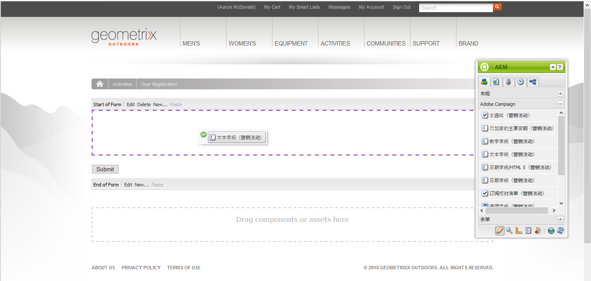

# 在 AEM 中创建 Adobe Campaign 表单{#creating-adobe-campaign-forms-in-aem}

AEM 允许您在网站上创建和使用与 Adobe Campaign 交互的表单。可以将特定字段插入到表单中，并将其映射到 Adobe Campaign 数据库。

您可以管理新的联系人订阅、取消订阅和用户配置文件数据，同时将他们的数据集成到 Adobe Campaign 数据库中。

要在 AEM 中使用 Adobe Campaign 表单，您需要执行本文档中所述的以下步骤：

1. 启用模板。
1. 创建表单。
1. 编辑表单内容。

默认情况下，可以使用三种特定于 Adobe Campaign 的表单：

* 保存配置文件
* 订阅服务
* 取消订阅服务

这些表单定义了一个 URL 参数，用于接受 Adobe Campaign 配置文件的已加密的主要密钥。根据此 URL 参数，表单会更新关联的 Adobe Campaign 配置文件的数据。

虽然您可以独立创建这些表单，但在典型用例中，您需要在新闻稿内容中生成一个指向表单页面的个性化链接，以使收件人能够打开该链接并调整其配置文件数据（无论是取消订阅、订阅还是更新其配置文件）。

表单会根据用户自动进行更新。有关更多信息，请参阅[编辑表单内容](#editing-form-content)。

## 启用模板  {#making-a-template-available}

您必须先在 AEM 应用程序中启用不同的模板，然后才能创建特定于 Adobe Campaign 的表单。

为此，请参阅[模板文档](/help/sites-developing/page-templates-static.md#templateavailability)。

首先，需检查创作和发布实例之间的连接，并确认 Adobe Campaign 正在运行。请参阅[与 Adobe Campaign Standard 集成](/help/sites-administering/campaignstandard.md)或[与 Adobe Campaign 6.1 集成](/help/sites-administering/campaignonpremise.md)。

>[!NOTE]
>
>使用 Adobe Campaign 6.1.x 或 Adobe Campaign Standard 时，请确保页面的 **jcr:content** 节点上的 **acMapping** 属性分别设置为 **mapRecipient** 或 **profile**。

### 创建表单 {#creating-a-form}

1. 在 siteadmin 中启动。
1. 滚动浏览树结构以找到所选网站中要创建表单的位置。
1. 选择&#x200B;**新建** > **新页面……**。
1. 选择&#x200B;**Adobe Campaign配置文件(AC 6.1)**&#x200B;或&#x200B;**Adobe Campaign配置文件(ACS)**&#x200B;模板并输入页面属性。

   >[!NOTE]
   >
   >如果模板不可用，请参阅[使模板可用](/help/sites-classic-ui-authoring/classic-personalization-ac.md#activatingatemplate)一节。

1. 单击&#x200B;**创建**&#x200B;以创建表单。

   

   然后，您可以[编辑并配置表单的内容](#editing-form-content)。

## 编辑表单内容  {#editing-form-content}

Adobe Campaign 的专用表单具有特定的组件。这些组件提供了一个选项，允许您将表单的每个字段链接到 Adobe Campaign 数据库中的字段。

>[!NOTE]
>
>如果所需的模板不可用，请参阅[使模板可用](/help/sites-classic-ui-authoring/classic-personalization-ac.md#activatingatemplate)。

此部分仅详细介绍了 Adobe Campaign 的特定链接。有关如何在Adobe Experience Manager中使用表单的更常规概述的更多信息，请参阅[编辑模式组件](/help/sites-classic-ui-authoring/classic-page-author-edit-mode.md)。

1. 导航到要编辑的表单。
1. 在工具箱中，选择&#x200B;**Page** > **Page Properties...然后，转到弹出窗口的** Cloud Services **选项卡。**
1. 单击&#x200B;**添加服务**，然后在服务的下拉列表中选择与您的Adobe Campaign实例对应的配置，以添加Adobe Campaign服务。 在设置实例之间的连接时会执行此配置。有关更多信息，请参阅[将AEM连接到Adobe Campaign](/help/sites-administering/campaignonpremise.md#connecting-aem-to-adobe-campaign)。

   >[!NOTE]
   >
   >如有必要，请通过单击挂锁图标来解锁配置，以便能够添加 Adobe Campaign 服务。

1. 使用表单开头的&#x200B;**Edit**&#x200B;按钮访问表单的常规参数。 **表单**&#x200B;选项卡允许您选择在验证表单后用户将被重定向到的感谢页面。

   使用&#x200B;**Advanced**&#x200B;窗体可选择窗体类型。 **帖子选项**&#x200B;字段允许您在三种类型的Adobe Campaign表单中进行选择：

   * **Adobe Campaign: 保存配置文件**：允许您在 Adobe Campaign 中创建或更新收件人（默认值）。
   * **Adobe Campaign: 订阅服务**：允许您在 Adobe Campaign 中管理收件人的订阅。
   * **Adobe Campaign: 取消订阅服务**：允许您在 Adobe Campaign 中取消收件人的订阅。

   通过&#x200B;**Action Configuration**&#x200B;字段，可指定是否在Adobe Campaign数据库中创建尚不存在的收件人用户档案。 要执行此操作，请选中&#x200B;**如果不存在**&#x200B;创建用户选项。

1. 通过将所选组件从工具箱拖放到表单中来添加它们。有关可用的 Adobe Campaign 特定组件的更多信息，请参阅 [Adobe 表单组件](/help/sites-classic-ui-authoring/classic-personalization-ac-components.md)。

   

1. 双击已添加的字段以对其进行配置。通过&#x200B;**Adobe Campaign**&#x200B;选项卡，可将字段链接到Adobe Campaign收件人表中的字段。 您还可以指定字段是否为对帐密钥的一部分，对帐密钥允许识别 Adobe Campaign 数据库中已存在的收件人。

   >[!CAUTION]
   >
   >每个表单字段的&#x200B;**元素名称**&#x200B;必须不同。 如有必要，请更改名称。
   >
   >每个表单都必须包含&#x200B;**已加密的主密钥**&#x200B;组件，才能正确管理Adobe Campaign数据库中的收件人。

1. 通过选择工具箱中的&#x200B;**Page** > **激活页面**&#x200B;来激活页面。 该页面会在您的站点上激活。您可以通过转到 AEM 发布实例来查看它。验证表单后，Adobe Campaign 数据库中的数据便会更新。

## 测试表单  {#testing-a-form}

创建表单并编辑表单内容后，您可能需要手动测试表单是否可以正常工作。

>[!NOTE]
>
>每个表单上必须具有&#x200B;**已加密的主密钥**&#x200B;组件。 在“组件”中，选择“Adobe Campaign”，以便只显示这些组件。
>
>在此过程中，虽然您手动输入了 EPK 编号，但实际上，用户可以在新闻稿中获得此页面的链接（无论是取消订阅、订阅还是更新配置文件）。EPK 会根据用户自动进行更新。
>
>要创建该链接，请使用变量&#x200B;**主资源标识符**(Adobe Campaign Standard)或&#x200B;**加密的标识符**(Adobe Campaign 6.1)(例如，在&#x200B;**文本与个性化（营销活动）**&#x200B;组件中)，该变量链接到Adobe Campaign中的EPK。

为此，您需要手动获取 Adobe Campaign 配置文件的 EPK，然后将其附加到 URL：

1. 要获取 Adobe Campaign 配置文件的已加密的主要密钥 (EPK)，请执行以下操作：

   * 在Adobe Campaign Standard中 — 导航到&#x200B;**Profiles and Audiences** > **Profiles**，其中列出了现有的配置文件。 确保表在列中显示&#x200B;**主资源标识符**&#x200B;字段（可通过单击/点按&#x200B;**配置列表**&#x200B;来配置此字段）。 复制所需配置文件的主要资源标识符。
   * 在Adobe Campaign 6.11中，转到&#x200B;**Profiles and Targets** > **Recipients**，其中列出了现有的配置文件。 确保表在列中显示&#x200B;**加密标识符**&#x200B;字段（可通过右键单击某个条目并选择&#x200B;**配置列表……来配置此字段）。**)。 复制所需配置文件的已加密标识符。

1. 在AEM中，打开发布实例上的表单页面，并将步骤1中的EPK作为URL参数附加：使用您在创作表单时在EPK组件中定义的相同名称(例如：`?epk=...`)
1. 现在，表单可用于修改与链接的 Adobe Campaign 配置文件相关联的数据和订阅。修改某些字段并提交表单后，您可以在 Adobe Campaign 内验证相应数据是否已更新。

验证表单后，Adobe Campaign 数据库中的数据便会更新。
