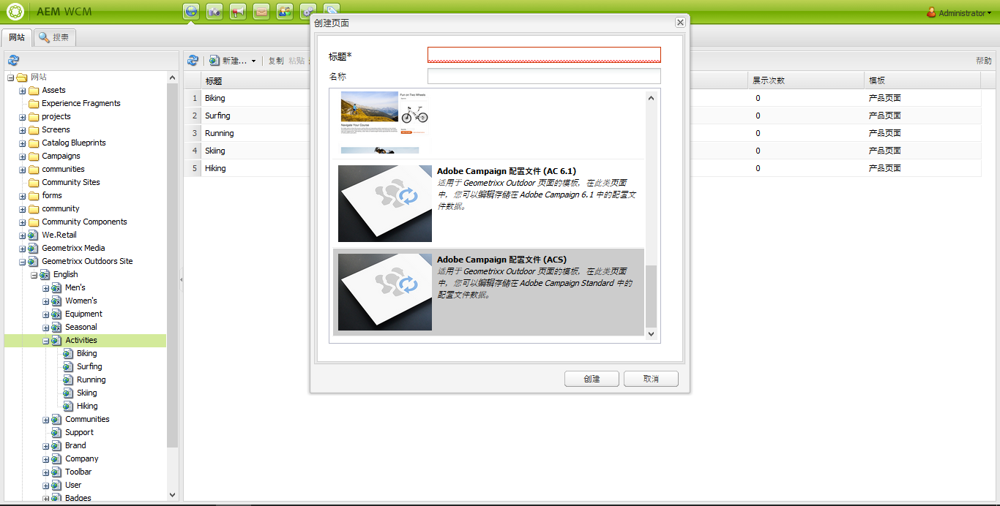

# 在 AEM 中创建 Adobe Campaign 表单{#creating-adobe-campaign-forms-in-aem}

AEM 允许您在网站上创建和使用与 Adobe Campaign 交互的表单。可以将特定字段插入到表单中，并将其映射到 Adobe Campaign 数据库。

您可以管理新的联系人订阅、取消订阅和用户配置文件数据，同时将他们的数据集成到 Adobe Campaign 数据库中。

要在 AEM 中使用 Adobe Campaign 表单，您需要执行本文档中所述的以下步骤：

1. 启用模板。
1. 创建表单。
1. 编辑表单内容。

默认情况下，可以使用三种特定于 Adobe Campaign 的表单：

* 保存配置文件
* 订阅服务
* 取消订阅服务

这些表单定义了一个 URL 参数，用于接受 Adobe Campaign 配置文件的已加密的主要密钥。根据此 URL 参数，表单会更新关联的 Adobe Campaign 配置文件的数据。

虽然您可以独立创建这些表单，但在典型用例中，您需要在新闻稿内容中生成一个指向表单页面的个性化链接，以使收件人能够打开该链接并调整其配置文件数据（无论是取消订阅、订阅还是更新其配置文件）。

表单会根据用户自动进行更新。有关更多信息，请参阅[编辑表单内容](#editing-form-content)。

## 启用模板 {#making-a-template-available}

您必须先在 AEM 应用程序中启用不同的模板，然后才能创建特定于 Adobe Campaign 的表单。

To do this, see the [Templates documentation](/help/sites-developing/page-templates-static.md#templateavailability).

首先，需检查创作和发布实例之间的连接，并确认 Adobe Campaign 正在运行。请参阅[与 Adobe Campaign Standard 集成](/help/sites-administering/campaignstandard.md)或[与 Adobe Campaign 6.1 集成](/help/sites-administering/campaignonpremise.md)。

>[!NOTE]
>
>使用 Adobe Campaign 6.1.x 或 Adobe Campaign Standard 时，请确保页面的 **jcr:content** 节点上的 **acMapping** 属性分别设置为 **mapRecipient** 或 **profile**。

### 创建表单 {#creating-a-form}

1. 在 siteadmin 中启动。
1. 滚动浏览树结构以找到所选网站中要创建表单的位置。
1. Select **New** > **New page...**.
1. Select either **Adobe Campaign Profile (AC 6.1)** or **Adobe Campaign Profile (ACS)** template and enter the page properties.

   >[!NOTE]
   >
   >If the template is not available, refer to the [Making a template available](/help/sites-classic-ui-authoring/classic-personalization-ac.md#activatingatemplate) section.

1. Click **Create** to create the form.

   

   然后，您可以[编辑并配置表单的内容](#editing-form-content)。

## 编辑表单内容 {#editing-form-content}

Adobe Campaign 的专用表单具有特定的组件。这些组件提供了一个选项，允许您将表单的每个字段链接到 Adobe Campaign 数据库中的字段。

>[!NOTE]
>
>If the desired template is not available, see [Making a template available](/help/sites-classic-ui-authoring/classic-personalization-ac.md#activatingatemplate).

此部分仅详细介绍了 Adobe Campaign 的特定链接。For more information on a more general overview of how to use forms in Adobe Experience Manager, see [Editmode components](/help/sites-classic-ui-authoring/classic-page-author-edit-mode.md).

1. 导航到要编辑的表单。
1. In the toolbox, select **Page** > **Page Properties...** then go to the **Cloud Services** tab of the pop-up window.
1. Add the Adobe Campaign service by clicking **Add service**, and then selecting the configuration that corresponds to your Adobe Campaign instance in the service&#39;s drop down list. 在设置实例之间的连接时会执行此配置。For more information, see [Connecting AEM to Adobe Campaign](/help/sites-administering/campaignonpremise.md#connecting-aem-to-adobe-campaign).

   >[!NOTE]
   >
   >如有必要，请通过单击挂锁图标来解锁配置，以便能够添加 Adobe Campaign 服务。

1. Access the form&#39;s general parameters using the **Edit** button found at the start of the form. The **Form** tab allows you to select a thank you page to which the user will be redirected after having validated the form.

   The **Advanced** form allows you to select the type of form. The **Post Options** field gives you the choice between three types of Adobe Campaign forms:

   * **Adobe Campaign: 保存配置文件**：允许您在 Adobe Campaign 中创建或更新收件人（默认值）。
   * **Adobe Campaign: 订阅服务**：允许您在 Adobe Campaign 中管理收件人的订阅。
   * **Adobe Campaign: 取消订阅服务**：允许您在 Adobe Campaign 中取消收件人的订阅。

   The **Action Configuration** field lets you specify whether or not you would like to create the recipient profile in the Adobe Campaign database if it does not yet exist. To do this, check the **Create user if not existing** option.

1. 通过将所选组件从工具箱拖放到表单中来添加它们。有关可用的 Adobe Campaign 特定组件的更多信息，请参阅 [Adobe 表单组件](/help/sites-classic-ui-authoring/classic-personalization-ac-components.md)。

   

1. 双击已添加的字段以对其进行配置。The **Adobe Campaign** tab lets you link the field to a field in the Adobe Campaign recipient table. 您还可以指定字段是否为对帐密钥的一部分，对帐密钥允许识别 Adobe Campaign 数据库中已存在的收件人。

   >[!CAUTION]
   >
   >The **Element Name** must be different for each form field. 如有必要，请更改名称。
   >
   >Each form must contain an **Encrypted Primary Key** component in order to correctly manage recipients in the Adobe Campaign database.

1. Activate the page by selecting **Page** > **Activate Page** in the toolbox. 该页面会在您的站点上激活。您可以通过转到 AEM 发布实例来查看它。验证表单后，Adobe Campaign 数据库中的数据便会更新。

## 测试表单 {#testing-a-form}

创建表单并编辑表单内容后，您可能需要手动测试表单是否可以正常工作。

>[!NOTE]
>
>You must have an **Encryted Primary Key** component on each form. 在“组件”中，选择“Adobe Campaign”，以便只显示那些组件。
>
>在此过程中，虽然您手动输入了 EPK 编号，但实际上，用户可以在新闻稿中获得此页面的链接（无论是取消订阅、订阅还是更新配置文件）。EPK 会根据用户自动进行更新。
>
>To create that link, you use the variable **Main resource identifier**(Adobe Campaign Standard) or **Encrypted identifier** (Adobe Campaign 6.1) (for example, in a **Text &amp; Personalization (Campaign)** component), which links to the epk in Adobe Campaign.

为此，您需要手动获取 Adobe Campaign 配置文件的 EPK，然后将其附加到 URL：

1. 要获取 Adobe Campaign 配置文件的已加密的主要密钥 (EPK)，请执行以下操作：

   * In Adobe Campaign Standard - Navigate to **Profiles and Audiences** > **Profiles**, which lists the existing profiles. Make sure the table displays the **Main Resource Identifier** field in a column (This can be configured by clicking/tapping **Configure list**). 复制所需配置文件的主要资源标识符。
   * In Adobe Campaign 6.11, go to **Profiles and Targets** >  **Recipients**, which lists the existing profiles. Make sure the table displays the **Encrypted identifier** field in a column (This can be configured by right-clicking on an entry and selecting **Configure list...**). 复制所需配置文件的已加密标识符。

1. In AEM, open the form page on the publish instance and append the EPK from step 1 as a URL parameter: use the same name that you previously defined in the EPK component when authoring the form (for example: `?epk=...`)
1. 现在，表单可用于修改与链接的 Adobe Campaign 配置文件相关联的数据和订阅。修改某些字段并提交表单后，您可以在 Adobe Campaign 内验证相应数据是否已更新。

验证表单后，Adobe Campaign 数据库中的数据便会更新。
