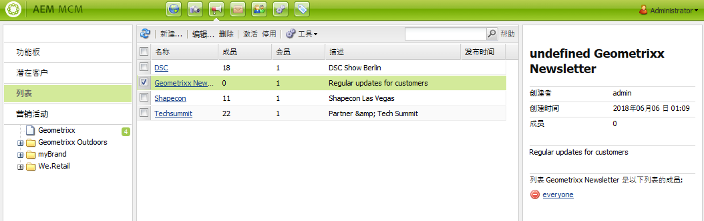
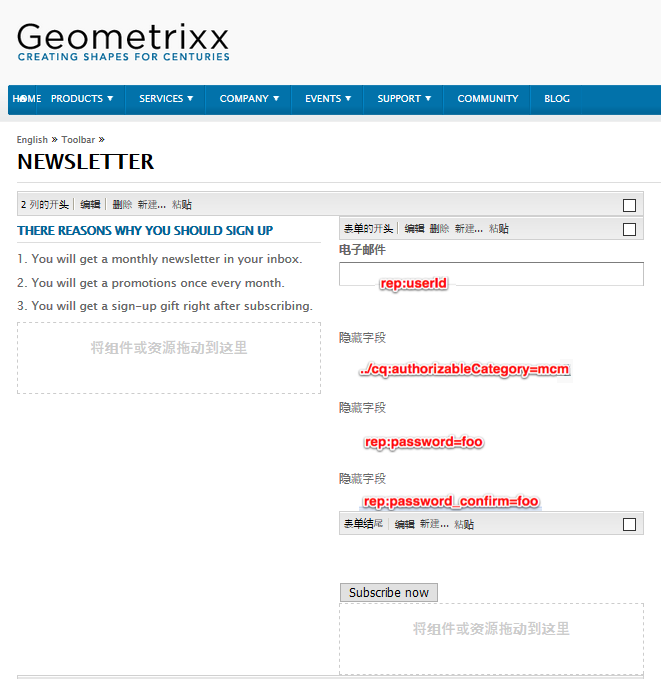
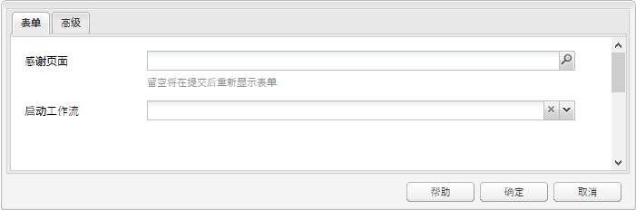
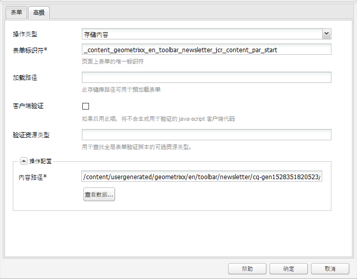
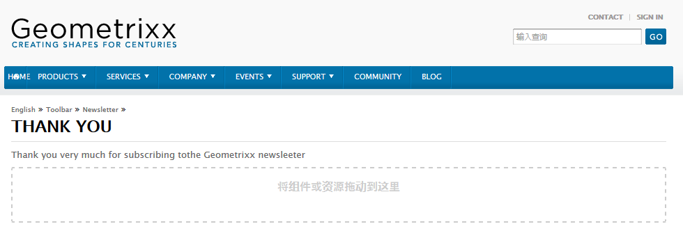
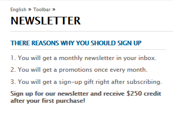
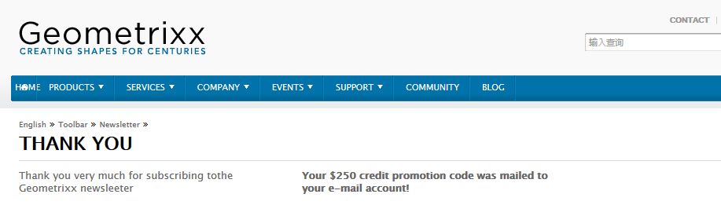

# 创建有效的新闻稿登陆页面{#creating-an-effective-newsletter-landing-page}

>[!CAUTION]
>
>AEM 6.4已结束扩展支持，本文档将不再更新。 有关更多详细信息，请参阅 [技术支助期](https://helpx.adobe.com/cn/support/programs/eol-matrix.html). 查找支持的版本 [此处](https://experienceleague.adobe.com/docs/).

有效的新闻稿登陆页面可帮助您让尽可能多的人注册您的新闻稿（或其他电子邮件营销活动）。 您可以使用从新闻稿注册中收集的信息来获取潜在客户。

要创建有效的新闻稿登陆页面，您需要执行以下操作：

1. 为新闻稿创建列表，以便用户订阅新闻稿。
1. 创建注册表单。 执行此操作时，添加一个工作流步骤，以自动将注册新闻稿的人员添加到您的潜在客户列表。
1. 创建一个确认页面，感谢用户注册，并可能为他们提供促销活动。
1. 添加Teaser。

>[!NOTE]
>
>Adobe不打算进一步增强此功能（管理潜在客户和列表）。\
>建议是利用 [Adobe Campaign及其AEM集成](/help/sites-administering/campaign.md).

## 为新闻稿创建列表 {#creating-a-list-for-the-newsletter}

创建列表，例如 **Geometrixx新闻稿**，在MCM中，获取用户应订阅的新闻稿。 有关创建列表的介绍，请参阅 [创建列表](/help/sites-classic-ui-authoring/classic-personalization-campaigns.md#creatingnewlists).

下面显示了列表示例：

## 创建注册表单 {#create-a-sign-up-form}

创建新闻稿注册表单，以允许用户订阅标记。 示例Geometrixx网站在Geometrixx工具栏中提供了新闻稿页面，您可以在该页面中创建表单。

要创建您自己的新闻稿表单，请参阅 [Forms文档](/help/sites-authoring/default-components.md#form). Newsletter使用标记库中的标记。 要添加其他标记，请参阅 [标记管理](/help/sites-authoring/tags.md#tagadministration).

以下示例中的隐藏字段提供最少信息量（电子邮件）；此外，您以后可以添加更多字段，但这将影响转化率。

以下示例是在http://localhost:4502/cf#/content/geometrixx/en/toolbar/newsletter.html上创建的表单。

1. 创建表单。

   

1. 单击 **编辑** 在表单组件中，配置表单以转到感谢页面(请参阅 [创建感谢页面](#creating-a-thank-you-page))。

   

1. 设置表单操作（即提交表单时将发生的操作）并配置组，以将注册用户分配到之前创建的列表（例如geometrixx-newsletter）。

   

## 创建感谢页面 {#creating-a-thank-you-page}

用户单击 **立即订阅**，则需要自动打开感谢页面。 在Geometrixx新闻稿页面中创建感谢页面。 创建新闻稿表单后，编辑表单组件并添加感谢页面的路径。

提交请求会将用户转到 **谢谢** 页面，随后他们将收到电子邮件。 此感谢页面是在/content/geometrixx/cn/toolbar/newsletter/thank_you中创建的。

## 添加Teaser {#adding-teasers}

添加 [teaser](/help/sites-classic-ui-authoring/classic-personalization-campaigns.md#teasers) 来定位特定受众。 例如，您可以向感谢页面和新闻稿注册页面添加Teaser。

要添加Teaser以生成有效的新闻稿登陆页面，请执行以下操作：

1. 为注册礼品创建Teaser段落。 选择 **第一个** 作为策略，并包含通知他们将收到什么礼物的文本。

   

1. 为感谢页面创建Teaser段落。 选择 **第一个** 作为策略，并包含指示礼品即将送达的文本。

   

1. 使用两个Teaser创建营销活动 — 标记一个带有业务标签，一个未标记。

## 将内容推送给订阅者 {#pushing-content-to-subscribers}

通过MCM中的新闻稿功能将任何更改推送到页面。 然后，将更新内容推送给订阅者。

请参阅 [发送新闻稿](/help/sites-classic-ui-authoring/classic-personalization-campaigns.md#newsletters).
