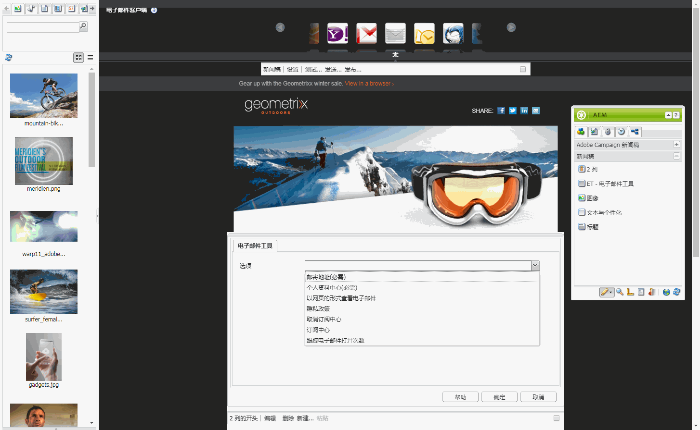
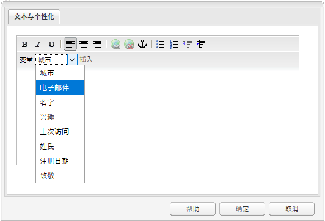
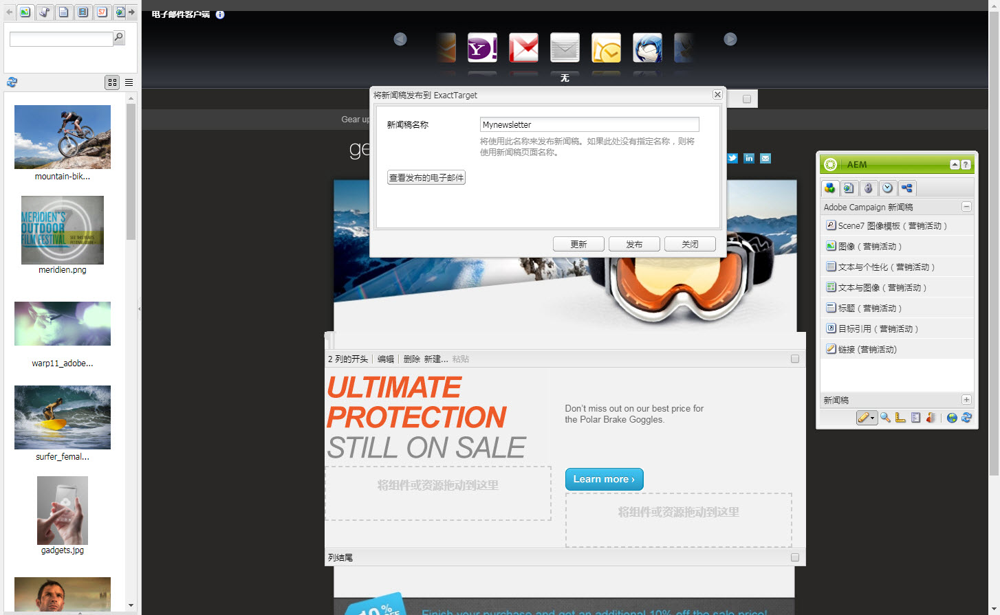

# 将电子邮件发布到电子邮件服务提供商{#publishing-an-email-to-email-service-providers}

>[!CAUTION]
>
>AEM 6.4已结束扩展支持，本文档将不再更新。 有关更多详细信息，请参阅 [技术支助期](https://helpx.adobe.com/cn/support/programs/eol-matrix.html). 查找支持的版本 [此处](https://experienceleague.adobe.com/docs/).

您可以将新闻稿发布到电子邮件服务，如ExactTarget和Silverpop Engage。 本文档介绍如何配置AEM以将新闻稿发布到这些电子邮件服务。

>[!NOTE]
>
>您需要先配置服务提供商，然后才能创建和发布电子邮件。 请参阅 [配置ExactTarget](/help/sites-administering/exacttarget.md) 和 [配置Silverpop Engage](/help/sites-administering/silverpop.md) 以了解更多信息。

要将电子邮件发布到电子邮件服务提供商，您需要执行以下步骤：

1. 创建电子邮件。
1. 将电子邮件服务配置应用到电子邮件。
1. 发布电子邮件。

>[!NOTE]
>
>如果您更新电子邮件提供商、进行试运行测试或发送新闻稿，则如果新闻稿未先发布到发布实例或发布实例不可用，则这些操作会失败。 确保发布新闻稿，并确保发布实例已启动并运行。

## 创建电子邮件 {#creating-an-email}

您可以在营销策划下使用 **Geometrixx新闻稿** 模板。 您还可以使用 **Geometrixx Outdoors电子邮件** 模板。 基于 **Geometrixx Outdoors电子邮件** 模板可在 `https://<hostname>:<port>/cf#/content/campaigns/geometrixx-outdoors/e-mails.html`.

要创建发布到所配置电子邮件服务的新电子邮件，请执行以下操作：

1. 转到 **网站** 然后 **促销活动**. 选择营销活动。
1. 单击 **新建** 打开 **创建页面** 窗口。
1. 输入标题、名称，然后选择 **Geometrixx新闻稿** 模板。
1. 单击&#x200B;**创建**。
1. 打开创建的电子邮件。
1. 切换到设计模式，以选择要在Sidekick中显示的组件。
1. 切换到编辑模式并开始添加内容(文本、图像、 [电子邮件工具](#adding-exacttarget-email-tools-to-your-email), [个性化变量](#adding-text-and-personalization-tool-to-your-e-mail)等)。

### 将ExactTarget电子邮件工具添加到电子邮件 {#adding-exacttarget-email-tools-to-your-email}

>[!NOTE]
>
>此部分特定于ExactTarget服务。

的 **电子邮件工具** ExactTarget的组件可以向您的电子邮件/新闻稿中添加更多电子邮件功能。

1. 打开要发布到ExactTarget的电子邮件。
1. 添加组件 **ET — 电子邮件工具** 使用sidekick添加到您的页面。 在编辑模式下打开组件。

   

1. 从 **选项** 菜单：

<table> 
 <tbody> 
  <tr> 
   <td>邮寄地址(必需)</td> 
   <td>此组件会在电子邮件中插入贵组织的邮寄地址。</td> 
  </tr> 
  <tr> 
   <td>个人资料中心(必需)</td> 
   <td>用户档案中心是一个网页，订阅者可以在其中输入和维护您保存的与他们有关的个人信息。</td> 
  </tr> 
  <tr> 
   <td>以网页的形式查看电子邮件</td> 
   <td>此组件允许用户以网页形式查看电子邮件。</td> 
  </tr> 
  <tr> 
   <td>隐私政策</td> 
   <td>此组件会在电子邮件中插入指向隐私政策的链接。  </td> 
  </tr> 
  <tr> 
   <td>取消订阅中心</td> 
   <td>为用户提供取消订阅邮寄列表的选项。</td> 
  </tr> 
  <tr> 
   <td>订阅中心</td> 
   <td>订阅中心是一个网页，订阅者可以在该网页中控制他们从贵组织收到的消息。</td> 
  </tr> 
  <tr> 
   <td>跟踪电子邮件打开次数</td> 
   <td>允许您使用ExactTarget跟踪功能的隐藏组件。  </td> 
  </tr> 
 </tbody> 
</table>

>[!NOTE]
>
>的 **选项** 仅当将ExactTarget配置应用于电子邮件时，才会填充下拉菜单。 请参阅 [将电子邮件服务配置应用到电子邮件设置](#applying-e-mail-service-configuration-to-e-mail-settings) 以了解更多信息。

1. 将电子邮件发布到ExactTarget。

   具有电子邮件工具的电子邮件可在配置的ExactTarget帐户中使用。

>[!NOTE]
>
>* 仅当使用 **简单发送** 或 **引导式发送** 但不是 **测试发送**.
>
>* 需要以下两种电子邮件工具： **邮寄地址（必需）** 和 **配置文件中心（必需）**. 将电子邮件发布到ExactTarget后，这两个电子邮件工具会默认添加到每封邮件的底部。
>

### 向电子邮件添加文本和个性化工具 {#adding-text-and-personalization-tool-to-your-e-mail}

您可以通过在电子邮件中添加 **文本和个性化** 组件添加到页面：

1. 打开要发布到电子邮件服务的电子邮件。
1. 要从电子邮件服务启用个性化字段，请在配置电子邮件服务时添加框架配置。 请参阅 [配置Silverpop Engage](/help/sites-administering/silverpop.md) 和 [配置ExactTarget](/help/sites-administering/exacttarget.md) 以了解更多信息。
1. 添加组件 **文本与个性化** 从Sidekick中。 此组件是新闻稿组的一部分。 在编辑模式下打开此组件。

   

1. 通过从下拉菜单中选择字段并单击，将所需的个性化字段添加到文本中 **插入**.
1. 单击 **确定** 完成。

## 将电子邮件服务配置应用到电子邮件设置 {#applying-e-mail-service-configuration-to-e-mail-settings}

要将电子邮件服务配置应用到新闻稿，请执行以下操作：

1. 创建电子邮件服务配置。
1. 打开您的电子邮件/新闻稿。
1. 通过单击 **设置** 或 **中的页面属性** Sidekick。
1. 单击 **添加服务** in **Cloud Services** 选项卡。 您会看到服务列表。 选择所需的配置 —  **ExactTarget** 或 **Silverpop**  — 从下拉列表的列表。

   

1. 单击&#x200B;**确定**。

## 将电子邮件发布到电子邮件服务 {#publishing-emails-to-email-service}

可以按照以下步骤将电子邮件/新闻稿发布到您的电子邮件服务：

1. 打开电子邮件。
1. 在发布电子邮件之前，请确保已将正确的配置应用于电子邮件。
1. 单击&#x200B;**发布**。这将打开 **将新闻稿发布到电子邮件服务提供商** 窗口。
1. 填写 **新闻稿名称** 字段。 电子邮件/新闻稿将以此名称发布到电子邮件服务提供商。 如果未提供电子邮件名称，则会使用AEM中新闻稿的页面名称发布电子邮件。
1. 单击&#x200B;**发布**。

   

   如果成功，AEM会确认您可以在ExactTarget或Silverpop Engage中查看电子邮件。

   对于ExactTarget，可以通过单击 **查看已发布的电子邮件**. 这会使您直接转到ExactTarget中已发布的Newsletter([https://members.exacttarget.com/](https://members.exacttarget.com/).)。

>[!NOTE]
>
>如果发布的电子邮件/新闻稿与已发布的电子邮件/新闻稿的名称相同，则不会替换之前的电子邮件/新闻稿。 而是会使用相同的名称创建新电子邮件/新闻稿（但两个新闻稿的ID不同）。
>
>将电子邮件/新闻稿发布到电子邮件服务提供商还会将电子邮件/新闻稿发布到AEM发布实例。

### 更新已发布的电子邮件 {#updating-a-published-e-mail}

的 **更新** “发布”对话框中的按钮可更新已发布到电子邮件服务提供商的新闻稿。 如果尚未发布新闻稿，并且 **更新** 按钮，则 **新闻稿未发布** 消息。

要更新已发布的电子邮件，请执行以下操作：

1. 打开之前已发布到电子邮件服务提供商的电子邮件/新闻稿，在对电子邮件/新闻稿进行更改后，您要重新发布该电子邮件服务提供商。
1. 单击&#x200B;**发布**。的 **将新闻稿发布到电子邮件服务提供商** 窗口。 单击&#x200B;**更新**。

   要检查ExactTarget上的电子邮件/Newsletter是否已更新，请单击 **查看已发布的电子邮件**. 这会将您转到ExactTarget中已发布的电子邮件。

   要检查Silverpop电子邮件服务上的电子邮件/新闻稿是否已更新，请访问Silverpop Engage网站。
