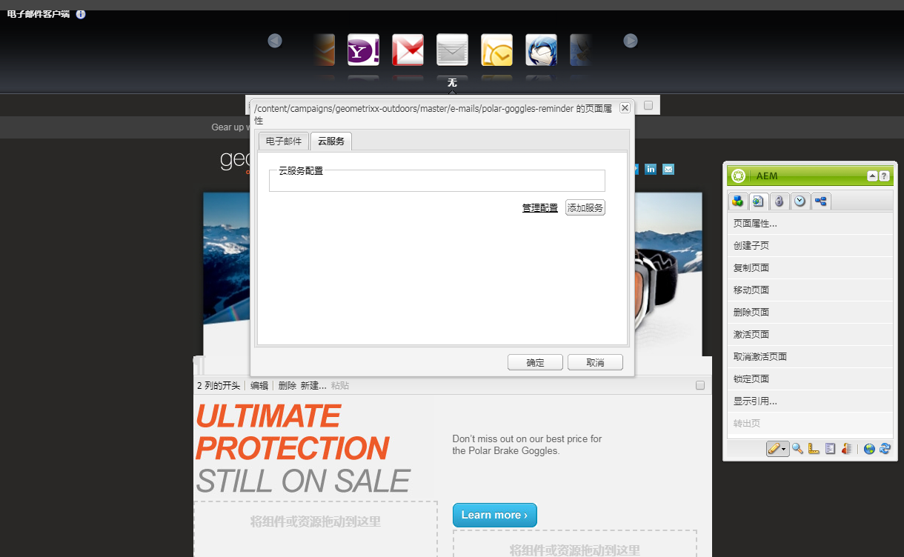
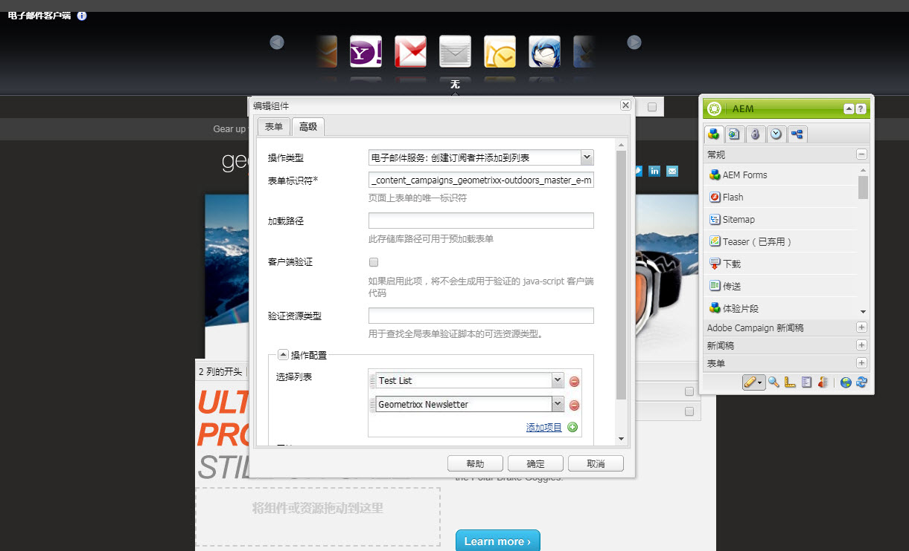
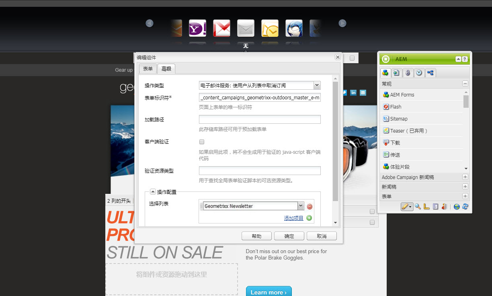
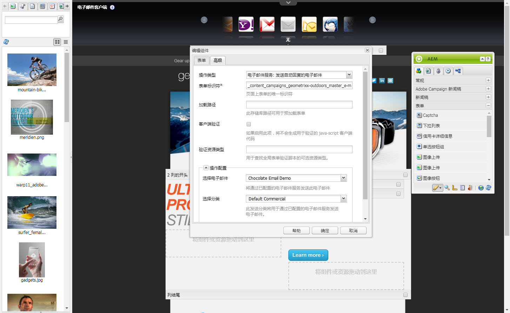

# 管理订阅{#managing-subscriptions}

>[!CAUTION]
>
>AEM 6.4已结束扩展支持，本文档将不再更新。 有关更多详细信息，请参阅 [技术支助期](https://helpx.adobe.com/cn/support/programs/eol-matrix.html). 查找支持的版本 [此处](https://experienceleague.adobe.com/docs/).

>[!NOTE]
>
>Adobe不打算进一步增强此功能（管理潜在客户和列表）。\
>建议是利用 [Adobe Campaign及其AEM集成](/help/sites-administering/campaign.md).

可以要求用户订阅 **电子邮件服务提供商的** 邮件列表 **表单** 组件。 要准备包含注册表单的AEM页面以订阅电子邮件服务邮寄列表，您必须将相应的服务配置应用到潜在订阅者将访问的AEM页面。

## 将电子邮件服务配置应用到页面 {#applying-email-service-configuration-to-a-page}

配置AEM页面：

1. 导航到 **网站** 选项卡。
1. 选择需要为服务配置的页面。 右键单击页面并选择 **属性**.

1. 选择 **Cloud Services** then **添加服务**. 从可用配置列表中选择配置。

   

1. 单击&#x200B;**确定**。

## 在AEM页面上创建注册表单以订阅/取消订阅列表 {#creating-a-sign-up-form-on-an-aem-page-for-subscribing-unsubscribing-to-lists}

要创建并配置注册表单以订阅电子邮件服务提供商的邮寄列表，请执行以下操作：

1. 打开用户将访问的AEM页面。
1. 将电子邮件服务提供商的配置应用到页面。

1. 添加 **表单** 组件添加到页面，方法是从Sidekick中拖动组件。 如果组件不可用，请切换到设计模式并启用 **表单** 群组。
1. 单击 **编辑** 在 **表单开始** 栏并导航到 **高级** 选项卡。
1. 在 **表单** 下拉菜单，选择 **电子邮件服务：创建订阅者** 和添加到列表。
1. 在对话框的底部，打开 **操作配置** 下拉列表，用于选择一个或多个订阅列表。
1. 在 **选择列表**，选择您希望用户订阅的列表。 您可以使用加号按钮(**添加项目**)。

   

   >[!NOTE]
   >
   >您的对话框可能会因电子邮件服务提供商而异。

1. 在 **表单** 选项卡上，选择您希望用户在提交表单后转到的“感谢”页面（如果留空，则提交后会重新显示表单）。 单击&#x200B;**确定**。安 **电子邮件ID** 组件显示在表单中，通过该表单，您可以创建一个表单，在该表单中，用户可以提交其电子邮件地址以订阅或取消订阅邮寄列表。
1. 添加 **提交** 按钮组件 **表单** 部分。

   表单已准备就绪。 发布在上述步骤中配置的页面以及 **谢谢** 页面。 任何访问该页面的潜在订阅者都可以填写表单并订阅配置中提供的列表。

   >[!NOTE]
   >
   >要使表单订阅正常工作， [需要在发布实例上导出和导入创作加密密钥](#exporting-keys-from-author-and-importing-on-publish).

## 从作者导出密钥并在发布时导入 {#exporting-keys-from-author-and-importing-on-publish}

要通过发布实例上的注册表单为电子邮件服务订阅和取消订阅工作，您需要执行以下步骤：

1. 在创作实例上，导航到包管理器。
1. 创建新资源包。 将过滤器设置为 `/etc/key`.
1. 生成并下载包。
1. 导航到发布实例上的包管理器，然后上传此包。
1. 导航到发布OSGi控制台并重新启动名为的包 **AdobeGranite加密支持**.

## 使用户从列表取消订阅 {#unsubscribing-users-from-lists}

要使用户从列表中取消订阅，请执行以下操作：

1. 打开包含注册表单的AEM页面的页面属性以取消订阅潜在客户。
1. 将服务配置应用到页面。
1. 在页面上创建注册表单。
1. 配置组件时，选择操作 **电子邮件服务**: **使用户从列表中取消订阅。**
1. 从下拉菜单中，选择在取消订阅时将从中删除用户的相应列表。

   

1. 将创作密钥导出到发布。

## 为电子邮件服务配置自动回复的电子邮件 {#configuring-auto-responder-emails-for-email-service}

要为订阅者配置自动回复的电子邮件，请执行以下操作：

1. 打开具有注册表单的AEM页面的页面属性，以为潜在客户配置自动回复。
1. 将ExactTarget配置应用到页面。

1. 添加 **表单** 组件添加到页面，方法是从Sidekick中拖动组件。 如果组件不可用，请切换到设计模式并启用 **表单** 群组。
1. 单击 **编辑** 在 **表单开始** 栏并导航到 **高级** 选项卡。
1. 在 **表单** 下拉菜单，选择 **电子邮件服务：发送自动回复电子邮件。**
1. **选择电子邮件** （这是作为自动回复电子邮件发送的邮件）。

1. **选择分类** （此分类用于发送电子邮件）。
1. 选择 **谢谢** 页面（用户提交表单后被定向到的页面）。

   在 **表单** 选项卡，选择您希望用户在提交表单后转到的感谢页面。 （如果留空，表单在提交后会重新显示。） 单击&#x200B;**确定**。

1. 将创作密钥导出到发布。
1. 添加 **提交** 按钮组件 **表单** 部分。

   注册表单已准备就绪。 发布在上述步骤中配置的页面以及 **谢谢** 页面。 任何访问该页面的潜在订阅者都可以填写表单，在提交表单时，访客将收到一封自动回复的电子邮件，其电子邮件ID在表单中填写。

   >[!NOTE]
   >
   >要使注册表单订阅正常工作，请 [需要在发布实例上导出和导入创作加密密钥](#exporting-keys-from-author-and-importing-on-publish).

   
