# 电子邮件营销{#e-mail-marketing}

>[!CAUTION]
>
>AEM 6.4已结束扩展支持，本文档将不再更新。 有关更多详细信息，请参阅 [技术支助期](https://helpx.adobe.com/cn/support/programs/eol-matrix.html). 查找支持的版本 [此处](https://experienceleague.adobe.com/docs/).

>[!NOTE]
>
>Adobe不打算进一步增强AEM SMTP服务发送的打开/弹回电子邮件。\
>建议是 [利用Adobe Campaign及其AEM集成](/help/sites-administering/campaign.md).

电子邮件营销（例如新闻稿）是任何营销活动的重要部分，因为您使用电子邮件营销将内容推送到潜在客户。 在AEM中，您可以根据现有AEM内容创建新闻稿，并添加特定于新闻稿的新内容。

创建新闻稿后，您可以立即或在其他计划时间（通过使用工作流）将新闻稿发送给特定用户组。 此外，用户还可以按其选择的格式订阅新闻稿。

此外，AEM还允许您管理新闻稿功能，包括维护主题、归档新闻稿和查看新闻稿统计资料。

>[!NOTE]
>
>在Geometrixx中，新闻稿模板会自动打开电子邮件编辑器。 您可以在要在其中发送电子邮件（例如，邀请）的其他模板中使用电子邮件编辑器。 无论页面从何处继承，都会显示电子邮件编辑器 **mcm/components/newsletter/page**.

本文档介绍了在AEM中创建新闻稿的基础知识。 有关如何处理电子邮件营销的更多详细信息，请参阅以下文档：

* [创建有效的新闻稿登陆页面](/help/sites-classic-ui-authoring/classic-personalization-campaigns-email-landingpage.md)
* [管理订阅](/help/sites-classic-ui-authoring/classic-personalization-campaigns-email-subscriptions.md)
* [将电子邮件发布到电子邮件服务提供商](/help/sites-classic-ui-authoring/classic-personalization-campaigns-email-newsletters.md)
* [跟踪弹回的电子邮件](/help/sites-classic-ui-authoring/classic-personalization-campaigns-email-tracking-bounces.md)

>[!NOTE]
>
>如果您更新电子邮件提供商、进行试运行测试或发送新闻稿，则如果新闻稿未先发布到发布实例或发布实例不可用，则这些操作会失败。 确保发布新闻稿，并确保发布实例已启动并运行。

## 创建新闻稿体验 {#creating-a-newsletter-experience}

>[!NOTE]
>
>需要通过osgi配置配置电子邮件通知。 请参阅 [配置电子邮件通知。](/help/sites-administering/notification.md)

1. 在左窗格中选择您的新营销活动，或在右窗格中双击它。

1. 使用图标选择列表视图：

   

1. 单击 **新建……**

   您可以指定 **标题**, **名称** 以及要创建的体验类型；在本例中，为新闻稿。

   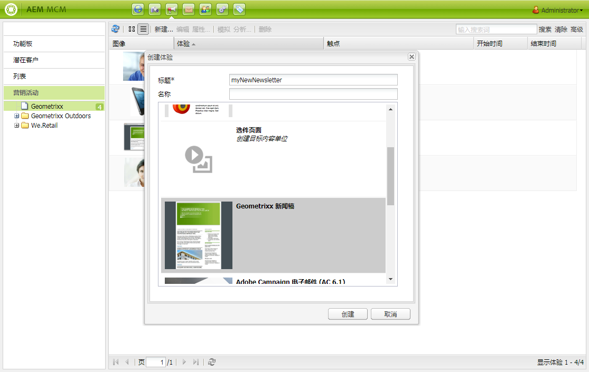

1. 单击&#x200B;**创建**。

1. 将立即打开一个新对话框。 您可以在此处输入新闻稿的属性。

   的 **默认收件人列表** 是必填字段，因为它构成了Newsletter的接触点(请参阅 [使用列表](/help/sites-classic-ui-authoring/classic-personalization-campaigns.md#workingwithlists) )。

   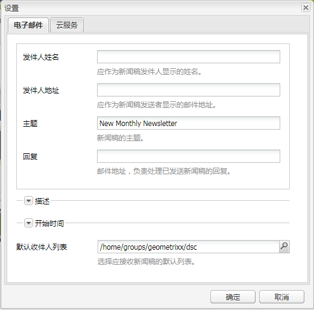

   * **发件人姓名**

      应作为新闻稿发件人显示的姓名。

   * **发件人地址**

      应作为新闻稿发送者显示的邮件地址。

   * **主题**

      新闻稿的主题。

   * **回复**

      邮件地址，负责处理已发送新闻稿的回复。

   * **描述**

      新闻稿的描述。

   * **开始时间**

      发送新闻稿的开机时间。

   * **默认收件人列表**

      应接收新闻稿的默认列表。
   这些更新可在以后的 **属性……** 对话框。

1. 单击 **确定** 保存。

## 将内容添加到新闻稿 {#adding-content-to-newsletters}

您可以像在任何AEM组件中一样，在新闻稿中添加内容（包括动态内容）。 在Geometrixx中，新闻稿模板具有某些组件，可用于在新闻稿中添加和修改内容。

1. 在MCM中，单击 **促销活动** 选项卡，然后双击要向其添加内容或进行编辑的新闻稿。 此时会打开新闻稿。

1. 如果组件不可见，请在开始编辑之前转到“设计”视图，并启用必要的组件（例如新闻稿组件）。
1. 根据需要输入任何新文本、图像或其他组件。 在Geometrixx示例中，有4个组件可用：文本、图像、标题和2列。 您的新闻稿中可能包含更多或更少的组件，具体取决于您如何设置它。

   >[!NOTE]
   >
   >您可以使用变量对新闻稿进行个性化设置。 在Geometrixx新闻稿中，变量在文本组件中可用。 变量的值继承自用户配置文件中的信息。

   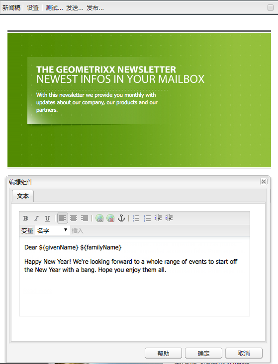

1. 要插入变量，请从列表中选择变量，然后单击 **插入**. 变量从配置文件中填充。

## 个性化新闻稿 {#personalizing-newsletters}

通过在新闻稿的文本组件中插入预定义的变量，在Geometrixx中对新闻稿进行个性化设置。 变量的值继承自用户配置文件中的信息。

您还可以通过使用Client Context并加载用户档案来模拟如何个性化新闻稿。

要个性化新闻稿并模拟其外观，请执行以下操作：

1. 在MCM中，打开要自定义其设置的Newsletter。

1. 打开要个性化的文本组件。

1. 将光标放在要显示变量的位置，然后从下拉列表中选择一个变量，然后单击 **插入**. 对所需数量的变量执行此操作，然后单击 **确定**.

   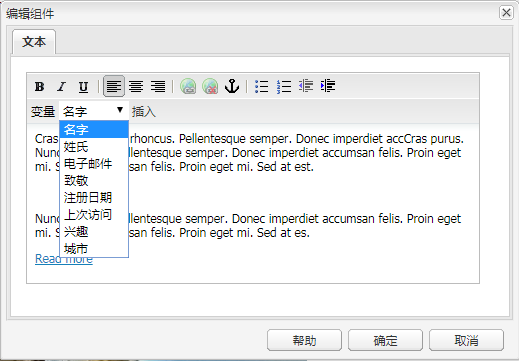

1. 要模拟变量在发送时的外观，请按CTRL+ALT+c打开Client Context，然后选择 **加载**. 从列表中选择要加载其配置文件的用户，然后单击 **确定**.

   加载的用户档案中的信息已填充变量。

   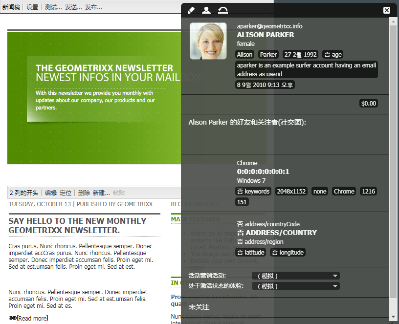

## 在不同的电子邮件客户端中测试新闻稿 {#testing-newsletters-in-different-e-mail-clients}

>[!NOTE]
>
>在发送新闻稿之前，请检查Day CQ Link Externalizer（位于）的OSGi配置 `http://localhost:4502/system/console/configMgr`.
>
>默认情况下，参数的值为 `localhost:4502` 如果运行实例的端口发生更改，则和操作无法完成。

在常用的电子邮件客户端之间切换，查看您的新闻稿在潜在客户端的外观如何。默认情况下，您的新闻稿会打开，但未选择任何电子邮件客户端。

目前，您可以在以下电子邮件客户端中查看新闻稿：

* Yahoo邮件
* Gmail
* Hotmail
* Thunderbird
* Microsoft Outlook 2007
* Apple Mail

要在客户端之间切换，请单击相应的图标以查看该电子邮件客户端中的新闻稿：

1. 在MCM中，打开要自定义其设置的Newsletter。

1. 单击顶部栏中的电子邮件客户端，以查看新闻稿在该客户端中的外观。

   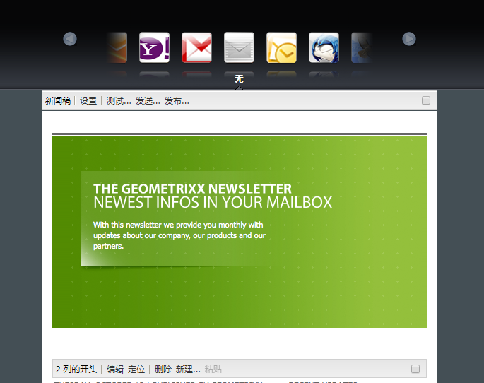

1. 对要查看的任何其他电子邮件客户端重复此步骤。

   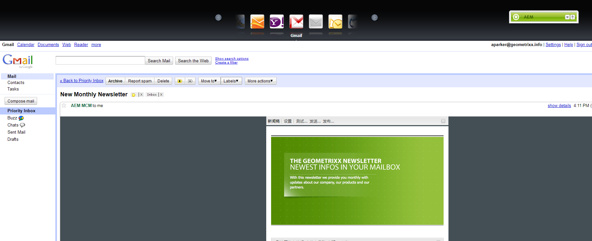

## 自定义新闻稿设置 {#customizing-newsletter-settings}

尽管只有授权用户才能发送新闻稿，但您应自定义以下内容：

* 主题行，以便用户能够打开您的电子邮件，并确保您的新闻稿最终不会被标记为垃圾邮件。
* 发件人地址(例如noreply@geometrixx.com)，以便用户从指定的地址接收电子邮件。

要自定义新闻稿设置，请执行以下操作：

1. 在MCM中，打开要自定义其设置的Newsletter。

   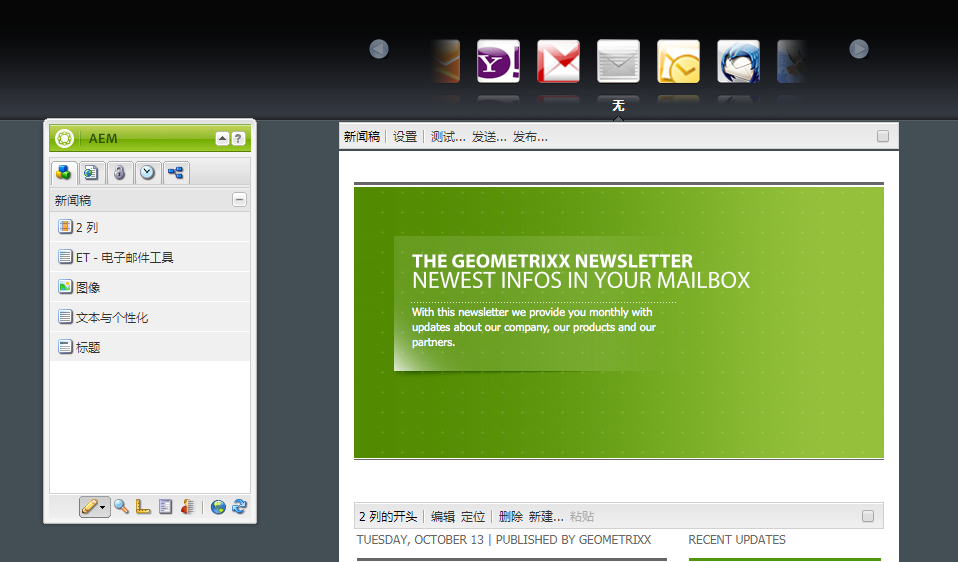

1. 在新闻稿顶部，单击 **设置**.

   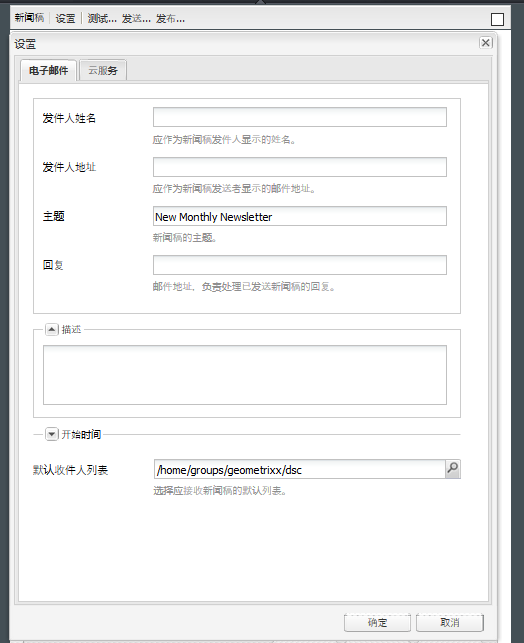

   1. 输入 **从** 电子邮件地址
   1. 修改 **主题** （如有必要）。
   1. 选择 **默认收件人列表** 从下拉列表中。
   1. 单击&#x200B;**确定**。

   在您测试或发送新闻稿时，收件人将收到具有指定电子邮件地址和主题的电子邮件。

## 试运行测试新闻稿 {#flight-testing-newsletters}

虽然试运行不是强制性的，但在发出新闻稿之前，您可能需要测试新闻稿以确保它按您希望的方式显示。

试运行测试允许您执行以下操作：

* 查看 [所有目标客户](#testing-newsletters-in-different-e-mail-clients).
* 验证邮件服务器是否已正确设置。
* 确定电子邮件是否被标记为垃圾邮件。 （确保将您自己包含在收件人列表中。）

>[!NOTE]
>
>如果您更新电子邮件提供商、进行试运行测试或发送新闻稿，则如果新闻稿未先发布到发布实例或发布实例不可用，则这些操作会失败。 确保发布新闻稿，并确保发布实例已启动并运行。

要试运行新闻稿，请执行以下操作：

1. 在MCM中，打开要测试和发送的新闻稿。

1. 在新闻稿顶部，单击 **测试** 以在发送之前进行测试。

   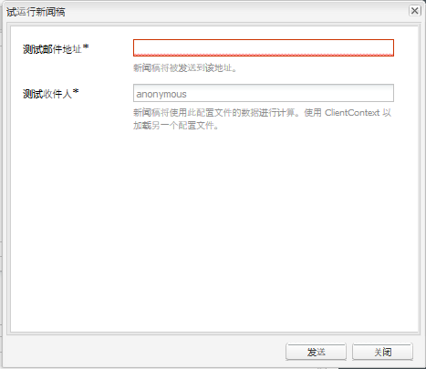

1. 输入要发送新闻稿的测试邮件地址，然后单击 **发送**. 如果要更改配置文件，请在Client Context中加载其他配置文件。 要执行此操作，请按CTRL+ALT+c并选择“加载”并加载配置文件。

## 发送新闻稿 {#sending-newsletters}

您可以从新闻稿或列表发出新闻稿。 对这两个过程都进行了描述。

>[!NOTE]
>
>在发送新闻稿之前，请检查Day CQ Link Externalizer（位于）的OSGi配置 `http://localhost:4502/system/console/configMgr`.
>
>默认情况下，参数的值为 `localhost:4502` 如果运行实例的端口发生更改，则和操作无法完成。

>[!NOTE]
>
>如果您更新电子邮件提供商、进行试运行测试或发送新闻稿，则如果新闻稿未先发布到发布实例或发布实例不可用，则这些操作会失败。 确保发布新闻稿，并确保发布实例已启动并运行。

### 从营销活动发送新闻稿 {#sending-newsletters-from-a-campaign}

要从营销活动内发出新闻稿，请执行以下操作：

1. 在MCM中，打开要发送的新闻稿。

   >[!NOTE]
   >
   >在发出之前，请确保已通过自定义新闻稿的主题和原始电子邮件地址 [自定义其设置](#customizing-newsletter-settings).
   >
   >[飞行测试](#flight-testing-newsletters) 建议在发送之前发送新闻稿。

1. 在新闻稿顶部，单击 **发送**. 此时将打开新闻稿向导。

1. 在收件人列表中，选择要接收新闻稿的列表，然后单击 **下一个**.

   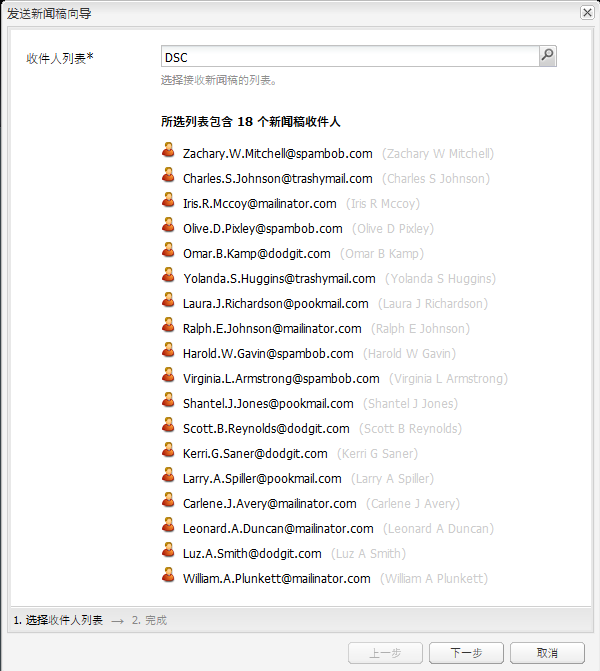

1. 已确认设置完成。 单击 **发送** 以实际发送新闻稿。

   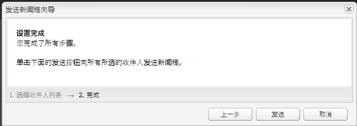

   >[!NOTE]
   >
   >确保您是收件人之一，以便确保收到新闻稿。

### 从列表发送新闻稿 {#sending-newsletters-from-a-list}

要从列表发出新闻稿，请执行以下操作：

1. 在MCM中，单击 **列表** 在左窗格中。

   >[!NOTE]
   >
   >在发出之前，请确保已通过自定义新闻稿的主题和原始电子邮件地址 [自定义其设置](#customizing-newsletter-settings). 如果从列表发送新闻稿，则无法测试新闻稿；您可以 [飞行试验](#flight-testing-newsletters) 如果您从新闻稿中发送它，则会发送。

1. 选中要将新闻稿发送到的潜在客户列表旁边的复选框。

1. 在 **工具** 菜单，选择 **发送新闻稿**. 的 **发送新闻稿** 窗口。

   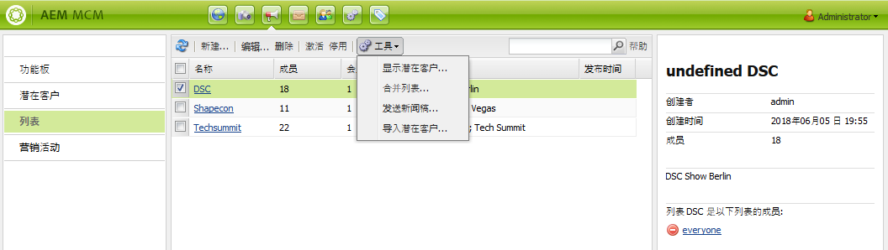

1. 在 **新闻稿** 字段，选择要发送的新闻稿，然后单击 **下一个**.

   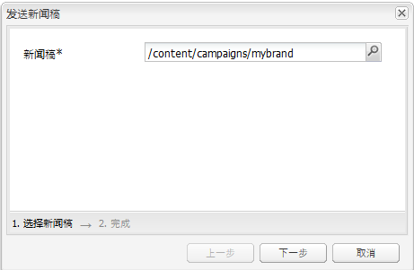

1. 已确认设置完成。 单击 **发送** 将选定的新闻稿发送到指定的潜在客户列表。

   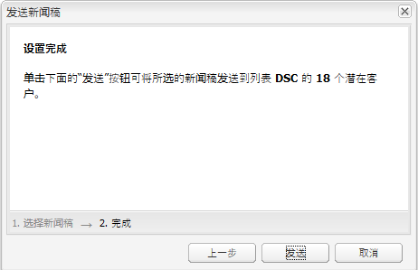

   您的新闻稿会发送给选定的收件人。

## 订阅新闻稿 {#subscribing-to-a-newsletter}

本节介绍如何订阅新闻稿。

### 订阅新闻稿 {#subscribing-to-a-newsletter-1}

要订阅新闻稿(以Geometrixx网站为例)，请执行以下操作：

1. 单击 **网站** 并导航到Geometrixx **工具栏** 然后打开它。

   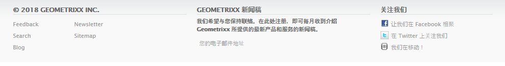

1. 在Geometrixx新闻稿中 **注册** ，输入您的电子邮件地址并单击 **注册**. 您现在已订阅新闻稿。
