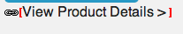

# 登录页面{#landing-pages}

>[!CAUTION]
>
>AEM 6.4已结束扩展支持，本文档将不再更新。 有关更多详细信息，请参阅 [技术支助期](https://helpx.adobe.com/cn/support/programs/eol-matrix.html). 查找支持的版本 [此处](https://experienceleague.adobe.com/docs/).

登陆页面功能允许快速轻松地将设计和内容直接导入AEM页面。 Web开发人员可以准备HTML和其他可导入为完整页面或仅作为页面一部分的资产。 此功能对于创建仅在有限时间内处于活动状态且需要快速创建的营销登陆页面非常有用。

本页介绍以下内容：

* 包括可用组件在内的AEM登陆页面外观
* 如何创建登陆页面以及如何导入设计包
* 如何在AEM中使用登陆页面
* 如何设置移动登陆页面

有关准备要导入的设计包，请参阅 [扩展和配置设计导入程序](/help/sites-administering/extending-the-design-importer-for-landingpages.md). 与Adobe Analytics集成涵盖 [将登陆页面与Adobe Analytics集成。](/help/sites-administering/integrating-landing-pages-with-adobe-analytics.md)

## 什么是登陆页面？ {#what-are-landing-pages}

登陆页面是作为营销推广活动“端点”的单页或多页站点，例如电子邮件、广告/横幅、社交媒体。 登陆页面可以实现多种目的，但有一点是相同的：访客应该完成一项任务，并定义登陆页面的成功与否。

AEM中的登陆页面功能允许营销人员与代理机构的Web设计人员或内部创意团队合作，创建可轻松导入AEM的页面设计，并且仍可由营销人员编辑，且在与其他AEM支持的网站相同的管理下进行发布。

在AEM中，您可以通过执行以下步骤来创建登陆页面：

1. 在AEM中创建包含登陆页面画布的页面。 AEM附带一个名为 **导入程序页面**.

1. [准备HTML和资产。](/help/sites-administering/extending-the-design-importer-for-landingpages.md)
1. 将资源打包到ZIP文件中，这里称为“设计包”。
1. 在导入器页面上导入设计包。
1. 修改并发布页面。

### 桌面登陆页面 {#desktop-landing-pages}

AEM中的登录页面示例如下所示：

### 移动设备登陆页面 {#mobile-landing-pages}

登陆页面也可以具有移动版本的页面。 要使登陆页面具有单独的移动版本，导入设计必须具有两个html文件： *index.htm(l)* 和 *mobile.index.htm(l)*.

登陆页面导入过程与普通登陆页面的过程相同，登陆页面设计有一个与移动设备登陆页面对应的额外html文件。 此html文件也必须具有画布 `div` with `id=cqcanvas` 与桌面登陆页面html类似，它支持桌面登陆页面描述的所有可编辑组件。

移动设备登陆页面创建为桌面登陆页面的子页面。 要将其打开，请导航到网站中的登陆页面，然后打开子页面。

>[!NOTE]
>
>如果桌面登陆页面被删除或停用，则移动设备登陆页面会与桌面登陆页面一起被删除/停用。

## 登陆页面组件 {#landing-page-components}

要使导入的HTML的某些部分在AEM中可编辑，您可以将登陆页面HTML中的内容直接映射到AEM组件。 设计导入程序默认了解以下组件：

* 文本，适用于任何文本
* 标题，适用于H1-6标记中的内容
* 图像，用于应可交换的图像
* 操作调用：

   * 点进链接
   * 图形链接

* CTA潜在客户表单，用于捕获用户信息
* 段落系统(Parsys)，用于添加任何组件，或转换上述组件

此外，还可以扩展此组件并支持自定义组件。 本节将详细介绍这些组件。

### 文本 {#text}

文本组件允许您使用所见即所得(WYSIWYG)编辑器输入文本块。 请参阅 [文本组件](/help/sites-authoring/default-components.md#text) 以了解更多信息。

以下是登陆页面上的文本组件示例：

### 标题 {#title}

标题组件允许您显示标题并配置大小(h1-6)。 请参阅 [标题组件](/help/sites-authoring/default-components.md#title) 以了解更多信息。

以下示例介绍了登陆页面上的标题组件：

### 图像 {#image}

图像组件会显示一个图像，您可以从内容查找器中拖放或单击以上传该图像。 请参阅 [图像组件](/help/sites-authoring/default-components.md) 以了解更多信息。

以下示例介绍了登陆页面上的图像组件：

### 行动动员(CTA) {#call-to-action-cta}

登陆页面设计可能包含多个链接 — 其中一些链接可能用作“行动动员”。

行动动员(CTA)用于让访客在登陆页面上立即执行操作，例如“立即订阅”、“查看此视频”、“仅限时间”等。

* 点进链接 — 允许您添加一个文本链接，单击该链接后，访客即会转到目标URL。
* 图形链接 — 允许您添加一个图像，当访客单击该图像时即会转到目标URL。

两个CTA组件都具有类似的选项。 点进链接包含其他富文本选项。 以下各段详细介绍了这些组件。

### 点进链接 {#click-through-link}

此CTA组件可用于在登陆页面上添加文本链接。 单击该链接可将用户引导至组件属性中指定的目标URL。 它是“行动动员”组的一部分。

**标签** 用户看到的文本。 您可以使用富文本编辑器修改格式。

**Target URL** 输入您希望用户在单击文本时访问的URI。

**渲染选项** 描述渲染选项。 您可以从以下内容中进行选择：

* 在新浏览器窗口中加载页面
* 在当前窗口中加载页面
* 在父框架中加载页面
* 取消所有框架，并在整个浏览器窗口中加载页面

**CSS** 在样式选项卡中，输入CSS样式表的路径。

**ID** 在样式选项卡中，输入组件的ID以对其进行唯一标识。

以下是点进链接的示例：

### 图形链接 {#graphical-link}

此CTA组件可用于在登陆页面上添加任何带有链接的图形图像。 该图像可以是一个简单的按钮，也可以是任何作为背景的图形图像。 单击图像后，会将用户转到组件属性中指定的目标URL。 它是 **行动动员** 群组。

**标签** 用户在图形中看到的文本。 您可以使用富文本编辑器修改格式。

**Target URL** 输入用户在单击图像时要访问的URI。

**渲染选项** 描述渲染选项。 您可以从以下内容中进行选择：

* 在新浏览器窗口中加载页面
* 在当前窗口中加载页面
* 在父框架中加载页面
* 取消所有框架，并在整个浏览器窗口中加载页面

**CSS** 在样式选项卡中，输入CSS样式表的路径。

**ID** 在样式选项卡中，输入组件的ID以对其进行唯一标识。

以下是图形链接的示例：

## 行动动员(CTA)潜在客户表单 {#call-to-action-cta-lead-form}

潜在客户表单是用于收集访客/潜在客户配置文件信息的表单。 这些信息可以存储，并稍后用于根据这些信息进行有效的营销。 此信息通常包括标题、名称、电子邮件、出生日期、地址、兴趣等。 它是 **CTA潜在客户表单** 群组。

CTA潜在客户表单示例如下所示：

CTA潜在客户表单由多个不同的组件构建：

* **潜在客户表单**
潜在客户表单组件定义页面上新潜在客户表单的开始和结尾。 然后，可以将其他组件放置在这些元素之间，例如电子邮件ID、名字等。

* **表单字段和元素**
表单字段和元素可以包含文本框、单选按钮、图像等。 用户通常在表单字段中完成操作，如键入文本。 有关更多信息，请参阅单个表单元素。

* **配置文件组件**
配置文件组件与用于社交协作的访客配置文件以及需要访客个性化的其他区域相关。

前面显示了一个示例表单；它由 **潜在客户表单** 组件（开始和结束），带 **名字** 和 **电子邮件Id** 用于输入的字段和 **提交** 字段

从Sidekick中，CTA潜在客户表单提供了以下组件：

### 许多潜在客户表单组件的常见设置 {#settings-common-to-many-lead-form-components}

尽管每个潜在客户表单组件具有不同的用途，但许多组件都由相似的选项和参数组成。

配置任何表单组件时，对话框中都提供以下选项卡：

* **标题和文本**
您需要在此指定基本信息，例如组件的标题以及任何附带的文本。 在适当时，它还允许您定义其他关键信息，例如字段是否可多选以及可供选择的项目。

* **初始值**
用于指定默认值。

* **约束**
在此，您可以指定字段是否为必填字段以及是否对该字段施加约束（例如，必须为数字等）。

* **样式**
指示字段的大小和样式。

>[!NOTE]
>
>您看到的字段因各个组件而异。
>
>并非所有选项都适用于所有潜在客户表单组件。 请参阅Forms ，以了解有关这些 [常用设置](/help/sites-authoring/default-components.md#formsgroup).

#### 潜在客户表单组件 {#lead-form-components}

以下部分介绍行动动员潜在客户表单的可用组件。

**关于** 允许用户添加关于信息。

**地址字段** 允许用户输入地址信息。 配置此组件时，必须在对话框中输入元素名称。 元素名称是表单元素的名称。 这表示数据在存储库中的存储位置。

**出生日期** 用户可以输入出生日期信息。

**电子邮件Id** 允许用户输入电子邮件地址（标识）。

**名字** 为用户提供输入其名字的字段。

**性别** 用户可以从下拉列表中选择其性别。

**姓氏** 用户可以输入姓氏信息。

**潜在客户表单** 添加此组件可向登陆页面添加潜在客户表单。 潜在客户表单自动包含“潜在客户表单的开头”和“潜在客户表单的结尾”字段。 在其中，您添加本节中介绍的潜在客户表单组件。

潜在客户表单组件使用 **表单开始** 和 **表单结尾** 元素。 这些表单始终是成对的，以确保正确定义表单。

添加潜在客户表单后，可通过单击 **编辑** 在相应的栏中。

**潜在客户表单的开头**

有两个选项卡可供配置 **表单** 和 **高级**:

**感谢页面** 为感谢访客提供其意见而引用的页面。 如果留空，表单将在提交后重新显示。

**启动工作流** 确定提交潜在客户表单后触发的工作流。

**帖子选项** 以下帖子选项可用：

* 创建潜在客户
* 电子邮件服务：创建订阅者并添加到列表 — 如果您使用的是ExactTarget之类的电子邮件服务提供程序，请使用。
* 电子邮件服务：发送自动回复的电子邮件 — 如果您使用的是ExactTarget之类的电子邮件服务提供程序，请使用。
* 电子邮件服务：使用户从列表中取消订阅 — 如果您使用的是ExactTarget之类的电子邮件服务提供程序，请使用。
* 取消订阅用户

**表单标识符** 表单标识符可唯一标识潜在客户表单。 如果单个页面上有多个表单，请使用表单标识符；确保它们具有不同的标识符。

**加载路径** 是用于将预定义值加载到潜在客户表单字段的节点属性的路径。

这是一个可选字段，用于指定存储库中节点的路径。 如果此节点具有与字段名称匹配的属性，则表单上的相应字段将预先加载这些属性的值。 如果不存在匹配项，则字段包含默认值。

**客户端验证** 指示此表单是否需要客户端验证（始终进行服务器验证）。 这可以与Forms Captcha组件结合使用来实现。

**验证资源类型** 如果要验证整个潜在客户表单（而不是单个字段），请定义表单验证资源类型。

如果您要验证完整表单，还应包括以下任一内容：

* 客户端验证脚本：

   ` /apps/<myApp>/form/<myValidation>/formclientvalidation.jsp`

* 服务器端验证的脚本：

   ` /apps/<myApp>/form/<myValidation>/formservervalidation.jsp`

**操作配置** 根据“帖子选项”中的选择，“操作配置”会发生更改。 例如，当您选择创建潜在客户时，您可以配置要将潜在客户添加到的列表。

* **显示提交按钮**
指示是否应显示“提交”按钮。

* **提交名称**
在表单中使用多个提交按钮时的标识符。

* **提交标题**
按钮上显示的名称，如“提交”或“发送”。

* **显示重置按钮**
选中复选框可使重置按钮可见。

* **重置标题**
“重置”按钮上显示的名称。

* **描述**
按钮下方显示的信息。

## 创建登陆页面 {#creating-a-landing-page}

创建登陆页面时，需要执行三个步骤：

1. 创建导入器页面。
1. [准备要导入的HTML。](/help/sites-administering/extending-the-design-importer-for-landingpages.md)
1. 导入设计包。

### 创建导入器页面 {#creating-an-importer-page}

在导入登陆页面设计之前，您需要创建一个导入程序页面，例如在营销活动下。 使用导入程序页面模板可导入完整的HTML登陆页面。 该页面包含一个下拉框，可在其中使用拖放操作导入登陆页面设计包。

>[!NOTE]
>
>默认情况下，导入程序页面只能在营销活动下创建，但您也可以覆盖此模板，以便在 `/content/mysite.`

要创建新登陆页面，请执行以下操作：

1. 转到 **网站** 控制台。
1. 在左窗格中选择您的营销活动。
1. 单击 **新建** 打开**创建页**窗口。
1. 选择 **导入程序页面** 模板，并添加标题和（可选）名称，然后单击 **创建**.

   

   随即会显示新导入程序页面。

### 准备导入HTML {#preparing-the-html-for-import}

在导入设计包之前，需要准备HTML。 请参阅 [扩展和配置设计导入](/help/sites-administering/extending-the-design-importer-for-landingpages.md) 以了解更多信息。

### 导入设计包 {#importing-the-design-package}

创建导入程序页面后，可以将设计包导入该页面。 有关创建设计包及其推荐结构的详细信息，请参阅 [扩展和配置设计导入](/help/sites-administering/extending-the-design-importer-for-landingpages.md).

假定您已准备好设计包，则以下步骤将描述如何将设计包导入导入器页面。

1. 打开导入程序页面 [已创建早期版本](#creatingablankcanvaspage). 您会看到一个标有文本的拖放框 **Zip**.

   

1. 将设计包拖放到拖放框中。 请注意，当包被拖动到其上方时，箭头会改变方向。
1. 执行拖放操作后，您会看到登陆页面代替导入程序页面。 您的HTML登录页面已成功导入。

   

>[!NOTE]
>
>如果在导入设计包时遇到问题，请参阅 [疑难解答](/help/sites-administering/extending-the-design-importer-for-landingpages.md#troubleshooting).

## 使用登陆页面 {#working-with-landing-pages}

登陆页面的设计和资产通常由代理商的设计人员使用他们惯用的工具(如Adobe Photoshop或Adobe Dreamweaver)创建。 设计完成后，设计人员会向营销部门发送一个包含所有资产的zip文件。 然后，营销部门的联系人负责将zip文件放入AEM中并发布内容。

此外，在通过编辑或删除内容并配置行动动员组件导入登陆页面后，设计人员可能需要对其进行修改。 最后，营销人员将需要预览登陆页面，然后激活营销活动以确保登陆页面已发布。

本节介绍如何执行以下操作：

* 删除登陆页面
* 下载设计包
* 查看导入信息
* 重置登陆页面
* [配置CTA组件并向页面添加内容](#call-to-action-cta)
* 预览登陆页面
* 激活/发布登陆页面

导入设计包时，登录页面顶部提供以下工具栏：

### 下载导入的设计包 {#downloading-the-imported-design-package}

下载zip文件可让您记录随特定登陆页面导入的zip文件。 请注意，页面上所做的更改不会添加到zip文件中。

要下载导入的设计包，请单击 **下载Zip** （在登陆页面工具栏中）。

### 查看导入信息 {#viewing-import-information}

在经典用户界面中，您可以随时通过单击登陆页面顶部的蓝色感叹号来查看有关上次导入的信息。

如果导入的设计包存在某些问题，例如，如果它引用的是包中不存在的图像/脚本等，则设计导入程序会以列表形式显示此类问题。 要查看问题列表，请在经典用户界面中，单击登陆页面工具栏中的问题链接。 在下图中，单击 **问题** 链接会打开“导入问题”窗口。

### 重置登陆页面 {#resetting-a-landing-page}

如果要在对登陆页面设计包进行某些更改后重新导入该包，则可以通过单击 **清除** 在经典用户界面的登陆页面顶部，或在触屏优化用户界面的设置菜单中单击清除。 这样做会删除导入的登陆页面，并创建空白导入器页面。

清除登陆页面时，您可以删除内容更改。 如果单击 **否**，则内容更改会保留，即下面的结构 `jcr:content/importer`将保留，并且仅保留导入器页面组件和 `etc/design` 删除。 然而，如果您单击 **是**, `jcr:content/importer` 也会被删除。

>[!NOTE]
>
>如果您决定删除内容更改，则在单击时，您在导入的登陆页面上所做的所有更改以及所有页面属性都将丢失 **清除**.

### 在登陆页面上修改和添加组件 {#modifying-and-adding-components-on-a-landing-page}

要在登陆页面上修改组件，请双击这些组件以将其打开，并像任何其他组件一样进行编辑。

要在登陆页面上添加组件，请将组件拖放到登陆页面（从经典用户界面的Sidekick或从触屏优化用户界面的“组件”窗格拖放到），然后根据需要进行编辑。

>[!NOTE]
>
>如果登陆页面上的组件无法编辑，则需要在 [修改HTML文件。](/help/sites-administering/extending-the-design-importer-for-landingpages.md) 这意味着在导入期间，不可编辑的部件不会转换为AEM组件。

### 删除登陆页面 {#deleting-a-landing-page}

删除登陆页面与删除普通AEM页面类似。

唯一的例外是，在删除桌面登陆页面时，也会删除相应的移动设备登陆页面（如果存在），但反之亦然。

### 发布登陆页面 {#publishing-a-landing-page}

您可以发布登陆页面及其所有依赖项，就像发布常规页面一样。

>[!NOTE]
>
>发布桌面登陆页面时，还会发布其相应的移动版本（如果有）。 但是，发布移动登陆页面时不会发布桌面版本。
