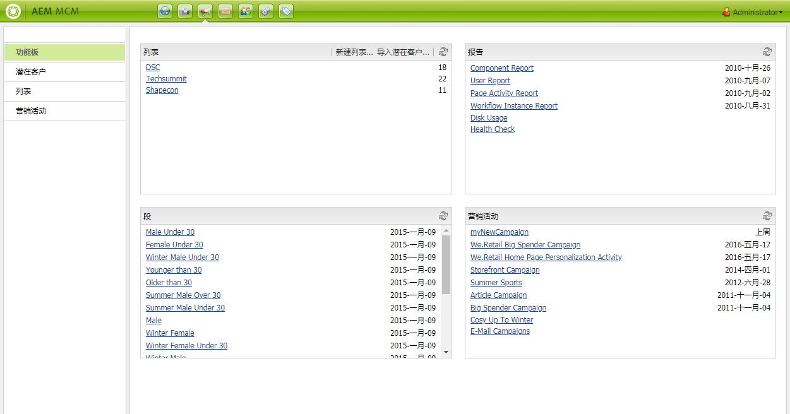

# 使用营销活动管理器{#working-with-the-marketing-campaign-manager}

>[!CAUTION]
>
>AEM 6.4已结束扩展支持，本文档将不再更新。 有关更多详细信息，请参阅 [技术支助期](https://helpx.adobe.com/cn/support/programs/eol-matrix.html). 查找支持的版本 [此处](https://experienceleague.adobe.com/docs/).

在AEM中，营销活动管理器(MCM)是一个控制台，可帮助您管理多渠道营销活动。 使用此营销自动化软件，您可以管理您的所有品牌、营销活动和体验，以及相关的区段、列表、潜在客户和报表。

MCM可从AEM的多个位置访问；例如，欢迎屏幕，使用“营销活动”图标或带有URL:

`https://<hostname>:<port>/libs/mcm/content/admin.html`

例如：

`http://localhost:4502/libs/mcm/content/admin.html`

从MCM中，您可以访问：

* **[功能板](#dashboard)**
这分为四个窗格：

   * [列表](#lists)

      此窗格显示您已创建的列表以及该列表中的潜在客户数量。 在此窗格中，您可以直接创建新列表或导入潜在客户以创建新列表。

      选择特定列表将转到 [列表](#lists) 部分。

   * [区段](/help/sites-classic-ui-authoring/classic-personalization-campaigns.md#anoverviewofsegmentation)

      此窗格显示您定义的区段。 通过区段，可以表示共享某些特征的访客集合。

      选择特定区段将打开区段定义页面。

   * [报表](/help/sites-administering/reporting.md)\
      AEM提供了不同的报表，以帮助您分析和监视实例的状态。 此MCM窗格列出了报告。

      选择报表将打开报表页面。

   * [营销活动](#campaigns)

      此窗格列出了您的营销活动体验，例如 [新闻稿](/help/sites-classic-ui-authoring/classic-personalization-campaigns.md#newsletters) 和 [teaser](/help/sites-classic-ui-authoring/classic-personalization-campaigns.md#teasers).

* **[潜在客户](#leads)**

   您可以在此处管理您的潜在客户。 您可以创建或导入潜在客户，编辑单个潜在客户的特定详细信息，或在不再需要时删除。 您还可以将潜在客户放入称为列表的不同组中。 **注意：** Adobe不打算进一步增强此功能。

   建议为 [利用Adobe Campaign和与AEM的集成](/help/sites-administering/campaign.md).

* **[列表](#lists)**

   您可以在此处管理（潜在客户）列表。**注意：** Adobe不打算进一步增强此功能。

   建议为 [利用Adobe Campaign和与AEM的集成](/help/sites-administering/campaign.md).

* **[促销活动](#campaigns)**
您可以在此处管理品牌、营销活动和体验。

## 仪表板 {#dashboard}

功能板显示四个窗格，其中提供了对（潜在客户）列表、区段、报表和营销活动的概述。 此处还提供了对这些功能的基本访问。

## 潜在客户 {#leads}

>[!NOTE]
>
>Adobe不打算进一步增强此功能（管理潜在客户）。\
>建议利用 [Adobe Campaign和AEM集成](/help/sites-administering/campaign.md).

在AEM MCM中，您可以通过手动输入潜在客户或导入以逗号分隔的列表来组织和添加潜在客户；例如，邮件列表。 生成潜在客户的其他方法包括新闻稿注册或社区注册（如果配置了，这些方法可以触发填充潜在客户的工作流）。 潜在客户通常会进行分类并放入列表中，以便您以后能够对整个列表执行操作；例如，向特定列表发送自定义电子邮件。

在 **潜在客户** 在左窗格中，您可以创建、导入、编辑和删除潜在客户，然后根据需要激活或取消激活。 您可以向列表添加潜在客户，或查看该潜在客户已属于哪些列表。

>[!NOTE]
>
>请参阅 [使用潜在客户](/help/sites-classic-ui-authoring/classic-personalization-campaigns.md#workingwithleads) 以详细了解特定任务。

## 列表 {#lists}

>[!NOTE]
>
>Adobe不打算进一步增强此功能（管理列表）。\
>建议利用 [Adobe Campaign和AEM集成](/help/sites-administering/campaign.md).

列表允许您将潜在客户组织成组。 通过列表，您可以将营销活动定位到选定的人员组；例如，您可以向列表发送定向新闻稿。

在 **列表**，您可以通过创建、导入、编辑、合并和删除列表来管理列表，然后可以根据需要激活或取消激活列表。 您还可以查看该列表中的潜在客户，查看该列表是否是其他列表的成员，或查看描述。

>[!NOTE]
>
>请参阅 [使用列表](/help/sites-classic-ui-authoring/classic-personalization-campaigns.md#workingwithlists) 以详细了解特定任务。

### 营销活动 {#campaigns}

>[!NOTE]
>
>请参阅 [Teaser和策略](/help/sites-classic-ui-authoring/classic-personalization-campaigns.md#workingwithlists), [设置营销活动](/help/sites-classic-ui-authoring/classic-personalization-campaigns.md#settingupyourcampaign) 和 [新闻稿](/help/sites-classic-ui-authoring/classic-personalization-campaigns.md#newsletters) 以详细了解特定任务。

要访问现有营销活动，请在MCM中单击 **促销活动**.

* **在左窗格中**:

   有所有品牌和营销活动的列表。

   单击一次品牌将同时：

   * 展开列表以在左侧窗格中显示所有相关的营销活动；此列表还显示每个营销活动存在的体验数。
   * 在右侧窗格中打开品牌概述。

* **在右侧窗格中**:

   将为每个品牌显示图标（不会显示历史营销活动）。

   您可以双击这些图标以打开品牌概述。

#### 品牌概述 {#brand-overview}

在此，您可以：

* 查看此品牌存在的营销活动和体验数量（左窗格中显示的数量）。
* 创建 **新建……** 营销活动。

* 更改正在查看的时间范围；选择 **周**, **月** 或 **季度**，则使用箭头选择特定时段或返回 **今天**.

* 选择营销活动（在右侧窗格中）以：

   * 编辑 **属性……**
   * **删除** 营销活动。

* 打开营销活动概述（在右窗格中双击某个营销活动，或在左窗格中单击）。

#### 营销活动概述 {#campaign-overview}

对于单个营销活动，有两个可用视图：

1. **日历视图**

   使用图标：

   

   这会显示所有接触点（灰色）列表，以及与该接触点关联的体验（绿色）的水平时间范围：

   

   在此，您可以：

   * 使用箭头更改您正在查看的时间跨度，或返回到 **今天**.
   * 使用 **添加接触点……** 为现有体验添加新接触点。
   * 单击Teaser（在右窗格中）以设置 **开始时间** 和 **关闭时间**.

1. **列表视图**

   使用图标：

   

   该列表列出了所选营销活动的所有体验（如Teaser和新闻稿）：

   

   在此，您可以：

   * 创建 **新建……** 经验；例如，Adobe Target选件、Teaser和新闻稿。
   * **编辑** 特定teaser页面或新闻稿的详细信息（也可使用双击）。
   * 定义 **属性……** 特定Teaser页面或新闻稿。
   * **模拟** 体验（teaser页面或新闻稿）的外观。

      当模拟的页面打开时，您可以打开Sidekick以切换到该页面的编辑模式。

   * **分析……** 为页面生成的展示次数。
   * **删除** 不再需要的项目。
   * **搜索** （将搜索体验的标题字段）。
   * 使用 **高级** 搜索以将过滤器应用于搜索。

### 模拟营销活动体验 {#simulating-your-campaign-experiences}

在MCM中，单击 **促销活动**. 确保列表视图处于活动状态，然后选择所需的营销活动体验并单击 **模拟**. 将打开接触点（Teaser或Newsletter页面）以显示您选择的体验 — 访客将看到该体验。

从此处，您还可以打开Sidekick（单击向下小箭头）以更改为编辑模式以更新页面。

### 分析营销活动体验 {#analyzing-your-campaign-experiences}

在MCM中，单击 **促销活动**. 确保列表视图处于活动状态，然后选择所需的营销活动体验并选择 **分析……**. 将显示一段时间内的页面展示次数图表。

