# 设置营销活动{#setting-up-your-campaign}

>[!CAUTION]
>
>AEM 6.4已结束扩展支持，本文档将不再更新。 有关更多详细信息，请参阅 [技术支助期](https://helpx.adobe.com/cn/support/programs/eol-matrix.html). 查找支持的版本 [此处](https://experienceleague.adobe.com/docs/).

设置新营销活动包括以下（一般）步骤：

1. [创建品牌](#creating-a-new-brand) 来保存营销活动。
1. 如果需要，您可以 [为新品牌定义属性](#defining-the-properties-for-your-new-brand).
1. [创建营销活动](#creating-a-new-campaign) 来保存经验；例如teaser页面或新闻稿。
1. 如果需要，您可以 [为新营销活动定义属性](#defining-the-properties-for-your-new-campaign).

然后，根据您创建的体验类型，您将需要 [创建体验](#creating-a-new-experience). 体验的详细信息及其创建后执行的操作取决于要创建的体验类型：

* 如果创建Teaser:

   1. [创建Teaser体验](/help/sites-classic-ui-authoring/classic-personalization-campaigns.md#creatingateaserexperience).
   1. [向Teaser添加内容](/help/sites-classic-ui-authoring/classic-personalization-campaigns.md#addingcontenttoyourteaser).
   1. [为Teaser创建接触点](/help/sites-classic-ui-authoring/classic-personalization-campaigns.md#creatingatouchpointforyourteaser) （将teaser添加到内容页面）。

* 如果创建新闻稿：

   1. [创建新闻稿体验](/help/sites-classic-ui-authoring/classic-personalization-campaigns.md#creatinganewsletterexperience).
   1. [向新闻稿中添加内容。](/help/sites-classic-ui-authoring/classic-personalization-campaigns.md#addingcontenttonewsletters)
   1. [个性化新闻稿。](/help/sites-classic-ui-authoring/classic-personalization-campaigns.md#personalizingnewsletters)
   1. [创建引人注目的新闻稿登陆页面](/help/sites-classic-ui-authoring/classic-personalization-campaigns.md#settingupanewsletterlandingpage).
   1. [发送新闻稿](/help/sites-classic-ui-authoring/classic-personalization-campaigns.md#sendingnewsletters) 订阅者或潜在客户。

* 如果创建Adobe Target（以前称为Test&amp;Target）选件：

   1. [创建Adobe Target选件体验](/help/sites-classic-ui-authoring/classic-personalization-campaigns.md#creatingatesttargetofferexperience).
   1. [与 Adobe Target 集成](/help/sites-classic-ui-authoring/classic-personalization-campaigns.md#integratewithadobetesttarget)

>[!NOTE]
>
>请参阅 [分段](/help/sites-administering/campaign-segmentation.md) ，以了解有关定义区段的详细说明。

## 创建新品牌 {#creating-a-new-brand}

要创建新品牌，请执行以下操作：

1. 打开 **MCM** 选择 **促销活动** 中。

1. 选择 **新建……** 输入 **标题** 和 **名称** 和用于新品牌的模板：

   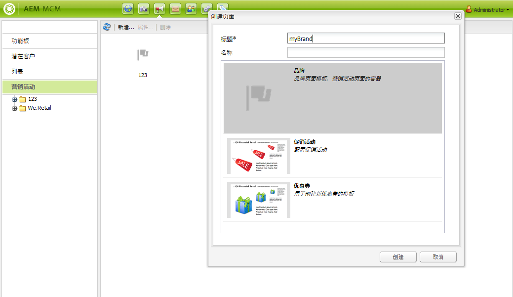

1. 单击&#x200B;**创建**。您的新品牌将显示在MCM中（带有默认图标）。

### 为新品牌定义属性 {#defining-the-properties-for-your-new-brand}

1. 从 **促销活动** 在左窗格中，选择右窗格中的新品牌图标，然后单击 **属性……**

   您可以输入 **标题**, **描述** 和要用作图标的图像。

   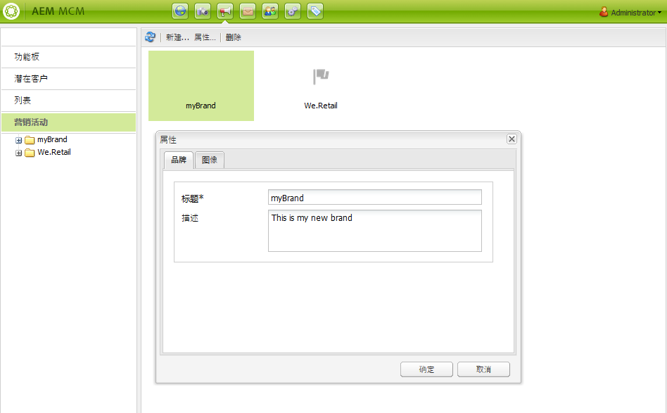

1. 单击 **确定** 保存。

## 创建新营销活动 {#creating-a-new-campaign}

要创建新营销活动，请执行以下操作：

1. 从 **促销活动**，请在左窗格中选择您的新品牌，或双击右窗格中的图标。

   将显示概述（如果是新品牌，则概述为空）。

1. 单击 **新建……** 并指定 **标题**, **名称** 和用于新营销活动的模板。

   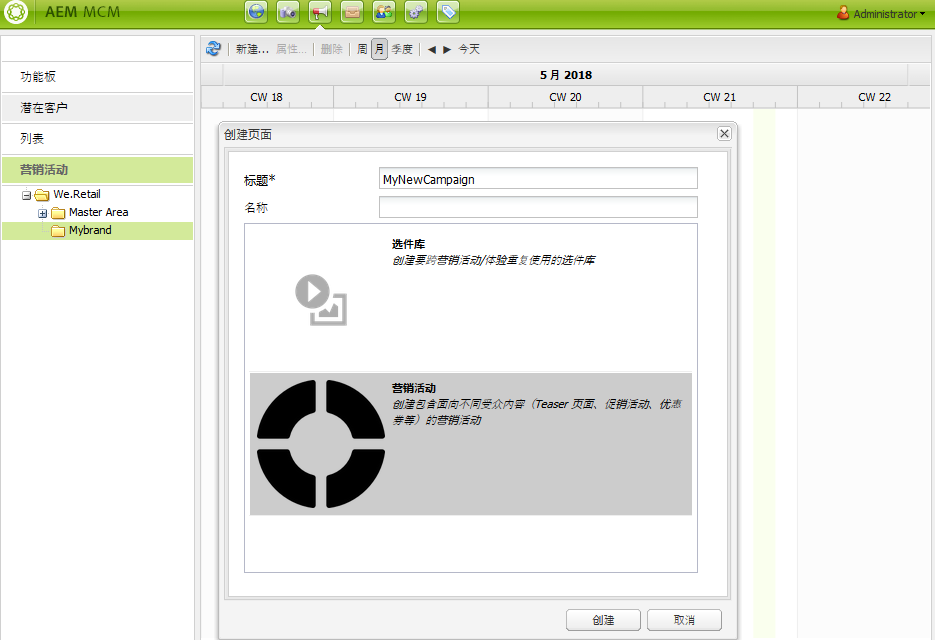

1. 单击&#x200B;**创建**。您的新营销活动将显示在MCM中。

### 为新营销活动定义属性 {#defining-the-properties-for-your-new-campaign}

配置可控制行为的营销活动属性：

* **优先级：** 此营销活动相对于其他营销活动的优先级。 当多个营销活动同时开启时，具有最高优先级的营销活动会控制访客体验。
* **开启和关闭时间：** 这些属性控制营销活动控制访客体验的时间段。 开始时间属性控制营销活动开始控制体验的时间。 “结束时间”属性可控制营销活动停止控制体验的时间。
* **图像：** 在AEM中表示营销活动的图像。
* **Cloud Services:** 集成营销活动的Cloud Service配置。 (请参阅 [与Adobe Marketing Cloud集成](/help/sites-administering/marketing-cloud.md).)

* **Adobe Target:** 配置与Adobe Target集成的促销活动的属性。 (请参阅 [与Adobe Target集成](/help/sites-administering/target.md).)

1. 从 **促销活动**，选择您的品牌。 在右侧窗格中，选择您的营销活动并单击 **属性**.

   您可以输入各种属性，包括 **标题**, **描述** 和 **Cloud Services** 你想。

   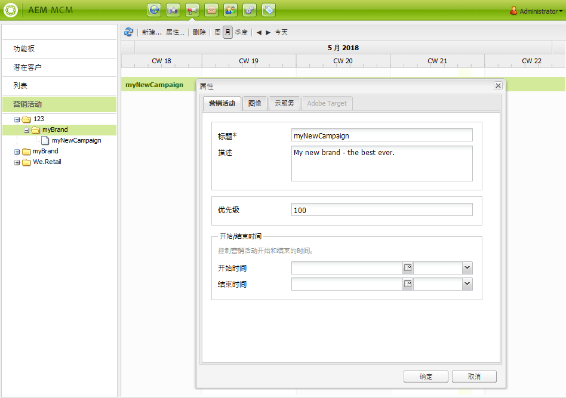

1. 单击 **确定** 保存。

## 创建新体验 {#creating-a-new-experience}

创建新体验的过程取决于体验类型：

* [创建Teaser](/help/sites-classic-ui-authoring/classic-personalization-campaigns.md#creatingateaser)
* [创建新闻稿](/help/sites-classic-ui-authoring/classic-personalization-campaigns.md#creatinganewsletter)
* [创建Adobe Target选件](/help/sites-classic-ui-authoring/classic-personalization-campaigns.md#creatingatesttargetoffer)

>[!NOTE]
>
>与以前的版本一样，仍然可以在 **网站** 控制台（以及在以前版本中创建的任何此类页面仍完全受支持）。
>
>现在，建议使用MCM创建体验。

## 配置新体验 {#configuring-your-new-experience}

现在，您已经为体验创建了基本骨架，接下来需要根据体验类型继续执行以下操作：

* [Teaser](/help/sites-classic-ui-authoring/classic-personalization-campaigns.md#teasers):

   * [将Teaser页面连接到访客区段。](/help/sites-classic-ui-authoring/classic-personalization-campaigns.md#applyingasegmenttoyourteaser)
   * [为Teaser创建接触点](/help/sites-classic-ui-authoring/classic-personalization-campaigns.md#creatingatouchpointforyourteaser) （将teaser添加到内容页面）。

* [新闻稿](/help/sites-classic-ui-authoring/classic-personalization-campaigns.md#newsletters):

   * [向新闻稿中添加内容。](/help/sites-classic-ui-authoring/classic-personalization-campaigns.md#addingcontenttonewsletters)
   * [个性化新闻稿。](/help/sites-classic-ui-authoring/classic-personalization-campaigns.md#personalizingnewsletters)
   * [发送新闻稿](/help/sites-classic-ui-authoring/classic-personalization-campaigns.md#sendingnewsletters) 订阅者或潜在客户。
   * [创建引人注目的新闻稿登陆页面](/help/sites-classic-ui-authoring/classic-personalization-campaigns.md#settingupanewsletterlandingpage).

* [Adobe Target选件](/help/sites-classic-ui-authoring/classic-personalization-campaigns.md#testtargetoffers):

   * [与 Adobe Target 集成](/help/sites-administering/target.md)

### 添加新接触点 {#adding-a-new-touchpoint}

如果您已有体验，则可以直接从MCM的“日历”视图添加接触点：

1. 选择营销活动的日历视图。

1. 单击 **添加接触点……** 打开对话框。 指定要添加的体验：

   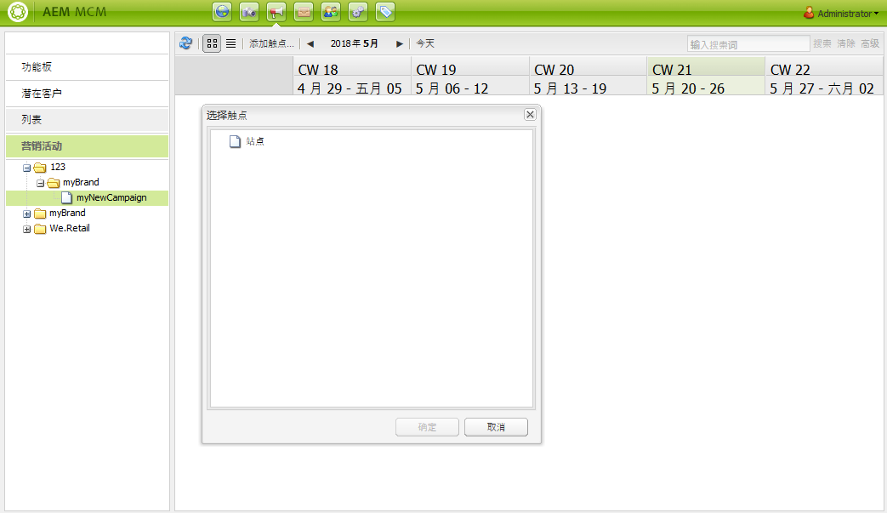

1. 单击 **确定** 保存。

## 使用潜在客户 {#working-with-leads}

>[!NOTE]
>
>Adobe不打算进一步增强此功能（管理潜在客户）。\
>建议为 [利用Adobe Campaign和与AEM的集成](/help/sites-administering/campaign.md).

在AEM MCM中，您可以通过手动输入潜在客户或导入以逗号分隔的列表（例如邮寄列表）来组织和添加潜在客户。 生成潜在客户的其他方法包括新闻稿注册或社区注册（如果配置了，这些方法可以触发填充潜在客户的工作流）。

潜在客户通常会进行分类并放入列表中，以便您稍后能够对整个列表执行操作，例如向特定列表发送自定义电子邮件。

在功能板中，您可以通过单击 **潜在客户** 从左窗格。 您还可以从 **列表** 中。

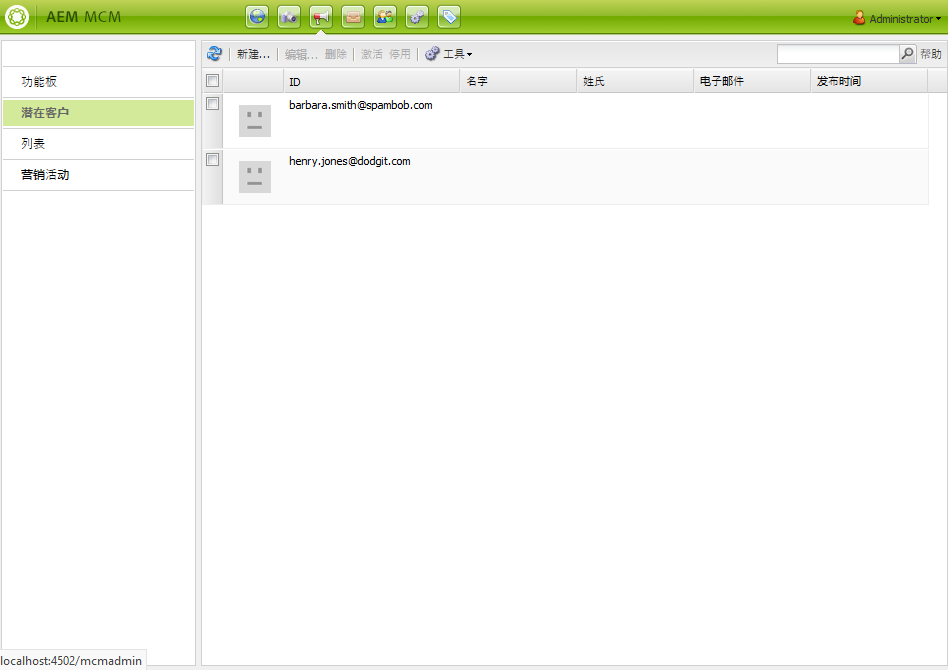

>[!NOTE]
>
>要添加或修改用户的头像，请打开Clickstream Cloud(Ctrl+Alt+c)，加载用户档案，然后单击 **编辑**.

### 创建新潜在客户 {#creating-new-leads}

创建新潜在客户后，请务必 [激活](#activating-or-deactivating-leads) 以便您跟踪他们在发布实例上的活动并个性化其体验。

要手动创建新潜在客户，请执行以下操作：

1. 在AEM中，导航到MCM。 在功能板中，单击 **潜在客户**.
1. 单击 **新建**. 的 **新建** 窗口。

   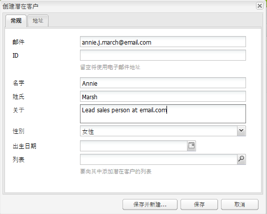

1. 根据需要，在字段中输入信息。 单击 **地址** 选项卡。

   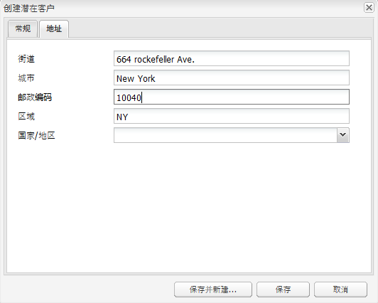

1. 根据需要输入地址信息。 单击 **保存** 以拯救潜在客户。 如果需要添加其他潜在客户，请单击**保存并新建**。

   新潜在客户会显示在“潜在客户”窗格中。 单击条目时，输入的所有信息都会显示在右侧窗格中。 创建潜在客户后，可将其添加到列表。

   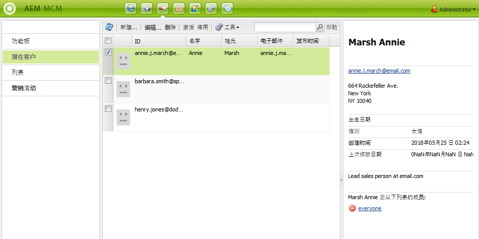

### 激活或停用潜在客户 {#activating-or-deactivating-leads}

激活潜在客户可帮助您跟踪其发布实例上的活动，并让您个性化其体验。 当您不再希望跟踪其活动时，可以停用它们。

要激活或取消激活潜在客户，请执行以下操作：

1. 在AEM中，导航到MCM并单击 **潜在客户**.

1. 选择要激活或取消激活的潜在客户，然后单击 **激活** 或 **停用**.

   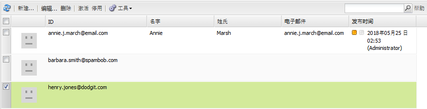

   与AEM页面一样，发布状态在 **已发布** 列。

   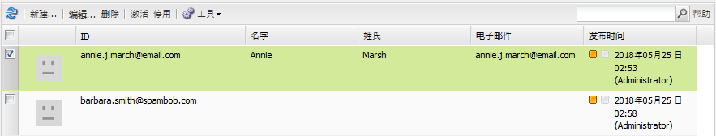

### 导入新潜在客户 {#importing-new-leads}

在导入新潜在客户时，您可以自动将其添加到现有列表或创建新列表以包含这些潜在客户。

要从以逗号分隔的列表导入潜在客户，请执行以下操作：

1. 在AEM中，导航到MCM并单击 **潜在客户**.

   >[!NOTE]
   >
   >或者，您也可以通过执行以下操作之一来导入潜在客户：
   >
   >* 在功能板中，单击 **导入潜在客户** 在 **列表** 窗格
   >* 单击 **列表** 和 **工具** 菜单，选择 **导入潜在客户**.

1. 在 **工具** 菜单，选择 **导入潜在客户**.
1. 按照示例数据中所述输入信息。 可以导入以下字段：email，familyName，givenName，gender，aboutMe，city，country，phoneNumber，postalCode，region，streetAddress

   >[!NOTE]
   >
   >CSV列表中的第一行是预定义的标签，其编写方式必须与示例中完全相同：
   >
   >`email,givenName,familyName`  — 如果写为 `givenname`例如，系统将无法识别它。

   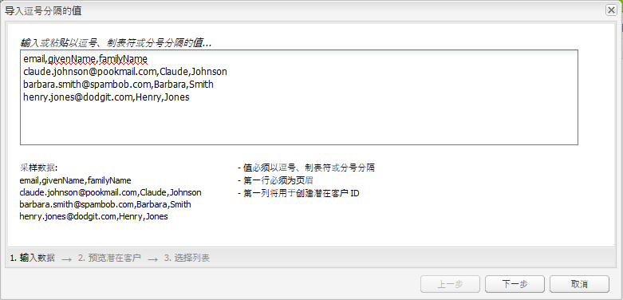

1. 单击&#x200B;**下一步**。在此，您可以预览潜在客户，以确保它们准确无误。

   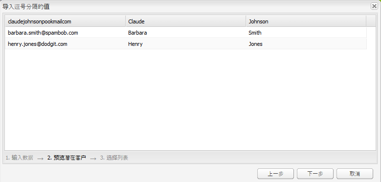

1. 单击&#x200B;**下一步**。选择您希望潜在客户所属的列表。 如果您不希望它们属于列表，请删除字段中的信息。 默认情况下，AEM会创建一个包含日期和时间的列表名称。 单击 **导入**.

   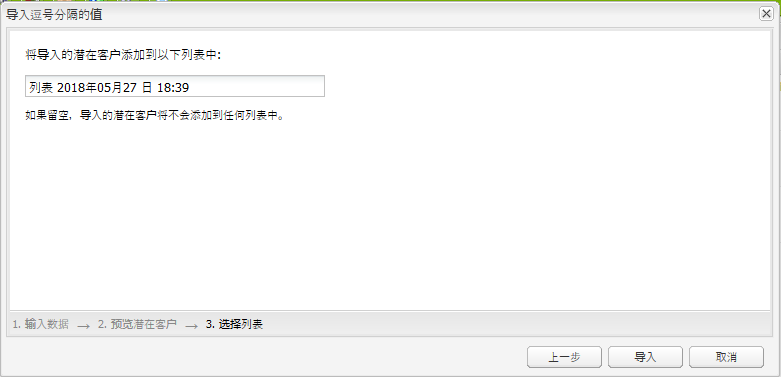

   新潜在客户会显示在“潜在客户”窗格中。 如果单击该条目，则所有输入的信息都会显示在右侧窗格中。 创建潜在客户后，可将其添加到列表。

### 将潜在客户添加到列表 {#adding-leads-to-lists}

要将潜在客户添加到预先存在的列表，请执行以下操作：

1. 在MCM中，单击 **潜在客户** 查看所有可用的潜在客户。

1. 通过选中潜在客户旁边的复选框，选择要添加到列表的潜在客户。 您可以添加所需数量的潜在客户。

   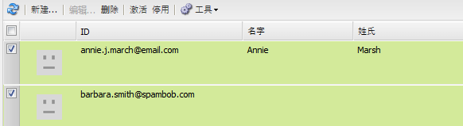

1. 在 **工具** 菜单，选择 **添加到列表…….** 将打开**添加到列表**窗口。

   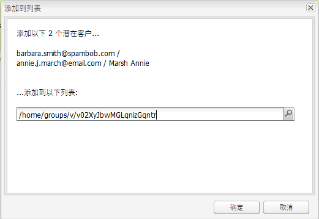

1. 选择要将潜在客户添加到的列表，然后单击 **确定**. 潜在客户会添加到相应的列表中。

### 查看潜在客户信息 {#viewing-lead-information}

要查看潜在客户信息，请在MCM中，单击潜在客户旁边的复选框，此时会打开一个右窗格，其中显示了潜在客户的所有信息，包括列表从属关系。

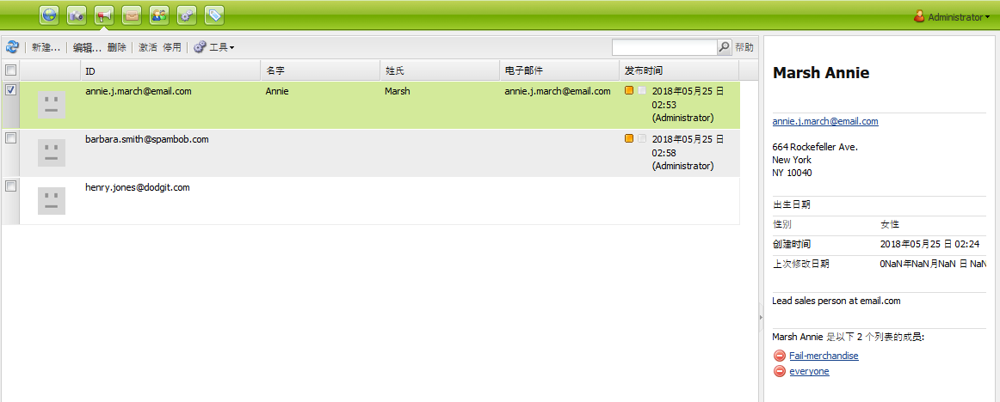

### 修改现有潜在客户 {#modifying-existing-leads}

要修改现有潜在客户信息，请执行以下操作：

1. 在MCM中，单击 **潜在客户**. 在潜在客户列表中，选中要编辑的潜在客户旁边的复选框。 所有潜在客户信息都显示在右侧窗格中。

   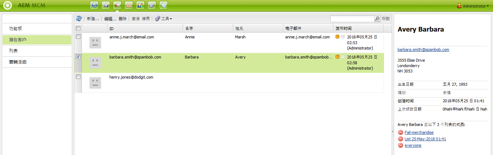

   >[!NOTE]
   >
   >您一次只能编辑一个潜在客户。 如果需要修改属于同一列表的潜在客户，则可以改为修改列表。

1. 单击 **编辑**. 的 **编辑潜在客户** 窗口。

   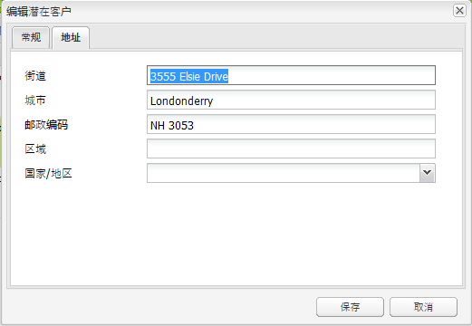

1. 根据需要进行编辑，然后单击 **保存** 以保存更改。

   >[!NOTE]
   >
   >要更改潜在客户头像，请转到用户配置文件。 您可以在Clickstream Cloud中加载用户档案，方法是按CTRL+ALT+c，单击 **加载**，然后选择用户档案。

### 删除现有潜在客户 {#deleting-existing-leads}

要在MCM中删除现有潜在客户，请选中该潜在客户旁边的复选框，然后单击 **删除**. 潜在客户会从潜在客户列表和所有关联列表中删除。

>[!NOTE]
>
>在删除之前，AEM会确认您是否要删除现有潜在客户。 删除后，将无法检索该内容。

## 使用列表 {#working-with-lists}

>[!NOTE]
>
>Adobe不打算进一步增强此功能（管理列表）。\
>建议为 [利用Adobe Campaign和与AEM的集成](/help/sites-administering/campaign.md).

列表允许您将潜在客户组织成组。 通过列表，您可以将营销活动定位到选定的人员组，例如，可以向列表发送定向新闻稿。 列表在MCM中(在功能板中或通过单击 **列表**. 这两种方法都会为您提供列表的名称和成员数量。

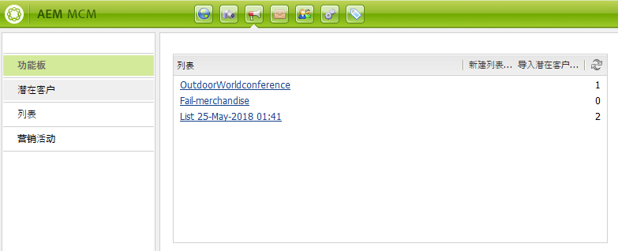

如果单击 **列表**，您还可以查看列表是否是其他列表的成员，并查看描述。

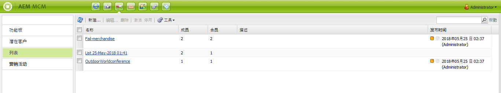

### 创建新列表 {#creating-new-lists}

要创建新列表（组），请执行以下操作：

1. 在MCM仪表板中，单击 **新建列表……** 或 **列表**，单击 **新建** ...“创建列表”(Create List)窗口打开。

   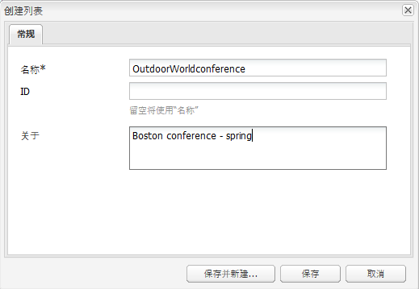

1. 输入名称（必需），并根据需要输入描述并单击 **保存**. 该列表显示在 **列表** 中。

   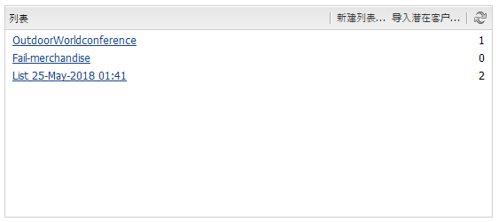

### 修改现有列表 {#modifying-existing-lists}

要修改现有列表，请执行以下操作：

1. 在MCM中，单击 **列表**.

1. 在列表中，选中要编辑的列表旁边的复选框，然后单击 **编辑**. 的 **编辑列表** 窗口。

   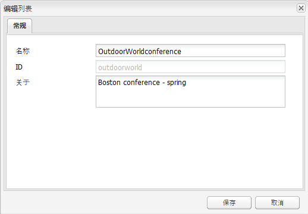

   >[!NOTE]
   >
   >一次只能编辑一个列表。

1. 根据需要进行编辑，然后单击 **保存** 以保存更改。

### 删除现有列表 {#deleting-existing-lists}

要删除现有列表，请在MCM中，选中列表旁边的复选框，然后单击 **删除**. 该列表将被删除。 不会删除与列表关联的潜在客户 — 只删除与列表的关联。

>[!NOTE]
>
>在删除之前，AEM会确认您是否要删除现有列表。 删除后，将无法检索该内容。

### 合并列表 {#merging-lists}

您可以将现有列表与其他列表合并。 执行此操作时，要合并的列表将成为另一个列表的成员。 它仍作为单独的实体存在，不应删除。

如果您在两个不同位置有同一个会议，并且希望将它们合并到所有会议的与会者列表中，则可以合并列表。

要合并现有列表，请执行以下操作：

1. 在MCM中，单击 **列表**.

1. 通过选中另一个列表旁边的复选框，选择要与其合并的列表。

1. 在 **工具** 菜单，选择 **合并列表**.

   >[!NOTE]
   >
   >一次只能合并一个列表。

1. 在 **合并列表** 窗口中，选择要与其合并的列表，然后单击 **确定**.

   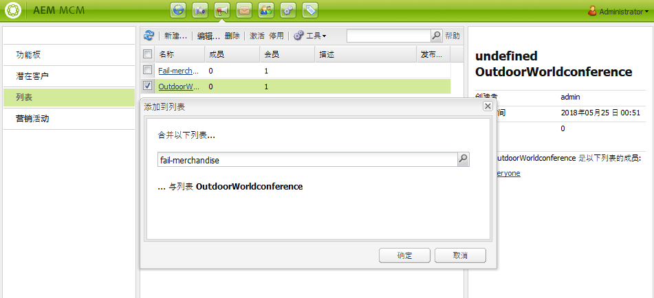

   合并的列表应增加一个成员。 要查看您的列表是否已合并，请选择您合并的列表，然后在 **工具** 菜单，选择 **显示潜在客户**.

1. 重复该步骤，直到合并了所有所需的列表。

   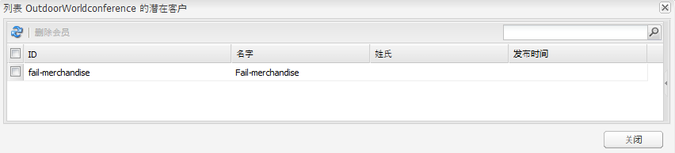

>[!NOTE]
>
>从成员资格中删除合并列表与从列表中删除潜在客户相同。 打开 **列表** 选项卡，选择包含合并列表的列表，然后单击列表旁边的红色圆圈以删除成员资格。

### 在列表中查看潜在客户 {#viewing-leads-in-lists}

您可以随时通过浏览或搜索成员来查看属于特定列表的潜在客户。

要查看属于列表的潜在客户，请执行以下操作：

1. 在MCM中，单击 **列表**.

1. 选中要查看其成员的列表旁的复选框。

1. 在 **工具** 菜单，选择 **显示潜在客户**. AEM显示属于该列表成员的潜在客户。 您可以浏览列表或搜索成员。

   >[!NOTE]
   >
   >此外，您还可以从列表中删除潜在客户，方法是选择潜在客户，然后单击 **删除成员资格**.

   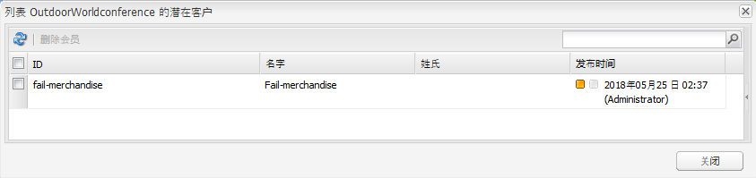

1. 单击 **关闭** 返回MCM。
