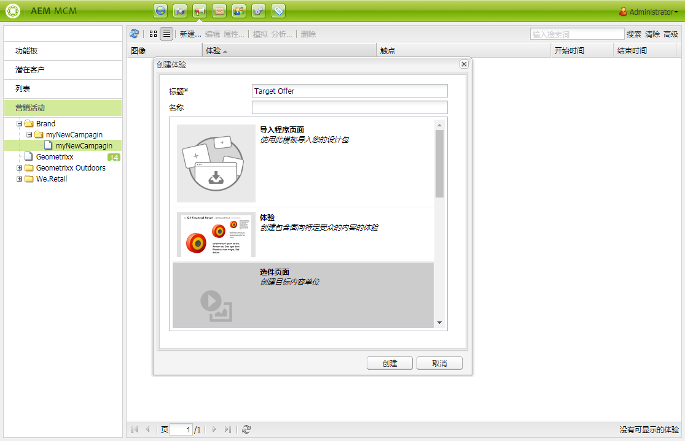

# Target选件{#target-offers}

>[!CAUTION]
>
>AEM 6.4已结束扩展支持，本文档将不再更新。 有关更多详细信息，请参阅 [技术支助期](https://helpx.adobe.com/cn/support/programs/eol-matrix.html). 查找支持的版本 [此处](https://experienceleague.adobe.com/docs/).

## 创建Test&amp;Target选件体验 {#creating-a-test-target-offer-experience}

1. 在左窗格中选择您的新营销活动，或在右窗格中双击它。
1. 使用图标选择列表视图：

   

1. 单击 **新建……**
1. 您可以指定 **标题**, **名称** 以及要创建的体验类型；在这种情况下，为Test&amp;Target选件。

   

1. 单击&#x200B;**创建**。

   >[!NOTE]
   >
   >Test&amp;Target体验当前未列在MCM中。 它们可从 **网站** 控制台中的“营销活动”下。

## 与 Adobe Target 集成 {#integrating-with-adobe-target}

请参阅 [与Adobe集成](/help/sites-administering/target.md) [Target](/help/sites-administering/target.md) 以了解完整详细信息。
