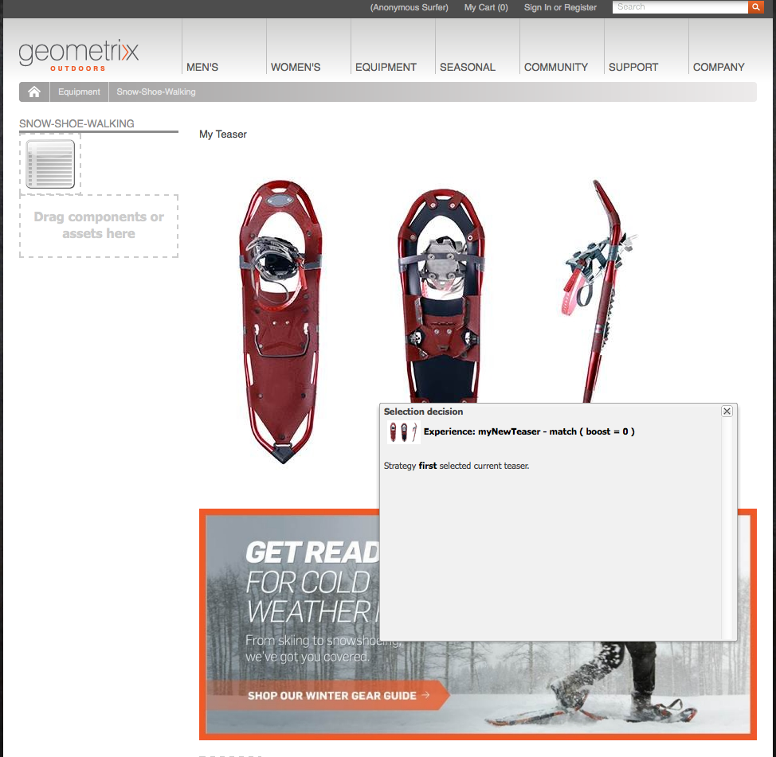

# Teaser和策略{#teasers-and-strategies}

>[!CAUTION]
>
>AEM 6.4已结束扩展支持，本文档将不再更新。 有关更多详细信息，请参阅 [技术支助期](https://helpx.adobe.com/cn/support/programs/eol-matrix.html). 查找支持的版本 [此处](https://experienceleague.adobe.com/docs/).

营销活动通常使用Teaser作为吸引特定区段的访客群体访问其关注的内容的机制。 为特定营销活动定义一个或多个Teaser。

>[!NOTE]
>
>AEM 6.2中已弃用Teaser组件。

* **品牌页面** 存储在网站的“营销活动”部分中。 品牌包含单个营销活动。

* **促销活动页面** 存储在网站的“营销活动”部分中。 每个营销活动都有一个单独的页面，在该页面中保留Teaser定义。 容器或概述页面还包含有关单个Teaser页面的某些信息和统计信息。

AEM中的Teaser由以下几部分组成：

* **Teaser页面** 存储在相应的营销活动页面下，并保存每个特定营销活动可用的teaser段落定义。 在显示Teaser段落时，会使用这些定义；包括内容变体，用于选择变体和提升因子的区段。
* 的 **Teaser组件** 开箱即用，允许您在内容页面中创建特定teaser段落的实例。 您可以从Sidekick中拖动Teaser组件，然后指定Teaser定义以创建您自己的Teaser段落。 **注意：** AEM 6.2中已弃用Teaser组件。

* **Teaser段落** 是内容页面中Teaser的实际实例。 这些功能可吸引区段访客访问其关注的内容。
* 包含针对特定访客区段的营销活动内容的页面。 通常，Teaser段落会将访客引导到此类页面。

## 策略 {#strategies}

在向页面添加Teaser段落时，您需要定义 **策略**.

这适用于以下情况：由于多个Teaser的分配区段都成功解析，因此可供选择。 的 **策略** 然后，指定用于选择显示的teaser的额外条件：

* **点击流得分**，基于访客客户端上下文中保留的标记和相关标记点击量（显示访客在包含相应标记的页面上单击的频率）。 将比较Teaser页面上定义的标记的点击率。
* **随机**，用于“随机”选择；使用为页面生成的随机因子，可通过 [客户端上下文](/help/sites-administering/client-context.md).

* **第一个** 在已解析的区段列表中。 顺序是营销活动容器页面中Teaser的顺序。

的 [提升因子](/help/sites-administering/campaign-segmentation.md#boost-factor) 区段对选择也有影响。 这是添加到区段定义中的加权因子，用于增加/减少被选择的相对可能性。

各种选择标准的过程和相互关系通过示例进行了最佳说明（此方法还可用于确保Teaser将到达所需受众）。

如果已创建以下区段并为其分配了各自的提升因子：

| 市场细分 | 提升因子 |
|---|---|
| S1 | 0 |
| S2 | 0 |
| S3 | 10 |
| S4 | 30 |
| S5 | 0 |
| S6 | 100 |

我们使用以下Teaser定义：

<table> 
 <tbody> 
  <tr> 
   <td>营销活动</td> 
   <td>Teaser</td> 
   <td>分配的区段</td> 
   <td>分配的标记 </td> 
  </tr> 
  <tr> 
   <td>C1</td> 
   <td>T1</td> 
   <td>S1、S2</td> 
   <td>业务、营销</td> 
  </tr> 
  <tr> 
   <td>C1</td> 
   <td>T2 </td> 
   <td>S1</td> 
   <td>  </td> 
  </tr> 
  <tr> 
   <td>C1 </td> 
   <td>T3</td> 
   <td>S3、S4</td> 
   <td>  </td> 
  </tr> 
  <tr> 
   <td>C1 </td> 
   <td>T4</td> 
   <td>S2、S5</td> 
   <td>  </td> 
  </tr> 
  <tr> 
   <td>C1 </td> 
   <td>T5</td> 
   <td>S1、S2、S6</td> 
   <td>营销</td> 
  </tr> 
  <tr> 
   <td>C1 </td> 
   <td>T6</td> 
   <td>S6</td> 
   <td>商务  </td> 
  </tr> 
 </tbody> 
</table>

然后，如果我们将此变量应用于以下访客：

* **S1**, **S2** 和 **S6** 已成功解析

* 标记 **营销** 具有3次点击
* 标记 **业务** 具有6次点击

我们可以看到结果：

* 匹配成功 — 分配给teaser的任何区段是否会为当前访客成功解析？
* 提升因子 — 所有适用区段的最高提升因子
* 点击流得分 — 所有适用标记点击的累计总数

值在应用相应策略之前计算：

<table> 
 <tbody> 
  <tr> 
   <td>营销活动</td> 
   <td>Teaser</td> 
   <td>分配的区段</td> 
   <td>标记 </td> 
   <td>成功匹配？</td> 
   <td>结果提升因子</td> 
   <td>生成的点击流得分 </td> 
  </tr> 
  <tr> 
   <td>C1</td> 
   <td>T1</td> 
   <td>S1、S2</td> 
   <td>业务、营销</td> 
   <td>是</td> 
   <td>0</td> 
   <td>9</td> 
  </tr> 
  <tr> 
   <td>C1</td> 
   <td>T2 </td> 
   <td>S1</td> 
   <td>  </td> 
   <td>是</td> 
   <td>0</td> 
   <td>  </td> 
  </tr> 
  <tr> 
   <td>C1 </td> 
   <td>T3</td> 
   <td>S3、S4</td> 
   <td>  </td> 
   <td>否</td> 
   <td>  </td> 
   <td>  </td> 
  </tr> 
  <tr> 
   <td>C1 </td> 
   <td>T4</td> 
   <td>S2、S5</td> 
   <td>  </td> 
   <td>是  </td> 
   <td>0  </td> 
   <td>  </td> 
  </tr> 
  <tr> 
   <td>C1 </td> 
   <td>T5</td> 
   <td>S1、S2、S6</td> 
   <td>营销</td> 
   <td>是</td> 
   <td>100</td> 
   <td>3</td> 
  </tr> 
  <tr> 
   <td>C1 </td> 
   <td>T6</td> 
   <td>S6</td> 
   <td>商务</td> 
   <td>是</td> 
   <td>100</td> 
   <td>6 </td> 
  </tr> 
 </tbody> 
</table>

这些值用于确定访客将看到的Teaser，具体取决于 **策略** 应用于Teaser段落：

<table> 
 <tbody> 
  <tr> 
   <td>战略</td> 
   <td>生成的Teaser</td> 
   <td>评论</td> 
  </tr> 
  <tr> 
   <td>第一个</td> 
   <td>T5</td> 
   <td>只有T5和T6被视为其区段全部解析 <i>和</i> 它们具有最高的提升因子。 返回的列表按T5、T6的顺序排列；以便选择并显示T5。</td> 
  </tr> 
  <tr> 
   <td>随机</td> 
   <td>T5或T6</td> 
   <td>两个Teaser的区段都会解析，且具有相同的提升因子。 因此，将以等比例显示这两个Teaser。</td> 
  </tr> 
  <tr> 
   <td>点击流得分</td> 
   <td>T6</td> 
   <td>
T1、T4、T5和T6的区段都会解析为访客。 T5和T6的提升因子越高，则T1和T4的提升因子越高。 最后，T6的点击流得分越高，就会选择该值。
 </td> 
  </tr> 
 </tbody> 
</table>

>[!NOTE]
>
>如果在上述分辨率技术之后，有多个Teaser可供选择，则内部选择（随机）将选择一个Teaser进行显示。
>
>例如，如果策略为Clickstream得分，而T5的Clickstream得分与T6相同（即6而不是3），则将使用内部选择（随机）选择这两者中的一个。

Teaser页面/段落用于将特定访客区段定向到他们感兴趣的内容。 它们可以显示一系列选项供访客选择，也可以仅显示一个基于特定访客区段的Teaser段落；例如，显示的Teaser段落可能取决于访客的年龄。

通常，Teaser页面是一个临时操作，将持续特定时间段，直到被下一个Teaser页面替换为止。

创建品牌和营销活动后，您可以创建和设置Teaser体验。

## 为Teaser创建接触点 {#creating-a-touchpoint-for-your-teaser}

>[!NOTE]
>
>AEM 6.2中已弃用Teaser组件。

1. 导航到要将Teaser段落放置到其中以通往营销活动页面的内容页面。
1. 添加 **Teaser** 组件(在 **个性化** 部分)。 首次创建时，将显示营销活动路径尚未配置：

   

1. 编辑Teaser组件以添加：

   * **营销活动路径**
包含单个Teaser页面的营销活动页面的路径；区段确切确定显示哪个teaser。
   * **[策略](/help/sites-classic-ui-authoring/classic-personalization-campaigns.md#strategies)**
用于在多个区段成功解析时进行选择的方法。
   

1. 单击 **确定** 保存。 根据您在Teaser中设置的区段以及您当前登录的用户的配置文件，将显示相应的内容：

   

1. 将鼠标悬停在Teaser段落上以显示问号图标（组件的右下角）。 单击此图标可查看应用的区段以及它们当前是否解析。

   

## Teaser概述 {#teaser-overview}

除了MCM中的营销活动视图外，营销活动页面还提供了与其连接的Teaser的信息：

1. 从 **网站** 控制台，打开营销活动页面；例如：

   `http://localhost:4502/content/campaigns/geometrixx-outdoors/storefront/summer.html`

   这显示了Teaser定义和查看统计信息的概述：

   
