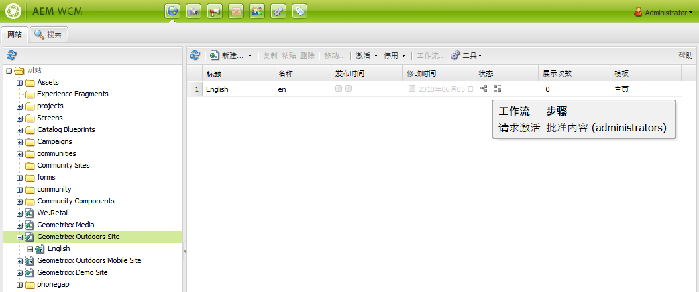
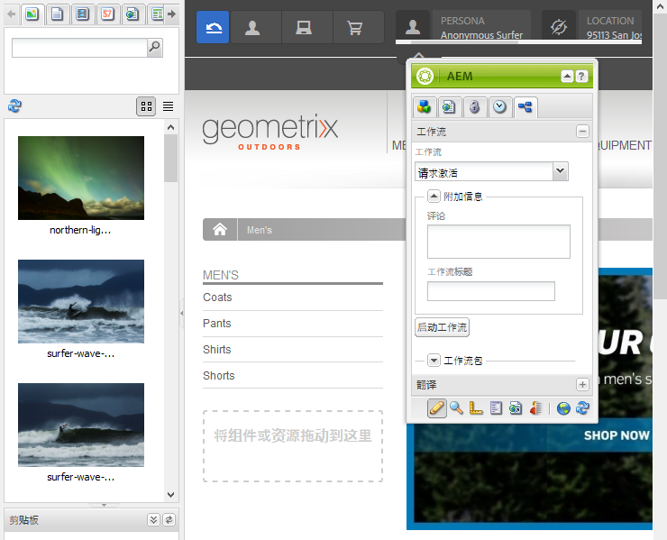

# 将工作流应用于页面{#applying-workflows-to-pages}

>[!CAUTION]
>
>AEM 6.4已结束扩展支持，本文档将不再更新。 有关更多详细信息，请参阅 [技术支助期](https://helpx.adobe.com/cn/support/programs/eol-matrix.html). 查找支持的版本 [此处](https://experienceleague.adobe.com/docs/).

应用工作流时，您可以指定以下信息：

* 要应用的工作流。

   您可以应用任何工作流（您有权访问，由 AEM 管理员分配）。
* （可选）：

   * 提供有关启动工作流原因的注释。
   * 可帮助在用户收件箱中识别工作流实例的标题。

>[!NOTE]
>
>AEM管理员可以使用 [其他方法](/help/sites-administering/workflows-starting.md).

## 应用工作流 {#applying-workflows}

可以从“网站”控制台启动工作流，或在编辑页面时，也可以从Sidekick启动工作流。

的 **状态** 列 **网站** 控制台指示工作流是否已应用于页面：

### 从网站控制台启动工作流 {#starting-a-workflow-from-the-websites-console}

1. 打开网站控制台。 ([http://localhost:4502/siteadmin](http://localhost:4502/siteadmin))
1. 在网站树中，选择要应用工作流的页面的父项。
1. 在页面列表中，选择页面，然后单击工作流。
1. 在启动工作流对话框中，选择要应用的工作流。 或者，输入评论和标题。 然后，单击“Start（开始）”。

### 使用Sidekick启动工作流 {#starting-a-workflow-using-sidekick}

1. 打开网站控制台。
1. 打开所需的页面。
1. 从Sidekick中选择工作流选项卡。
1. 展开 **工作流** 对话框，允许您选择 **工作流** （可选）输入 **工作流标题** 和 **注释**.

   

1. 单击 **启动工作流** 以启动新的工作流实例，并将您配置的属性和当前页面作为有效负载。 现在，工作流正在运行。
