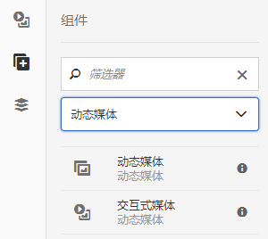
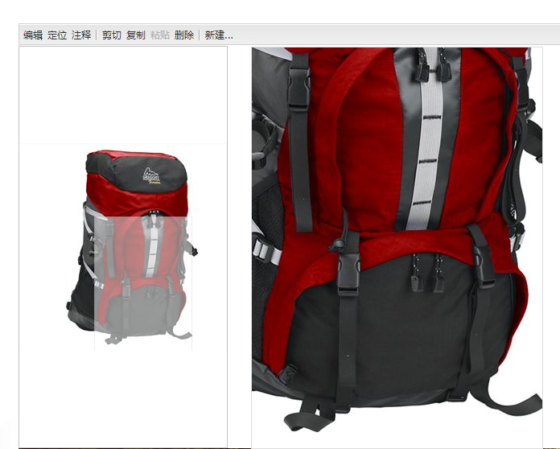
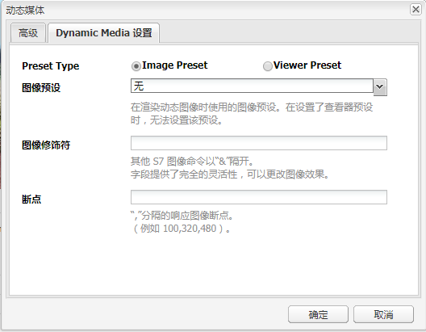
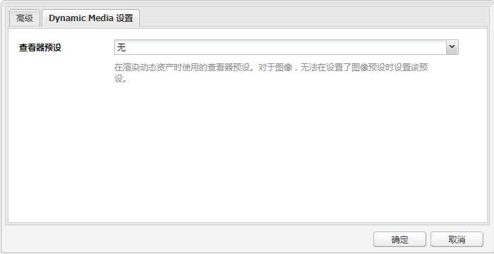

# 将 Dynamic Media 资产添加到页面{#adding-dynamic-media-assets-to-pages}

>[!CAUTION]
>
>AEM 6.4已结束扩展支持，本文档将不再更新。 有关更多详细信息，请参阅 [技术支助期](https://helpx.adobe.com/cn/support/programs/eol-matrix.html). 查找支持的版本 [此处](https://experienceleague.adobe.com/docs/).

要将Dynamic Media功能添加到您在网站上使用的资产中，您可以将 **[!UICONTROL Dynamic Media]** 或 **[!UICONTROL 交互式媒体]** 组件。 要执行此操作，请输入 [!UICONTROL 设计] 模式并启用dynamic media组件。 然后，您可以将这些组件添加到页面，并将资产添加到该组件。 Dynamic Media和交互式媒体组件是智能的 — 它们知道您添加的是图像还是视频，可用选项会相应地发生更改。

如果您使用AEM作为WCM，则可以直接将Dynamic Media资产添加到页面。

>[!NOTE]
>
>可开箱即用于传送横幅的图像映射。

## 将Dynamic Media组件添加到页面 {#adding-a-dynamic-media-component-to-a-page}

添加 [!UICONTROL Dynamic Media] 或 [!UICONTROL 交互式媒体] 将组件添加到页面与将组件添加到任何页面相同。 的 [!UICONTROL Dynamic Media] 和 [!UICONTROL 交互式媒体] 以下各节对组件进行了详细描述。

要将Dynamic Media组件/查看器添加到页面，请执行以下操作：

1. 在AEM中，打开要添加Dynamic Media组件的页面。
1. 如果没有可用的Dynamic Media组件，请单击 [!UICONTROL Sidekick] 输入 **[!UICONTROL 设计]** 模式，单击 **[!UICONTROL 编辑]** parsys，然后选择 **[!UICONTROL Dynamic Media]** 以使Dynamic Media组件可用。

   >[!NOTE]
   >
   >请参阅 [在设计模式下配置组件](/help/sites-authoring/default-components-designmode.md) 以了解更多信息。

1. 返回 **[!UICONTROL 编辑]** 模式(在 [!UICONTROL Sidekick].
1. 拖动 **[!UICONTROL Dynamic Media]** 或 **[!UICONTROL 交互式媒体]** 组件 **[!UICONTROL 其他]** 在sidekick中将群组分组到所需位置的页面上。
1. 单击 **[!UICONTROL 编辑]** 以打开组件。
1. [编辑组件](#dynamic-media-component) 根据需要单击 **[!UICONTROL 确定]** 保存更改。

## Dynamic Media组件 {#dynamic-media-components}

[!UICONTROL Dynamic Media] 和 [!UICONTROL 交互式媒体] 在 [!UICONTROL Sidekick] 在 **[!UICONTROL Dynamic Media]**. 您使用 **[!UICONTROL 交互式媒体]** 组件。 对于所有其他Dynamic Media组件，请使用 **[!UICONTROL Dynamic Media]** 组件。

>[!NOTE]
>
>默认情况下，这些组件不可用，在使用之前需要在设计模式下选择这些组件。 [在设计模式下使用它们后](/help/sites-authoring/default-components-designmode.md)，则可以像将其他AEM组件添加到页面一样将这些组件添加到页面。

### Dynamic Media组件 {#dynamic-media-component}

Dynamic Media组件是智能的 — 根据您添加的是图像还是视频，您有各种不同的选项。 该组件支持图像预设、基于图像的查看器（如图像集、旋转集、混合媒体集和视频）。 此外，查看器是响应式的。 也就是说，屏幕的大小会根据屏幕大小自动更改。 所有查看器都是基于HTML5的查看器。

>[!NOTE]
>
>当您添加 [!UICONTROL Dynamic Media] 组件和 **[!UICONTROL Dynamic Media设置]** 为空，或者您无法正确添加资产，请勾选以下内容：
>
>* 您拥有 [启用Dynamic Media](/help/assets/config-dynamic.md). Dynamic Media默认处于禁用状态。
>* 该图像具有金字塔TIFF文件。 在启用Dynamic Media之前导入的图像没有金字塔tiff文件。
>

#### 使用图像时 {#when-working-with-images}

的 [!UICONTROL Dynamic Media] 组件允许您添加动态图像，包括图像集、旋转集和混合媒体集。 您可以放大、缩小，如果适用，可以在旋转集中旋转图像或从其他类型的集合中选择图像。

您还可以直接在组件中配置查看器预设、图像预设或图像格式。 要使图像具有响应性，您可以设置断点或应用响应式图像预设。

您可以通过单击 **[!UICONTROL 编辑]** ，然后单击 **[!UICONTROL Dynamic Media设置]** 选项卡。

>[!NOTE]
>
>默认情况下，Dynamic media图像组件是自适应的。 如果要使其变为固定大小，请在 **[!UICONTROL 高级]** 选项卡 **[!UICONTROL 宽度]** 和 **[!UICONTROL 高度]** 属性。

**[!UICONTROL 查看器预设]**  — 从下拉菜单中选择现有的查看器预设。 如果您要查找的查看器预设不可见，则可能需要使其可见。 请参阅 [管理查看器预设](/help/assets/managing-viewer-presets.md). 如果您使用的是图像预设，则无法选择查看器预设，反之亦然。

如果您查看的是图像集、旋转集或混合媒体集，则这是唯一可用的选项。 显示的查看器预设也是智能的 — 仅显示相关的查看器预设。

**[!UICONTROL 图像预设]**  — 从下拉菜单中选择现有的图像预设。 如果您要查找的图像预设不可见，则可能需要使其可见。 请参阅 [管理图像预设](/help/assets/managing-image-presets.md). 如果您使用的是图像预设，则无法选择查看器预设，反之亦然。

如果您查看的是图像集、旋转集或混合媒体集，则此选项不可用。

**[!UICONTROL 图像修饰符]**  — 您可以通过提供其他图像命令来更改图像效果。 这些内容在 [管理图像预设](/help/assets/managing-viewer-presets.md) 和 [命令引用](https://experienceleague.adobe.com/docs/dynamic-media-developer-resources/image-serving-api/image-serving-api/http-protocol-reference/command-reference/c-command-reference.html).

如果您查看的是图像集、旋转集或混合媒体集，则此选项不可用。

**[!UICONTROL 断点]**  — 如果您在响应式网站上使用此资产，则需要添加页面断点。 图像断点之间需要用逗号(,)分隔。 当图像预设中未定义高度或宽度时，此选项有效。

如果您查看的是图像集、旋转集或混合媒体集，则此选项不可用。

您可以编辑以下内容 [!UICONTROL 高级设置] 单击 **[!UICONTROL 编辑]** 中。

**[!UICONTROL 标题]**  — 更改图像的标题。

**[!UICONTROL 替换文本]**  — 为已关闭图形的用户在图像中添加标题。

如果您查看的是图像集、旋转集或混合媒体集，则此选项不可用。

**[!UICONTROL URL，在中打开]**  — 您可以设置资产来打开链接。 设置 **[!UICONTROL URL]** 和 **[!UICONTROL 在中打开]** 以指示您希望在同一窗口还是新窗口中打开该窗口。

如果您查看的是图像集、旋转集或混合媒体集，则此选项不可用。

**[!UICONTROL 宽度和高度]**  — 如果希望图像具有固定大小，请输入值（以像素为单位）。 将这些值留空会使资产具有自适应性。

#### 使用视频时 {#when-working-with-video}

使用 [!UICONTROL Dynamic Media] 组件将动态视频添加到网页。 编辑组件时，您可以选择使用预定义的视频查看器预设来在页面上播放视频。

您可以编辑以下内容 [!UICONTROL Dynamic Media设置] 单击 **[!UICONTROL 编辑]** 中。

>[!NOTE]
>
>默认情况下，Dynamic Media视频组件是自适应的。 如果要使其变为固定大小，请在组件中使用 **[!UICONTROL 宽度]** 和 **[!UICONTROL 高度]** 在 **[!UICONTROL 高级]** 选项卡。

**[!UICONTROL 查看器预设]**  — 从下拉菜单中选择现有的视频查看器预设。 如果您要查找的查看器预设不可见，则可能需要使其可见。 请参阅 [管理查看器预设](/help/assets/managing-viewer-presets.md).

您可以编辑以下内容 [!UICONTROL 高级] 单击 **[!UICONTROL 编辑]** 中。

**[!UICONTROL 标题]**  — 更改视频的标题。

**[!UICONTROL 宽度和高度]**  — 如果希望视频具有固定大小，请输入值（以像素为单位）。 将这些值留空会使其具有自适应性。

#### 如何交付安全视频 {#how-to-delivery-secure-video}

在AEM 6.2中，安装 [FP-13480](https://experience.adobe.com/#/downloads/content/software-distribution/en/aem.html?package=/content/software-distribution/en/details.html/content/dam/aem/public/adobe/packages/cq620/featurepack/cq-6.2.0-featurepack-13480)，则可以控制视频是通过安全SSL连接(HTTPS)还是不安全连接(HTTP)来传送。 默认情况下，视频传输协议会自动从嵌入网页的协议中继承。 如果网页是通过HTTPS加载的，则视频也会通过HTTPS交付。 反之，如果网页位于HTTP上，则视频将通过HTTP传送。 在大多数情况下，此默认行为是正确的，无需进行任何配置更改。 但是，您可以通过附加 `VideoPlayer.ssl=on` 在URL路径的末尾或嵌入代码片段中其他查看器配置参数的列表中，强制进行安全视频交付。

有关安全视频交付和使用的 `VideoPlayer.ssl` 配置属性，请参阅 [安全视频交付](https://experienceleague.adobe.com/docs/dynamic-media-developer-resources/library/viewers-aem-assets-dmc/video/c-html5-video-viewer-20-securevideodelivery.html) （在查看器参考指南中）。 除了视频查看器之外，安全视频交付也适用于混合媒体查看器和交互式视频查看器。

### 交互式媒体组件 {#interactive-media-component}

交互式媒体组件适用于具有交互性的资产，例如热点或图像映射。 如果您有交互式图像、交互式视频或轮播横幅，请使用 **[!UICONTROL 交互式媒体]** 组件。

的 [!UICONTROL 交互式媒体] 组件是智能的 — 根据您添加的是图像还是视频，您可以选择各种选项。 此外，查看器是响应式的。 也就是说，屏幕的大小会根据屏幕大小自动更改。 所有查看器都是基于HTML5的查看器。

您可以编辑以下内容 **[!UICONTROL 常规]** 单击 **[!UICONTROL 编辑]** 中。

**[!UICONTROL 查看器预设]**  — 从下拉菜单中选择现有的查看器预设。 如果您要查找的查看器预设不可见，则可能需要使其可见。 查看器预设必须先发布，然后才能使用。 请参阅管理查看器预设。

**[!UICONTROL 标题]**  — 更改视频的标题。

**[!UICONTROL 宽度和高度]**  — 如果希望视频具有固定大小，请输入值（以像素为单位）。 将这些值留空会使其具有自适应性。

您可以编辑以下内容 **[!UICONTROL 添加到购物车]** 单击 **[!UICONTROL 编辑]** 中。

**[!UICONTROL 显示产品资产]**  — 默认情况下，此值处于选中状态。 产品资产会显示在商务模块中定义的产品图像。 清除复选标记，不会显示产品资产。

**[!UICONTROL 显示产品价格]**  — 默认情况下，此值处于选中状态。 产品价格显示了商务模块中定义的项目价格。 清除复选标记，不显示产品价格。

**[!UICONTROL 显示产品表单]**  — 默认情况下，未选择此值。 产品表单包含任何产品变体，如大小和颜色。 清除复选标记，不显示产品变体。
