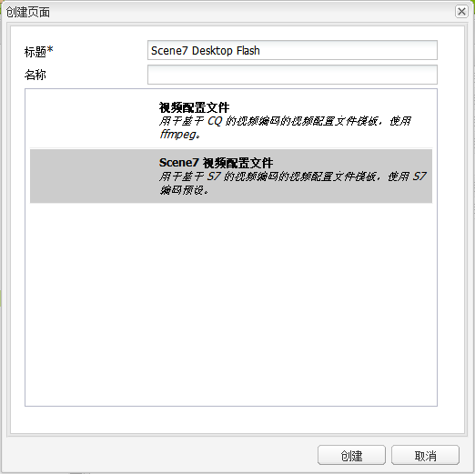
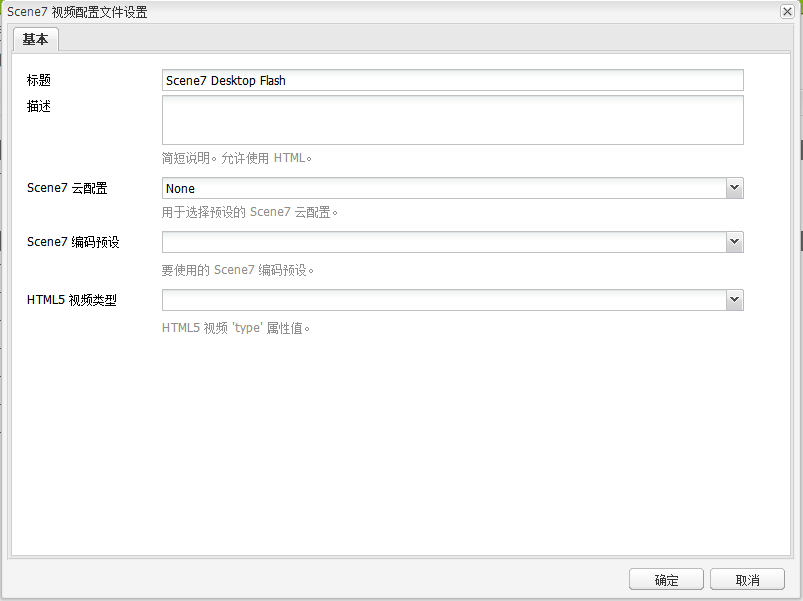

# 视频{#video}

>[!CAUTION]
>
>AEM 6.4已结束扩展支持，本文档将不再更新。 有关更多详细信息，请参阅 [技术支助期](https://helpx.adobe.com/cn/support/programs/eol-matrix.html). 查找支持的版本 [此处](https://experienceleague.adobe.com/docs/).

Assets提供了集中式视频资产管理功能，您可以在该功能中直接将视频上传到Assets以自动编码到Dynamic Media Classic，并直接从Assets访问Dynamic Media Classic视频以进行页面创作。

Dynamic Media Classic视频集成将优化视频的覆盖范围扩展到所有屏幕（自动设备和带宽检测）。

* Dynamic Media Classic(Scene7)视频组件可自动执行设备和带宽检测，以在台式机、平板电脑和移动设备上播放正确的格式和质量的视频。
* 资产 — 您可以包含自适应视频集，而不是仅包含单个视频资产。 自适应视频集是一个容器，可容纳在多个屏幕上无缝播放视频时需要的所有视频演绎版。 自适应视频集是同一视频的一组版本，这些版本以不同的比特率和格式进行编码，如400 kbps、800 kbps和1000 kbps。 您可以使用自适应视频集和S7视频组件，在多个屏幕(包括台式机、iOS、Android、Blackberry和Windows移动设备)上实现自适应视频流播放。 请参阅 [Scene7文档有关自适应视频集的更多信息](https://experienceleague.adobe.com/docs/dynamic-media-classic/using/setup/application-setup.html#video-presets-for-encoding-video-files).

## 关于FFMPEG和Dynamic Media Classic {#about-ffmpeg-and-scene}

默认的视频编码过程基于使用基于FFMPEG的与视频配置文件的集成。 因此，现成的DAM更新资产工作流包含以下两个基于ffmpeg的工作流步骤：

* FFMPEG缩略图
* FFMPEG编码

请注意，启用和配置Dynamic Media Classic集成不会从即装即用的DAM更新资产摄取工作流中自动删除或停用这两个工作流步骤。 如果您已在AEM中使用基于FFMPEG的视频编码，则可能已在创作环境中安装FFMPEG。 在这种情况下，使用Assets摄取的新视频将进行两次编码：一次从FFMPEG编码器获取，一次从Dynamic Media Classic集成获取。

如果您在AEM中配置了基于FFMPEG的视频编码，并安装了FFMPEG，则Adobe建议您从DAM更新资产工作流中删除两个FFMPEG工作流。

### 支持的格式 {#supported-formats}

Dynamic Media Classic视频组件支持以下格式：

* F4V H.264
* MP4 H.264

### 确定上传视频的位置 {#deciding-where-to-upload-your-video}

决定将视频资产上传到何处取决于以下内容：

* 您是否需要视频资产的工作流？
* 您是否需要对视频资产进行版本控制？

如果上述任一问题的答案为“是”或两者都为“是”，则请将视频直接上传到AdobeDAM。 如果两个问题的答案都为“否”，请将您的视频直接上传到Dynamic Media Classic。 以下部分介绍了每个方案的工作流。

#### 如果您要直接将视频上传到Adobe资产， {#if-you-are-uploading-your-video-directly-to-adobe-assets}

如果您需要为资产提供工作流或版本控制，则应先上传到Adobe资产。 建议使用以下工作流：

1. 将视频资产上传到Adobe资产，并自动对其进行编码和发布到Dynamic Media Classic。
1. 在AEM中，在 **[!UICONTROL 电影]** 选项卡。
1. 使用Dynamic Media Classic视频或基础视频组件进行创作。

#### 如果您要将视频上传到Dynamic Media Classic {#if-you-are-uploading-your-video-to-scene}

如果您不需要为资产提供工作流或版本控制，则应将资产上传到Dynamic Media Classic。 建议使用以下工作流：

1. 在Dynamic Media Classic, [设置计划的FTP上传和编码到Dynamic Media Classic（系统自动）](https://experienceleague.adobe.com/docs/dynamic-media-classic/using/upload-publish/uploading-files.html#uploading-your-files).
1. 在AEM中，在 **[!UICONTROL Dynamic Media Classic]** 选项卡。
1. 使用Dynamic Media Classic视频组件进行创作。

### 配置与Dynamic Media Classic的集成视频 {#configuring-integration-with-scene-video}

**配置通用预设**:

1. 在 **[!UICONTROL Cloud Services]**，导航到您的 **[!UICONTROL Dynamic Media Classic]** 配置，单击 **[!UICONTROL 编辑]**.
1. 选择 **[!UICONTROL 视频]** 选项卡。

   >[!NOTE]
   >
   >的 **[!UICONTROL 视频]** 选项卡。 请参阅 [为WCM启用Dynamic Media Classic](#enablingscene7forwcm).

1. 选择自适应视频编码配置文件、现成的单个视频编码配置文件或自定义视频编码配置文件。

   >[!NOTE]
   >
   >有关视频预设含义的更多信息，请参阅 [Dynamic Media Classic文档](https://experienceleague.adobe.com/docs/dynamic-media-classic/using/setup/application-setup.html#video-presets-for-encoding-video-files).
   >
   >Adobe建议您在配置通用预设时选择两个自适应视频集，或选择 **[!UICONTROL 自适应视频编码]** 选项。

1. 选定的编码配置文件会自动应用于上传到您为此Dynamic Media Classic云配置设置的CQ DAM目标文件夹的所有视频。 您可以使用不同的目标文件夹设置多个Dynamic Media Classic云配置，以根据需要应用不同的编码配置文件。

### 更新查看器和编码预设 {#updating-viewer-and-encoding-presets}

如果由于Dynamic Media Classic中的预设已更新，因此您需要更新AEM中视频的查看器和编码预设，请导航到云配置中的Dynamic Media Classic配置，然后单击 **更新查看器和编码预设**.

### 上传主控视频 {#uploading-your-master-video}

要从AdobeDAM将主控视频上传到Dynamic Media Classic，请执行以下操作：

1. 导航到CQ DAM目标文件夹，您已在该文件夹中使用Dynamic Media Classic编码配置文件设置云配置。
1. 单击 **[!UICONTROL 上传]** 上传主控视频。 视频上传和编码在 [!UICONTROL DAM更新资产] 工作流已完成且 **[!UICONTROL 发布到Dynamic Media Classic]** 带有复选标记。

   >[!NOTE]
   >
   >可能需要一些时间才能生成视频缩略图。

   将DAM主控视频拖动到视频组件访问 *全部* Dynamic Media Classic编码的代理演绎版的URL。

### 基础视频组件与Dynamic Media Classic视频组件 {#foundation-video-component-versus-scene-video-component}

使用AEM时，您既可以访问站点中提供的视频组件，也可以访问Dynamic Media Classic(Scene7)视频组件。 这些组件不能互换。

Dynamic Media Classic视频组件仅适用于Dynamic Media Classic视频。 基础组件可处理从AEM（使用ffmpeg）和Dynamic Media Classic视频存储的视频。

下表说明了何时应使用哪个组件：

>[!NOTE]
>
>Dynamic Media Classic视频组件开箱即用地使用通用视频配置文件。 但是，您可以获取基于HTML5的视频播放器，以供AEM使用。 在Dynamic Media Classic中，复制现成HTML5视频播放器的嵌入代码，并将其放入AEM页面。

## AEM视频组件 {#aem-video-component}

即使建议使用Dynamic Media Classic视频组件来查看Dynamic Media Classic视频，本节仍介绍如何在 [!UICONTROL 基础视频组件] 为了完整起见。

### AEM视频与Dynamic Media Classic视频比较 {#aem-video-and-scene-video-comparison}

下表简要比较了AEM Foundation视频组件与Scene7视频组件之间支持的功能：

|  | AEM Foundation视频 | Dynamic Media Classic视频 |
|---|---|---|
| 方法 | HTML5第一种方法。 Flash仅用于非HTML5回退。 | Flash。 HTML5用于移动设备和平板电脑。 |
| 交付 | 渐进 | 自适应流播放 |
| 跟踪 | 是 | 是 |
| 可扩展性 | 是 | 是(使用Dynamic Media Classic查看器SDK) |
| 移动视频 | 是 | 是 |

### 设置 {#setting-up}

#### 创建视频配置文件 {#creating-video-profiles}

根据在Dynamic Media Classic云配置中选择的Dynamic Media Classic编码预设，创建各种视频编码。 为了使基础视频组件能够使用它们，必须为每个选定的Dynamic Media Classic编码预设创建视频配置文件。 这允许视频组件相应地选择DAM演绎版。

>[!NOTE]
>
>必须激活新视频配置文件及其更改才能发布。

1. 在AEM中，转到 **[!UICONTROL 工具]**，然后选择 **[!UICONTROL 配置控制台]**. 在配置控制台中，导航到 **[!UICONTROL 工具]** > **[!UICONTROL 资产]** > **[!UICONTROL 视频配置文件]** 中。
1. 创建新的Dynamic Media Classic视频配置文件。 在 **[!UICONTROL 新建……]** 菜单，选择 **[!UICONTROL 创建页面]** ，然后选择Dynamic Media Classic视频配置文件模板。 为新的视频配置文件页面指定一个名称并单击 **[!UICONTROL 创建]**.

   

1. 编辑新的视频配置文件。 首先选择云配置。 然后，选择在云配置中选择的相同编码预设。

   

   | 属性 | 描述 |
   |---|---|
   | Dynamic Media Classic(Scene7)云配置 | 用于编码预设的云配置。 |
   | Dynamic Media Classic(Scene7)编码预设 | 要将此视频配置文件映射到的编码预设。 |
   | HTML5 视频类型 | 此属性允许设置HTML5视频源元素的type属性的值。 Dynamic Media Classic编码预设未提供此信息，但需要使用HTML5视频元素正确渲染视频时需要此信息。 提供了常用格式的列表，但其他格式可能会被覆盖。 |

   对在云配置中选择的所有要在视频组件中使用的编码预设重复此步骤。

#### 配置设计 {#configuring-design}

基础视频组件必须了解要使用哪些视频配置文件才能构建视频源列表。 您必须打开视频组件设计对话框，并配置组件设计以便使用新的视频配置文件。

>[!NOTE]
>
>如果您在移动设备页面上使用基础视频组件，则可能需要在移动设备页面的设计中重复这些步骤。

>[!NOTE]
>
>对设计所做的更改需要激活设计才能在发布时生效。

1. 打开基础视频组件的设计对话框，然后将 **[!UICONTROL 用户档案]** 选项卡。 然后，删除现成的用户档案，并添加新的Dynamic Media Classic视频用户档案。 设计对话框中用户档案列表的顺序还定义视频源元素在渲染时的顺序。
1. 对于不支持HTML5的浏览器，视频组件允许配置Flash回退。 打开视频组件设计对话框，并更改为 **[!UICONTROL Flash]** 选项卡。 配置Flash Player设置并为Flash Player分配备用配置文件。

#### 核对清单 {#checklist}

1. 创建Dynamic Media Classic(Scene7)云配置。 确保已设置视频编码预设并且导入器正在运行。
1. 为在云配置中选择的每个视频编码预设创建Dynamic Media Classic视频配置文件。
1. 必须激活视频配置文件。
1. 在页面上配置基础视频组件的设计。
1. 完成设计更改后，激活设计。
