# 将Dynamic Media经典功能添加到页面{#adding-scene-features-to-your-page}

[Adobe](https://help.adobe.com/en_US/scene7/using/WS26AB0D9A-F51C-464e-88C8-580A5A82F810.html) Dynamic MediaClassics是一种托管解决方案，用于管理、增强、发布富媒体资产并将富媒体资产交付到Web、移动、电子邮件以及连接Internet的显示屏和印刷品。

您可以在各种查看器中视图发布在Dynamic Media经典中的AEM资产：

* 缩放
* 弹出
* 视频
* 图像模板
* 图像

您可以将数字资产从AEM直接发布到Dynamic Media经典，还可以将数字资产从Dynamic Media经典发布到AEM。

本节介绍如何将数字资产从AEM发布到Dynamic Media经典，反之亦然。 此外，还详细介绍了各种查看器。有关为Dynamic Media经典配置AEM的信息，请参阅[将Dynamic Media经典与AEM](/help/sites-administering/scene7.md)集成。

另请参阅[添加图像映射](/help/assets/image-maps.md)。

有关在 AEM 中使用视频组件的更多信息，请参阅以下内容：

* [视频](/help/sites-classic-ui-authoring/manage-assets-classic-s7-video.md)

>[!NOTE]
>
>如果Dynamic Media经典资产显示不正确，请确保Dynamic Media已禁用，然后刷新页面。

## 从资产{#manually-publishing-to-scene-from-assets}手动发布到Dynamic Media经典

您可以在经典UI中从“资产”控制台或直接从资产中将数字资产发布到Dynamic Media经典。

>[!NOTE]
>
>AEM异步发布到Dynamic Media经典。 单击&#x200B;**[!UICONTROL 发布]**&#x200B;后，您的资产可能需要几秒钟时间才能发布到Dynamic Media经典。

### 从“资产”控制台发布 {#publishing-from-the-assets-console}

如果资产位于Dynamic Media经典目标文件夹中，则要从“资产”控制台发布到Dynamic Media经典：

1. 在AEM经典UI中，单击&#x200B;**[!UICONTROL 数字资产]**&#x200B;以访问数字资产管理器。

1. 从要发布到Dynamic Media经典的目标文件夹中选择资产（或资产）或文件夹，然后右键单击并选择&#x200B;**[!UICONTROL 发布到Dynamic Media经典]**。 或者，也可以从&#x200B;**[!UICONTROL 工具]**&#x200B;菜单中选择&#x200B;**[!UICONTROL 发布到Dynamic Media经典]**。

   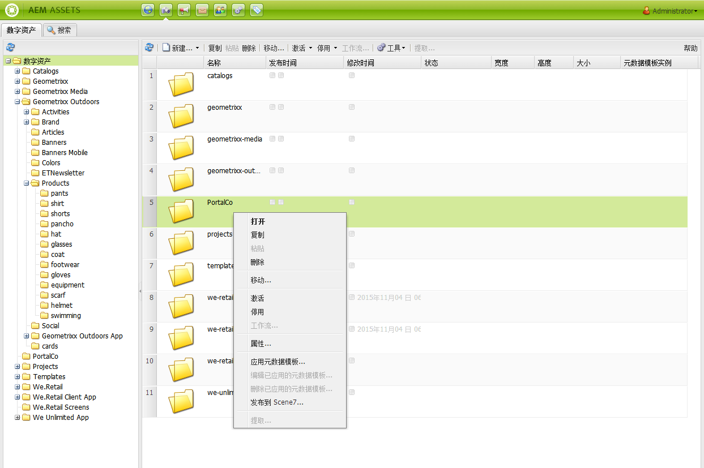

1. 转到Dynamic Media经典并确认资产可用。

   >[!NOTE]
   >
   >如果资产不在“Dynamic Media经典同步”文件夹中，则两个菜单中的&#x200B;**[!UICONTROL 发布到Dynamic Media经典]**&#x200B;都可见，但处于禁用状态。

### 从资产发布 {#publishing-from-an-asset}

只要资产位于同步的Dynamic Media经典文件夹中，您就可以手动发布资产。

>[!NOTE]
>
>如果资产未位于Dynamic Media经典同步文件夹中，则指向&#x200B;**[!UICONTROL 发布到Dynamic Media经典]**&#x200B;的链接将不可用。

**要直接从数字资产发布到Dynamic Media经典，请**:

1. 在 AEM 中，单击&#x200B;**[!UICONTROL 数字资产]**，以访问数字资产管理器。

1. 双击以打开某个资产。

1. 在资产详细信息窗格中，选择&#x200B;**[!UICONTROL 发布到Dynamic Media经典]**。

   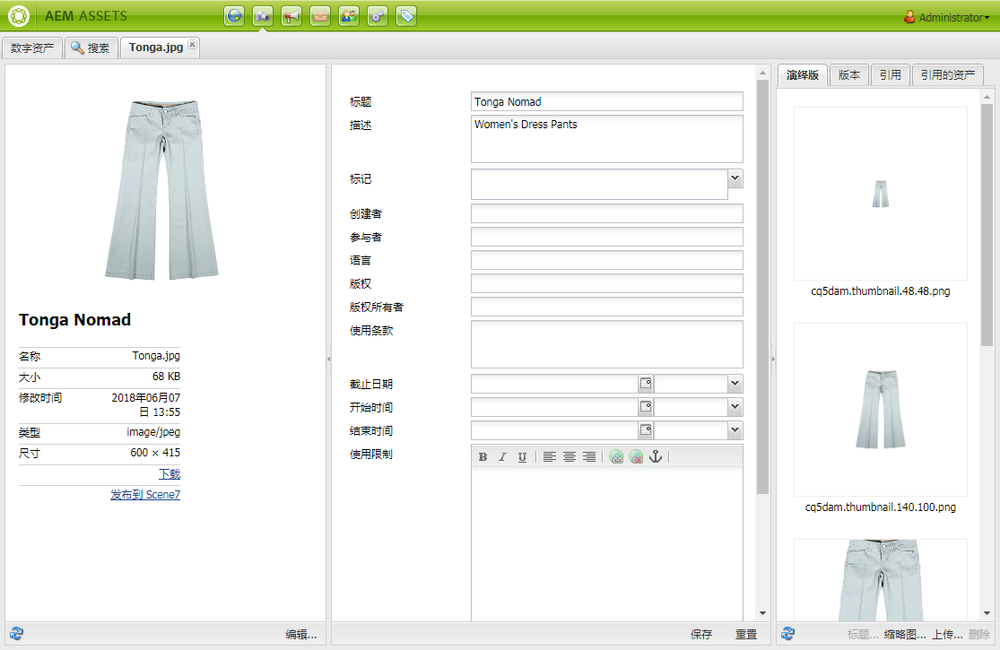

1. 该链接随即会变为&#x200B;**[!UICONTROL 正在发布...]**，之后又变为&#x200B;**[!UICONTROL 已发布]**。转到Dynamic Media经典并确认资产可用。

   >[!NOTE]
   >
   >如果资产未正确发布到Dynamic Media经典，则链接将变为&#x200B;**[!UICONTROL 发布失败]**。 如果资产已发布到Dynamic Media经典，则链接会显示&#x200B;**[!UICONTROL 重新发布到Dynamic Media经典]**。 通过重新发布，您可以在AEM中对资产进行更改并重新发布资产。

### 从CQ目标文件夹{#publishing-assets-from-outside-the-cq-target-folder}外部发布资产

Adobe建议您仅从“Dynamic Media经典”目标文件夹中的资产将资产发布到Dynamic Media经典。 但是，如果您需要从目标文件夹外的文件夹上传资产，您仍可以这样做，方法是将资产上传到Dynamic Media经典上的&#x200B;*ad-hoc*&#x200B;文件夹。

为此，您需要为要显示资产的页面配置云配置。 然后，您可以向页面添加一个Dynamic Media经典组件，并在该组件上拖放资产。 为该页面设置页面属性后，将显示&#x200B;**[!UICONTROL 发布到Dynamic Media经典]**&#x200B;链接，当选择该链接时，会触发上传到Dynamic Media经典的操作。

>[!NOTE]
>
>位于临时文件夹中的资产不显示在Dynamic Media经典内容浏览器中。

**要发布位于CQ目标文件夹以外的资产，请执行以下操作**:

1. 在经典UI的AEM中，单击&#x200B;**[!UICONTROL 网站]**，然后导航到要向其中添加尚未发布到Dynamic Media经典的数字资产的网页。 （普通页面继承规则适用。）

1. 在Sidekick中，单击&#x200B;**[!UICONTROL 页面]**&#x200B;图标，然后单击&#x200B;**[!UICONTROL 页面属性]**。

1. 单击&#x200B;**[!UICONTROL Cloud Services] > [!UICONTROL 添加服务] > [!UICONTROL Dynamic Media经典(Scene7)]**。
1. 在“AdobeDynamic Media经典”下拉列表中，选择所需的配置，然后单击&#x200B;**[!UICONTROL 确定]**。

   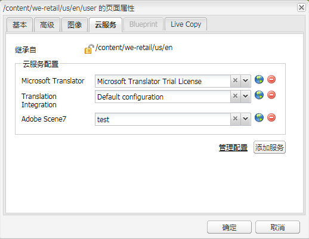

1. 在网页上，将Dynamic Media经典(Scene7)组件添加到页面上的所需位置。
1. 从内容查找器中，将相应的数字资产拖放到该组件中。您会看到一个链接，指向&#x200B;**[!UICONTROL 检查Dynamic Media经典发布状态]**。

   >[!NOTE]
   >
   >如果数字资产位于CQ目标文件夹中，则不会显示指向&#x200B;**[!UICONTROL 检查Dynamic Media经典发布状态]**&#x200B;的链接。 资产只是放置在组件中。

   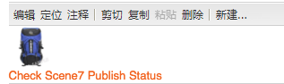

1. 单击&#x200B;**[!UICONTROL 检查Dynamic Media经典发布状态]**。 如果资产未发布，AEM会将资产发布到Dynamic Media经典。 上传后，资产会被放置在临时文件夹中。默认情况下，临时文件夹位于`name_of_the_company/CQ5_adhoc`中。 您可以[根据需要配置此位置](#configuringtheadhocfolder)。

   >[!NOTE]
   >
   >如果资产不在Dynamic Media经典同步文件夹中，且当前页面没有关联的Dynamic Media经典云配置，则上传将失败。

## Dynamic Media经典(Scene7)组件{#scene-components}

AEM中提供以下Dynamic Media经典组件：

* 缩放
* 弹出（缩放）
* 图像模板
* 图像
* 视频

>[!NOTE]
>
>这些组件默认不可用，在使用前需要在&#x200B;**[!UICONTROL Design]**&#x200B;模式下选择。

在&#x200B;**[!UICONTROL Design]**&#x200B;模式中使用组件后，您可以像任何其他AEM组件一样将组件添加到页面。 尚未发布到Dynamic Media经典的资产将发布到Dynamic Media经典(如果位于同步文件夹、页面或具有Dynamic Media经典云配置)。

### Flash查看器生命周期结束通知{#flash-viewers-end-of-life-notice}

自2017年1月31日起，AdobeDynamic Media经典正式终止了对Flash查看器平台的支持。

有关此重要更改的详细信息，请参阅[Flash查看器生命周期结束常见问题解答](https://docs.adobe.com/content/docs/en/aem/6-1/administer/integration/marketing-cloud/scene7/flash-eol.html)。

### 将Dynamic Media经典组件添加到页面{#adding-a-scene-component-to-a-page}

向页面添加Dynamic Media经典组件与向任何页面添加组件相同。 Dynamic Media经典组件在以下各节中有详细说明。

**要在经典UI中向页面添加Dynamic Media经典组件／查看器，请执行以下操作**:

1. 在AEM中，打开要添加Dynamic Media经典组件的页面。

1. 如果没有可用的Dynamic Media经典组件，请单击Sidekick中的标尺以进入&#x200B;**[!UICONTROL Design]**&#x200B;模式，单击&#x200B;**[!UICONTROL Edit]** parsys，然后选择所有&#x200B;**[!UICONTROL Dynamic Media经典]**&#x200B;组件以使其可用。

1. 单击Sidekick中的铅笔，返回至&#x200B;**[!UICONTROL 编辑]**&#x200B;模式。

1. 将组件从Sidekick中的&#x200B;**[!UICONTROL Dynamic Media经典]**&#x200B;组拖动到页面的所需位置。

1. 单击&#x200B;**[!UICONTROL 编辑]**&#x200B;以打开该组件。

1. 根据需要编辑该组件，然后单击&#x200B;**[!UICONTROL 确定]**&#x200B;以保存更改。

### 在响应式网站中添加交互式查看体验  {#adding-interactive-viewing-experiences-to-a-responsive-website}

如果您的资产具有响应式设计，则意味着您的资产会根据其显示的位置自行进行调整。通过响应式设计，同一资源可高效地显示在多个设备上。

**要在经典UI中向响应式站点添加交互式查看体验，请执行以下操作**:

1. 登录到AEM，并确保您已配置[AdobeDynamic Media经典Cloud Services](/help/sites-administering/scene7.md#configuring-scene-integration)，且Dynamic Media经典组件可用。

   >[!NOTE]
   >
   >如果Dynamic Media经典WCM组件不可用，请务必通过**[!UICONTROL 设计]模式启用它们。

1. 在启用了Dynamic Media经典组件的网站中，将&#x200B;**[!UICONTROL Image]**&#x200B;查看器拖至页面。
1. 编辑组件并调整&#x200B;**[!UICONTROL Dynamic Media经典设置]**&#x200B;选项卡中的断点。

   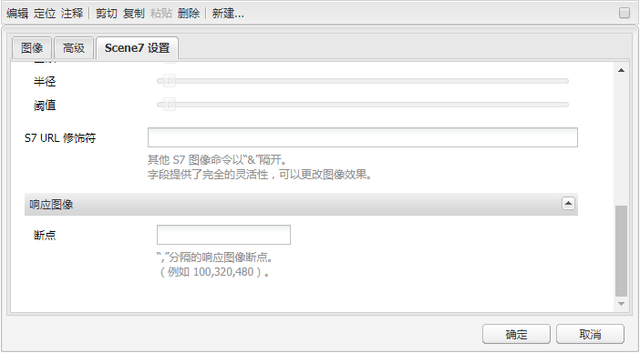

1. 确认查看器可实现响应式大小调整，并且所有交互已针对台式机、平板电脑和移动设备进行了优化。

### 所有Dynamic Media经典组件{#settings-common-to-all-scene-components}的通用设置

尽管配置选项不同，但以下是所有Dynamic Media经典组件的通用选项：

* **[!UICONTROL 文件引用]** - 浏览到要引用的文件。文件引用显示资产URL，但不一定是完整的Dynamic Media经典URL（包括URL命令和参数）。 不能在此字段中添加Dynamic Media经典URL命令和参数。 必须使用组件中的相应功能才能添加这些命令和参数。
* **[!UICONTROL 宽度]** - 允许您设置宽度。
* **[!UICONTROL 高度]** - 允许您设置高度。

通过多次单击Dynamic Media经典组件来设置这些配置选项，例如，打开&#x200B;**[!UICONTROL Zoom]**&#x200B;组件时：

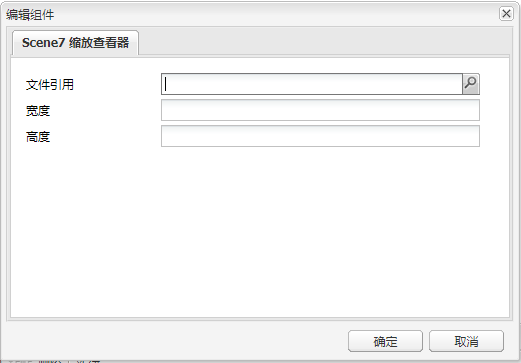

### 缩放 {#zoom}

按下 + 按钮时，HTML5 缩放组件会显示放大的图像。

缩放工具位于资产底部。单击 **[!UICONTROL +]** 可放大。单击 **[!UICONTROL -]** 可缩小。单击&#x200B;**[!UICONTROL x]**&#x200B;或重置缩放箭头可将图像恢复为导入时的原始大小。 单击对角线可进入全屏模式。单击&#x200B;**[!UICONTROL 编辑]**&#x200B;可配置该组件。使用此组件，可以配置所有Dynamic Media经典组件](#settings-common-to-all-scene-components)通用的[设置。

### 弹出 {#flyout}

在 HTML5 弹出组件中，资产会分屏显示；左侧屏幕以指定大小显示资产；右侧屏幕则显示缩放部分。单击&#x200B;**[!UICONTROL 编辑]**&#x200B;可配置该组件。使用此组件，可以配置所有Dynamic Media经典组件](/help/sites-administering/scene7.md#settingscommontoalldynamicmediaclassiccomponents)通用的[设置。

>[!NOTE]
>
>如果弹出组件使用自定义大小，则系统会使用该自定义大小，并禁用该组件的响应设置。
>
>如果您的弹出组件使用默认大小(如[!UICONTROL Design]视图中所设置)，则会使用默认大小，组件将拉伸以适应页面布局大小，同时启用组件的响应设置。 但是，请注意，组件的响应式设置存在限制。 在弹出组件中使用响应设置时，您不应该将弹出组件延伸到整个页面。否则，弹出窗口可能会超出页面的右边框。

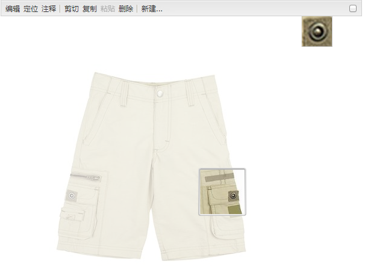

### 图像 {#image}

通过Dynamic Media经典图像组件，您可以向图像添加Dynamic Media经典功能，如Dynamic Media经典修饰符、图像预设或查看器预设，以及锐化。 Dynamic Media经典图像组件与AEM中具有特殊Dynamic Media经典功能的其他图像组件类似。 在此示例中，图像应用了Dynamic Media经典URL修饰符`&op_invert=1`。

**[!UICONTROL 标题、替代文本]** -在高级  选项卡中，为图像添加一个标题，并为关闭了图形的用户添加替代文本。

**[!UICONTROL URL，打开方式]** -您可以设置资产以打开链接。设置&#x200B;**[!UICONTROL URL]**&#x200B;和&#x200B;**[!UICONTROL 在]**&#x200B;中打开，以指示您希望在同一窗口还是新窗口中打开它。

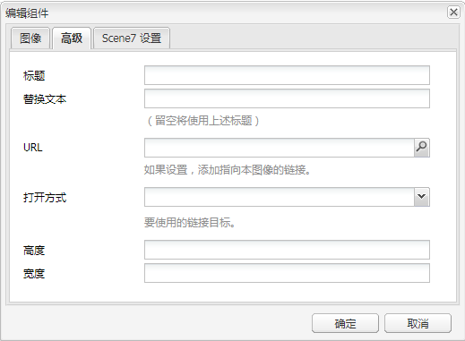

**[!UICONTROL 查看器预设]** -从下拉菜单中选择现有的查看器预设。如果未显示您要查找的查看器预设，则可能需要将其显示出来。请参阅[管理查看器预设](/help/assets/managing-viewer-presets.md)。如果您正在使用图像预设，则无法选择查看器预设，反之亦然。

**[!UICONTROL Dynamic Media经典配置]** -选择要用于从Scene7出版系统获取活动图像预设的Dynamic Media经典配置。

**[!UICONTROL 图像预设]** -从下拉菜单中选择现有的图像预设。如果未显示您要查找的图像预设，则可能需要将其显示出来。请参阅[管理图像预设](/help/assets/managing-image-presets.md)。如果您正在使用图像预设，则无法选择查看器预设，反之亦然。

**[!UICONTROL 输出格式]** -选择图像的输出格式，例如jpeg。根据所选的输出格式，您可能会有额外的配置选项。请参阅[管理图像预设](/help/assets/managing-image-presets.md)。

**[!UICONTROL 锐化]** -选择要如何锐化图像。[*AdobeDynamic Media经典图像质量和锐化最佳实践*](/help/assets/assets/s7_sharpening_images.pdf)&#x200B;中详细介绍了锐化。

**[!UICONTROL URL修饰符]** -您可以通过提供其他Dynamic Media经典图像命令来更改图像效果。这些操作在[管理图像预设](/help/assets/managing-image-presets.md)和[命令参考](https://docs.adobe.com/content/help/en/dynamic-media-developer-resources/image-serving-api/image-serving-api/http-protocol-reference/command-reference/c-command-reference.html)中有介绍。

**[!UICONTROL 断点]** -如果您的网站是响应式的，您需要调整断点。断点必须用逗号`,`分隔。

### 图像模板 {#image-template}

[Dynamic Media经典图](https://help.adobe.com/en_US/scene7/using/WS60B68844-9054-4099-BF69-3DC998A04D3C.html) 像模板是已导入到Dynamic Media经典的分层的Photoshop内容，在经典中，内容和属性进行了参数化以实现可变性。通过&#x200B;**[!UICONTROL 图像模板]**&#x200B;组件，您可以在 AEM 中导入图像并对文本进行动态更改。此外，您还可以配置&#x200B;**[!UICONTROL 图像模板]**&#x200B;组件，以使用 Client Context 中的值，从而让每个客户获取个性化的图像体验。

单击&#x200B;**[!UICONTROL 编辑]**&#x200B;可配置该组件。您可以配置所有Dynamic Media经典组件](/help/sites-administering/scene7.md#settingscommontoalldynamicmediaclassicscomponents)通用的[设置以及本节中介绍的其他设置。

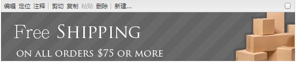

**[!UICONTROL 文件引用、宽度、高度]** -查看所有Dynamic Media经典组件通用的设置。

>[!NOTE]
>
>Dynamic Media经典URL命令和参数不能直接添加到文件引用URL。 只能在组件 UI 的&#x200B;**[!UICONTROL 参数]**&#x200B;面板中定义这些命令和参数。

**[!UICONTROL 标题、替代文]** 本在“Dynamic Media [!UICONTROL 经典图像] 模板”选项卡中，为图像添加一个标题，并为关闭了图形的用户添加替代文本。

**[!UICONTROL URL，打开]** 位置您可以设置资产以打开链接。设置 **[!UICONTROL URL]**，并在&#x200B;**[!UICONTROL 打开方式]**&#x200B;中指示是要在同一窗口中还是在新窗口中打开该 URL。

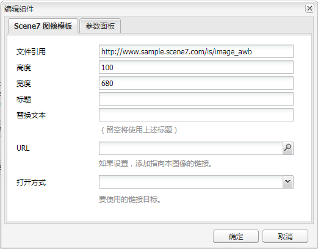

**[!UICONTROL 参]** 数面板导入图像时，参数会预填充图像中的信息。如果没有可以动态更改的内容，则此窗口将是空的。

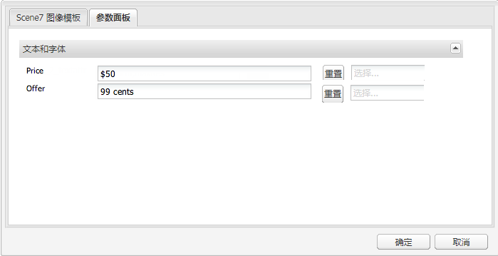

#### 动态更改文本 {#changing-text-dynamically}

要动态更改文本，请在字段中输入新文本，然后单击&#x200B;**[!UICONTROL 确定]**。在此示例中，**[!UICONTROL 价格]**&#x200B;现在为 50 美元，运费为 99 美分。

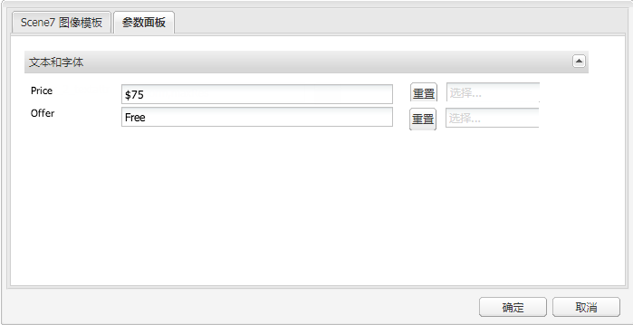

图像中的文本发生了更改。您可以通过单击相应字段旁边的&#x200B;**[!UICONTROL 重置]**，将文本重置为原始值。

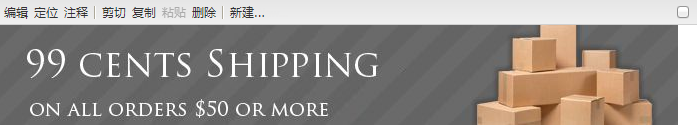

#### 更改文本以反映 Client Context 值 {#changing-text-to-reflect-the-value-of-a-client-context-value}

要将字段链接到Client Context值，请单击&#x200B;**[!UICONTROL 选择]**&#x200B;以打开Client Context菜单，选择Client Context，然后单击&#x200B;**[!UICONTROL 确定]**。 在此示例中，由于已将名称与个人资料中设置的格式化名称链接在一起，因此名称会相应地发生更改。

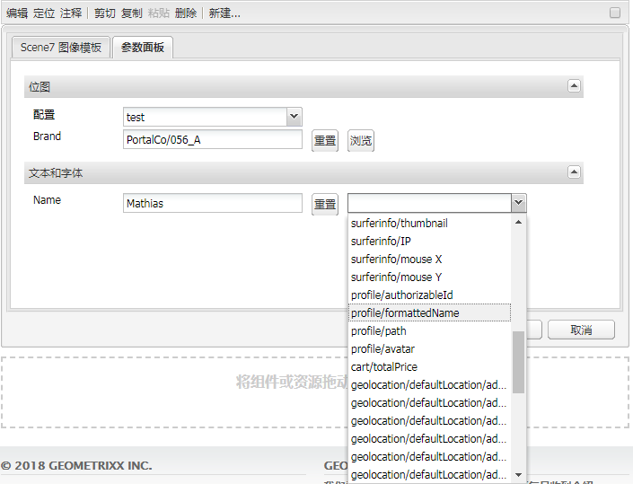

文本反映了当前已登录用户的名称。您可以通过单击相应字段旁边的&#x200B;**[!UICONTROL 重置]**，将文本重置为原始值。

#### 使Dynamic Media经典图像模板成为链接{#making-the-scene-image-template-a-link}

**要使“Dynamic Media经典”图像模板成为链接**:

1. 在具有Dynamic Media经典图像模板组件的页面上，单击&#x200B;**[!UICONTROL 编辑]**。
1. 在 **[!UICONTROL URL]** 字段中，输入用户单击图像后所转到的 URL。在&#x200B;**[!UICONTROL 打开方式]**&#x200B;字段中，选择您希望在新窗口中还是在同一窗口中打开目标。

   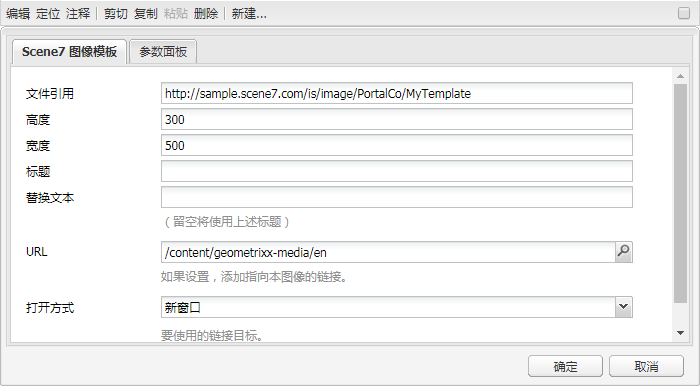

1. 单击&#x200B;**[!UICONTROL 确定]**。

### 视频组件  {#video-component}

Dynamic Media经典&#x200B;**[!UICONTROL 视频]**&#x200B;组件(可从Sidekick的Dynamic Media经典部分获得)使用设备和带宽检测为每个屏幕提供正确的视频。 此组件是一种 HTML5 视频播放器，它是可以跨渠道使用的单一查看器。

它可用于自适应视频集、单个MP4视频或单个F4V视频。

有关视频如何与Dynamic Media经典集成结合使用的更多信息，请参阅[视频](/help/sites-classic-ui-authoring/manage-assets-classic-s7-video.md)。 此外，查看[**Dynamic Media经典视频**&#x200B;组件与基础&#x200B;**视频**&#x200B;组件](/help/sites-classic-ui-authoring/manage-assets-classic-s7-video.md)的比较情况。

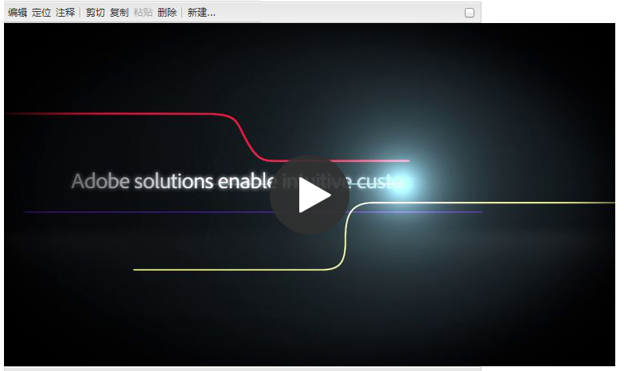

### 视频组件的已知限制 {#known-limitations-for-the-video-component}

Adobe DAM 和 WCM 会显示是否上传了主视频。但它们不会显示以下代理资产：

* Dynamic Media经典编码再现
* Dynamic Media经典自适应视频集

使用带有Dynamic Media经典视频组件的自适应视频集时，必须调整组件大小以适合视频的尺寸。

## Dynamic Media经典内容浏览器{#scene-content-browser}

通过Dynamic Media经典内容浏览器，您可以直接在AEM中视图Dynamic Media经典中的内容。 要访问内容浏览器，请在内容查找器中，选择触屏优化用户界面中的&#x200B;**[!UICONTROL Dynamic Media经典]**&#x200B;或经典用户界面中的&#x200B;**[!UICONTROL S7]**&#x200B;图标。 这两种用户界面的功能是相同的。

如果您有多个配置，默认情况下，AEM 会显示[默认配置](/help/sites-administering/scene7.md#configuring-a-default-configuration)。您可以直接在Dynamic Media经典内容浏览器中的下拉菜单中选择不同的配置。

>[!NOTE]
>
>* 位于临时文件夹中的资产不显示在Dynamic Media经典内容浏览器中。
>* 启用[安全预览](/help/sites-administering/scene7.md#configuring-the-state-published-unpublished-of-assets-pushed-to-scene)后，Dynamic Media经典上已发布和未发布的资产都会显示在Dynamic Media经典内容浏览器中。
>* 如果内容浏览器中未显示&#x200B;**[!UICONTROL Dynamic Media经典]**&#x200B;或&#x200B;**[!UICONTROL S7]**&#x200B;图标作为选项，则需要[配置Dynamic Media经典以与AEM](/help/sites-administering/scene7.md)一起使用。

   >
   >
* 对于视频，Dynamic Media经典内容浏览器支持：
   >
   >
* 自适应视频集：一种容器，包含在多种屏幕上实现无缝播放所需的所有视频呈现
>* 单个 MP4 视频
>* 单个F4V视频

### 在经典 UI 中浏览内容 {#browsing-content-in-the-classic-ui}

单击&#x200B;**[!UICONTROL S7]**&#x200B;选项卡，浏览Dynamic Media经典中的内容。

您可以通过选择配置来更改要访问的配置。 文件夹会根据您选择的配置而发生更改。

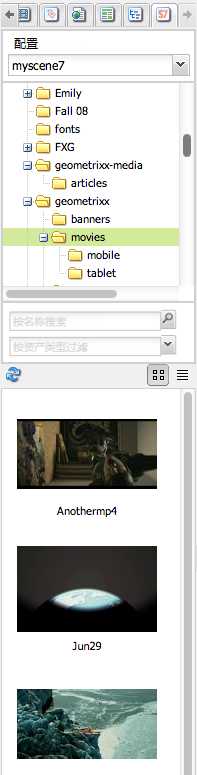

与资产的内容查找器一样，您也可以搜索资产并筛选结果。但是，与资产查找器不同的是，在 **[!UICONTROL S7]** 选项卡中输入关键字时，文件名是以您输入的字符串&#x200B;*开头*，而不是将关键字&#x200B;*包含*&#x200B;在文件名中。

默认情况下，资产会按文件名显示。您也可以按资产类型筛选结果。

>[!NOTE]
>
>对于视频，WCM的Dynamic Media经典内容浏览器支持：
>
>* 自适应视频集：一种容器，包含在多种屏幕上实现无缝播放所需的所有视频呈现
>* 单个 MP4 视频
>* 单个F4V视频

>

### 使用内容浏览器{#searching-for-scene-assets-with-the-content-browser}搜索Dynamic Media经典资产

搜索Dynamic Media经典资产与搜索AEM资产类似，但搜索时，您实际看到的是Dynamic Media经典系统中资产的远程视图，而不是直接将其导入AEM。

您可以使用经典 UI 或触屏优化 UI 来查看和搜索资产。根据所用的界面，搜索方式会略有不同。

在任一 UI 中进行搜索时，您都可以按以下条件进行筛选（此处显示的是触屏优化 UI）：

**[!UICONTROL 输入关键字]** -您可以按名称搜索资产。搜索时，您输入的关键字是文件名称的开头。例如，键入“swimming”一词后，将在该文件夹中查找任何以这些字母开头的资产文件名。键入搜索词后，请务必单击 Enter，这样才能查找资产。

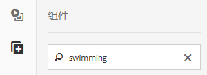

**[!UICONTROL 文件夹／路]** 径——显示的文件夹名称基于您选择的配置。您可以向下选择更低级别的文件夹，方法是单击文件夹图标并选择一个子文件夹，然后单击复选标记以将其选中。

如果您输入了关键字并选择了文件夹，则 AEM 会搜索此文件夹及其所有子文件夹。但是，如果您在搜索时未输入任何关键字，则选择文件夹后，只会显示此文件夹中的资产，而不会包括所有子文件夹。

默认情况下，AEM 会搜索选中的文件夹及其所有子文件夹。

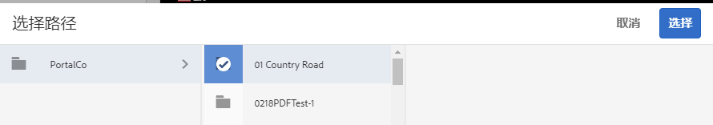

**[!UICONTROL 资产类型选]** 择Dynamic Media经典可浏览Dynamic Media经典内容。仅当您已配置Dynamic Media经典时，此选项才可用。

**[!UICONTROL 配]** 置如果您在Cloud Services中定义了多个Dynamic Media经 [!UICONTROL 典配置]，则可以在此处选择它。根据您选择的配置，文件夹会相应地进行更改。

**[!UICONTROL 资产]** 类型在Dynamic Media经典浏览器中，您可以筛选结果以包含以下任一内容：图像、模板、视频和自适应视频集。如果您没有选择任何资产类型，则默认情况下，AEM 会搜索所有资产类型。

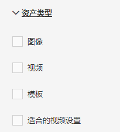

>[!NOTE]
>
>* 搜索视频时，您搜索的是单个视频呈现。结果返回原始再现（仅&amp;ast;.mp4）和编码再现。
>* 在搜索自适应视频集时，您正在搜索文件夹和所有子文件夹，但前提是您已向搜索添加了关键字。 如果您没有添加关键字，则 AEM 不会搜索子文件夹。

>

**[!UICONTROL 发布]** 状态您可以根据发布状态筛选资产： [!UICONTROL 已发] 布或未 [!UICONTROL 发布]。如果未选择任何[!UICONTROL 发布状态]，默认情况下AEM将搜索所有发布状态。

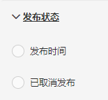

