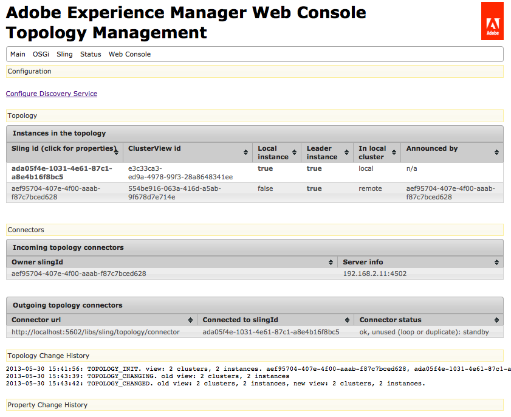

# 卸载作业{#offloading-jobs}

>[!CAUTION]
>
>AEM 6.4已结束扩展支持，本文档将不再更新。 有关更多详细信息，请参阅 [技术支助期](https://helpx.adobe.com/cn/support/programs/eol-matrix.html). 查找支持的版本 [此处](https://experienceleague.adobe.com/docs/).

## 简介 {#introduction}

卸载会在拓扑中分配处理任务量为Experience Manager实例。 通过卸载，您可以使用特定的Experience Manager实例来执行特定类型的处理。 通过专业化的处理，您可以最大限度地利用可用的服务器资源。

卸载基于 [Apache Sling Discovery](https://sling.apache.org/documentation/bundles/discovery-api-and-impl.html) 和Sling JobManager功能。 要使用卸载，请将Experience Manager群集添加到拓扑中，并确定群集处理的作业主题。 群集由一个或多个Experience Manager实例组成，因此单个实例被视为群集。

有关将实例添加到拓扑的信息，请参阅 [管理拓扑](/help/sites-deploying/offloading.md#administering-topologies).

### 作业分发 {#job-distribution}

Sling JobManager和JobConsumer允许创建拓扑中处理的作业：

* 作业管理器：为特定主题创建作业的服务。
* JobConsumer:执行一个或多个主题的作业的服务。 可以为同一主题注册多个JobConsumer服务。

当JobManager创建作业时，卸载框架会选择拓扑中的Experience Manager群集来执行该作业：

* 群集必须包含一个或多个运行为作业主题注册的JobConsumer的实例。
* 必须为群集中的至少一个实例启用主题。

请参阅 [配置主题使用情况](/help/sites-deploying/offloading.md#configuring-topic-consumption) 有关优化作业分配的信息。

当卸载框架选择一个群集以执行作业，并且该群集由多个实例组成时，Sling Distribution会确定群集中的哪个实例执行该作业。

### 作业负载 {#job-payloads}

卸载框架支持将作业与存储库中的资源相关联的作业负载。 为处理资源创建作业并将作业卸载到另一台计算机时，作业负载非常有用。

创建作业时，只保证有效负载位于创建该作业的实例上。 卸载作业时，复制代理可确保在最终使用该作业的实例上创建有效负载。 作业执行完成后，反向复制会将有效负载复制回创建作业的实例。

## 管理拓扑 {#administering-topologies}

拓扑是参与卸载的松散耦合的Experience Manager群集。 群集由一个或多个Experience Manager服务器实例（单个实例被视为群集）组成。

每个Experience Manager实例运行以下与卸载相关的服务：

* 发现服务：向拓扑连接器发送请求以加入拓扑。
* 拓扑连接器：接收加入请求，并接受或拒绝每个请求。

拓扑的所有成员的发现服务指向其中一个成员上的拓扑连接器。 在以下部分中，此成员称为根成员。

拓扑中的每个群集都包含一个被识别为领导者的实例。 群集领导者代表群集的其他成员与拓扑交互。 当引线离开群集时，将自动选择群集的新引线。

### 查看拓扑 {#viewing-the-topology}

使用拓扑浏览器来浏览Experience Manager实例所参与的拓扑的状态。 拓扑浏览器显示拓扑的簇和实例。

对于每个群集，您会看到一个群集成员列表，该列表指示每个成员加入群集的顺序，以及哪个成员是“领导者”。 “当前”属性指示您当前管理的实例。

对于群集中的每个实例，您可以看到几个与拓扑相关的属性：

* 实例作业使用者的主题允许列表。
* 用于与拓扑连接的端点。
* 注册实例以卸载的作业主题。
* 实例处理的作业主题。

1. 使用触屏UI，单击工具选项卡。 ([http://localhost:4502/tools.html](http://localhost:4502/tools.html))
1. 在“Granite操作”区域，单击卸载浏览器。
1. 在导航面板中，单击拓扑浏览器。

   将显示参与拓扑的群集。

   

1. 单击某个群集可查看群集中实例及其ID、当前状态和领导者状态的列表。
1. 单击实例ID以查看更多详细属性。

您还可以使用Web控制台查看拓扑信息。 控制台提供了有关拓扑群集的进一步信息：

* 哪个实例是本地实例。
* 此实例用于连接到拓扑（传出）的拓扑连接器服务，以及连接到此实例（传入）的服务。
* 更改拓扑和实例属性的历史记录。

请按照以下过程打开Web控制台的“拓扑管理”页：

1. 在浏览器中打开Web控制台。 ([http://localhost:4502/system/console](http://localhost:4502/system/console))
1. 单击“主”>“拓扑管理”。

   

### 配置拓扑成员资格 {#configuring-topology-membership}

Apache Sling基于资源的发现服务在每个实例上运行，以控制Experience Manager实例与拓扑交互的方式。

发现服务向拓扑连接器服务发送定期POST请求（心率），以建立和维护与拓扑的连接。 拓扑连接器服务维护允许加入拓扑的IP地址或主机名允许列表:

* 要将实例连接到拓扑，请指定根成员的拓扑连接器服务的URL。
* 要使实例能够加入拓扑，请将该实例添加到根成员的拓扑连接器服务的允许列表中。

使用Web控制台或sling:OsgiConfig节点配置org.apache.sling.discovery.impt.Config服务的以下属性：

<table> 
 <tbody> 
  <tr> 
   <th>属性名称</th> 
   <th>OSGi名称</th> 
   <th>描述</th> 
   <th>默认值</th> 
  </tr> 
  <tr> 
   <td>心率超时（秒）</td> 
   <td>heartbeatTimeout</td> 
   <td>在目标实例被认为不可用之前等待心率响应的时间（以秒为单位）。 </td> 
   <td>20</td> 
  </tr> 
  <tr> 
   <td>心率间隔（秒）</td> 
   <td>heartbeatInterval</td> 
   <td>心率之间的时间（以秒为单位）。</td> 
   <td>15</td> 
  </tr> 
  <tr> 
   <td>最小事件延迟（秒）</td> 
   <td>minEventDelay</td> 
   <td>
当拓扑发生更改时，将状态从TOPOLOGY_CHANGING延迟到TOPOLOGY_CHANGED的时间。 当状态为TOPOLOGY_CHANGING时发生的每次更改都会将延迟增加此时间量。
 
这种延迟可防止听众被事件淹没。 
 
要不使用延迟，请指定0或负数。
 </td> 
   <td>3</td> 
  </tr> 
  <tr> 
   <td>拓扑连接器URL</td> 
   <td>topologyConnectorUrl</td> 
   <td>用于发送心率消息的拓扑连接器服务的URL。</td> 
   <td>http://localhost:4502/libs/sling/topology/connector</td> 
  </tr> 
  <tr> 
   <td>拓扑连接器允许列表</td> 
   <td>topologyConnectorWhitelist</td> 
   <td>本地拓扑连接器服务允许在拓扑中使用的IP地址或主机名列表。 </td> 
   <td>
localhost
 
127.0.0.1
 </td> 
  </tr> 
  <tr> 
   <td>存储库描述符名称</td> 
   <td>leaderElectionRepositoryDescriptor</td> 
   <td> </td> 
   <td>&lt;无值&gt;</td> 
  </tr> 
 </tbody> 
</table>

请按照以下过程将CQ实例连接到拓扑的根成员。 该过程将实例指向根拓扑成员的拓扑连接器URL。 对拓扑的所有成员执行此过程。

1. 在浏览器中打开Web控制台。 ([http://localhost:4502/system/console](http://localhost:4502/system/console))
1. 单击“主”>“拓扑管理”。
1. 单击配置发现服务。
1. 向“拓扑连接器URL”属性添加一个项，并指定根拓扑成员的拓扑连接器服务的URL。 URL的格式为https://rootservername:4502/libs/sling/topology/connector。

对拓扑的根成员执行以下过程。 该过程将其他拓扑成员的名称添加到其发现服务允许列表。

1. 在浏览器中打开Web控制台。 ([http://localhost:4502/system/console](http://localhost:4502/system/console))
1. 单击“主”>“拓扑管理”。
1. 单击配置发现服务。
1. 对于拓扑的每个成员，向拓扑连接器允许列表属性中添加一个项，并指定拓扑成员的主机名或IP地址。

## 配置主题使用情况 {#configuring-topic-consumption}

使用卸载浏览器为拓扑中的Experience Manager实例配置主题使用情况。 对于每个实例，您可以指定它使用的主题。 例如，要配置拓扑以便仅一个实例使用特定类型的主题，请禁用除一个实例之外的所有实例上的主题。

作业是使用循环逻辑启用关联主题的分发数量实例。

1. 使用触屏UI，单击工具选项卡。 ([http://localhost:4502/tools.html](http://localhost:4502/tools.html))
1. 在“Granite操作”区域，单击卸载浏览器。
1. 在导航面板中，单击卸载浏览器。

   此时会显示卸载主题以及可以使用这些主题的服务器实例。

   

1. 要禁用实例的主题使用，请在主题名称下方单击实例旁边的禁用。
1. 要配置实例的所有主题使用情况，请单击任意主题下方的实例标识符。

   

1. 单击主题旁边的以下按钮之一以配置实例的使用行为，然后单击保存：

   * 已启用：此实例会使用此主题的作业。
   * 已禁用：此实例不会使用此主题的作业。
   * 独家：此实例仅使用此主题的作业。

   **注意：** 当您为某个主题选择“排他性”时，所有其他主题都会自动设置为“禁用”。

### 已安装的作业使用者 {#installed-job-consumers}

多个JobConsumer实施随Experience Manager一起安装。 注册这些JobConsumer的主题显示在卸载浏览器中。 显示的其他主题是自定义JobConsumer已注册的主题。 下表描述了默认的JobConsumer。

| 作业主题 | 服务 PID | 描述 |
|---|---|---|
| / | org.apache.sling.event.impl.jobs.deprecated.EventAdminBridge | 随Apache Sling一起安装。 处理OSGi事件管理员生成的作业，以实现向后兼容性。 |
| com/day/cq/replication/job/&amp;ast; | com.day.cq.replication.impl.AgentManagerImpl | 复制代理，用于复制作业负载。 |
| com/adobe/granite/workflow/offloading | com.adobe.granite.workflow.core.offloading.WorkflowOffloadingJobConsumer | 处理DAM更新资产卸载程序工作流生成的作业。 |

### 禁用和启用实例的主题 {#disabling-and-enabling-topics-for-an-instance}

Apache Sling作业使用者管理器服务提供主题允许列表和阻止列表属性。 配置这些属性以启用或禁用对Experience Manager实例上特定主题的处理。

**注意：** 如果实例属于拓扑，则还可以在拓扑中的任何计算机上使用卸载浏览器来启用或禁用主题。

创建已启用主题列表的逻辑首先允许允许列表中的所有主题，然后删除阻止列表中的主题。默认情况下，所有主题都处于启用状态(允许列表值为 `*`)且未禁用任何主题(阻止列表没有值)。

使用Web控制台或 `sling:OsgiConfig` 节点来配置以下属性。 对于 `sling:OsgiConfig` 节点中，作业消费者管理器服务的PID是org.apache.sling.event.impl.jobs.JobConsumerManager。

| Web控制台中的属性名称 | OSGi ID | 描述 |
|---|---|---|
| 主题白名单 | job.consumermanager.whitelist | 本地JobManager服务处理的主题列表。 默认值&amp;ast;会将所有主题发送到注册的TopicConsumer服务。 |
| 主题黑名单 | job.consumermanager.blacklist | 本地JobManager服务不处理的主题列表。 |

## 创建用于卸载的复制代理 {#creating-replication-agents-for-offloading}

卸载框架使用复制在作者和工作人员之间传输资源。 卸载框架会在实例加入拓扑时自动创建复制代理。 将使用默认值创建代理。 您必须手动更改代理用于身份验证的密码。

>[!CAUTION]
>
>自动生成的复制代理存在的一个已知问题要求您手动创建新的复制代理。 按照 [使用自动生成的复制代理时出现的问题](/help/sites-deploying/offloading.md#problems-using-the-automatically-generated-replication-agents) 创建卸载代理之前。

创建在实例之间传输作业负载以进行卸载的复制代理。 下图显示了从作者卸载到工作实例所需的代理。 作者的Sling ID为1，工作实例的Sling ID为2:

此设置需要以下三个代理：

1. 创作实例上的传出代理，该代理会复制到工作实例。
1. 创作实例上的反向代理，从工作实例上的发件箱中提取。
1. 工作实例上的发件箱代理。

此复制方案与创作实例和发布实例之间使用的复制方案类似。 但是，对于卸载情况，涉及的所有实例都是创作实例。

>[!NOTE]
>
>卸载框架使用拓扑获取卸载实例的IP地址。 然后，该框架会根据这些IP地址自动创建复制代理。 如果卸载实例的IP地址稍后发生更改，则在实例重新启动后，拓扑上会自动提示更改。 但是，卸载框架不会自动更新复制代理以反映新的IP地址。 要避免出现这种情况，请对拓扑中的所有实例使用固定的IP地址。

### 命名复制代理以卸载 {#naming-the-replication-agents-for-offloading}

对 ***名称*** 复制代理的属性，以便卸载框架自动为特定的工作程序实例使用正确的代理。

**在创作实例上命名传出代理：**

`offloading_<slingid>`，其中 `<slingid>` 是工作器实例的Sling ID。

示例: `offloading_f5c8494a-4220-49b8-b079-360a72f71559`

**在创作实例上命名反向代理：**

`offloading_reverse_<slingid>`，其中 `<slingid>` 是工作器实例的Sling ID。

示例: `offloading_reverse_f5c8494a-4220-49b8-b079-360a72f71559`

**在工作实例上命名发件箱：**

`offloading_outbox`

### 创建传出代理 {#creating-the-outgoing-agent}

1. 创建 **复制代理** 作者。 (请参阅 [复制代理文档](/help/sites-deploying/replication.md))。 指定任意 **标题**. 的 **名称** 必须遵循命名规范。
1. 使用以下属性创建代理：

   | 属性 | 价值 |
   |---|---|
   | 设置>序列化类型 | 默认 |
   | 传输>传输URI | https://*`<ip of target instance>`*:*`<port>`*`/bin/receive?sling:authRequestLogin=1` |
   | 传输>传输用户 | 目标实例上的复制用户 |
   | 传输>传输密码 | 目标实例上的复制用户密码 |
   | Extended > HTTP方法 | POST |
   | 触发器>忽略默认值 | True |

### 创建反向代理 {#creating-the-reverse-agent}

1. 创建 **反向复制代理** 作者。 (请参阅 [复制代理文档](/help/sites-deploying/replication.md).) 指定任意 **标题**. 的 **名称** 必须遵循命名规范。
1. 使用以下属性创建代理：

   | 属性 | 价值 |
   |---|---|
   | 设置>序列化类型 | 默认 |
   | 传输>传输URI | https://*`<ip of target instance>`*:*`<port>`*`/bin/receive?sling:authRequestLogin=1` |
   | 传输>传输用户 | 目标实例上的复制用户 |
   | 传输>传输密码 | 目标实例上的复制用户密码 |
   | Extended > HTTP方法 | GET |

### 创建发件箱代理 {#creating-the-outbox-agent}

1. 创建 **复制代理** 在工作实例上。 (请参阅 [复制代理文档](/help/sites-deploying/replication.md).) 指定任意 **标题**. 的 **名称** 必须 `offloading_outbox`.
1. 使用以下属性创建代理。

   | 属性 | 价值 |
   |---|---|
   | 设置>序列化类型 | 默认 |
   | 传输>传输URI | repo://var/replication/outbox |
   | 触发器>忽略默认值 | True |

### 查找Sling ID {#finding-the-sling-id}

使用以下任一方法获取Experience Manager实例的Sling ID:

* 打开Web控制台，然后在Sling设置中，找到Sling ID属性的值([http://localhost:4502/system/console/status-slingsettings](http://localhost:4502/system/console/status-slingsettings))。 如果实例尚未包含在拓扑中，则此方法可用。
* 如果实例已经是拓扑的一部分，请使用拓扑浏览器。

## 卸载DAM资产的处理 {#offloading-the-processing-of-dam-assets}

配置拓扑的实例，以便特定实例对在DAM中添加或更新的资产执行后台处理。

默认情况下，当DAM资产发生更改或将一个资产添加到DAM时，Experience Manager会执行DAM更新资产工作流。 更改默认行为，以便Experience Manager改为执行DAM更新资产卸载程序工作流。 此工作流会生成一个JobManager作业，该作业的主题为 `com/adobe/granite/workflow/offloading`. 然后，配置拓扑，以将作业卸载到专用工作器。

>[!CAUTION]
>
>使用工作流卸载时，不应该使用任何工作流是临时的。 例如，在用于资产卸载时，DAM更新资产工作流不得为临时工作流。 要在工作流中设置/取消设置临时标记，请参阅 [瞬态工作流](/help/assets/performance-tuning-guidelines.md#workflows).

以下过程假定卸载拓扑具有以下特征：

* 一个或多个Experience Manager实例是创作用户与之交互的实例，用于添加或更新DAM资产。
* 用户不会直接与处理DAM资产的一个或多个Experience Manager实例交互。 这些实例专用于DAM资产的后台处理。

1. 在每个Experience Manager实例上，配置Discovery服务，使其指向根Tomprity Connector。 (请参阅 [配置拓扑成员资格](#title4).)
1. 配置根Tomprications连接器，以便连接实例位于允许列表上。
1. 打开卸载浏览器并禁用 `com/adobe/granite/workflow/offloading` 主题介绍用户通过交互方式上传或更改DAM资产的实例。

   

1. 在用户与交互以上传或更改DAM资产的每个实例上，配置工作流启动器以使用DAM更新资产卸载工作流：

   1. 打开工作流控制台。
   1. 单击启动器选项卡。
   1. 找到执行DAM更新资产工作流的两个启动器配置。 一个启动器配置事件类型为“已创建节点”，另一个类型为“已修改节点”。
   1. 更改这两种事件类型，以便执行DAM更新资产卸载工作流。 (有关启动器配置的信息，请参阅 [在节点发生更改时启动工作流](/help/sites-administering/workflows-starting.md).)

1. 在执行DAM资产后台处理的实例中，禁用执行DAM更新资产工作流的工作流启动器。

## 深入阅读 {#further-reading}

除了本页介绍的详细信息外，您还可以阅读以下内容：

* 有关使用Java API创建作业和作业使用者的信息，请参阅 [为卸载创建和使用作业](/help/sites-developing/dev-offloading.md).
* 有关资产卸载的一般准则和最佳实践，请参阅 [资产卸载的一般准则和最佳实践](/help/assets/assets-offloading-best-practices.md#general-guidance-and-best-practices-for-asset-offloading).
* 要了解如何禁用自动创建卸载代理，请参阅 [关闭自动代理管理](/help/assets/assets-offloading-best-practices.md#turning-off-automatic-agent-management).
