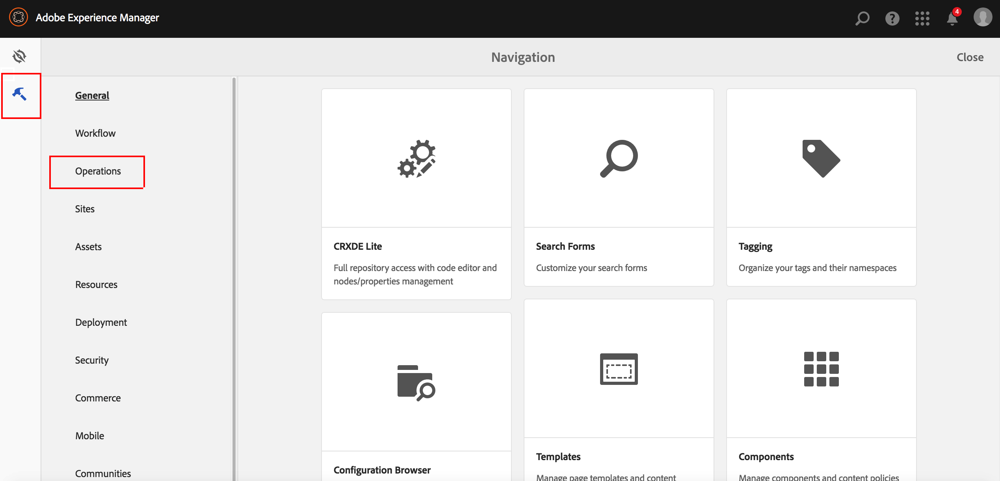

# 选择汇总的使用情况统计信息收集{#opting-into-aggregated-usage-statistics-collection}

## 简介 {#introduction}

您可以通过发送Adobe统计信息来帮助您改进Adobe Marketing Cloud，了解您与AEM的互动方式。 此信息不包含任何有关公司网站访客的数据，仅用于帮助Adobe提供、支持和改善用户体验。

您可以使用触屏UI或Web控制台选择加入使用情况统计信息收集。

>[!NOTE]
>
>有各种数据保护和隐私法规； 例如，包括GDPR和CCPA。 AEM Sites愿意帮助客户履行其数据保护和隐私合规义务。 本页指导客户完成选择（或退出）汇总使用情况统计信息收集的过程。
>
>有关更多信息，另请参 [阅Adobe隐私中心](https://www.adobe.com/privacy.html)。

>[!NOTE]
>
>您还可以随时使用Web控制台 [或不](/help/sites-deploying/opt-in-aggregated-usage-statistics.md#opt-in-by-using-the-web-console) 选择AEM参与屏幕上的加入选项来选择退出。

## 使用触屏UI选择加入 {#opt-in-by-using-the-touch-ui}

第一次开始AEM时，您可以使用触屏UI，如下所示：

1. 在AEM导航屏幕上，单击收 **件箱** （铃）图标。

   

1. 在下拉列表中，单击“启用聚&#x200B;**合使用统计信息收集**”。

   

1. 在选择加入屏幕上，选择“允&#x200B;**许收集汇总的使用情况统计**”。

   

1. Click &quot;**Done**&quot;.

## 使用Web控制台选择加入 {#opt-in-by-using-the-web-console}

您可以通过使用Web控制台，按如下方式选择加入（或选择退出）:

1. 在AEM导航屏幕上，单击“工 **具** ”，然后 **单击“操作**”。

   

1. 在“操作”窗口中，单击“ **Web控制台”**。

   

1. 搜索“汇&#x200B;**总使用情况统计信息收**&#x200B;集”。
1. Click the **Edit** icon.

   

1. 选中“启 **用** ”复选框。 或者，如果要退出使用统计信息收集，也可以取消选中此复选框。

   

1. 单击&#x200B;**保存**。

