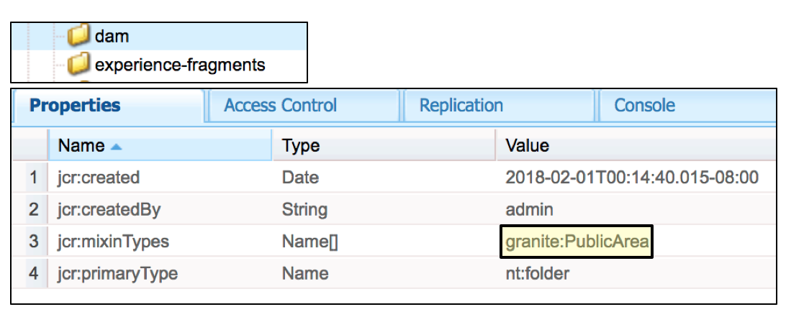

# 可持续升级{#sustainable-upgrades}

## 自定义框架 {#customization-framework}

### 架构（功能／基础架构／内容／应用程序）  {#architecture-functional-infrastructure-content-application}

自定义框架功能旨在帮助减少非扩展区域的代码（如API）或内容（如叠加）中不易升级的违规。

自定义框架有两个组件： API **Surface** 和内 **容分类**。

#### API Surface {#api-surface}

在AEM的先前发行版中，许多API通过Uber Jar公开。 这些API中的一些并非客户使用的，但它们暴露在不同捆绑套件中支持AEM功能。 今后，Java API将标为“公共”或“私有”，向客户指示哪些API在升级环境中是安全的。 其他具体信息包括：

* 标记为的Java API `Public` 可由自定义实施包使用和引用。

* 公共API将向后兼容兼容性包的安装。
* 兼容性软件包将包含兼容性Uber JAR，以确保向后兼容性
* 标记为的Java `Private` API仅供AEM内部捆绑包使用，不应由自定义捆绑包使用。

>[!NOTE]
>
>在这种情 `Private` 况下 `Public` ，不应将公共和私人类的Java概念混为一谈。

#### 内容分类 {#content-classifications}

AEM长期以来一直使用叠加和Sling Resource Merager的原则来允许客户扩展和自定义AEM功能。 支持AEM控制台和UI的预定义功能存储在 **/libs中**。 客户永远不得修改/lib **下的任何内容** ，但可以在/app下添加其他内容 **，以覆盖和扩展在/libs中定义的** 功能 **** （有关详细信息，请参阅使用Overlays进行开发）。 当将AEM升级为/libs中的内容时，这仍然会引 **起许多问** 题，这些问题可能会发生更改，导致叠加功能以意外方式中断。 客户还可以通过继承扩展AEM组 `sling:resourceSuperType`件，或直接通过sling:resourceType **在/libs** 中引用组件。 类似的升级问题可能与引用和覆盖用例有关。

为了使客户更安全、更轻松地了解哪些区域/ **lib是安全的** ，并将/lib中的内容 **** /libs中的内容与以下混音进行了分类：

* **公共(granite:PublicArea)** -将节点定义为公共，以便它可以覆盖、继承()或 `sling:resourceSuperType`直接() `sling:resourceType`使用。 添加兼容性包后，/libs下标为“公共”的节点将安全升级。 一般而言，客户只应利用标记为“公共”的节点。

* **摘要(granite:AbstractArea)** -将节点定义为摘要。 节点可以覆盖或继承( `sling:resourceSupertype`)，但不得直接使用( `sling:resourceType`)。

* **Final(granite:FinalArea)** -将节点定义为final。 分类为final的节点不能被覆盖或继承。 最终节点可直接通过使 `sling:resourceType`用。 默认情况下，最终节点下的子节点被视为内部节点

* **内部(granite:InternalArea)** -将节点定义为内部。 分类为内部的节点不能被覆盖、继承或直接使用。 这些节点仅用于AEM的内部功能

* **无注释** -节点根据树层次结构继承分类。 默认情况下，/ root为公共。 **父节点分类为“内部”或“最终”的节点也被视为“内部”。**

>[!NOTE]
>
>这些策略仅针对基于Sling搜索路径的机制实施。 客户端 **库** /lib的其他区域可标记为 `Internal`，但仍可与标准clientlib包含一起使用。 在这些情况下，客户应继续遵守内部分类。

#### CRXDE Lite内容类型指示器 {#crxde-lite-content-type-indicators}

在CRXDE Lite中应用的混合将显示标记为灰显的内容节 `INTERNAL` 点和树。 因 `FINAL` 为图标仅灰显。 这些节点的子项也将显示为灰色。 这两种情况下均禁用“叠加节点”功能。

**公共**

**最终**

**内部**

**内容运行状况检查**

AEM 6.4附带运行状况检查，以在以与内容分类不一致的方式使用覆盖或引用的内容时提醒客户。

Sling/ **Granite内容访问检查** (Sling/Granite Content Access Check)是一种新的运行状况检查，它监视存储库以查看客户代码是否错误地访问AEM中的受保护节点。

此操作将扫 **描／应用** ，通常需要几秒钟才能完成。

要访问此新的运行状况检查，您需要执行以下操作：

1. 从AEM主屏幕，导航到工具> **操作>运行状况报告**
1. 单击Sling/ **Granite内容访问检查** ，如下所示：

   

扫描完成后，将显示一列表警告，通知未正确引用的受保护节点的最终用户：

修复违规后，将返回绿色状态：

运行状况检查显示由后台服务收集的信息，当所有Sling搜索路径中使用叠加或资源类型时，后台服务会异步检查该信息。 如果内容混合使用不正确，则报告违规。
