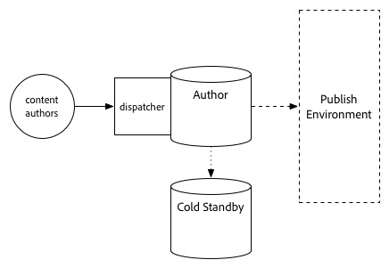

# 升级过程{#upgrade-procedure}

>[!NOTE]
>
>由于大多数AEM升级都是就地执行的，因此升级过程将需要创作层停机。 通过遵循这些最佳实践，可以最大限度地减少或消除发布层停机时间。

在升级AEM环境时，您需要考虑升级创作环境或发布环境之间在方法上的差异，以便最大限度地减少作者和最终用户的停机时间。 本页概述了升级当前在AEM 6.x版本上运行的AEM拓扑的高级过程。由于创作层和发布层以及基于Mongo和TarMK的部署之间的过程不同，因此每个层和微内核都已在单独的部分中列出。 执行部署时，我们建议您先升级创作环境，确定成功与否，然后继续访问发布环境。

## TarMK创作层{#tarmk-author-tier}

### 启动拓扑{#starting-topology}

此部分假定的拓扑由在TarMK上运行的具有冷备用的作者服务器组成。 从创作服务器复制到TarMK发布场。 虽然此处未说明，但此方法也可用于使用卸载的部署。 请确保在创作实例上禁用复制代理后并在重新启用它们之前，在新版本上升级或重新构建卸载实例。

### 升级准备{#upgrade-preparation}

1. 停止内容创作
1. 停止备用实例
1. 在作者上禁用复制代理
1. 运行[升级前维护任务](/help/sites-deploying/pre-upgrade-maintenance-tasks.md)。

### 升级执行{#upgrade-execution-1}

1. 运行[就地升级](/help/sites-deploying/in-place-upgrade.md)
1. 如果需要，请更新调度程序模块&#x200B;**
1. QA将验证升级
1. 关闭创作实例。

### 如果{#if-successful}成功

1. 复制已升级的实例以创建新的Cold Standby
1. 启动创作实例
1. 启动备用实例。

### 如果失败（回滚）{#if-unsuccessful-rollback}

1. 启动冷备用实例作为新主实例
1. 从冷备用环境重建创作环境。

## MongoMK创作群集{#mongomk-author-cluster}

### 启动拓扑 {#starting}

此部分的假定拓扑由MongoMK创作群集组成，该群集至少具有两个AEM创作实例，并由至少两个MongoMK数据库作为后盾。 所有创作实例都共享一个数据存储。 这些步骤应同时适用于S3和文件数据存储。 从创作服务器复制到TarMK发布场。

### 升级准备 {#preparation}

1. 停止内容创作
1. 克隆数据存储以进行备份
1. 停止除一个AEM创作实例（主作者）之外的所有其他实例
1. 从副本集（主Mongo实例）中删除除一个MongoDB节点之外的所有节点
1. 更新主作者上的`DocumentNodeStoreService.cfg`文件，以反映您的单个成员副本集
1. 重新启动主作者，以确保正确重新启动
1. 在主作者上禁用复制代理
1. 在主Author实例上运行[升级前维护任务](/help/sites-deploying/pre-upgrade-maintenance-tasks.md)
1. 如有必要，请使用WiredTiger将主Mongo实例上的MongoDB升级到版本3.2

### 升级执行 {#execution}

1. 在主作者上运行[就地升级](/help/sites-deploying/in-place-upgrade.md)
1. 如果需要，请更新调度程序或Web模块&#x200B;**
1. QA将验证升级

### 如果{#successful-1}成功

1. 创建新的6.3创作实例，该实例已连接到已升级的Mongo实例
1. 重建已从群集中删除的MongoDB节点
1. 更新`DocumentNodeStoreService.cfg`文件以反映完整的副本集
1. 重新启动创作实例，一次一个
1. 删除克隆的数据存储。

### 如果失败（回滚）{#if-unsuccessful}

1. 重新配置辅助创作实例以连接到克隆的数据存储
1. 关闭已升级的创作主实例
1. 关闭已升级的Mongo主实例。
1. 启动次Mongo实例，其中一个实例作为新主实例
1. 在辅助Author实例上配置`DocumentNodeStoreService.cfg`文件，以指向尚未升级的Mongo实例的副本集
1. 启动辅助创作实例
1. 清理已升级的创作实例、Mongo节点和数据存储。

## TarMK发布场{#tarmk-publish-farm}

### TarMK发布场{#publish-farm}

此部分的假定拓扑由两个TarMK发布实例组成，Dispatcher前面有两个TarMK发布实例，后面有负载平衡器。 从创作服务器复制到TarMK发布场。

### 升级执行{#execution-upgrade}

1. 在负载平衡器中停止Publish 2实例的流量
1. 在发布2中运行[升级前维护](/help/sites-deploying/pre-upgrade-maintenance-tasks.md)
1. 在发布2中运行[就地升级](/help/sites-deploying/in-place-upgrade.md)
1. 如果需要，请更新调度程序或Web模块&#x200B;**
1. 刷新Dispatcher缓存
1. QA将验证通过防火墙后的Dispatcher发布2
1. 关闭发布2
1. 复制Publish 2实例
1. 开始发布2

### 如果{#successful-2}成功

1. 启用流量以发布2
1. 停止流量以发布1
1. 停止Publish 1实例
1. 将Publish 1实例替换为Publish 2的副本
1. 如果需要，请更新调度程序或Web模块&#x200B;**
1. 刷新Publish 1的Dispatcher缓存
1. 开始发布1
1. QA将验证通过防火墙后的Dispatcher发布1

### 如果失败（回滚） {#rollback}

1. 创建发布1的副本
1. 将Publish 2实例替换为Publish 1的副本
1. 刷新Publish 2的调度程序缓存
1. 开始发布2
1. QA将验证通过防火墙后的Dispatcher发布2
1. 启用流量以发布2

## 最终升级步骤{#final-upgrade-steps}

1. 启用流量以发布1
1. QA会通过公共URL执行最终验证
1. 从创作环境中启用复制代理
1. 恢复内容创作
1. 执行[升级后检查](/help/sites-deploying/post-upgrade-checks-and-troubleshooting.md)。

