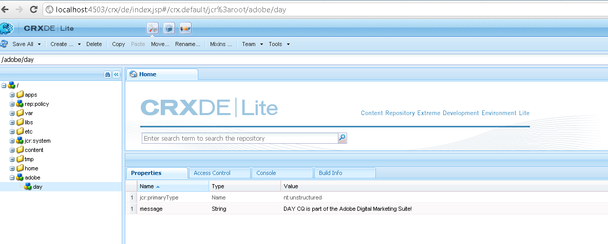

# 如何以编程方式访问AEM JCR{#how-to-programmatically-access-the-aem-jcr}

>[!CAUTION]
>
>AEM 6.4已结束扩展支持，本文档将不再更新。 有关更多详细信息，请参阅 [技术支助期](https://helpx.adobe.com/cn/support/programs/eol-matrix.html). 查找支持的版本 [此处](https://experienceleague.adobe.com/docs/).

您可以以编程方式修改位于Adobe CQ存储库(属于Adobe Marketing Cloud的一部分)中的节点和属性。 要访问CQ存储库，请使用Java内容存储库(JCR)API。 您可以使用Java JCR API对位于Adobe CQ存储库内的内容执行创建、替换、更新和删除(CRUD)操作。 有关Java JCR API的更多信息，请参阅 [https://jackrabbit.apache.org/jcr/jcr-api.html](https://jackrabbit.apache.org/jcr/jcr-api.html).

>[!NOTE]
>
>本开发文章从外部Java应用程序修改Adobe CQ JCR。 相反，您可以使用JCR API从OSGi包中修改JCR。 有关详细信息，请参阅 [在Java内容存储库中保留CQ数据](https://helpx.adobe.com/experience-manager/using/persisting-cq-data-java-content1.html).

>[!NOTE]
>
>要使用JCR API，请将 `jackrabbit-standalone-2.4.0.jar` 文件到Java应用程序的类路径。 您可以从Java JCR API网页(位于 [https://jackrabbit.apache.org/jcr/jcr-api.html](https://jackrabbit.apache.org/jcr/jcr-api.html).

>[!NOTE]
>
>要了解如何使用JCR查询API查询Adobe CQ JCR，请参阅 [使用JCR API查询Adobe Experience Manager数据](https://helpx.adobe.com/experience-manager/using/querying-experience-manager-data-using1.html).

## 创建存储库实例 {#create-a-repository-instance}

尽管有不同的方法连接到存储库并建立连接，但本开发文章使用属于的静态方法 `org.apache.jackrabbit.commons.JcrUtils` 类。 方法的名称为 `getRepository`. 此方法采用一个表示Adobe CQ服务器URL的字符串参数。 例如 `http://localhost:4503/crx/server`。

的 `getRepository`方法返回 `Repository`实例，如以下代码示例中所示。

```java
//Create a connection to the AEM JCR repository running on local host
Repository repository = JcrUtils.getRepository("http://localhost:4503/crx/server");
```

## 创建会话实例 {#create-a-session-instance}

的 `Repository`实例表示CRX存储库。 您使用 `Repository`与存储库建立会话的实例。 要创建会话，请调用 `Repository`实例 `login`方法和通过 `javax.jcr.SimpleCredentials` 对象。 的 `login`方法返回 `javax.jcr.Session` 实例。

您可以创建 `SimpleCredentials`对象，并传递以下字符串值：

* 用户名；
* 相应的密码

传递第二个参数时，调用String对象的 `toCharArray`方法。 以下代码显示如何调用 `login`返回 `javax.jcr.Sessioninstance`.

```java
//Create a Session instance
javax.jcr.Session session = repository.login( new SimpleCredentials("admin", "admin".toCharArray()));
```

## 创建节点实例 {#create-a-node-instance}

使用 `Session`创建实例 `javax.jcr.Node` 实例。 A `Node`通过实例，您可以执行节点操作。 例如，您可以创建新节点。 要创建表示根节点的节点，请调用 `Session`实例 `getRootNode` 方法，如下面一行代码中所示。

```java
//Create a Node
Node root = session.getRootNode();
```

创建 `Node`实例中，您可以执行一些任务，例如创建另一个节点并为其添加值。 例如，以下代码会创建两个节点，并向第二个节点添加一个值。

```java
// Store content 
Node day = adobe.addNode("day");
day.setProperty("message", "Adobe CQ is part of the Adobe Digital Marketing Suite!");
```

## 检索节点值 {#retrieve-node-values}

要检索节点及其值，请调用 `Node`实例 `getNode`方法并将表示完全限定路径的字符串值传递到节点。 请考虑在上一个代码示例中创建的节点结构。 要检索日节点，请指定adobe/day，如以下代码所示：

```java
// Retrieve content
Node node = root.getNode("adobe/day");
System.out.println(node.getPath());
System.out.println(node.getProperty("message").getString());
```

## 在Adobe CQ存储库中创建节点 {#create-nodes-in-the-adobe-cq-repository}

以下Java代码示例表示一个Java类，该类连接到Adobe CQ，并创建 `Session`实例，并添加新节点。 节点会被分配一个数据值，然后节点的值及其路径会写出到控制台。 完成会话后，请务必注销。

```java
/*
 * This Java Quick Start uses the jackrabbit-standalone-2.4.0.jar
 * file. See the previous section for the location of this JAR file
 */
 
import javax.jcr.Repository; 
import javax.jcr.Session; 
import javax.jcr.SimpleCredentials; 
import javax.jcr.Node; 
 
import org.apache.jackrabbit.commons.JcrUtils;
import org.apache.jackrabbit.core.TransientRepository;

public class GetRepository {

public static void main(String[] args) throws Exception { 
 
try { 
 
    //Create a connection to the CQ repository running on local host 
    Repository repository = JcrUtils.getRepository("http://localhost:4503/crx/server");
   
   //Create a Session
   javax.jcr.Session session = repository.login( new SimpleCredentials("admin", "admin".toCharArray())); 
 
  //Create a node that represents the root node
  Node root = session.getRootNode(); 
 
  // Store content 
  Node adobe = root.addNode("adobe"); 
  Node day = adobe.addNode("day"); 
  day.setProperty("message", "Adobe CQ is part of the Adobe Digital Marketing Suite!");

  // Retrieve content 
  Node node = root.getNode("adobe/day"); 
  System.out.println(node.getPath()); 
  System.out.println(node.getProperty("message").getString()); 
 
  // Save the session changes and log out
  session.save(); 
  session.logout();
  }
 catch(Exception e){
  e.printStackTrace();
  }
 } 
}
```

运行完整代码示例并创建节点后，可以在 **[!UICONTROL CRXDE Lite]**，如下图所示。


