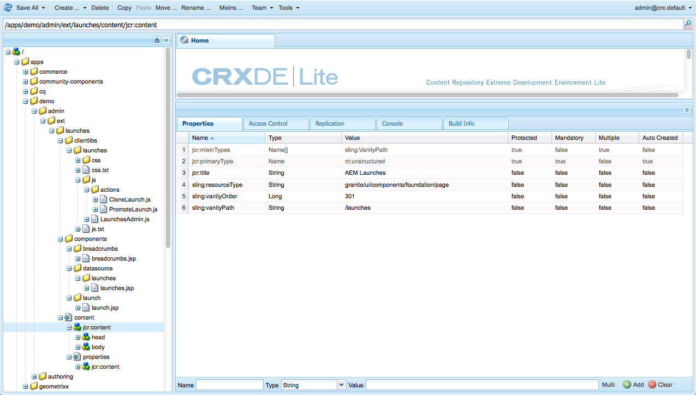

# 自定义控制台{#customizing-the-consoles}

>[!CAUTION]
>
>AEM 6.4已结束扩展支持，本文档将不再更新。 有关更多详细信息，请参阅 [技术支助期](https://helpx.adobe.com/cn/support/programs/eol-matrix.html). 查找支持的版本 [此处](https://experienceleague.adobe.com/docs/).

>[!CAUTION]
>
>本文档介绍如何在现代化的触屏优化UI中自定义控制台，并且不适用于经典UI。

AEM提供了各种机制，允许您自定义控制台( [页面创作功能](/help/sites-developing/customizing-page-authoring-touch.md))。

* Clientlibs

   Clientlibs允许您扩展默认实施以实现新功能，同时重用标准函数、对象和方法。 自定义时，您可以在 `/apps.` 例如，它可以保存自定义组件所需的代码。

* 叠加

   叠加基于节点定义，允许您覆盖标准功能(在 `/libs`) `/apps`)。 在创建叠加时，不需要原始资源的1:1副本，因为Sling资源合并器允许继承。

这些控制台可以通过多种方式来扩展您的AEM控制台。 下面（在高级别）介绍了一些小的选择。

>[!NOTE]
>
>有关更多信息，请参阅：
>
>* 使用和创建 [clientlibs](/help/sites-developing/clientlibs.md).
>* 使用和创建 [叠加](/help/sites-developing/overlays.md).
>* [Granite](https://helpx.adobe.com/experience-manager/6-4/sites/developing/using/reference-materials/granite-ui/api/index.html)
>
>本主题还在 [AEM Gems会话 — AEM 6.0的用户界面自定义](https://experienceleague.adobe.com/docs/experience-manager-gems-events/gems/gems2014/aem-user-interface-customization-for-aem6.html).

>[!CAUTION]
>
>您 ***必须*** 不会更改 `/libs` 路径。
>
>这是因为 `/libs` 在下次升级实例时被覆盖（当您应用修补程序或功能包时，可能会被覆盖）。
>
>配置和其他更改的推荐方法是：
>
>1. 重新创建所需项目(即， `/libs`)下 `/apps`
>
>1. 在 `/apps`

>

例如， `/libs` 结构可以覆盖：

* 控制台（任何基于Granite UI页面的控制台）；例如：

   * `/libs/wcm/core/content`

<!-- Needs a review by Engineering -->
<!--
* secondary (inner) rails; for example:

    * `/libs/wcm/core/content/search`

* toolbar(s) (dependent on console; for example sites):

    * default 

      `/libs/wcm/core/content/sites/jcr:content/body/content/header/items/default`

    * selection mode

      `/libs/wcm/core/content/sites/jcr:content/body/content/header/items/selection`

* help menu options (dependent on console; for example sites):

    * `/libs/wcm/core/content/sites/jcr:content/body/help`

* information shown on the card view (dependent on console; for example sites):

    * `/libs/wcm/core/content/sites/jcr:content/body/content/content/items/childpages`

-->
>[!NOTE]
>
>请参阅知识库文章， [AEM触屏UI问题疑难解答](https://helpx.adobe.com/experience-manager/kb/troubleshooting-aem-touchui-issues.html)，以获取更多提示和工具。

<!-- Needs a review by Engineering -->
<!--
## Code Samples {#code-samples}

Various packages have been made available on Github. These provide code samples related to the tasks covered on this page.

### aem-admin-extension-new-console {#aem-admin-extension-new-console}

`aem-admin-extension-new-console` is a sample package showing how to [create a new AEM 6 console](#create-a-custom-console). This package provides a UI for managing [Launches](/help/sites-authoring/launches.md) and adds a link in the navigation:

CODE ON GITHUB

You can find the code of this page on GitHub

* [Open aem-admin-extension-new-console project on GitHub](https://github.com/Adobe-Marketing-Cloud/aem-admin-extension-new-console)
* Download the project as [a ZIP file](https://github.com/Adobe-Marketing-Cloud/aem-admin-extension-new-console/archive/master.zip)

### aem-admin-extension-customize-sites {#aem-admin-extension-customize-sites}

`aem-admin-extension-customize-sites` is a sample package showing how to customize an existing AEM 6 admin console. This package provides updates to Sites administration:

CODE ON GITHUB

You can find the code of this page on GitHub

* [Open aem-admin-extension-customize-sites project on GitHub](https://github.com/Adobe-Marketing-Cloud/aem-admin-extension-customize-sites)
* Download the project as [a ZIP file](https://github.com/Adobe-Marketing-Cloud/aem-admin-extension-customize-sites/archive/master.zip)
-->

<!-- Needs a review by Engineering -->
<!--
## Create a Custom Console {#create-a-custom-console}

1. You can create a custom console with related actions; for example, Launches at the top level (below Sites):

   This involves:

    * creating the root space definition of your new console ``; for example:

        * `/apps/<yourProject>/admin/ext/launches`

    * this can contain (according to requirements):

        * the corresponding [clientlibs](/help/sites-developing/clientlibs.md) for custom actions and `less`/ `css` definitions

            * `/apps/<yourProject>/admin/ext/launches/clientlibs`

        * components that need to be redefined/adjusted; for example, the breadcrumbs, datasource and the launch

            * `/apps/<yourProject>/admin/ext/launches/components`

        * the Granite UI page resource:

            * `/apps/<yourProject>/admin/ext/launches/content/jcr:content`

              property: `sling:resourceType`

        * the page definition of the console

            * `/apps/<yourProject>/admin/ext/launches/content/jcr:content/head`
            * `/apps/<yourProject>/admin/ext/launches/content/jcr:content/body`

   

   To use the new console (for example in the [rail for navigation](#add-new-navigation-option-to-rail)) an ID is used, so that it can be explicitly referenced. The ID is used to connect the console and its navigation definition. The ID is defined in the `rail` node of the page; for example, for the Sites console:

    * the rail node is: 

      `/libs/wcm/core/content/sites/jcr:content/body/rail`

        * here the `currentId` property is defined: 

          `currentId` = `cq-sites`

   For the Launches console example:

    * the node is:

        * `/apps/<yourProject>/admin/ext/launches/content/jcr:content/body/rail`

    * with the following properties:

        * `currentId` = `cq-launches`
        * `sling:resourceType` = `granite/ui/components/endor/navcolumns`
        * `srcPath` = `cq/core/content/nav`
-->

## 自定义控制台的默认视图 {#customizing-the-default-view-for-a-console}

您可以自定义控制台的默认视图（列、卡片、列表）：

1. 您可以通过在下面叠加所需条目来重新排序视图：

   `/libs/wcm/core/content/sites/jcr:content/views`

   第一个条目将是默认条目。

   可用的节点与可用的视图选项相关联：

   * `column`
   * `card`
   * `list`

1. 例如，在列表的叠加中：

   `/apps/wcm/core/content/sites/jcr:content/views/list`

   定义以下属性：

   * **名称**: `sling:orderBefore`
   * **类型**: `String`
   * **值**: `column`

<!-- Needs a review by Engineering -->
<!--
`aem-admin-extension-customize-sites` is a sample package showing how to customize an existing AEM 6 admin console. This package provides updates to Sites administration:

CODE ON GITHUB

You can find the code of this page on GitHub

* [Open aem-admin-extension-customize-sites project on GitHub](https://github.com/Adobe-Marketing-Cloud/aem-admin-extension-customize-sites)
* Download the project as [a ZIP file](https://github.com/Adobe-Marketing-Cloud/aem-admin-extension-customize-sites/archive/master.zip)
-->

<!-- Needs a review by Engineering -->
<!--
### Add New Navigation Option to Rail {#add-new-navigation-option-to-rail}

1. You can add a navigation entry in the rail (for example, a [custom console](#create-a-custom-console) such as Launches).

   To do this, you create an overlay of:

   `/libs/cq/core/content/nav`

   In the `/apps` overlay:

   `/apps/cq/core/content/nav`

   Create the new nodes and properties:

   

    * Extend navigation:

        * `/apps/cq/core/content/nav/launches`

    * Specify location in the tree:

        * property: `sling:orderBefore`

    * To create the connection, the `id` property references (i.e. must be the same as) the `currentID` property [for the appropriate console](#create-a-custom-console):

        * property: `id`
        * value: same as for your console (e.g. `cq-launches`) 

          for example: the same value as the `currentId` property on:

          `/apps/<yourProject>/admin/ext/launches/content/jcr:content/body/rail`
-->

## 将新操作添加到工具栏 {#add-new-action-to-the-toolbar}

1. 您可以构建自己的组件，并为自定义操作包含相应的客户端库。 例如， **提升至Twitter** 操作：

   `/apps/wcm/core/clientlibs/sites/js/twitter.js`

   然后，此组件可以连接到控制台上的工具栏项目：

   `/apps/<yourProject>/admin/ext/launches`

   例如，在选择模式下：

   `content/jcr:content/body/content/header/items/selection/items/twitter`

## 将工具栏操作限制为特定群组 {#restrict-a-toolbar-action-to-a-specific-group}

1. 您可以使用自定义渲染条件来覆盖标准操作，并强制规定在渲染之前必须满足的特定条件。

   例如，创建一个组件以根据组控制渲染条件：

   `/apps/myapp/components/renderconditions/group`

1. 要将这些操作应用到站点控制台上的创建站点操作，请执行以下操作：

   `/libs/wcm/core/content/sites`

   创建叠加：

   `/apps/wcm/core/content/sites`

1. 然后，为操作添加rendercondition:

   `jcr:content/body/content/header/items/default/items/create/items/createsite/rendercondition`

   使用此节点上的属性，您可以定义 `groups` 允许执行具体操作；例如， `administrators`

<!-- Needs a review by Engineering -->
<!--
## Remove Access to Navigation Option on Rail {#remove-access-to-navigation-option-on-rail}

1. You can rename a navigation entry in the rail by overlaying the required entry from under:

   `/libs/cq/core/content/nav`

   The nodes available correlate to the navigation options in the rail:

    * `projects`
    * `sites`
    * `assets`
    * `apps`
    * `forms`
    * `screens`
    * `personalization`
    * `commerce`
    * `tools`
    * `communities`

1. For example, on a overlay at:

   `/apps/cq/core/content/nav/sites`

   Define the following property:

    * **Name**: `sling:hideResource`
    * **Type**: `String` 
    * **Value**: `true`

`aem-admin-extension-customize-sites` is a sample package showing how to customize an existing AEM 6 admin console. This package provides updates to Sites administration:

CODE ON GITHUB

You can find the code of this page on GitHub

* [Open aem-admin-extension-new-console project on GitHub](https://github.com/Adobe-Marketing-Cloud/aem-admin-extension-new-console)
* Download the project as [a ZIP file](https://github.com/Adobe-Marketing-Cloud/aem-admin-extension-new-console/archive/master.zip)
-->

<!-- Needs a review by Engineering -->
<!--
## Restrict Access to Navigation Option on Rail {#restrict-access-to-navigation-option-on-rail}

You can restrict access to a navigation option using ACLs:

1. Open the [user and/or group management](/help/sites-administering/security.md) and select the user/group you want to restrict access for.

   >[!NOTE]
   >
   >Avoid assigning/restricting permissions on a user-by-user basis. It is [recommended to use groups](/help/sites-administering/security.md#best-practices).

1. Remove access [permissions](/help/sites-administering/security.md#permissions) to the appropriate node(s) under `/libs/cq/core/content/nav/sites`. These correlate to the navigation options in the rail:

    * `projects`
    * `sites`
    * `assets`
    * `apps`
    * `forms`
    * `screens`
    * `personalization`
    * `commerce`
    * `tools`
    * `communities`
-->

## 自定义列表视图中的列 {#customizing-columns-in-the-list-view}

>[!NOTE]
>
>此功能针对文本字段的列进行了优化；对于其他数据类型，可以叠加 `cq/gui/components/siteadmin/admin/listview/columns/analyticscolumnrenderer` in `/apps`.

<!-- Needs a review by Engineering -->
<!--
CODE ON GITHUB

You can find the code of this page on GitHub

* [Open aem-sites-extension-listview-columns project on GitHub](https://github.com/Adobe-Marketing-Cloud/aem-sites-extension-listview-columns)
* Download the project as [a ZIP file](https://github.com/Adobe-Marketing-Cloud/aem-sites-extension-listview-columns/archive/master.zip)
-->

要自定义列表视图中的列，请执行以下操作：

1. 覆盖可用列的列表。

   * 在节点上：

      `/apps/wcm/core/content/common/availablecolumns`

   * 添加新列 — 或删除现有列。
   请参阅 [使用叠加（和Sling资源合并器）](/help/sites-developing/overlays.md) 以了解更多信息。

1. （可选）：

   * 如果要插入其他数据，需要编写 ` [PageInforProvider](https://helpx.adobe.com/experience-manager/6-4/sites/developing/using/reference-materials/javadoc/com/day/cq/wcm/api/PageInfoProvider.html)` 带有

      `pageInfoProviderType` 属性.
   例如，请参阅下面附加的类/包（从GitHub）。

1. 您现在可以在列表视图的列配置器中选择列。

## 筛选资源 {#filtering-resources}

使用控制台时，常见的用例是用户必须从资源（例如页面、组件、资产等）中进行选择。 这可以采用列表的形式，例如，作者必须从中选择项目。

为了使列表保持为合理大小并且与用例相关，可以采用自定义谓词的形式实现过滤器。 请参阅 [本文](/help/sites-developing/customizing-page-authoring-touch.md#filtering-resources) 以了解详细信息。
