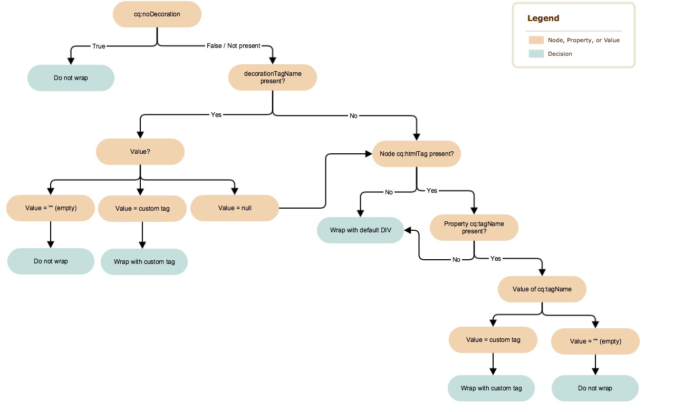

# 装饰标签{#decoration-tag}

>[!NOTE]
>
>本文描述的装饰标签行为和选项基于 [AEM 6.3 CFP1](https://helpx.adobe.com/experience-manager/release-notes--aem-6-3-cumulative-fix-pack.html)。
>
>6.3中CFP1之前的装饰标签的行为与AEM 6.2的行为类似。

呈现网页中的组件时，可以生成HTML元素，将呈现的组件封装在它自身中。 这主要用于两个用途：

* 组件仅在用HTML元素包装时才可编辑。
* 包装元素用于应用提供以下功能的HTML类：

   * 布局信息
   * 样式信息

对于开发人员，AEM提供了清晰而简单的逻辑，用于控制封装包含组件的装饰标签。 装饰标签的呈现方式和呈现方式由两个因素的组合来定义，本页将深入讨论这两个因素：

* 组件本身可以使用一组属性配置其装饰标签。
* 包含组件（HTL、JSP、调度程序等）的脚本可以使用包含参数来定义装饰标签的方面。

## 推荐 {#recommendations}

以下是一些关于何时包含包装器元素的一般建议，这些建议应有助于避免遇到意外问题：

* 包装器元素的存在在WCMMode（编辑或预览模式）、实例（创作或发布）或环境（暂存或生产）之间不应有所不同，因此页面的CSS和JavaScript在所有情况下均具有相同的工作方式。
* 应将包装器元素添加到所有可编辑的组件中，以便页面编辑器能够正确初始化和更新它们。
* 对于不可编辑的组件，如果包装器元素不用于特定功能，则可以避免包装器元素，因此所得标记不会不必要的膨胀。

## 组件控件 {#component-controls}

以下属性和节点可应用于组件以控制其装饰标签的行为：

* **`cq:noDecoration {boolean}`**:此属性可以添加到组件，而true值会强制AEM不在组件上生成任何包装器元素。

* **`cq:htmlTag`**节点：此节点可以添加到组件下，并且可以具有以下属性：

   * **`cq:tagName {String}`**:这可用于指定用于封装组件而不是默认DIV元素的自定义HTML标签。
   * **`class {String}`**:这可用于指定要添加到包装器的css类名称。
   * 其他属性名称将添加为HTML属性，其字符串值与提供的相同。

## 脚本控件 {#script-controls}

但是，包装器行为的确不同，具体取决于 [是使用HTL](/help/sites-developing/decoration-tag.md#htl)[还是JSP](/help/sites-developing/decoration-tag.md#jsp) 来包含元素。

### HTL {#htl}

通常，HTL中的包装器行为可总结如下：

* 默认情况下（仅执行操作时）不会呈现包装器DIV `data-sly-resource="foo"`。
* 所有wcm模式（禁用、预览、在创作和发布时编辑）呈现相同的效果。

包装器的行为也可以完全控制。

* HTL脚本对包装器标签的生成行为具有完全控制权。
* 组件属性(如 `cq:noDecoration` 和 `cq:tagName`)还可以定义包装器标签。

可以完全控制HTL脚本中的包装器标签及其关联逻辑的行为。

有关在HTL中进行开发的更多信息，请参阅 [HTL文档](https://helpx.adobe.com/experience-manager/htl/user-guide.html)。

#### 决策树 {#decision-tree}

此决策树汇总确定包装器标签行为的逻辑。


#### Use Cases {#use-cases}

以下三个用例提供了包装器标签处理方式的示例，并说明了控制包装器标签的所需行为是多么简单。

下面的所有示例都采用以下内容结构和组件：

```
/content/test/
  @resourceType = "test/components/one"
  child/
    @resourceType = "test/components/two"
```

```
/apps/test/components/
  one/
    one.html
  two/
    two.html
    cq:htmlTag/
      @cq:tagName = "article"
      @class = "component-two"
```

#### 用例1:包含用于代码重用的组件 {#use-case-include-a-component-for-code-reuse}

最典型的用例是当组件包含另一个组件时，由于代码重用的原因。 在这种情况下，不希望包含的组件能够使用其自己的工具栏和对话框进行编辑，因此不需要包装器，并且将忽略组 `cq:htmlTag` 件的包装。 这可以视为默认行为。

`one.html: <sly data-sly-resource="child"></sly>`

`two.html: Hello World!`

在以下位置生成输 `/content/test.html`出：

**`Hello World!`**

例如，一个组件包括用于显示图像的核心图像组件，在这种情况下，通常使用合成资源，该合成资源包括通过将表示组件将具有的所有属性的Map对象传递到数据透明资源来包括虚拟子组件。

#### 用例2:包括可编辑的组件 {#use-case-include-an-editable-component}

另一个常见用例是当容器组件包括可编辑的子组件时（如布局容器）。 在这种情况下，每个包含的子项都必须有一个包装器才能使编辑器正常工作(除非在属性中显式禁 `cq:noDecoration` 用)。

由于包含的组件是独立组件，因此它需要一个包装器元素才能使编辑器工作，并定义要应用的布局和样式。 要触发此行为，有一个选 `decoration=true` 项。

`one.html: <sly data-sly-resource="${'child' @ decoration=true}"></sly>`

`two.html: Hello World!`

在以下位置生成输 `/content/test.html`出：

**`<article class="component-two">Hello World!</article>`**

#### 用例3:自定义行为 {#use-case-custom-behavior}

可能存在任意数量的复杂情况，而HTL明确提供这些情况的可能性很容易实现：

* **`decorationTagName='ELEMENT_NAME'`** 定义包装器的元素名称。
* **`cssClassName='CLASS_NAME'`** 定义要在其上设置的CSS类名称。

`one.html: <sly data-sly-resource="${'child' @ decorationTagName='aside', cssClassName='child'}"></sly>`

`two.html: Hello World!`

结果输 `/content/test.html`出：

**`<aside class="child">Hello World!</aside>`**

## JSP {#jsp}

当使用e或包 `cq:includ`含组件 `sling:include`时，AEM中的默认行为是使用DIV来包装元素。 但是，可以通过两种方式自定义此包装：

* 明确告知AEM不要使用包装组件 `cq:noDecoration`。
* 使用自定义HTML标签使用 `cq:htmlTag`/或包含 `cq:tagName` 组件 `decorationTagName`。

### 决策树 {#decision-tree-1}

以下决策树说明 `cq:noDecoration`、 `cq:htmlTag`、 `cq:tagName`和 `decorationTagName` 如何影响包装器行为。



