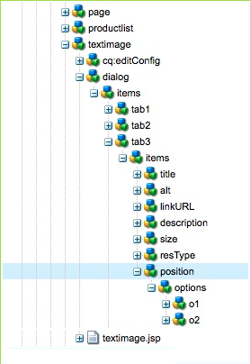

# 开发AEM组件（经典UI）{#developing-aem-components-classic-ui}

经典UI使用ExtJS创建构件，提供组件的外观。 由于这些构件的性质，组件与经典UI和触屏优化UI的交互方 [式存在一些差异](/help/sites-developing/developing-components.md)。

>[!NOTE]
>
>组件开发的许多方面在经典UI和触屏优化UI中都很常见， **因此您必[须阅读AEM组件- Basics](/help/sites-developing/components-basics.md)，然后才** 能使用此页面，该页面会介绍经典UI的特定信息。

>[!NOTE]
>
>Although both the HTML Template Language (HTL) and JSP can be used for developing components for the classic UI, this page illustrates development with JSP. This is solely due to the history of using JSP within the classic UI.
>
>HTL is now the recommended scripting language for AEM. 请参 [阅HTL](https://helpx.adobe.com/experience-manager/htl/user-guide.html) 和 [开发AEM组件](/help/sites-developing/developing-components.md) ，以比较方法。

## 结构 {#structure}

AEM组件——基础知识页面中介绍了组 [件的基本结构](/help/sites-developing/components-basics.md#structure)，它同时应用触屏和经典UI。 即使您不需要在新组件中使用触屏优化UI的设置，在从现有组件继承时也可以了解这些设置。

## JSP脚本 {#jsp-scripts}

JSP脚本或Servlet可用于呈现组件。 根据Sling的请求处理规则，默认脚本的名称为：

`<*componentname*>.jsp`

## global.jsp {#global-jsp}

JSP脚本文 `global.jsp` 件用于提供对特定对象（即访问内容）的快速访问，以访问用于呈现组件的任何JSP脚本文件。

因此， `global.jsp` 在每个组件中都应包括呈现JSP脚本的内容，其中使用了中提供的一个或多个 `global.jsp` 对象。

默认位置 `global.jsp` 为：

`/libs/foundation/global.jsp`

>[!NOTE]
>
>版本 `/libs/wcm/global.jsp`CQ 5.3及更早版本使用的路径现在已过时。

### global.jsp、已使用API和Taglibs的函数 {#function-of-global-jsp-used-apis-and-taglibs}

以下列表从默认值提供的最重要的对象 `global.jsp`:

摘要:

* `<cq:defineObjects />`

   * `slingRequest` -封装的请求对 `SlingHttpServletRequest`象()。
   * `slingResponse` -封装的响应对象( `SlingHttpServletResponse`)。
   * `resource` - Sling资源对象( `slingRequest.getResource();`)。
   * `resourceResolver` - Sling资源解析器对象( `slingRequest.getResoucreResolver();`)。
   * `currentNode` -请求的已解析JCR节点。
   * `log` -默认记录器()。
   * `sling` - Sling脚本帮助程序。
   * `properties` -已寻址资源的属性( `resource.adaptTo(ValueMap.class);`)。
   * `pageProperties` -已寻址资源页面的属性。
   * `pageManager` - The page manager for accessing AEM content pages ( `resourceResolver.adaptTo(PageManager.class);`).
   * `component` - The component object of the current AEM component..
   * `designer` - The designer object for retrieving design information ( `resourceResolver.adaptTo(Designer.class);`).
   * `currentDesign` -已寻址资源的设计。
   * `currentStyle` - The style of the addressed resource.

### Accessing Content {#accessing-content}

There are three methods to access content in AEM WCM:

* Via the properties object introduced in `global.jsp`:

   The properties object is an instance of a ValueMap (see [Sling API](https://sling.apache.org/apidocs/sling5/org/apache/sling/api/resource/ValueMap.html)) and contains all properties of the current resource.

   Example: `String pageTitle = properties.get("jcr:title", "no title");` used in the rendering script of a page component.

   Example: `String paragraphTitle = properties.get("jcr:title", "no title");` used in the rendering script of a standard paragraph component.

* Via the `currentPage` object introduced in `global.jsp`:

   The `currentPage` object is an instance of a page (see [AEM API](https://helpx.adobe.com/experience-manager/6-4/sites/developing/using/reference-materials/javadoc/com/day/cq/wcm/api/Page.mhtml)). The page class provides some methods to access content.

   示例: `String pageTitle = currentPage.getTitle();`

* Via `currentNode` object introduced in `global.jsp`:

   对 `currentNode` 象是节点的实例(请参 [阅JCR API](https://jackrabbit.apache.org/api/2.16/org/apache/jackrabbit/standalone/cli/core/CurrentNode.html))。 节点的属性可通过该方法进 `getProperty()` 行访问。

   示例: `String pageTitle = currentNode.getProperty("jcr:title");`

## JSP Tag Libraries {#jsp-tag-libraries}

The CQ and Sling tag libraries give you access to specific functions for use in the JSP script of your templates and components.

For more information, see the document [Tag Libraries](/help/sites-developing/taglib.md).

## 使用客户端HTML库 {#using-client-side-html-libraries}

Modern websites rely heavily on client-side processing driven by complex JavaScript and CSS code. 组织和优化此代码的服务可能是一个复杂的问题。

To help deal with this issue, AEM provides **Client-side Library Folders**, which allow you to store your client-side code in the repository, organize it into categories and define when and how each category of code is to be served to the client. The client-side library system then takes care of producing the correct links in your final web page to load the correct code.

See the document [Using Client-Side HTML Libraries](/help/sites-developing/clientlibs.md) for more information.

## 对话框 {#dialog}

您的组件将需要一个作者对话框来添加和配置内容。

See [AEM Components - The Basics](/help/sites-developing/components-basics.md#dialogs) for further details.

## 配置编辑行为 {#configuring-the-edit-behavior}

You can configure the edit behavir of a component. 这包括一些属性，如可用于组件的操作、就地编辑器的特性以及与组件上的事件相关的监听器。 该配置对于触屏优化UI和经典UI都是通用的，尽管有某些特定差异。

通 [过在组件节点](/help/sites-developing/components-basics.md#edit-behavior) （类型）下添加类型的节点 `cq:editConfig` ，并添加特定属性和子节 `cq:EditConfig``cq:Component`点，可配置组件的编辑行为。

## 使用和扩展ExtJS构件 {#using-and-extending-extjs-widgets}

有关详 [细信息，请参阅使用和扩展ExtJS](/help/sites-developing/widgets.md) 构件。

## 将xtypes用于ExtJS构件 {#using-xtypes-for-extjs-widgets}

有关更 [多详细信息](/help/sites-developing/xtypes.md) ，请参阅使用xtypes。

## 开发新组件 {#developing-new-components}

本节介绍如何创建您自己的组件并将其添加到段落系统。

快速入门的方法是复制现有组件，然后进行所需的更改。

有关如何开发组件的示例在扩展文本和图 [像组件——一个示例中有详细说明。](#extending-the-text-and-image-component-an-example)

### 开发新组件（调整现有组件） {#develop-a-new-component-adapt-existing-component}

要根据现有组件为AEM开发新组件，您可以复制组件，为新组件创建javascript文件并将其存储在AEM可访问的位置(另请参阅自 [定义组件和其他元素](/help/sites-developing/dev-guidelines-bestpractices.md#customizing-components-and-other-elements)):

1. 使用CRXDE Lite，在以下位置创建新组件文件夹：

   / `apps/<myProject>/components/<myComponent>`

   像在libs中一样重新创建节点结构，然后复制现有组件（如文本组件）的定义。 例如，要自定义文本组件副本，请执行以下操作：

   * 从 `/libs/foundation/components/text`
   * 到 `/apps/myProject/components/text`

1. 修改 `jcr:title` 以反映其新名称。
1. 打开新组件文件夹并进行所需的更改。 同时，删除文件夹中的任何无关信息。

   您可以进行以下更改：

   * 在对话框中添加新字段

      * `cq:dialog` -触屏优化UI的对话框
      * `dialog` -经典UI的对话框
   * 替换文 `.jsp` 件（在新组件后命名它）
   * 或完全重新工作整个组件（如果您希望）

   例如，如果您复制了标准文本组件，则可以向对话框添加一个附加字段，然后更新该字段 `.jsp` 以处理在该处输入。

   >[!NOTE]
   >
   >用于以下项目的组件：
   >
   >* 触屏优化UI使用 [Granite组件](https://helpx.adobe.com/experience-manager/6-4/sites/developing/using/reference-materials/granite-ui/api/jcr_root/libs/granite/ui/index.html)
   >* 经典UI使用 [ExtJS构件](https://helpx.adobe.com/experience-manager/6-4/sites/developing/using/reference-materials/widgets-api/index.html)


   >[!NOTE]
   >
   >为经典UI定义的对话框将在触屏优化UI中运行。
   >
   >为触屏优化UI定义的对话框在经典UI中无法运行。
   >
   >根据您的实例和作者环境，您可能希望为组件定义这两种类型的对话框。

1. 以下节点之一应当存在并正确初始化，新组件才能显示：

   * `cq:dialog` -触屏优化UI的对话框
   * `dialog` -经典UI的对话框
   * `cq:editConfig` -组件在编辑环境中的行为方式（例如拖放）
   * `design_dialog` -设计模式对话框（仅限经典UI）

1. 通过以下任一方式在段落系统中激活新组件：

   * 使用CRXDE Lite将值( `<path-to-component>` 例如， `/apps/geometrixx/components/myComponent`)添加到节点的属性组件 `/etc/designs/geometrixx/jcr:content/contentpage/par`
   * 按照向段落系 [统添加新组件中的说明](#adding-a-new-component-to-the-paragraph-system-design-mode)

1. 在AEM WCM中，在您的网站中打开一个页面，然后插入刚刚创建的新段落类型，以确保组件正常工作。

>[!NOTE]
>
>要查看页面加载的计时统计信息，可使用Ctrl-Shift-U —— 并 `?debugClientLibs=true` 在URL中设置。

### 向段落系统添加新组件（设计模式） {#adding-a-new-component-to-the-paragraph-system-design-mode}

在开发组件后，可将其添加到段落系统，这样作者就可以在编辑页面时选择并使用组件。

1. 例如，在您的创作环境中访问使用段落系统的页面 `<contentPath>/Test.html`。
1. 通过以下任一方式切换到“设计”模式：

   * 添 `?wcmmode=design` 加到URL末尾并再次访问，例如：

      `<contextPath>/ Test.html?wcmmode=design`

   * 单击Sidekick中的设计

   您现在处于设计模式，可以编辑段落系统。

1. 单击编辑。

   将显示属于段落系统的组件的列表。 还会列出您的新组件。

   可以激活（或取消激活）这些组件，以确定在编辑页面时向作者提供的组件。

1. 激活您的组件，然后返回正常编辑模式以确认该组件可供使用。

### 扩展文本和图像组件——一个示例 {#extending-the-text-and-image-component-an-example}

本节提供一个示例，说明如何使用可配置的图像放置功能扩展广泛应用的文本和图像标准组件。

文本和图像组件的扩展功能允许编辑人员使用组件的所有现有功能外加一个额外的选项来指定图像的位置：

* 在文本的左侧（当前行为和新默认值）
* 在右侧

扩展此元件后，可以通过元件的对话框配置图像放置。

本练习介绍以下技术：

* 复制现有组件节点并修改其元数据
* 修改组件的对话框，包括父对话框构件的继承
* 修改组件的脚本以实现新功能

>[!NOTE]
>
>此示例针对经典UI。

>[!NOTE]
>
>此示例基于Geometrixx样本内容，该内容不再随AEM一起提供，而已被We.Retail替换。 有关如何下 [载和安装文档](/help/sites-developing/we-retail.md#we-retail-geometrixx) ，请参阅GeometrixxWe.Retail Reference Implementation。

#### 扩展现有文本时间组件 {#extending-the-existing-textimage-component}

要创建新组件，我们将使用标准文本时间组件作为基础并对其进行修改。 我们将新组件存储在GeometrixxAEM WCM示例应用程序中。

1. 将标准文本时间组件从 `/libs/foundation/components/textimage` Geometrixx组件文件夹中复 `/apps/geometrixx/components`制，并使用文本时间作为目标节点名称。 (通过导航到组件，右键单击并选择复制并浏览到目标目录，即可复制组件。)

   

1. 要使此示例简单，请导航到您复制的组件，并删除新文本时间节点的所有子节点，以下子节点除外：

   * 对话框定义： `textimage/dialog`
   * 组件脚本： `textimage/textimage.jsp`
   * 编辑配置节点（允许拖放资产）: `textimage/cq:editConfig`

   >[!NOTE]
   >
   >对话框定义取决于UI:
   >
   >* Touch-enabled UI: `textimage/cq:dialog`
   >* 经典 UI: `textimage/dialog`


1. 编辑组件元数据：

   * 组件名称

      * 设置 `jcr:description` 为 `Text Image Component (Extended)`
      * 设置 `jcr:title` 为 `Text Image (Extended)`
   * 组，其中组件列在Sidekick中（保持原样）

      * 保 `componentGroup` 持设置为 `General`
   * 新组件的父组件（标准文本时间组件）

      * 设置 `sling:resourceSuperType` 为 `foundation/components/textimage`

   此步骤之后，组件节点如下所示：

   

1. 更改 `sling:resourceType` 图像编辑配置节点的属性(属性： `textimage/cq:editConfig/cq:dropTargets/image/parameters/sling:resourceType`) `geometrixx/components/textimage.`

   这样，当图像被拖放到页面上的组件时，扩展文 `sling:resourceType` 本时间组件的属性将设置为： `geometrixx/components/textimage.`

1. 修改组件的对话框以包含新选项。 新组件会继承与原始对话框中相同的对话框部分。 我们添加的唯一功能是扩展“高 **级** ”选项卡，添加“图 **像位置** ”下拉列表，其中 **包含“左** 侧”和“ ****&#x200B;右”选项：

   * 保留属 `textimage/dialog`性不变。

   请注 `textimage/dialog/items` 意，如何有四个子节点（tab1到tab4），表示文本时间对话框的四个选项卡。

   * 对于前两个选项卡（tab1和tab2）:

      * 将xtype更改为cqinclude（从标准组件继承）。
      * 分别添加具有值和 `/libs/foundation/components/textimage/dialog/items/tab1.infinity.json`值 `/libs/foundation/components/textimage/dialog/items/tab2.infinity.json`的路径属性。
      * 删除所有其他属性或子节点。
   * 对于tab3:

      * 保留属性和子节点而不进行更改
      * 将新字段定义添加 `tab3/items`到类型的节点位置 `cq:Widget`
      * 为新节点设置以下属性(字符串类 `tab3/items/position`型):

         * `name`: `./imagePosition`
         * `xtype`: `selection`
         * `fieldLabel`: `Image Position`
         * `type`: `select`
      * 添加类 `position/options` 型的子节 `cq:WidgetCollection` 点以表示图像放置的两种选择，并在其下面创建两个类型的节点，o1和o2 `nt:unstructured`。
      * 对于节 `position/options/o1` 点，请设置属性： `text` 到 `Left` 和 `value` 到 `left.`
      * 对于节 `position/options/o2` 点，请设置属性： `text` 到 `Right` 和 `value` 到 `right`。
   * 删除选项卡4。

   图像位置作为表示段落 `imagePosition`的节点的属性保留在内 `textimage` 容中。 完成这些步骤后，组件对话框如下所示：

   

1. 扩展组件脚本 `textimage.jsp`，并额外处理新参数：

   ```xml
   Image image = new Image(resource, "image");
   
   if (image.hasContent() || WCMMode.fromRequest(request) == WCMMode.EDIT) {
        image.loadStyleData(currentStyle);
   ```

   我们将用新代码替换 *强调的代码片段%>&lt;div class=&quot;image&quot;>&lt;%* ，该新代码为此标记生成自定义样式。

   ```xml
   // todo: add new CSS class for the 'right image' instead of using 
   // the style attribute 
   String style="";
        if (properties.get("imagePosition", "left").equals("right")) { 
             style = "style=\"float:right\""; 
        } 
        %><div <%= style %> class="image"><%
   ```

1. 将组件保存到存储库。 组件已准备好进行测试。

#### 检查新组件 {#checking-the-new-component}

开发组件后，可将其添加到段落系统，这样作者就可以在编辑页面时选择并使用组件。 这些步骤允许您测试组件。

1. 以Geometrixx(如英语/公司)打开页面。
1. 单击Sidekick中的“设计”，切换到设计模式。
1. 在页面中间的段落系统上单击“编辑”，编辑段落系统设计。 将显示可放置在段落系统中的组件列表，它应包括您新开发的组件文本图像（扩展）。 通过选择段落系统并单击“确定”，将其激活。
1. 切换回编辑模式。
1. 将文本图像（扩展）段落添加到段落系统，使用示例内容初始化文本和图像。 保存更改。
1. 打开文本和图像段落的对话框，将“高级”选项卡上的“图像位置”更改为“右”，然后单击“确定”以保存更改。
1. 段落将在右侧显示图像。
1. 该组件现已准备就绪。

组件将其内容存储在公司页面的段落中。

### 禁用图像组件的上传功能 {#disable-upload-capability-of-the-image-component}

要禁用此功能，我们将使用标准图像组件作为基础并对其进行修改。 我们将新组件存储在Geometrixx示例应用程序中。

1. 将标准图像组件从复 `/libs/foundation/components/image` 制到Geometrixx组件文件夹， `/apps/geometrixx/components`使用图像作为目标节点名称。

   

1. 编辑组件元数据：

   * 将 **jcr:title设置为** `Image (Extended)`

1. 导航至 `/apps/geometrixx/components/image/dialog/items/image`.
1. 添加新属性:

   * **名称**: `allowUpload`
   * **类型**: `String`
   * **值**: `false`

   

1. 单击“ **全部保存**”。 组件已准备好进行测试。
1. 以Geometrixx(如英语/公司)打开页面。
1. 切换到设计模式并激活“图像”(Extended)。
1. 切换回编辑模式，并将其添加到段落系统。 在下一张图片上，您可以看到原始图像组件与刚刚创建的图像组件之间的差异。

   原始图像组件：

   

   您的新图像组件：

   

1. 该组件现已准备就绪。

