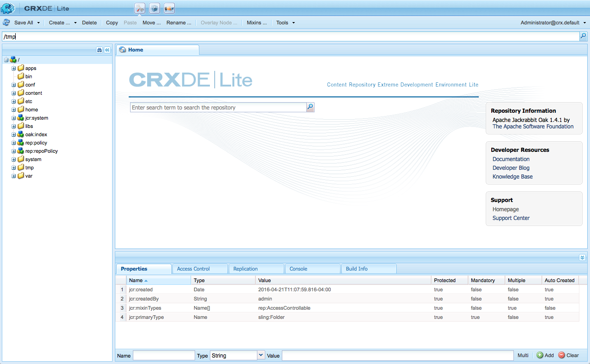

# 使用CRXDE Lite进行开发 {#developing-with-crxde-lite}

>[!CAUTION]
>
>AEM 6.4已结束扩展支持，本文档将不再更新。 有关更多详细信息，请参阅 [技术支助期](https://helpx.adobe.com/cn/support/programs/eol-matrix.html). 查找支持的版本 [此处](https://experienceleague.adobe.com/docs/).

本节介绍如何使用CRXDE Lite开发AEM应用程序。

有关可用的不同开发环境的更多信息，请参阅概述文档。

CRXDE Lite嵌入到AEM中，允许您在浏览器中执行标准开发任务。 通过CRXDE Lite，您可以在记录时创建项目、创建和编辑文件(如.jsp和.java)、文件夹、模板、组件、对话框、节点、属性和包。

当您无法直接访问AEM服务器、通过扩展或修改现成组件和Java包来开发应用程序时，或者您不需要专用调试器、代码完成和语法突出显示时，建议使用CRXDE Lite。

>[!NOTE]
>
>从AEM 6.4.8.1开始，便无法再匿名访问CRXDE Lite。
>用户将被重定向到登录屏幕。

>[!NOTE]
>
>建议使用 [AEM Developer Tools for Eclipse](/help/sites-developing/aem-eclipse.md) 和 [AEM HTL Brackets扩展](/help/sites-developing/aem-brackets.md) 在项目开发期间。

## CRXDE Lite入门 {#getting-started-with-crxde-lite}

要开始使用CRXDE Lite，请按如下步骤操作：

1. 安装AEM。
1. 在您的浏览器中，输入https://`<host>`:`<port>`/crx/de. 默认情况下，这是 `http://localhost:4502/crx/de`。
1. 输入 **用户名** 和 **密码**. 默认情况下， `admin` 和 `admin`.

1. 单击&#x200B;**确定**。

CRXDE Lite用户界面在您的浏览器中如下所示：

您现在可以使用CRXDE Lite来开发应用程序。

### 用户界面概述 {#overview-of-the-user-interface}

CRXDE Lite提供以下功能：

<table> 
 <tbody> 
  <tr> 
   <td>顶部切换器栏</td> 
   <td>允许您在CRXDE Lite、包管理器和包共享之间快速切换。</td> 
  </tr> 
  <tr> 
   <td>节点路径小组件</td> 
   <td>
显示当前选定节点的路径。
 
您还可以使用它跳转到节点，方法是手动输入路径，或从其他位置粘贴路径，然后按Enter。
 
它还支持查找具有特定节点名称的节点。 输入要查找的节点名称，然后等待（或点击右侧的搜索符号）。 您可以尝试输入，例如，字符串 <em>oak</em> 进入小组件，了解其工作原理。 如果给定的节点或节点已加载到资源管理器窗格中，则将显示该列表，您可以选择路径并按Enter键导航到该路径。 请注意，它仅适用于当前加载到浏览器中CRXDE客户端应用程序的节点。 如果要搜索整个存储库，请依次使用工具和查询。
 </td> 
  </tr> 
  <tr> 
   <td>浏览器窗格</td> 
   <td>
显示存储库中所有节点的树。
 
单击某个节点以在 <strong>属性</strong> 选项卡。 单击某个节点后，您可以在工具栏中选择一项操作。 再次单击该节点以对其进行重命名。
 
树导航过滤器（双目图标）：用于筛选库中名称包含输入文本的节点。 它仅适用于已本地加载的节点。  
 </td> 
  </tr> 
  <tr> 
   <td>编辑窗格</td> 
   <td>
<strong>主页</strong> 选项卡：允许您搜索内容和/或文档，并访问开发人员资源（文档、开发人员博客、知识库）和支持(Adobe主页和支持中心)。  
 
双击 <strong>资源管理器</strong> 窗格显示其内容；例如.jsp或.java文件。 然后，您可以修改并保存更改。
 
在 <strong>编辑</strong> ，工具栏上提供以下工具：  
 - <strong>在树中显示： </strong>显示存储库树中的文件。  - <strong>搜索/替换……</strong>:进行搜索或替换。    双击 <strong>编辑</strong> 窗格打开 <strong>转至行</strong> 对话框，以便您可以输入要转到的特定行号。  </td> 
  </tr> 
  <tr> 
   <td>“属性”选项卡  </td> 
   <td>显示所选节点的属性。 您可以添加新属性或删除现有属性。  </td> 
  </tr> 
  <tr> 
   <td>“访问控制”选项卡</td> 
   <td>
根据当前路径、存储库级别或主体显示权限。
 
权限被划分为
 
- <strong>适用的访问控制策略</strong>:可应用于当前选择的策略。
 
- <strong>本地访问控制策略</strong>:当前策略应用于当前选择。
 
- <strong>有效的访问控制策略</strong>:应用于当前选择的当前策略可以在本地设置，也可以从父节点继承。
 
注意. 要能够看到访问控制信息，登录CRXDE Lite的用户必须具有读取ACL条目的权限。 默认情况下，匿名用户看不到此信息 — 请以管理员等身份登录来查看该信息。
 </td> 
  </tr> 
  <tr> 
   <td>“复制”选项卡</td> 
   <td>
显示当前节点的复制状态。 您可以复制并复制删除当前节点的操作。
 </td> 
  </tr> 
  <tr> 
   <td>“控制台”选项卡  </td> 
   <td>
<strong>服务器日志</strong>:
 
显示日志消息。 您可以配置日志级别、清除控制台、固定到所选滚动位置并启用/禁用消息显示。  
 
<strong>版本控制</strong>:
 
显示版本控制消息。  
 </td> 
  </tr> 
  <tr> 
   <td>“生成信息”选项卡  </td> 
   <td>显示构建包时的信息。  </td> 
  </tr> 
  <tr> 
   <td>刷新  </td> 
   <td>刷新当前选择。 在您的存储库视图中，会更新其他用户所做的更改。 您所做的更改不会受到影响。  </td> 
  </tr> 
  <tr> 
   <td>全部保存</td> 
   <td>
<strong>全部保存</strong>:  
 
保存您所做的所有更改。 在单击保存之前，所做的更改是临时的，在您退出控制台时，这些更改将会丢失。
 
<strong>还原</strong>:
 
放弃自上次保存操作以来对所选节点所做的所有更改，然后重新加载所选节点的存储库的当前状态。
 
<strong>全部恢复</strong>:
 
放弃自上次保存操作后在整个存储库中所做的所有更改，然后重新加载存储库的当前状态。
 </td> 
  </tr> 
  <tr> 
   <td>创建 ...  </td> 
   <td>
用于在选定节点下创建以下内容的下拉菜单：  
 
- <strong>节点</strong>:具有任意节点类型的节点  
 
- <strong>文件</strong>:nt：文件节点及其nt:resource子节点
 
- <strong>文件夹</strong>:nt：文件夹节点
 
- <strong>模板</strong>:AEM模板
 
- <strong>组件</strong>:AEM组件
 
- <strong>对话框</strong>:AEM对话框
 </td> 
  </tr> 
  <tr> 
   <td>删除  </td> 
   <td>删除所选节点。  </td> 
  </tr> 
  <tr> 
   <td>复制</td> 
   <td>复制所选节点。  </td> 
  </tr> 
  <tr> 
   <td>粘贴  </td> 
   <td>将复制的节点粘贴到选定的节点下。  </td> 
  </tr> 
  <tr> 
   <td>移动 ...  </td> 
   <td>将所选节点移动到通过对话框设置的节点。</td> 
  </tr> 
  <tr> 
   <td>重命名 ...  </td> 
   <td>重命名选定的节点。  </td> 
  </tr> 
  <tr> 
   <td>Mixin...  </td> 
   <td>用于向节点类型添加混合类型。 混合类型主要用于添加高级功能，如版本控制、访问控制、引用和锁定到节点。</td> 
  </tr> 
  <tr> 
   <td>工具  </td> 
   <td>
下拉菜单，其中包含以下工具：
 
- <strong>服务器配置……</strong>:访问Felix控制台。
 
- <strong>查询……</strong>:查询存储库。
 
- <strong>权限……</strong>:要打开权限管理，您可以在其中查看和添加权限。
 
- <strong>测试访问控制……</strong>:可在此处测试特定路径和/或主体的权限。
 
- <strong>导出节点类型</strong>:将系统中的节点类型导出为cnd符号。
 
- <strong>导入节点类型……</strong>:使用cnd符号导入节点类型。
  
- <strong>安装SiteCatalyst调试器……</strong>:有关如何安装Analytics Debugger的说明。
 </td> 
  </tr> 
  <tr> 
   <td>登录小组件  </td> 
   <td>
显示当前已登录的用户及其已登录的工作区，例如admin@crx.default。
 
单击该页面可以以特定用户身份登录或重新登录。 如果您没有指定要登录的工作区，则您将登录到默认工作区crx.default 。
 
如果要以匿名用户的身份浏览存储库，请使用 <strong>匿名</strong> 作为登录名，以及任何密码（例如空格或圆点）。  
 
如果您的授权不再有效（例如，授权已过期），则登录小组件会显示“<strong>未授权 — 登录……</strong>" 单击该页面可再次登录。
 </td> 
  </tr> 
 </tbody> 
</table>

### 创建文件夹 {#creating-a-folder}

要创建具有CRXDE Lite的文件夹，请执行以下操作：

1. 在浏览器中打开CRXDE Lite。
1. 在导航窗格中，右键单击要在其下创建新文件夹的文件夹，选择 **创建……**，则 **创建文件夹……**.

1. 输入文件夹 **名称** 单击 **确定**.

1. 单击 **全部保存** 来保存对服务器所做的更改。

### 创建模板 {#creating-a-template}

要创建具有CRXDE Lite的模板，请执行以下操作：

1. 在浏览器中打开CRXDE Lite。
1. 在“导航”窗格中，右键单击要创建模板的文件夹，然后选择 **创建……**，则 **创建模板……**.

1. 输入 **标签**, **标题**, **描述**, **资源类型** 和 **排名** 的子菜单。 单击&#x200B;**下一步**。

1. 此步骤是可选的：设置 **允许的路径**. 单击 **下一个**

1. 此步骤是可选的：设置 **允许的父项**. 单击&#x200B;**下一步**。

1. 此步骤是可选的：设置 **允许的子项**. 单击&#x200B;**确定**。

1. 单击 **全部保存** 来保存对服务器所做的更改。

它创建：

* 类型的节点 `cq:Template` 模板属性

* 类型的子节点 `cq:PageContent` 和页面内容属性

您可以向模板添加属性：请参阅 [创建资产](#creating-a-property) 中。

### 创建组件 {#creating-a-component}

仅当节点类型为 `cq:Component` 在存储库中可用。

要创建具有CRXDE Lite的组件，请执行以下操作：

1. 在浏览器中打开CRXDE Lite。
1. 在导航窗格中，右键单击要创建组件的文件夹，然后选择 **创建……**，则 **创建组件……**.

1. 输入 **标签**, **标题**, **描述**, **超级资源类型** 和 **组** 的子代。 单击&#x200B;**下一步**。

1. 此步骤是可选的：设置组件属性 **是容器，无装饰**, **单元格名称** 和 **对话框路径**. 单击&#x200B;**下一步**。

1. 此步骤是可选的：设置组件属性 **允许的父项**. 单击&#x200B;**下一步**。

1. 此步骤是可选的：设置组件属性 **允许的子项**. 单击&#x200B;**确定**。

1. 单击 **全部保存** 来保存对服务器所做的更改。

它创建：

* 类型的节点 `cq:Component`
* 组件属性
* 组件.jsp脚本

### 创建对话框 {#creating-a-dialog}

要创建具有CRXDE Lite的对话框，请执行以下操作：

1. 在浏览器中打开CRXDE Lite。
1. 在导航窗格中，右键单击要创建对话框的组件，选择 **创建……**，则 **创建对话框……**.

1. 输入 **标签** 和 **标题**. 单击&#x200B;**确定**。

1. 单击 **全部保存** l在服务器上保存更改。

它会创建具有以下结构的对话框：

`dialog[cq:Dialog]/items[cq:Widget]/items[cq:WidgetCollection]/tab1[cq:Panel]`

您现在可以通过修改属性或创建新节点来调整对话框，以满足您的需求。

您还可以使用对话框编辑器来编辑对话框。 在CRXDE Lite中双击对话框节点将显示编辑器。 有关对话框编辑器的更多信息，请参阅 [此处](/help/sites-developing/dialog-editor.md).

### 创建节点 {#creating-a-node}

要创建具有CRXDE Lite的节点，请执行以下操作：

1. 在浏览器中打开CRXDE Lite。
1. 在导航窗格中，右键单击要创建新节点的节点，选择 **创建……**，则 **创建节点……**.

1. 输入 **名称** 和 **类型**. 单击&#x200B;**确定**。

1. 单击 **全部保存** 来保存对服务器所做的更改。

您现在可以通过修改属性或创建新节点来调整节点，以满足您的需求。

>[!NOTE]
>
>大多数编辑操作（包括“创建节点”）都会保留内存中的所有更改，并且仅在保存后（通过“全部保存”按钮）才将它们存储到存储库中。 但是，某些操作（如移动）会自动保留。
>
>在保存更改时，JCR存储库还首先执行有关父节点的节点类型是否允许新创建的节点的验证。 如果您在保存节点时收到错误消息，请检查内容结构是否有效(例如，您无法创建 `nt:unstructured` 节点作为的子节点 `nt:folder` 节点)。

### 创建资产 {#creating-a-property}

要创建具有CRXDE Lite的资产，请执行以下操作：

1. 在浏览器中打开CRXDE Lite。
1. 在“导航”窗格中，选择要添加新属性的节点。
1. 在 **属性** ，输入 **名称**, **类型** 和 **值**. 单击 **添加**.

1. 单击 **全部保存** 来保存对服务器所做的更改。

### 创建脚本 {#creating-a-script}

要创建新脚本，请执行以下操作：

1. 在浏览器中打开CRXDE Lite。
1. 在“导航”窗格中，右键单击要创建脚本的组件，然后选择 **创建……**，则 **创建文件……**.

1. 输入文件 **名称** 包括其扩展。 单击&#x200B;**确定**。

1. 新文件将作为选项卡在“编辑”窗格中打开。
1. 编辑文件。
1. 单击 **全部保存** 以保存更改。

### 导出和导入节点类型 {#exporting-and-importing-node-types}

通过CRXDE Lite，您可以在 [CND（紧凑命名空间和节点类型定义）表示法](http://jackrabbit.apache.org/jcr/node-type-notation.html).

要导出节点类型定义，请执行以下操作：

1. 在浏览器中打开CRXDE Lite。
1. 选择所需的节点。
1. 选择 **工具** then **导出节点类型**.

1. 定义（以符号表示）将显示在浏览器中。 如有需要，保存信息。

要导入节点类型定义，请执行以下操作：

1. 在浏览器中打开CRXDE Lite。
1. 选择 **工具** then **导入节点类型……**.

1. 在文本框中输入定义的CND符号。
1. 检查 **允许更新** 如果要更新现有定义，则。
1. 单击 **导入**.

### 日志记录 {#logging}

通过CRXDE Lite，您可以显示文件 `error.log` 位于 `<crx-install-dir>/crx-quickstart/server/logs` 并使用相应的日志级别进行筛选。 请按如下方式继续：

1. 在浏览器中打开CRXDE Lite。
1. 在 **控制台** 选项卡，在右侧的下拉菜单中，选择 **服务器日志**.

1. 单击 **停止** 图标来显示消息。

您可以：

* 通过单击 **日志记录配置** 图标。
* 单击 **画笔** 图标。
* 通过单击 **固定** 图标。
* 通过单击 **停止** 图标。

## 访问控制 {#access-control}

>[!NOTE]
>
>请参阅 [用户、组和访问权限管理](/help/sites-administering/user-group-ac-admin.md) 以了解更多信息。
