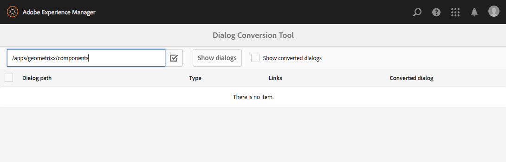
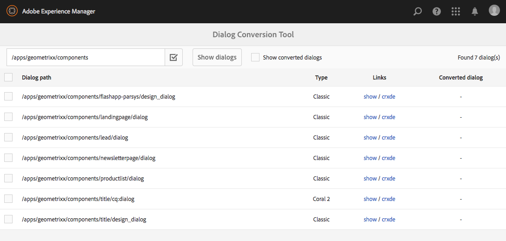
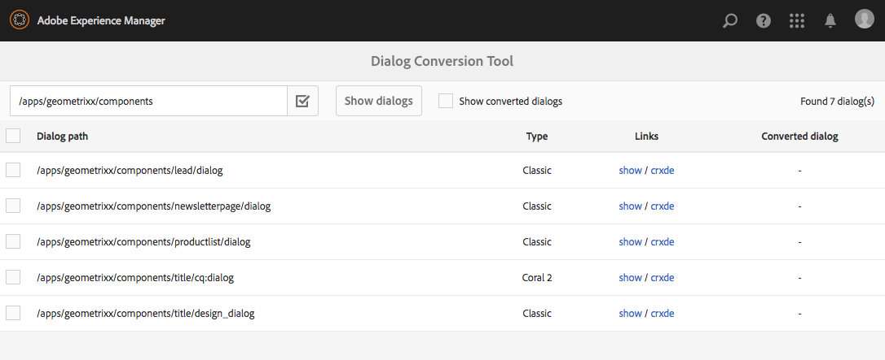

# 对话框转换工具{#dialog-conversion-tool}

对话框转换工具可帮助扩展仅为经典UI（基于ExtJS）或基于Granite UI和Coral 2定义对话框的现有组件。 该工具使用原始对话框创建基于Granite UI和Coral 3的标准UI设计的重复对话框。

此工具的目标是尽可能实现升级自动化、提高效率并减少错误。 但是，由于该工具不能涵盖每种情况，因此该过程无法完全自动化，用户必须查看转换的对话框，并可能进行其他调整。 该工具旨在帮助您开始转化过程，但并非旨在完全控制转化。

该工具将使用标准的、基于Granite UI和基于Coral 3的UI创建新对话框，但将跳过无法转换的对话框。 因此，如果没有与特定组件匹配的规则，则生成的对话框可能包含原始对话框中的节点。 此外，转换的组件可能具有一些未转换的属性，因为没有相应的规则来转换它们。

>[!CAUTION]
>
>该工具不能涵盖每种情形，因为其转换规则并非完全，并且会尽力操作。 它会转换最常用的元素和属性，但在处理自定义或高度专业化的对话框时，转换将不完整。 **转换的对话框可能需要进行额外调整，并且必须检查所有转换。**

>[!NOTE]
>
>由于经典UI不再是开发或增强的，Adobe建议客户升级到默认的Granite UI用户界面以从最新技术中受益。
>
>虽然迁移到最新平台通常是一种很好的做法，但从Coral 2迁移到Coral 3并不重要。 但是，任何新项目都应基于Coral 3启动。

## 下载并安装对话框转换工具 {#download-and-install-the-dialog-conversion-tool}

对话框转换工具已变为开放源代码，可通过GitHub访问。

GITHUB上的代码

您可以在GitHub上找到此页面的代码

* [在GitHub上打开aem-dialog-conversion项目](https://github.com/Adobe-Marketing-Cloud/aem-dialog-conversion)
* 以ZIP文件的 [形式下载项目](https://github.com/Adobe-Marketing-Cloud/aem-dialog-conversion/archive/master.zip)

>[!NOTE]
>
>AEM不附带对话框转换工具。 您必须下载并安装它才能使用它。

按照以下步骤安装对话框转换工具。

1. 从Dialog Conversion Tool GitHub [项目下载包](https://github.com/Adobe-Marketing-Cloud/aem-dialog-conversion/releases)。
1. 在实例上安装包。 有关包管理的详细信息，请 [参阅如何使用包](/help/sites-administering/package-manager.md)。

## 转换对话框 {#converting-a-dialog}

该工具通过在内容树中与原始对话框相同的位置创建相应的Granite UI/Coral 3对话框来转换对话框。 对于Granite UI/Coral 2对话框，这些对话框将被复制到备份位置( `.coral2` 在对话框节点名称后附加后缀)，以便不被覆盖。 该工具可以转换设计对话框和编辑对话框。

使用以下步骤转换一个或多个对话框：

1. 打开对 **话框转换** 控制台，可 **从全局导航** ->工 **具** - **>操作**:

   `https://<hostname>:<port>/libs/cq/dialogconversion/content/console.html`

   

1. 输入所需的路径，如 `/apps/geometrixx/components`。 您还可以输入指向单个对话框的直接路径，如 `/apps/geometrixx/components/lead`。

   

1. 选择“ **显示对话框** ”以显示该位置下的所有对话框。

   

   该表将列表输入路径下的所有现有旧版对话框。 每个对话框都列出其“类型”。 类型包括：

   * **经典：** 具有节点名 `cq:Dialog``dialog` 称或 `design_dialog`
   * **珊瑚2:** 在其子 `cq:dialog` 内容 `cq:design_dialog` 节点处命名或具有Granite UI / Coral 2资源类型的节点

   每行都包含一个视图对话框的链接和一个CRXDE Lite到视图其节点结构的链接。

   >[!NOTE]
   >
   >根本没有经典UI或Coral 2对话框的组件（即，它们使用Granite UI / Coral 3进行设计）不会列出。

1. 选择一个或多个要转换的对话框，然后单 **击或点按转换X对话框** ，以开始转换过程。

   

1. 所选对话框将列出其转换结果。 如果转换成功，则行包含链接，用于视图转换的对话框或以CRXDE Lite打开它。

   单击或点 **按** “返回”返回对话框转换工具。

   

1. 返回到对话框转换工具后，转换的对话框不再显示在列表中。 但是，请注意，仍会列出找到的对话框总数，包括已转换的对话框，即表中的行数不一定与找到的数字匹配。

   

1. 选中“显 **示已转换的对话框** ”选项，以显示那些位于已转换的指定路径上的对话框。

   

   如果对话框已转换，则还会向转换的对话框提供链接。 如果存在兄弟的Granite UI / Coral 3对话框，则该对话框被视为已转换。

## 对话框重写规则 {#dialog-rewrite-rules}

该对话转换工具基于图重写的 **概念**，包括通过应用重写规则来转换主题图。 重写规则是将图案与替换图形配对。 该规则匹配主题图中某个子图的出现，然后替换它们。 另请参 [阅https://en.wikipedia.org/wiki/Graph_rewriting](https://en.wikipedia.org/wiki/Graph_rewriting) ，了解有关图形重写的详细信息。

对话框转换工具使用此方法将给定的传统对话框树（经典或Granite UI / Coral 2）重写为其Granite UI / Coral 3对应的对话框。 这具有转换非常灵活的优点，并且甚至可以考虑复杂的组件，因为匹配是在实际的子树上完成的，而不仅仅是单个节点或属性。

### 算法 {#algorithm}

重写算法将待重写树和一组重写规则作为参数。 它按预先顺序遍历树，并且每个节点都检查是否有规则应用于根在该节点的子树。 匹配的第一个规则将应用于该子树以重写它。 遍历随后从根启动。 一旦遍历了整个树并且没有任何规则与任何子树匹配，算法就会停止。 作为一种优化度量，该算法跟踪一组最终的节点，因此无需在后续遍历中重新检查匹配项。 重写规则定义重写树的哪些节点是最终节点，哪些节点应该由算法的未来路径重新访问。

转换的入口点是，在 `DialogConversionServlet`POST请求中注册到 `/libs/cq/dialogconversion/content/convert.json`。 它接受路径请求参数，该参数是一个数组，包含应转换的对话框的路径。 对于每个对话框，servlet随后通过应用所有定义的对话框重写规则来重写相应的对话框树。

### 重写规则类型 {#rewrite-rule-types}

重写规则可以通过两种不同的方式进行定义，即：

* JCR节点结构- [基于节点的重写规则](/help/sites-developing/dialog-conversion.md#node-based-rewrite-rules)

* 实现特定接口的Java类- [基于Java的重写规则](/help/sites-developing/dialog-conversion.md#java-based-rewrite-rules)

有些 [是开箱即用的](#provided-rewrite-rules)，但您也可以定义自己的自定义规则。 [还提供了](/help/sites-developing/dialog-conversion.md#sample-rewrite-rules) “重写规则”示例。

通常，单个对话框重写规则负责重写单个对话框元素，例如路径浏览器输入字段。

>[!CAUTION]
>
>算法不检测到重写循环，因 **此重写规则不能循环地重写树**。

### 基于节点的重写规则 {#node-based-rewrite-rules}

可以根据节点和属性定义对话框重写规则。

```xml
rule
  - jcr:primaryType = nt:unstructured
  - cq:rewriteRanking = 4
  + patterns
    - jcr:primaryType = nt:unstructured
    + foo
      - ...
      + ...
    + foo1
      - ...
      + ...
  + replacement
    + bar
      - ...
      + ...
```

此示例定义一个规则， **该规则包** 含两个模式(根 `foo` 于和的树 `foo1`)和一个替 **换(根于** )的 `bar`树)。 图案和替换树是包含节点和属性的任意树。 如果任何已定义的模式匹配，则规则与子树匹配。 为了匹配模式，主题树必须包含与模式（匹配名称）相同的节点，并且模式中定义的所有属性必须与树的属性相匹配。

在匹配的情况下，匹配的子树（称为原始树）将被替换。 替换树可以定义将继承原始树中某个属性的值的映射属性。 它们必须为类型， `String` 并且格式如下：

`${<path>}`

如果原始树中不存在引用的属性，则忽略该属性。 或者，也可以为该情况指定默认值（仅对字符串属性可能）:

`${<path>:<default>}`

包含“”字 `:`符的属性可以单引用，以避免与提供默认值发生冲突。 如果表达式前缀为“ ”，则布尔属性将 `!`被否定。 映射的属性可以是多值属性，在这种情况下，将为它们分配匹配树中存在的第一个属性的值。

例如，将为以下属 `one` 性分配匹配的原始树 `./two/three` 的属性值。

```xml
...
  + replacement
    + bar
      - one = ${./two/three}
      - negated = !${./some/boolean/prop}
      - default = ${./some/prop:default}
      - multi = [${./prop1}, ${./prop2}]
```

规则还支持以下可选属性。

* `cq:rewriteOptional` (布尔型)

   在模式节点上设置此属性，以指示模式不必存在该节点，

* `cq:rewriteRanking` （整数）

   在规则节点上设置此属性以影响应用规则的顺序。 这对于确保处理更特定结构的规则不会被更一般的结构覆盖非常有用。 级别较低的规则优先于级别较高的规则。 默认情况下，所有规则都 `Integer.MAX_VALUE` 会作为其排名接收。

替换树还支持以下特殊属性(名称以开头 `cq:rewrite`):

* `cq:rewriteMapChildren` (字符串)

   包含此属性的节点将收到由属性值引用的原始树中节点的子节点的副本(例如， `cq:rewriteMapChildren=./items`)。

* `cq:rewriteFinal` (布尔型)

   这是一个优化度量，告诉算法包含此属性的节点是最终的，无需重新检查是否匹配重写规则。 当放置在替换节点本身上时，整个替换树被视为最终替换。
* `cq:rewriteCommonAttrs` (布尔型)

   在替换节点(/)上设 `rule`置此属 `replacement`性，将原始根节点的相关属性映射到副本根节点中的Granite公用属性等效项。 它将通过复制／创建目标上的子节 `granite:data` 点并在其中写入属性来处理 `data-*` 数据属性。
* `cq:rewriteRenderCondition` (布尔型)

   在替换节点(/)上设 `rule`置此属 `replacement`性，将任何Granite渲染条件（或）子节点从原始根节点复制到复制根 `rendercondition``granite:rendercondition``granite:rendercondition` 的子节点。

此外，可将节 `cq:rewriteProperties` 点添加到替换节点，以为结果中映射的属性定义字符串重写。 该节点从替换中删除。 必须将节点的 `cq:rewriteProperties` 属性命名为与它们要重写的属性相同，并接受包含两个参数的字符串数组：

* `pattern`: 要与匹配的正则表达式，例如 `"(?:coral-Icon-)(.+)"`

* `replacement`: 提供给匹配 `replaceAll` 器函数，例如 `"$1"`

以下是将Coral 2图标属性重写为Coral 3等效项的示例：

```xml
...
  + replacement
    + bar
      - icon = ${./icon}
      + cq:rewriteProperties
       - icon = [(?:coral-Icon--)(.+), $1]
```

#### 定义您自己的基于节点的重写规则 {#defining-your-own-node-based-rewrite-rules}

提供的重写规则定义于：

`/libs/cq/dialogconversion/rules`

在此位置，规则进一步被划分为经典重写规则和Coral 2重写规则的文件夹：

`/libs/cq/dialogconversion/rules/classic`

`/libs/cq/dialogconversion/rules/coral2`

通过在以下位置提供一组规则，可以覆盖这些规则：

`/apps/cq/dialogconversion/rules`

然后，您可 `/libs/cq/dialogconversion/rules` 以复制 `/apps` 到，并修改现有规则和／或向此新实例“”添加新规则。

### 基于Java的重写规则 {#java-based-rewrite-rules}

更复杂的重写规则可以定义为暴露接口的OSGi服务的Java类 `com.adobe.cq.dialogconversion.DialogRewriteRule`。

此类必须实现以下方法：

```java
boolean matches(Node root) throws RepositoryException;
Node applyTo(Node root, Set<Node> finalNodes) throws DialogRewriteException, RepositoryException;
int getRanking();
```

如果 `matches` 规则与根 `true` 于提供的根节点的子树匹配，则该方法必须返回。 如果规则匹配，树重写算法随后将调用该方 `applyTo` 法，该方法必须重写根在指定根节点上的子树。 通常，此方法会临时重命名原始树，将新树构建为原始树父节点的新子节点（使用其节点和属性），最后删除原始树。 有关详细信息，请参阅接口的Javadoc `com.adobe.cq.dialogconversion.DialogRewriteRule` 。

#### 更多信息- Javadocs {#further-information-javadocs}

有关详细信息，请参阅的Javadocs [`com.adobe.cq.dialogconversion`](https://adobe-marketing-cloud.github.io/aem-touchui-dialogconversion-samples/javadoc/)。

#### 定义您自己的基于Java的重写规则 {#defining-your-own-java-based-rewrite-rules}

以下类显示实现接口的自定义重写规则的 `com.adobe.cq.dialogconversion.DialogRewriteRule` 示例。

```java
@Component
@Service
public class CustomDialogRewriteRule implements DialogRewriteRule {
 
    public boolean matches(Node root) throws RepositoryException {
        // ...
    }
 
    public Node applyTo(Node root, Set<Node> finalNodes) throws DialogRewriteException, RepositoryException {
        // ...
    }
 
    int getRanking() {
        // ...
    }

}
```

或者，您也可以按 `com.adobe.cq.dialogconversion.AbstractDialogRewriteRule` 如下方式扩展。 抽象类实现该 `getRanking` 方法并使用服 `service.ranking` 务的OSGi属性来确定规则的排序。

```java
@Component
@Service
@Properties({
        @Property(name="service.ranking", intValue = 10)
})
public class CustomDialogRewriteRule extends AbstractDialogRewriteRule {

    public boolean matches(Node root) throws RepositoryException {
        // ...
    }
 
    public Node applyTo(Node root, Set<Node> finalNodes) throws RewriteException, RepositoryException {
        // ...
    }
 
}
```

### 提供的重写规则 {#provided-rewrite-rules}

该包 `cq-dialog-conversion-content` 包含若干预定义的重写规则。 有关经典UI构件，请参 [阅使用xtypes](/help/sites-developing/xtypes.md) ，以了解更多信息)。

<table> 
 <tbody> 
  <tr> 
   <td><strong>规则</strong></td> 
   <td><strong>旧版组件</strong></td> 
   <td><strong>Granite UI/Coral 3替换</strong></td> 
  </tr> 
  <tr> 
   <td><code>com.adobe.cq.dialogconversion.rules.CqDialogRewriteRule</code></td> 
   <td>类型的节点， <code>cq:Dialog</code>处理不同的子结构</td> 
   <td><p>使 <code>granite/ui/components/foundation/container</code> 用布局 <code>fixedcolumns</code> 或布 <code>tabs</code> 局</p> <p>该对话框的实际组件被复制并在算法的后续步骤中被重写。</p> </td> 
  </tr> 
  <tr> 
   <td><code>com.adobe.cq.dialogconversion.rules.IncludeRule</code></td> 
   <td>xtype = <code>cqinclude</code></td> 
   <td>引用的节点被复制到Granite UI/Coral 3对话框中，并（可能）随后由算法重写。</td> 
  </tr> 
  <tr> 
   <td><code>com.adobe.cq.dialogconversion.rules.MultifieldRewriteRule</code></td> 
   <td>xtype = <code>multifield</code></td> 
   <td><p>A <code>granite/ui/components/coral/foundation/form/multifield</code></p> <p>子节 <code>fieldConfig</code> 点（如果有）会单独重写，因此不会限制支持的组件。</p> </td> 
  </tr> 
  <tr> 
   <td><code>/libs/cq/dialogconversion/rules/classic</code></td> 
   <td><code class="code">button
      checkbox
      colorfield
      combobox
      componentselector
      datetime
      fieldset
      fileupload
      hidden
      numberfield
      panel
      password
      pathfield
      radio
      radiogroup
      select
      sizefield
      tabpanel
      tags
      textarea
      textfield</code></td> 
   <td> </td> 
  </tr> 
  <tr> 
   <td><code>/libs/cq/dialogconversion/rules/coral2</code></td> 
   <td><code class="code">actionfield
      autocomplete
      button
      checkbox
      collapsible
      colorpicker
      container
      datepicker
      fieldset
      fileupload
      fixedcolumns
      heading
      hidden
      hyperlink
      include
      multifield
      nestedcheckboxlist
      nestedcheckboxlist-checkbox
      numberfield
      password
      pathbrowser
      radio
      radiogroup
      reset
      select
      submit
      switch
      tabs
      tags
      text
      textarea
      textfield
      userpicker
      well</code></td> 
   <td> </td> 
  </tr> 
 </tbody> 
</table>

### 重写规则示例 {#sample-rewrite-rules}

GITHUB上的代码

您可以在GitHub上找到此页面的代码

* [在GitHub上打开aem-touchui-dialogconversion-samples项目](https://github.com/Adobe-Marketing-Cloud/aem-touchui-dialogconversion-samples)
* 以ZIP文件的 [形式下载项目](https://github.com/Adobe-Marketing-Cloud/aem-touchui-dialogconversion-samples/archive/master.zip)

