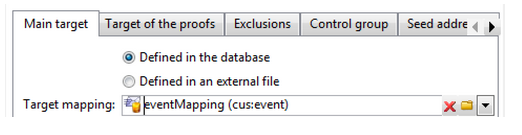
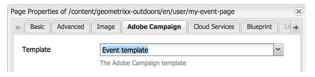

# 创建自定义表单映射{#creating-custom-form-mappings}

在Adobe Campaign中创建自定义表时，您可能希望在AEM中构建一个映射到该自定义表的表单。

本文档介绍如何创建自定义表单映射。 完成此文档中的步骤后，您将为用户提供一个事件页面，在该页面中，用户可以注册即将到来的事件。 然后，您通过Adobe Campaign跟进这些用户。

## 前提条件 {#prerequisites}

您需要安装以下组件：

* Adobe Experience Manager
* Adobe Campaign Classic

See [Integrating AEM with Adobe Campaign Classic](/help/sites-administering/campaignonpremise.md) for more information.

## 创建自定义表单映射 {#creating-custom-form-mappings-2}

要创建自定义表单映射，您需要遵循以下高级步骤，以下各节将详细介绍这些步骤：

1. 创建自定义表。
1. 扩展 **种子** 表。
1. 创建自定义映射。
1. 根据自定义映射创建投放。
1. 在AEM中构建表单，它将使用创建的投放。
1. 提交表单以对其进行测试。

### 在Adobe Campaign中创建自定义表 {#creating-the-custom-table-in-adobe-campaign}

开始，方法是在Adobe Campaign中创建自定义表。 在此示例中，我们使用以下定义创建事件表：

```xml
<element autopk="true" label="Event" labelSingular="Event" name="event">
 <attribute label="Event Date" name="eventdate" type="date"/>
 <attribute label="Event Name" name="eventname" type="string"/>
 <attribute label="Email" name="email" type="string"/>
 <attribute label="Number of Seats" name="seats" type="long"/>
</element>
```

创建事件表后，运行“更 **新库结构”向** 导以创建表。

### 扩展种子表 {#extending-the-seed-table}

在Adobe Campaign中，点按／单 **击** “添加”以创建 **种子地址(nms)表的新扩展** 。


现在，使用事件表 **中** 的字段扩展 **种子表** :

```xml
<element label="Event" name="custom_cus_event">
 <attribute name="eventname" template="cus:event:event/@eventname"/>
 <attribute name="eventdate" template="cus:event:event/@eventdate"/>
 <attribute name="email" template="cus:event:event/@email"/>
 <attribute name="seats" template="cus:event:event/@seats"/>
 </element>
```

之后，运行“ **更新数据库** ”向导以应用更改。

### 创建自定义目标映射 {#creating-custom-target-mapping}

在 **管理/活动**&#x200B;管理中，转 **到目标映射** 并添加新&#x200B;**目标映射。**

>[!NOTE]
>
>确保对内部名称使用有意 **义的名称**。


### 创建自定义投放模板 {#creating-a-custom-delivery-template}

在此步骤中，您将添加一个使用创建的投放模板 **的目标映射**。

在“ **资源／模板**”中，导航到投放模板并重复现有AEM投放。 单击“至 **”**，选择创建事件 **目标映射**。



### 在AEM中构建表单 {#building-the-form-in-aem}

在AEM中，确保已在页面属性中配置 **Cloud Service**。

然后，在“ **Adobe Campaign** ”选项卡中，选择在“创建自 [定义投放模板”中创建的投放](#creating-a-custom-delivery-template)。



配置字段时，请确保为表单字段指定唯一的元素名称。

配置字段后，您需要手动更改映射。

在CRXDE-lite中，转 **到jcr:content** (of the page)节点，将 **acMapping值更改为** 目标映射的内部名称 ****。


在表单的配置中，确保选中复选框以创建非现有表单


### 提交表单 {#submitting-the-form}

您现在可以提交表单并在Adobe Campaign端验证是否保存了这些值。


## 疑难解答 {#troubleshooting}

**&quot;元素&#39;@eventdate&#39;中值&#39;02/02/2015&#39;的类型无效(类型为&#39;文档(adb:[事件])&#39;的事件)&quot;**

提交表单时，此错误将记录在AEM **的error.log** 中。

这是由于日期字段的格式无效。 解决方法是 **提供yyyy-mm-dd** 作为值。

