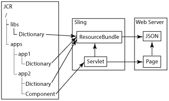

# 组件国际化{#internationalizing-components}

>[!CAUTION]
>
>AEM 6.4已结束扩展支持，本文档将不再更新。 有关更多详细信息，请参阅 [技术支助期](https://helpx.adobe.com/cn/support/programs/eol-matrix.html). 查找支持的版本 [此处](https://experienceleague.adobe.com/docs/).

将组件和对话框国际化，以便其UI字符串可以以不同语言显示。 为国际化而设计的组件允许将UI字符串外部化、翻译，然后导入到存储库。 运行时，用户的语言首选项或页面区域设置会确定UI中显示的语言。

使用以下流程将组件国际化，并以不同语言提供UI:

1. [使用可国际化字符串的代码实施组件。](/help/sites-developing/i18n-dev.md) 您的代码会标识要翻译的字符串，并选择要在运行时显示的语言。
1. [创建字典](/help/sites-developing/i18n-translator.md#creating-a-dictionary) 和 [添加](/help/sites-developing/i18n-translator.md#adding-changing-and-removing-strings) 要翻译的英文字符串。

1. [导出](/help/sites-developing/i18n-translator.md#exporting-a-dictionary) 将字典转换为XLIFF格式，然后翻译字符串 [导入](/help/sites-developing/i18n-translator.md#importing-a-dictionary) XLIFF文件会返回到AEM。 或者，您也可以 [手动添加翻译](/help/sites-developing/i18n-translator.md#editing-translated-strings) 到字典。

1. [将字典整合到应用程序的版本管理流程中](/help/sites-developing/i18n-translator.md#publishing-dictionaries).

>[!NOTE]
>
>此处介绍的组件国际化方法用于翻译静态字符串。 当组件字符串需要更改时，您应使用常规的翻译工作流。 例如，当作者可以使用组件“编辑”对话框中的属性来编辑UI字符串时，不应使用语言字典来国际化该字符串。

## 语言词典 {#language-dictionaries}

AEM国际化框架使用存储库中的字典来存储其他语言的英文字符串及其译文。 框架使用英语作为默认语言。 字符串使用其英文版本进行标识。 通常，国际化框架使用字母数字ID来表示UI字符串。 使用字符串的英文版本作为ID具有以下几个优势：

* 代码易于阅读。
* 默认语言始终可用。

本地化字符串可以存储在存储库的多个字典中。 AEM系统字典位于 `/libs` 节点。 您可以在 `/apps` 节点。 AEM国际化框架将字典整合在一起，并在Sling中作为单个字典提供 `ResourceBundle` 对象。 呈现组件后，它们会从资源包中检索已翻译的字符串。 组合词典还以JSON格式部署在Web服务器上，以向网页中的Javascript代码提供翻译字符串。

此外， [翻译工具](/help/sites-developing/i18n-translator.md) 允许您从一个中心位置管理所有字典。

>[!NOTE]
>
>请勿修改位于 `/libs` 节点。

### 在系统词典中叠加字符串 {#overlaying-strings-in-system-dictionaries}

字典下的字符串 `/apps` 节点会覆盖字典中位于以下位置的重复字符串 `/libs` 节点。 如果您的组件使用AEM系统词典中包含的字符串，请在您自己的词典中复制该字符串。 所有组件都将使用词典中的字符串。

请注意，当字符串在字典中重复出现时，您无法预测使用哪个翻译 `/apps` 节点。
