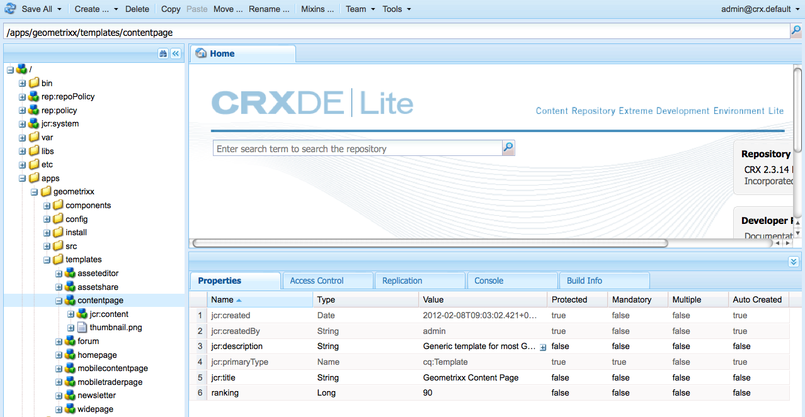
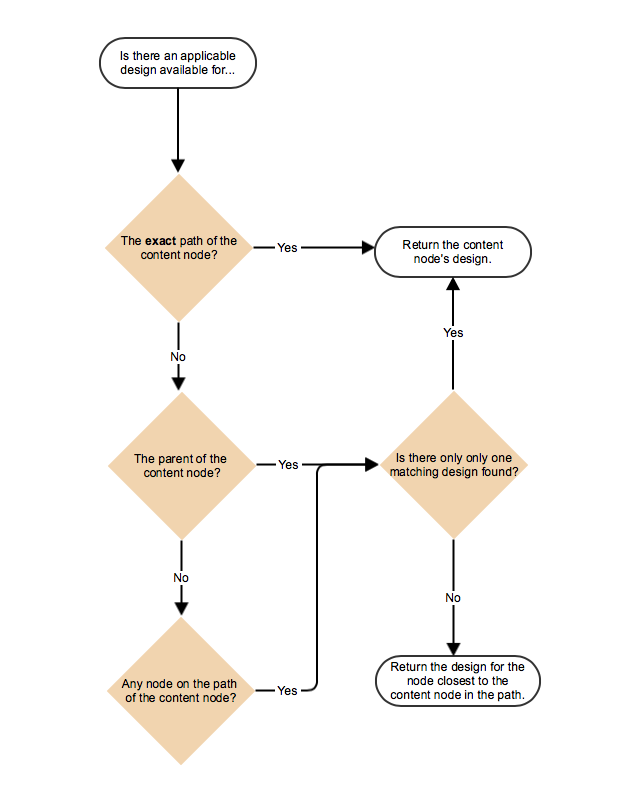
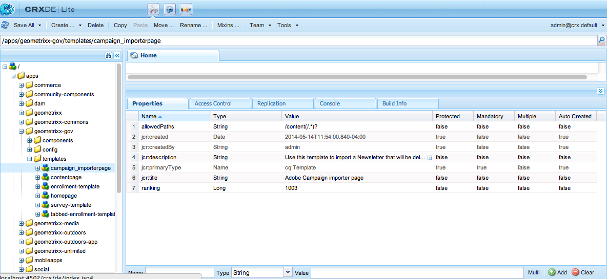
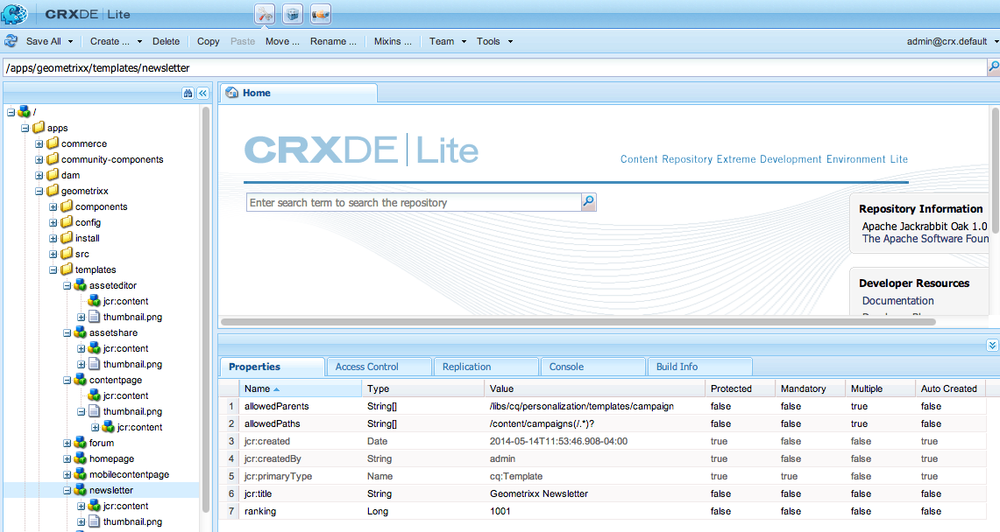

# 页面模板——静态{#page-templates-static}

模板用于创建页面并定义可在所选范围内使用的组件。 模板是节点的层次结构，其结构与要创建的页面相同，但没有任何实际内容。

每个模板都会为您提供一系列可用组件。

* 模板由组件构 [建](/help/sites-developing/components.md);
* 组件使用和允许访问构件，这些构件用于呈现内容。

>[!NOTE]
>
>[还提供可编辑](/help/sites-developing/page-templates-editable.md) 模板，这些模板是推荐的模板类型，可实现最大的灵活性和最新功能。

## 模板的属性和子节点 {#properties-and-child-nodes-of-a-template}

模板是cq:Template类型的节点，具有以下属性和子节点：

<table> 
 <tbody> 
  <tr> 
   <td><strong>名称   </strong></td> 
   <td><strong>类型   </strong></td> 
   <td><strong>描述   </strong></td> 
  </tr> 
  <tr> 
   <td>.   </td> 
   <td> cq:Template</td> 
   <td>当前模板。 模板的节点类型为cq:Template。  </td> 
  </tr> 
  <tr> 
   <td> allowedChildren </td> 
   <td> String[]</td> 
   <td>Path of a template that is allowed to be a child of this template.  </td> 
  </tr> 
  <tr> 
   <td> allowedParents</td> 
   <td> String[]</td> 
   <td>Path of a template that is allowed to be a parent of this template.  </td> 
  </tr> 
  <tr> 
   <td> allowedPaths</td> 
   <td> String[]</td> 
   <td>允许基于此模板的页面的路径。  </td> 
  </tr> 
  <tr> 
   <td> jcr:created</td> 
   <td> 日期</td> 
   <td>模板的创建日期。  </td> 
  </tr> 
  <tr> 
   <td> jcr:description</td> 
   <td> 字符串</td> 
   <td>模板的说明。  </td> 
  </tr> 
  <tr> 
   <td> jcr:title</td> 
   <td> 字符串</td> 
   <td>Title of the template.  </td> 
  </tr> 
  <tr> 
   <td> 排名</td> 
   <td> 长整型</td> 
   <td>模板的排名。 用于在用户界面中显示模板。  </td> 
  </tr> 
  <tr> 
   <td> jcr:content</td> 
   <td> cq:PageContent</td> 
   <td>包含模板内容的节点。  </td> 
  </tr> 
  <tr> 
   <td> thumbnail.png</td> 
   <td> nt：文件</td> 
   <td>模板的缩略图。  </td> 
  </tr> 
  <tr> 
   <td> icon.png</td> 
   <td> nt：文件</td> 
   <td>模板的图标。  </td> 
  </tr> 
 </tbody> 
</table>

模板是页面的基础。

要创建页面，必须将模板（节点——树）复 `/apps/<myapp>/template/<mytemplate>`制到站点——树中的相应位置： 这是使用网站选项卡创建页面时发 **生的** 情况。

此复制操作还为页面提供其初始内容（通常仅限顶级内容）和属性sling:resourceType，用于呈现页面的页面组件的路径（子节点jcr:content中的所有内容）。

## 模板的结构 {#how-templates-are-structured}

需要考虑两个方面：

* 模板本身的结构
* 使用模板时生成的内容的结构

### 模板的结构 {#the-structure-of-a-template}

在cq:Template类型的节点下 **创建模板**。

可以设置各种属性，特别是：

* **jcr:title** —— 模板的标题； 创建页面时显示在对话框中。
* **jcr:description** —— 模板的描述； 创建页面时显示在对话框中。

此节点包含一个jcr:content(cq:PageContent)节点，该节点用作生成页面的内容节点的基础； 此引用使用sling:resourceType，即用于呈现新页面实际内容的组件。

此组件用于定义创建新页面时内容的结构和设计。

### 模板生成的内容 {#the-content-produced-by-a-template}

模板用于创建类型为页 `cq:Page` 面（如前所述，页面是一种特殊类型的组件）。 每个AEM页面都有一个结构化节 `jcr:content`点。 此功能：

* 属于cq:PageContent类型
* 是包含已定义内容定义的结构化节点类型
* 具有一个属 `sling:resourceType` 性来引用包含sling脚本的组件，这些脚本用于呈现内容

### 默认模板 {#default-templates}

AEM附带许多现成可用的默认模板。 在某些情况下，您可能希望按原样使用模板。 在这种情况下，您需要确保该模板可用于您的网站。

例如，AEM附带多个模板，包括内容页面和主页。

| **标题** | **组件** | **位置** | **用途** |
|---|---|---|---|
| 主页 | homepage | geometrixx | Geometrixx 主页模板。 |
| 内容页 | contentpage | geometrixx | Geometrixx 内容页模板。 |

#### 显示默认模板 {#displaying-default-templates}

要查看存储库中所有模板的列表，请按如下步骤继续：

1. 在 CRXDE Lite 中，打开&#x200B;**工具**&#x200B;菜单，然后单击&#x200B;**查询**。

1. 在“查询”选项卡中
1. 选择 **XPath** 作为&#x200B;**类型**。
1. 在&#x200B;**查询**&#x200B;输入字段中，输入以下字符串：

   //element(&amp;ast;, cq:Template)

1. 单击&#x200B;**执行**。将在结果框中显示列表。

在大多数情况下，您需要使用现有模板并开发一个新模板供自己使用。 有关详 [细信息，请参阅](#developing-page-templates) “开发页面模板”。

要为网站启用现有模板，并且希望在从“网站 **”控制台的“网站”下创建页面时，该模板** 显示在 ******** “创建页面”对话框中，请将模板节点的allowedPaths属性设置为： **/content(/.&amp;ast;?**

## 如何应用模板设计 {#how-template-designs-are-applied}

当使用设计模式在UI中定 [义样式](/help/sites-authoring/default-components-designmode.md)，设计将保留在要为其定义样式的内容节点的正确路径上。

>[!CAUTION]
>
>Adobe建议仅通过设计模式 [应用设计](/help/sites-authoring/default-components-designmode.md)。
>
>例如，在 CRX DE 中修改设计不是最佳实践，并且此类设计的应用程序可能与预期不同。

如果设计仅使用“设计模式”应用，则以下部分 [、“设计路径](/help/sites-developing/page-templates-static.md#design-path-resolution)” [、“决策树](/help/sites-developing/page-templates-static.md#decision-tree)”和“ [示例](/help/sites-developing/page-templates-static.md#example) ”不适用。

>[!NOTE]
>
>本节介绍AEM 6.4.2.0的设计路径分辨率行为。

### 设计路径分辨率 {#design-path-resolution}

当基于静态模板呈现内容时，AEM将尝试基于内容层次结构的遍历将最相关的设计和样式应用于内容。

AEM按以下顺序确定内容节点的最相关样式：

* 如果内容节点具有完整且精确的路径设计（如在设计模式中定义设计时），则使用该设计。
* 如果父项的内容节点有设计，则使用该设计。
* 如果内容节点路径上的任何节点都有设计，则使用该设计。

在最后两种情况下，如果有多个适用的设计，请使用最接近内容节点的设计。

### 决策树 {#decision-tree}

这是设计路径解析逻辑 [的图形表示](/help/sites-developing/page-templates-static.md#design-path-resolution) 。

### 示例 {#example}

请考虑如下简单的内容结构，其中设计可应用于任何节点：

`/root/branch/leaf`

下表说明AEM将如何选择设计。

<table> 
 <tbody> 
  <tr> 
   <td><strong>查找针对  </strong></td> 
   <td><strong>设计适用于  </strong></td> 
   <td><strong>选择设计  </strong></td> 
   <td><strong>注释</strong></td> 
  </tr> 
  <tr> 
   <td><code class="code">leaf
      </code></td> 
   <td>
<code>root</code>
 
<code>branch</code>
 
<code>leaf</code>
 </td> 
   <td><code>leaf</code></td> 
   <td>最精确的匹配总是被采用。  </td> 
  </tr> 
  <tr> 
   <td><code>leaf</code></td> 
   <td>
<code>root</code>
 
<code>branch</code>
 </td> 
   <td><code>branch</code></td> 
   <td>倒回树下最接近的匹配。</td> 
  </tr> 
  <tr> 
   <td><code>leaf</code></td> 
   <td><code>root</code></td> 
   <td><code>root</code></td> 
   <td>如果所有的方法都失败了，就拿剩下的。  </td> 
  </tr> 
  <tr> 
   <td><code>branch</code></td> 
   <td><code>branch</code></td> 
   <td><code>branch</code></td> 
   <td> </td> 
  </tr> 
  <tr> 
   <td><code>branch</code></td> 
   <td>
<code>branch</code>
 
<code class="code">leaf
       </code>
 </td> 
   <td><code>branch</code></td> 
   <td> </td> 
  </tr> 
  <tr> 
   <td><code>branch</code></td> 
   <td>
<code>root</code>
 
<code class="code">branch
       </code>
 </td> 
   <td><code>branch</code></td> 
   <td> </td> 
  </tr> 
  <tr> 
   <td><code>branch</code></td> 
   <td>
<code>root</code>
 
<code class="code">leaf
       </code>
 </td> 
   <td><code>root</code></td> 
   <td>
如果没有完全匹配，请取树中的下一个。
 
假定这始终适用，但在树的上方可能过于具体。  
 </td> 
  </tr> 
 </tbody> 
</table>

## 开发页面模板 {#developing-page-templates}

AEM页面模板只是用于创建新页面的模型。 它们可以根据需要包含尽可能少或尽可能多的初始内容，其角色是创建正确的初始节点结构，并将所需的属性（主要是sling:resourceType）设置为允许编辑和渲染。

### 创建新模板（基于现有模板） {#creating-a-new-template-based-on-an-existing-template}

不用说可以完全从头开始创建新模板，但通常会复制并更新现有模板以节省时间和精力。 例如，可以使用Geometrixx中的模板开始操作。

要基于现有模板创建新模板，请执行以下操作：

1. 将现有模板（最好将定义尽可能接近您想要达到的目标）复制到新节点。

   模板通常存 **储在/apps/&lt;website-name>/templates/&lt;template-name>中**。

   >[!NOTE]
   >
   >可用模板的列表取决于新页面的位置以及在每个模板中指定的放置限制。 请参阅 [模板可用性](/help/sites-developing/templates.md#template-availability)。

1. 更改 **新模板节点的** jcr:title以反映其新角色。 您还可以根据需要 **更新jcr:** description。 请确保根据需要更改页面的模板可用性。

   >[!NOTE]
   >
   >如果您希望在从网站控制台的网 **站下创建页面时** ，在创建页面时在“创建页面” **对话框中** 显示模板 **，请将模板**`allowedPaths` 节点的属性设置为： `/content(/.*)?`

   

1. 复制模板所基于的组件(由模板中 **jcr:content** 节点的 **sling:resourceType属性指示** )以创建新实例。

   组件通常存 **储在/apps/&lt;website-name>/components/&lt;component-name>中**。

1. 更新 **新组件的****jcr:title和** jcr:description。
1. 如果希望在模板选择列表（大小为128 x 98 px）中显示新的缩览图图片，请替换thumbnail.png。
1. 更新 **模板的jcr** :content节点 **的sling:resourceType** ，以引用新组件。
1. 对模板和／或其基础组件的功能或设计进行进一步更改。

   >[!NOTE]
   >
   >对/apps/&lt; **website>/templates/&lt;template-name>节点所做的更改将影响模板实例** (如在选择列表中)。
   对/apps/&lt; **website>/components/&lt;component-name>节点所做的更改** ，将影响在使用模板时创建的内容页面。

   您现在可以使用新模板在网站中创建页面。

>[!NOTE]
编辑器客户端库假定内容页 `cq.shared` 面中存在命名空间，如果不存在，则将 `Uncaught TypeError: Cannot read property 'shared' of undefined` 导致JavaScript错误。
所有示例内容页面都 `cq.shared`包含，因此基于这些页面的任何内容都会自动 `cq.shared`包含。 但是，如果您决定从头开始创建自己的内容页面，而不是基于示例内容，则必须确保包含 `cq.shared` 命名空间。
有关 [更多信息，请参阅](/help/sites-developing/clientlibs.md) “使用客户端库”。

## 使现有模板可用 {#making-an-existing-template-available}

此示例说明如何允许将模板用于某些内容路径。 创建新页面时页面作者可用的模板由模板可用性中定义的逻辑 [决定](/help/sites-developing/templates.md#template-availability)。

1. 在CRXDE Lite中，导航到要用于页面的模板，例如新闻稿模板。
1. 更改用 `allowedPaths` 于模板可用性的属性 [和其他属性](/help/sites-developing/templates.md#template-availability)。 例如 `allowedPaths`: `/content/geometrixx-outdoors/[^/]+(/.*)?` 表示此模板在下的任意路径中都允许 `/content/geometrixx-outdoors`。

   

