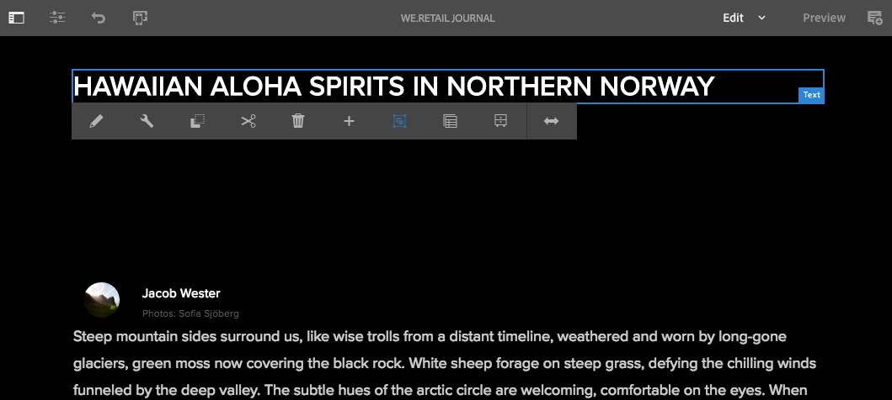
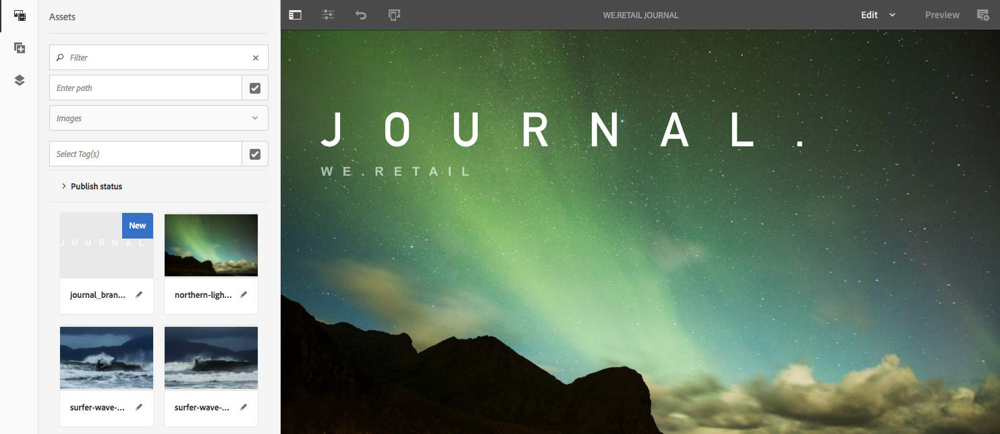

# SPA 简介和演练{#spa-introduction-and-walkthrough}

>[!CAUTION]
>
>AEM 6.4已结束扩展支持，本文档将不再更新。 有关更多详细信息，请参阅 [技术支助期](https://helpx.adobe.com/cn/support/programs/eol-matrix.html). 查找支持的版本 [此处](https://experienceleague.adobe.com/docs/).

单页应用程序 (SPA) 可以为网站用户提供引人入胜的良好体验。开发人员希望能够使用 SPA 框架构建站点，而作者则希望能够在 AEM 中顺畅地为使用此类框架构建的站点编辑内容。

SPA 编辑器提供了一个全面的解决方案来支持 AEM 中的 SPA。本文演练了如何使用基本 SPA 应用程序进行创作，并展示了它与底层 AEM SPA Editor 的关系。

>[!NOTE]
>
>单页应用程序(SPA)编辑器功能需要AEM 6.4 Service Pack 2或更高版本。
>
>对于需要基于SPA框架的客户端渲染(例如，React或Angular)的项目，推荐使用SPA编辑器解决方案。

## 简介 {#introduction}

### 文章目标 {#article-objective}

本文先介绍了 SPA 的基本概念，然后使用简单 SPA 应用程序来演示基本内容编辑，从而引导完成浏览 SPA 编辑器演练。随后，深入探究了页面构造以及 SPA 应用程序如何与 AEM SPA Editor 相关并与之交互。

此简介和演练的目的是，向 AEM 开发人员说明 SPA 为何相关及其通常如何工作、AEM SPA Editor 如何处理 SPA，以及它与标准 AEM 应用程序的差异。

演练基于标准AEM功能和示例We.Retail Journal应用程序。 必须满足以下要求：

* [带有Service Pack 2或更高版本的AEM版本6.4](/help/release-notes/sp-release-notes.md)
* [请在此处安装GitHub上提供的示例We.Retail Journal应用程序。](https://github.com/Adobe-Marketing-Cloud/aem-sample-we-retail-journal)

>[!CAUTION]
>
>本文档使用 [We.Retail Journal应用程序](https://github.com/Adobe-Marketing-Cloud/aem-sample-we-retail-journal) 仅用于演示目的。 不应将它用于任何项目工作。
>
>任何 AEM 项目都应使用 [AEM 项目原型](https://experienceleague.adobe.com/docs/experience-manager-core-components/using/developing/archetype/overview.html)，它支持使用 React 或 Angular 的 SPA 项目并利用 SPA SDK。

### 什么是 SPA？ {#what-is-a-spa}

单页应用程序 (SPA) 与传统页面的不同之处在于，它在客户端呈现且主要由 Javascript 驱动，并且依靠 Ajax 调用来加载数据和动态更新页面。大多数内容或所有内容在单个页面加载中检索一次，并基于用户与页面的交互按需异步加载其他资源。

这减少了页面刷新需求，并为用户提供了一种无缝、快速且更类似于本机应用程序体验的体验。

利用 AEM SPA Editor，前端开发人员可以创建可集成到 AEM 站点中的 SPA，从而允许内容作者像编辑任何其他 AEM 内容那样轻松地编辑 SPA 内容。

### 为什么使用 SPA？ {#why-a-spa}

SPA 的工作方式的特性使其更快、更流畅且更类似于本机应用程序，从而为网页访客以及营销人员和开发人员提供一种极具吸引力的体验。


**访客**

* 访客希望在与内容交互时获得与本地体验类似的体验。
* 有数据明确表明，页面越快，转化几率就越高。

**营销人员**

* 营销人员希望提供丰富的、与本地体验类似的体验，以促使访客充分参与互动并与内容产生共鸣。
* 个性化可以使这些体验变得更具吸引力。

**开发人员**

* 开发人员希望完全分离内容和表示形式之间的关注点。
* 完全分离可提高系统的可扩展性，并允许独立的前端开发。

### SPA 的工作原理是什么？ {#how-does-a-spa-work}

SPA的主要思想是减少对服务器的调用和依赖，以最大限度地减少由服务器调用引起的延迟，以便SPA接近本机应用程序的响应。

在传统的连续网页中，仅加载即时页面所需的数据。这意味着，当访客移至另一个页面时，将调用服务器以获取其他资源。当访客与页面上的元素交互时，可能需要进行其他调用。 由于页面必须与访客的请求同步，因此多次调用可能会给人一种滞后或延迟的感觉。


要获得更流畅的体验，即接近访客从移动设备本机应用程序中所期望的体验，SPA会在首次加载时为访客加载所有必需数据。 虽然最初可能需要花费更长的时间，但随后便不再需要额外的服务器调用。

通过在客户端进行渲染，页面元素可以更快地做出反应，并且访客与页面的交互会立即进行。 可能需要的任何其他数据都将进行异步调用，以最大化页面速度。

>[!NOTE]
>
>有关SPA如何在AEM中工作的技术详细信息，请参阅文章 [AEM SPA快速入门](/help/sites-developing/spa-getting-started-react.md).
>
>有关SPA编辑器的设计、架构和技术工作流程的详细信息，请参阅文章 [SPA编辑器概述](/help/sites-developing/spa-overview.md).

## SPA 的内容编辑体验 {#content-editing-experience-with-spa}

构建SPA以利用AEM SPA编辑器时，内容作者注意到在编辑和创建内容时没有区别。 提供了常用 AEM 功能，而无需更改作者的工作流。

>[!NOTE]
>
>演练基于标准AEM功能和示例We.Retail Journal应用程序。 必须满足以下要求：
>
>* [AEM版本6.4（带有Service Pack 2）](/help/release-notes/sp-release-notes.md)
>* [请在此处安装GitHub上提供的示例We.Retail Journal应用程序。](https://github.com/Adobe-Marketing-Cloud/aem-sample-we-retail-journal)
>


1. 在AEM中编辑We.Retail Journal应用程序。

   `http://localhost:4502/editor.html/content/we-retail-journal/react.html`

   

1. 选择标题组件后，请注意工具栏会像任何其他组件一样显示。 选择&#x200B;**[!UICONTROL 编辑]**。

   

1. 在 AEM 中正常编辑内容，会发现更改已保存。

   

   >[!NOTE]
   >请参阅 [SPA编辑器概述](spa-overview.md#requirements-limitations) 有关就地文本编辑器和SPA的更多信息。

1. 使用资产浏览器将新图像拖放到图像组件中。

   

1. 将保留更改。

   

与在任何非 SPA 应用程序一样，支持其他创作工具，例如在页面上拖放其他组件、重新排列组件和修改版面。

>[!NOTE]
>
>SPA 编辑器不修改应用程序的 DOM。SPA 本身负责 DOM。
>
>要了解其工作原理，请继续阅读本文的下一部分 [SPA 应用程序和 AEM SPA Editor](/help/sites-developing/spa-walkthrough.md#spa-apps-and-the-aem-spa-editor)。

## SPA 应用程序和 AEM SPA Editor {#spa-apps-and-the-aem-spa-editor}

了解SPA对最终用户的行为方式，然后检查SPA页面有助于更好地了解SAP应用程序如何与AEM中的SPA Editor配合使用。

### 使用 SPA 应用程序 {#using-an-spa-application}

1. 在发布服务器上或使用选项加载We.Retail Journal应用程序 **[!UICONTROL 查看已发布的项目]** 从 **页面信息** 菜单。

   `/content/we-retail-journal/react.html`

   

   请注意页面结构，包括导航到子页面、天气小组件和文章。

1. 使用菜单导航到子页面，可以看到页面将立即加载，而无需刷新。

   

1. 打开浏览器的内置开发人员工具，并在您浏览子页面时监控网络活动。

   

   在应用程序中从一个页面移至另一个页面时，几乎不产生流量。不会重新加载页面，而只请求新图像。

   SPA 完全在客户端管理内容和路由。

那么，如果在子页面中导航时没有重新加载页面，如何加载页面呢？

下一节， [加载SPA应用程序](/help/sites-developing/spa-walkthrough.md#loading-an-spa-application)，深入了解加载SPA的机制以及如何同步和异步加载内容。

### 加载 SPA 应用程序 {#loading-an-spa-application}

1. 如果尚未加载，请在发布服务器上或使用选项加载We.Retail Journal应用程序 **[!UICONTROL 查看已发布的项目]** 从 **页面信息** 菜单。

   `/content/we-retail-journal/react.html`

   

1. 使用浏览器的内置工具可查看页面的源。
1. 请注意，源的内容非常有限。

   ```
   <!DOCTYPE HTML>
   <html lang="en-CH">
       <head>
       <meta charset="UTF-8">
       <title>We.Retail Journal</title>
   
       <meta name="template" content="we-retail-react-template"/>
   
   <link rel="stylesheet" href="/etc.clientlibs/we-retail-journal/react/clientlibs/we-retail-journal-react.css" type="text/css">
   
   <link rel="stylesheet" href="/libs/wcm/foundation/components/page/responsive.css" type="text/css">
   
   </head>
       <body class="page basicpage">
   
   <div id="page"></div>
   
   <script type="text/javascript" src="/etc.clientlibs/we-retail-journal/react/clientlibs/we-retail-journal-react.js"></script>
   
       </body>
   </html>
   ```

   页面的正文中没有任何内容。它主要由样式表和对React脚本的调用组成， `we-retail-journal-react.js`.

   此React脚本是此应用程序的主要驱动程序，负责渲染所有内容。

1. 可以使用浏览器的内置工具检查页面。查看完全加载的 DOM 的内容。

   

1. 切换到检查器中的“网络”选项卡并重新加载页面。

   忽略图像请求，请注意，为页面加载的主要资源包括页面本身、CSS、React Javascript、其依赖项以及页面的 JSON 数据。

   

1. 在新选项卡中加载 `react.model.json`。

   `/content/we-retail-journal/react.model.json`

   

   AEM SPA Editor 利用 [AEM 内容服务](/help/assets/content-fragments.md)将页面的全部内容作为 JSON 模型交付。

   通过实施特定接口，Sling 模型为 SPA 提供了必要信息。将 JSON 数据的交付工作向下委派给每个组件（从页面到段落再到组件等）。

   每个组件都会选择它公开的内容和呈现方式（使用HTL的服务器端或使用React的客户端）。 当然，本文重点介绍使用React进行客户端渲染。

1. 该模型还可以对页面进行分组以便同步加载它们，从而减少所需的页面重新加载次数。

   在We.Retail Journal的示例中， `home`, `blog`和 `aboutus` 页面会同步加载，因为访客通常会访问所有这些页面。 但是 `weather` 页面是异步加载的，因为访客不太可能访问该页面。

   此行为不是强制性的，而是完全可定义的。

   

1. 要查看此行为差异，请重新加载  页面并清除检查器的网络活动。在页面菜单中导航到博客和关于我们的页面，并查看没有报告网络活动。

   导航到天气页面，并查看 `weather.model.json` 异步调用。

   

### 与 SPA 编辑器进行交互 {#interaction-with-the-spa-editor}

使用示例We.Retail Journal应用程序，可以清楚地知道应用程序的行为和在发布时加载的方式，从而可利用内容服务来交付JSON内容以及异步加载资源。

此外，对于内容作者而言，在 AEM 中使用 SPA 编辑器创建内容是无缝操作。

在下一部分中，我们将探究允许 SPA 编辑器将 SPA 中的组件与 AEM 组件相关联并实现此无缝编辑体验的合同。

1. 在编辑器中加载We.Retail Journal应用程序，并切换到 **预览** 模式。

   `http://localhost:4502/editor.html/content/we-retail-journal/react.html`

1. 使用浏览器的内置开发人员工具检查页面内容。使用选择工具，在页面上选择一个可编辑的组件并查看元素详细信息。

   请注意，该组件具有一个新的数据属性 `data-cq-data-path`。

   

   例如

   `data-cq-data-path="root/responsivegrid/paragraph_1`

   此路径允许检索和关联每个组件的编辑上下文配置对象。

   这是编辑器将组件识别为 SPA 中的可编辑组件所需的唯一标记属性。根据此属性，SPA 编辑器将确定哪项可编辑的配置与组件关联，以便加载正确的框架、工具栏等。

   还为标记占位符和资产拖放功能添加了一些特定的类名。

   >[!NOTE]
   >
   >这是对AEM中服务器端呈现页面的行为发生更改，其中 `cq` 元素。
   >
   >在SPA中，这种方法无需插入自定义元素，而只需依赖附加的数据属性，从而使前端开发人员可以更轻松地进行标记。

## 后续步骤 {#next-steps}

现在，您已了解 AEM 中的 SPA 编辑体验以及 SPA 与 SPA 编辑器的关系，请更深入地了解 SPA 的构建方式。

* [AEM SPA快速入门](/help/sites-developing/spa-getting-started-react.md) 显示如何构建基本SPA以与AEM中的SPA编辑器一起使用
* [SPA 编辑器概述](/help/sites-developing/spa-overview.md)更深入地介绍了 AEM 和 SPA 之间的通信模型。
* [为 AEM 开发 SPA](/help/sites-developing/spa-architecture.md) 介绍了如何让前端开发人员为 AEM 开发 SPA，以及 SPA 如何与 AEM 的架构进行交互。
