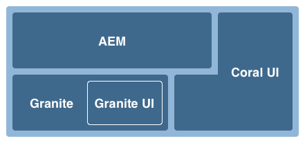

# AEM触屏UI的概念{#concepts-of-the-aem-touch-enabled-ui}

>[!CAUTION]
>
>AEM 6.4已结束扩展支持，本文档将不再更新。 有关更多详细信息，请参阅 [技术支助期](https://helpx.adobe.com/cn/support/programs/eol-matrix.html). 查找支持的版本 [此处](https://experienceleague.adobe.com/docs/).

在AEM 5.6Adobe中，引入了新的触屏UI，该UI [响应式设计](/help/sites-authoring/responsive-layout.md) （在创作环境中）。 这与原始的经典UI有很大不同，因为它设计为在触屏和桌面设备上运行。

此触屏优化UI现在是AEM的标准UI，取代了经典UI。

>[!NOTE]
>
>触屏优化UI是AEM的标准UI，但仍支持经典UI。

触屏UI包括：

* 包标题：

   * 显示徽标
   * 提供指向全局导航的链接
   * 提供指向其他通用操作的链接；例如搜索、帮助、Marketing Cloud解决方案、通知和用户设置。

* 左边栏（在需要时显示且可隐藏），可显示：

   * 时间线
   * 引用
   * 过滤器

* 导航标题，它同样是上下文相关的，可以显示：

   * 指示您当前使用的控制台和/或该控制台中的位置
   * 选择左边栏
   * 痕迹导航
   * 访问适当的 **创建** 操作
   * 查看选择

* 内容区域：

   * 列出内容项目（无论是页面、资产、论坛帖子等）
   * 可以根据请求进行格式设置，例如列、卡或列表
   * 使用响应式设计（显示器根据设备和/或窗口大小自动调整大小）
   * 使用无限滚动（不再分页，所有项目都在一个窗口中列出）


>[!NOTE]
>
>几乎所有AEM功能都移植到了触屏UI。 但是，在某些有限的情况下，功能会还原到经典UI。 请参阅 [触屏UI功能状态](/help/release-notes/touch-ui-features-status.md) 以了解更多信息。

触屏优化UI由Adobe设计，旨在提供多个产品中用户体验的一致性。 它基于：

* **Coral用户界面** (CUI)触屏UI实施Adobe的可视样式。 Coral UI提供您的产品/项目/ Web应用程序采用UI可视化样式所需的一切功能。
* **Granite用户界面** 组件是使用Coral UI构建的。

触屏UI的基本原理包括：

* 移动设备优先（考虑台式机）
* 响应式设计
* 与上下文相关的显示
* 可重用
* 包含嵌入的参考文档
* 包括嵌入测试
* 自下而上的设计，以确保这些原则适用于每个元素和组件

有关触屏优化UI结构的进一步概述，请参阅文章 [AEM触屏UI的结构](/help/sites-developing/touch-ui-structure.md).

## AEM技术堆栈 {#aem-technology-stack}

AEM使用Granite平台作为基础，而Granite平台包括Java内容存储库等。


## Granite {#granite}

Granite是Adobe的开放Web堆栈，提供各种组件，包括：

* 应用程序启动器
* OSGi框架，所有内容都可部署到其中
* 支助建筑应用的若干OSGi简编服务
* 提供各种日志记录API的全面日志记录框架
* JCR API规范的CRX存储库实施
* Apache Sling Web Framework
* 当前CRX产品的其他部分

>[!NOTE]
>
>Granite在Adobe中作为开放开发项目运行：对代码、讨论和问题的贡献来自整个公司。
>
>但是，Granite是 **not** 开源项目。 它在很大程度上基于多个开源项目（特别是Apache Sling、Felix、Jackrabbit和Lucene），但Adobe在公开项目与内部项目之间划出了明确的界限。

## Granite用户界面 {#granite-ui}

Granite工程平台还提供了基础UI框架。 其主要目标是：

* 提供精细的UI小组件
* 实施UI概念并说明最佳实践（长列表渲染、列表筛选、对象CRUD、CUD向导……）
* 提供基于插件的可扩展管理UI

这些功能符合以下要求：

* 尊重“移动优先”
* 可扩展
* 易于覆盖



Granite用户界面：

* 使用Sling的RESTful架构
* 实施旨在构建以内容为中心的Web应用程序的组件库
* 提供粒度UI小组件
* 提供默认的标准化UI
* 可扩展
* 专为移动设备和桌面设备而设计（首先考虑移动设备）
* 可用于任何基于Granite的平台/产品/项目；eg AEM


* [Granite UI基础组件](#granite-ui-foundation-components)

   此基础组件库可供其他库使用或扩展。

* [Granite UI管理组件](#granite-ui-administration-components)

### 客户端与服务器端 {#client-side-vs-server-side}

Granite UI中的客户端与服务器通信由超文本（而非对象）组成，因此客户端无需了解业务逻辑

* 服务器利用语义数据丰富了HTML
* 客户端通过超媒体（交互）丰富超文本


#### 客户端 {#client-side}

它使用HTML词汇的扩展，以便作者能够表达他们构建交互式Web应用程序的意图。 这是类似的 [韦阿里亚](https://www.w3.org/TR/wai-aria/) 和 [微格式](http://microformats.org/).

它主要由一组由JS和CSS代码解释的交互模式（例如，异步提交表单）组成，并在客户端运行。 客户端的作用是增强交互性标记（作为服务器提供的超媒体）。

客户端独立于任何服务器技术。 只要服务器给出适当的标记，客户端就可以履行其角色。

目前，JS和CSS代码以Granite形式交付 [clientlibs](/help/sites-developing/clientlibs.md) 在类别下：

`granite.ui.foundation and granite.ui.foundation.admin`

这些内容将作为内容包的一部分提供：

`granite.ui.content`

#### 服务器端 {#server-side}

这由Sling组件集合构成，使作者能够 *组合* 网络应用程序。 开发人员开发组件，作者将组件组合成一个Web应用程序。 服务器端的作用是为客户端提供超媒体可用性（标记）。

当前，这些组件位于Granite存储库的以下位置：

`/libs/granite/ui/components/foundation`

此内容将作为内容包的一部分提供：

`granite.ui.content`

### 与经典UI的差异 {#differences-with-the-classic-ui}

Granite UI与ExtJS（用于经典UI）之间的差异也是值得关注的：

<table> 
 <tbody> 
  <tr> 
   <td><strong>ExtJS</strong></td> 
   <td><strong>Granite用户界面</strong></td> 
  </tr> 
  <tr> 
   <td>远程过程调用<br /> </td> 
   <td>状态转换</td> 
  </tr> 
  <tr> 
   <td>数据传输对象</td> 
   <td>超媒体</td> 
  </tr> 
  <tr> 
   <td>客户端知道服务器内部信息</td> 
   <td>客户不知道内部信息</td> 
  </tr> 
  <tr> 
   <td>"胖客户"</td> 
   <td>"瘦客户机"</td> 
  </tr> 
  <tr> 
   <td>专用客户端库</td> 
   <td>通用客户端库</td> 
  </tr> 
 </tbody> 
</table>

### Granite UI基础组件 {#granite-ui-foundation-components}

的 [Granite UI基础组件](https://helpx.adobe.com/experience-manager/6-4/sites/developing/using/reference-materials/granite-ui/api/jcr_root/libs/granite/ui/index.html) 提供构建任何UI所需的基本构建基块。 其中包括：

* 按钮
* 超链接
* 用户头像

基础组件可在以下位置找到：

`/libs/granite/ui/components/foundation`

此库包含每个Coral元素的Granite UI组件。 组件是内容驱动的，其配置驻留在存储库中。 这样，就可以在无需手动编写HTML标记的情况下编写Granite UI应用程序。

用途:

* HTML元素的组件模型
* 组分组合物
* 自动单元和功能测试

实施:

* 基于存储库的组合和配置
* 利用Granite平台提供的测试设施
* JSP模板

此基础组件库可供其他库使用或扩展。

### ExtJS和相应的Granite UI组件 {#extjs-and-corresponding-granite-ui-components}

升级ExtJS代码以使用Granite UI时，以下列表为ExtJS xtypes和节点类型及其等效的Granite UI资源类型提供了方便的概述。

| **ExtJS xtype** | **Granite UI资源类型** |
|---|---|
| `button` | `granite/ui/components/foundation/form/button` |
| `checkbox` | `granite/ui/components/foundation/form/checkbox` |
| `componentstyles` | `cq/gui/components/authoring/dialog/componentstyles` |
| `cqinclude` | `granite/ui/components/foundation/include` |
| `datetime` | `granite/ui/components/foundation/form/datepicker` |
| `dialogfieldset` | `granite/ui/components/foundation/form/fieldset` |
| `hidden` | `granite/ui/components/foundation/form/hidden` |
| `html5smartfile, html5smartimage` | `granite/ui/components/foundation/form/fileupload` |
| `multifield` | `granite/ui/components/foundation/form/multifield` |
| `numberfield` | `granite/ui/components/foundation/form/numberfield` |
| `pathfield, paragraphreference` | `granite/ui/components/foundation/form/pathbrowser` |
| `selection` | `granite/ui/components/foundation/form/select` |
| `sizefield` | `cq/gui/components/authoring/dialog/sizefield` |
| `tags` | `granite/ui/components/foundation/form/autocomplete` `cq/gui/components/common/datasources/tags` |
| `textarea` | `granite/ui/components/foundation/form/textarea` |
| `textfield` | `granite/ui/components/foundation/form/textfield` |

| **节点类型** | **Granite UI资源类型** |
|---|---|
| `cq:WidgetCollection` | `granite/ui/components/foundation/container` |
| `cq:TabPanel` | `granite/ui/components/foundation/container` `granite/ui/components/foundation/layouts/tabs` |
| `cq:panel` | `granite/ui/components/foundation/container` |

### Granite UI管理组件 {#granite-ui-administration-components}

的 [Granite UI管理组件](https://helpx.adobe.com/experience-manager/6-4/sites/developing/using/reference-materials/granite-ui/api/jcr_root/libs/granite/ui/index.html) 在基础组件上构建，以提供任何管理应用程序都可以实施的通用构建块。 其中包括：

* 全局导航栏
* 边栏（骨架）
* 搜索面板

用途:

* 管理应用程序的统一外观
* Rad管理应用程序

实施:

* 使用基础组件的预定义组件
* 组件可以进行自定义

## Coral用户界面 {#coral-ui}

Coral UI(CUI)是触屏UIAdobe可视化样式的实施，旨在提供多个产品中用户体验的一致性。 Coral UI提供了采用创作环境中使用的可视化样式所需的一切功能。

>[!CAUTION]
>
>Coral UI是一个UI库，可供AEM客户在其产品许可使用范围内构建应用程序和Web界面。
>
>仅允许使用Coral UI:
>
>* 当它已发运并与AEM捆绑在一起时。
>* 在扩展创作环境的现有UI时使用。
>* Adobe公司宣传资料、广告和演示。
>* Adobe品牌应用程序的UI（字体必须不能供其他使用）。
>* 具有次要自定义。
>
>应避免在以下位置使用Coral UI:
>
>* 文档和其他与Adobe无关的项目。
>* 内容创建环境（其中，前面的项目可能由他人生成）。
>* 未明确连接到Adobe的应用程序/组件/网页。
>


Coral UI是用于开发Web应用程序的构建基块的集合。


每个模块从一开始就设计为模块化，根据其主要作用形成一个不同的层。 尽管这些层设计为相互支持，但如果需要，也可以单独使用。 这样，就可以在任何支持HTML的环境中实施Coral的用户体验。

使用Coral UI时，不必强制使用特定的开发模型和/或平台。 Coral的主要目标是提供统一且干净的HTML5标记，与发出此标记的实际方法无关。 这可能用于客户端或服务器端渲染、模板、JSP、PHP，甚至AdobeFlashRIA应用程序 — 只是几个。

### HTML元素 — 标记层 {#html-elements-the-markup-layer}

HTML元素为所有基本UI元素（包括导航栏、按钮、菜单、边栏等）提供了通用的外观。

在最基本的级别上，HTML元素是具有专用类名称的HTML标记。 更复杂的元素可以由多个标记组成，这些标记彼此嵌套在一起（以特定方式）。

CSS用于提供实际外观。 为了能够轻松自定义外观（例如，对于品牌策略），实际样式值会声明为由 [LESS](https://lesscss.org/) 运行时预处理器。

用途:

* 为基本UI元素提供通用的外观
* 提供默认网格系统

实施:

* HTML标记，其样式灵感来自 [引导](https://twitter.github.com/bootstrap/)
* 类在LESS文件中定义
* 图标被定义为字体图标

例如，标记：

```xml
<button class="btn btn-large btn-primary" type="button">Large button</button> 
<button class="btn btn-large" type="button">Large button</button>
```

显示为：


外观在LESS中定义，通过专用类名称绑定到元素（为简便起见，缩短了以下提取）：

```xml
.btn {
    font-size: @baseFontSize; 
    line-height: @baseLineHeight; 
    .buttonBackground(@btnBackground,
                                @btnBackgroundHighlight,
                                @grayDark, 0 1px 1px rgba(255,255,255,.75));
```

实际值在LESS变量文件中定义（为简便起见，缩短了以下提取）：

```xml
@btnBackgroundHighlight: darken(@white, 10%); 
@btnPrimaryBackgroundHighlight: spin(@btnPrimaryBackground, 20%); 
@baseFontSize: 17px;
@baseFontFamily: @sansFontFamily;
```

### 元素插件 {#element-plugins}

许多HTML元素需要显示某种动态行为，如打开和关闭弹出菜单。 这是元素插件的角色，元素插件可通过使用JavaScript操作DOM来完成此类任务。

插件为：

* 设计为对特定DOM元素运行。 例如，对话框插件应该找到 `DIV class=dialog`
* 自然通用。 例如，布局管理器为 `DIV` 或 `LI` 元素

可以通过以下任一方式通过参数自定义插件行为：

* 通过javascript调用传递参数
* 使用专用 `data-*` 与HTML标记关联的属性

尽管开发人员可以为任何插件选择最佳方法，但经验法则是：

* `data-*` 与HTML布局相关的选项的属性。 例如，指定列数
* 与数据相关的功能的API选项/类。 例如，构建要显示的项目列表

同一概念用于实施表单验证。 对于要验证的元素，必须将所需的输入表单指定为自定义的 `data-*` 属性。 然后，此属性将用作验证插件的选项。

>[!NOTE]
>
>HTML5 — 本机表单验证应尽可能使用和/或扩展。

用途:

* 为HTML元素提供动态行为
* 提供纯CSS无法实现的自定义布局
* 执行表单验证
* 执行高级DOM操作

实施:

* jQuery插件，绑定到特定的DOM元素
* 使用 `data-*` 自定义行为的属性

示例标记的提取（请注意指定为数据 — &amp;A）的选项；属性):

```xml
<ul data-column-width="220" data-layout="card" class="cards">
  <li class="item">
    <div class="thumbnail">
       
      <div class="caption">
        <h4>Toolbar</h4>
          <p><small>toolbar</small><br></p>
      </div>
    </div>
  </li>
  <li class="item">
    <div class="thumbnail">
       
      <div class="caption">
        <h4>Toolbar</h4>
        <p><small>toolbar</small><br></p>
      </div>
    </div>
  </li>
```

对jQuery插件的调用：

```
$(‘.cards’).cardlayout ();
```

此参数将显示为：


的 `cardLayout` 插件布置了包含的 `UL` 元素的高度并考虑父项的宽度。

### HTML元素小组件 {#html-elements-widgets}

小组件将一个或多个基本元素与Javascript插件组合在一起，形成“更高级别”的UI元素。 与单个元素交付的内容相比，这些元素可以实施更复杂的行为，以及更复杂的外观。 标记选取器或边栏小组件就是很好的示例。

小组件可以触发和监听自定义事件，以与页面上的其他小组件合作。 某些小组件实际上是使用CoralHTML元素的本机jQuery小组件。

用途:

* 实施展现复杂行为的更高级别UI元素
* 触发和处理事件

实施:

* jQuery插件+HTML标记
* 可以利用客户端/服务器端模板

示例标记为：

```
<input type="text" name="tags" placeholder="Tags" class="tagManager"/>
```

对jQuery插件的调用（包含选项）：

```
$(".tagManager").tagsManager({
        prefilled: ["Pisa", "Rome"] })
```

此插件会发出HTML标记（此标记使用基本元素，这些元素可能在内部使用其他插件）：

```
<span>Pisa</span>
<a title="Removing tag" tagidtoremove="0"
   id="myRemover_0" class="myTagRemover" href="#">x</a></span>

<span id="myTag_1" class="myTag"><span>Rome</span>
<a title="Removing tag" tagidtoremove="1"
   id="myRemover_1" class="myTagRemover" href="#">x</a></span>

<input type="text" data-original-title="" class="input-medium tagManager"
       placeholder="Tags" name="tags" data-provide="typeahead" data-items="6"
       autocomplete="off">
```

此参数将显示为：


### 实用程序库 {#utility-library}

此库是javascript帮助程序插件和/或函数的集合，这些插件和/或函数包括：

* 独立于UI
* 但对于构建功能齐全的Web应用程序至关重要

这包括XSS处理和事件总线。

尽管HTML元素插件和小组件可能依赖于实用工具库提供的功能，但实用工具库不能对元素和小组件本身有任何硬依赖关系。

用途:

* 提供常用功能
* 事件总线实施
* 客户端模板
* XSS

实施:

* jQuery插件或AMD兼容的JavaScript模块
