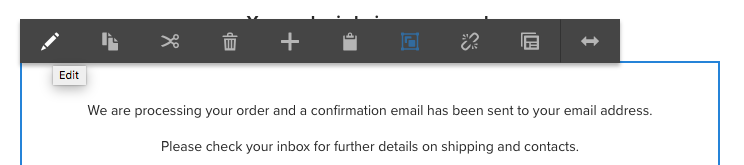

# 在We.Retail中试用核心组件{#trying-out-core-components-in-we-retail}

核心组件是现代、灵活的组件，具有轻松的可扩展性并允许与项目轻松集成。 核心组件围绕几个主要的设计原则构建而成，如HTL、现成可用性、可配置性、版本控制和可扩展性。 We.Retail已构建在核心组件上。

## 尝试 {#trying-it-out}

1. 开始AEM包含We.Retail示例内容并打开组 [件控制台](/help/sites-authoring/default-components-console.md)。

   **全局导航->工具->组件**

1. 在组件控制台中打开边栏，可以过滤特定组件组。 核心组件位于

   * `.core-wcm`: 标准核心组件
   * `.core-wcm-form`: 表单提交核心组件

   选择 `.core-wcm`。

   

1. 请注意，所有核心组件 **均命名为** v1，这反映出这是该核心组件的第一个版本。 以后将发布常规版本，它与AEM版本兼容，并可轻松升级，以便您充分利用最新功能。
1. 单 **击“文本(v1)**”。

   请参阅 **组件的** “资源类型” `/apps/core/wcm/components/text/v1/text`。 核心组件位于下面，并 `/apps/core/wcm/components` 且按组件进行版本控制。

   

1. 单击“文 **档** ”选项卡以查看该组件的开发人员文档。

   

1. 返回到组件控制台。 筛选组 **We.Retail** ，然后选 **择Text** 组件。
1. 请参阅资 **源类型** （如下所示）指向组件， `/apps/weretail` 但资 **源超级类型(** Resource Super Type `/apps/core/wcm/components/text/v1/text`)指向核心组件。

   

1. 单击“ **实时使用** ”选项卡，查看此组件当前在哪些页面上使用。 单击第一个 **感谢页面** ，以编辑该页面。

   

1. 在感谢页面上，选择文本组件，然后在组件的编辑菜单中单击取消继承图标。

   [We.Retail具有一个全球化的站点结构](/help/sites-developing/we-retail-globalized-site-structure.md) ，其中内容通过称为继承的 [机制从语言母版推送到Live Copy](/help/sites-administering/msm.md)。 因此，必须取消继承，以允许用户手动编辑文本。

   

1. 单击是以确认取 **消**。

   

1. 取消继承并选择文本组件后，可使用更多选项。 单击**编辑**。

   

1. 您现在可以看到文本组件可用的编辑选项。

   

1. 从页面 **信息菜单** ，选择 **编辑模板**。
1. 在页面的模板编辑器中，单击页 **面的** “布局”容器 **中** “文本”组件的“策略”图标。

   

1. 核心组件允许模板作者配置页面作者可以使用的属性。 这些功能包括允许粘贴源、格式选项、可用的段落样式等。

   此类设计对话框可用于许多核心组件，并与模板编辑器协同工作。 启用后，创作者可通过组件编辑器访问它们。

   

## 更多信息 {#further-information}

有关核心组件的更多信息，请参阅创作文档 [核心组件](https://docs.adobe.com/content/help/zh-Hans/experience-manager-core-components/using/introduction.html) ，了解核心组件功能的概述，或参阅开发人员文档开 [发核心组件](https://helpx.adobe.com/experience-manager/core-components/using/developing.html) ，了解技术概述。

此外，您可能希望进一步调查可编 [辑的模板](/help/sites-developing/we-retail-editable-templates.md)。 有关可编辑模板的完 [整详细信息，请参](/help/sites-authoring/templates.md) 阅创作文档创 [建页面模板](/help/sites-developing/page-templates-editable.md) ，或参阅开发人员文档页面模板——可编辑。
