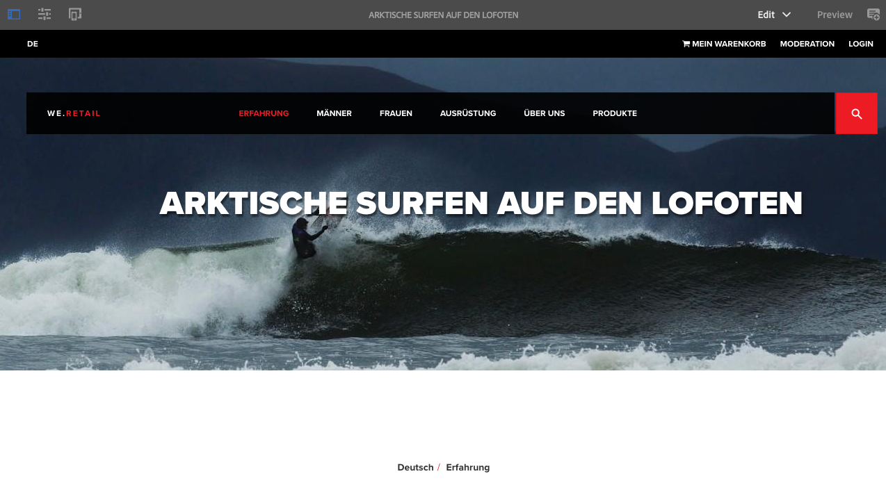

# 试论We.Retail中的全球化网站结构{#trying-out-the-globalized-site-structure-in-we-retail}

We.Retail已构建为一个全球化的站点结构，提供可实时复制到国家／地区特定网站的语言母版。 一切都是开箱即用设置，让您能够尝试此结构和内置的翻译功能。

## 尝试 {#trying-it-out}

1. 从全局导航->站 **点中打开站点控制台**。
1. 切换到列视图（如果尚未激活），然后选择We.Retail。 请注意瑞士、美国、法国等国家的示例国家结构，并与语言大师一起。

   

1. 选择瑞士并查看该国语言的语言根。 请注意，这些根下还没有任何内容。

   

1. 切换到列表视图，查看国家／地区的语言副本均为Live Copy。

   

1. 返回列视图并单击“语言主控”，查看包含内容的语言主控根。 请注意，只有英语包含内容。

   We.Retail不附带任何翻译内容，但已提供结构和配置，使您能够演示翻译服务。

   

1. 选择“英语”主控后，打开站 **点控制台** 中的“引用”边栏，然后选择 **“语言副本**”。

   

1. 勾选“语言副本”标 **签旁的复选框** ，以选择所有语言副本。 在边栏 **的“更新语言** ”副本部分，选择选 **项以创建新的翻译项目**。 为项目提供名称，然后单击“ **更新**”。

   

1. 将为每个语言翻译创建一个项目。 在“导航”- **>“项目”下视图它们**。

   

1. 单击“德语”查看翻译项目的详细信息。 请注意，状态在“草稿” **中**。 要将翻译与Microsoft的翻译服务开始，请单击“翻译作业”标 **题旁的V形** ，然后选择 **开始**。

   

1. 翻译项目开始。 单击标签为“翻译作业”的卡片底部的省略号可查看详细信息。 状态为“准 **备审阅** ”的页面已由翻译服务翻译。

   

1. 在列表中选择一个页面，然后在工具栏 **的站点中** 预览，将在页面编辑器中打开译文页面。

   

>[!NOTE]
>
>此过程演示了与Microsoft机器翻译的内置集成。 使用AEM [翻译集成框架](/help/sites-administering/translation.md)，您可以与许多标准翻译服务集成以编排AEM的翻译。

## 更多信息 {#further-information}

有关详细信息，请参阅创作文档 [翻译多语言站点的内容](/help/sites-administering/translation.md) ，了解完整的技术详细信息。
