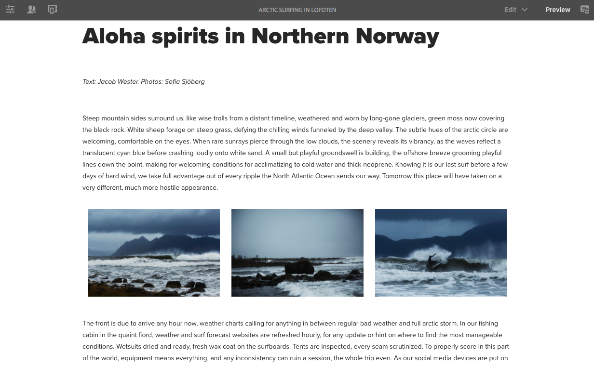

# 在We.Retail中尝试响应式布局{#trying-out-responsive-layout-in-we-retail}

所有We.Retail页面都使用布局容器组件来实现响应式设计。 布局容器提供了段落系统，允许您将组件放置在响应式网格内。 此网格可以根据设备/窗口大小和格式重新安排布局。The component is used in conjunction with the **Layout** mode in the page editor, which allows you to create and edit your responsive layout dependent on device.

## 尝试 {#trying-it-out}

1. 在语言主控分支的“体验”部分编辑北极冲浪页面。

   http://localhost:4502/editor.html/content/we-retail/language-masters/en/experience/arctic-surfing-in-lofoten.html

1. 切换到 **预览** ，即可查看页面呈现给网站访客的效果。 向下滚动到挪威北部的 *Aloha spirits文章的内容*。

   

1. 调整浏览器窗口的大小并观察布局如何动态调整为调整大小。

   

1. 切换到布局模式。 模拟器工具栏会自动显示，允许您根据目标设备规划布局。

   选择组件后，编辑菜单中会显示浮动和隐藏选项以及组件的调整大小手柄。

   

1. 抓取并拖动组件的调整大小控制滑块会自动显示布局网格，以帮助您调整大小。

   

## 更多信息 {#further-information}

有关详细信息，请参阅创作文档响 [应式布局](/help/sites-authoring/responsive-layout.md) 或管理员文档配 [置布局容器和布局模式](/help/sites-administering/configuring-responsive-layout.md) ，以了解完整的技术详细信息。
