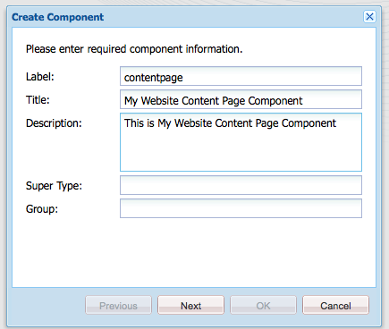

# 创建功能完备的网站(JSP){#create-a-fully-featured-website-jsp}

>[!CAUTION]
>
>本文介绍如何使用JSP和基于经典UI创建网站。 Adobe建议如开发AEM Sites入门一文中所述，为您的网站利用最 [新的AEM技术](/help/sites-developing/getting-started.md)。

本教程使您能够与Adobe Experience Manager(AEM)一起创建功能完备的网站。 该网站将基于一个通用网站，主要面向Web开发人员。 所有开发都将在创作环境内进行。

本教程介绍如何：

1. 安装AEM。
1. 访问CRXDE Lite(开发环境)。
1. 以CRXDE Lite设置项目结构。
1. 创建模板、组件和脚本，它们用作创建内容页面的基础。
1. 创建网站的根页面，然后创建内容页面。
1. 创建以下组件以在您的页面上使用：

   * **[!UICONTROL 顶部导航]**
   * **[!UICONTROL 列出子项]**
   * **[!UICONTROL 徽标]**
   * **[!UICONTROL 图像]**
   * **[!UICONTROL 文本图像]**
   * **[!UICONTROL 搜索]**

1. 包括各种基础组件。

执行所有步骤后，您的页面将显示如下：


**下载最终结果**

要按照教程而不是练习进行操作，请下载website-1.0.zip。 此文件是包含本教程结果的AEM内容包。 使用 [包管理器](/help/sites-administering/package-manager.md) ，将包安装到您的创作实例中。

>[!NOTE]
>安装此包将覆盖您使用本教程创建的创作实例上的所有资源。

网站内容包

[获取文件](assets/website-1_0.zip)

## Installing Adobe Experience Manager {#installing-adobe-experience-manager}

要安装AEM实例以开发您的网站，请按照说明使用创作和发 [布实例设置部署环境](/help/sites-deploying/deploy.md#author-and-publish-installs)，或执行 [通用安装](/help/sites-deploying/deploy.md#default-local-install)。 通用安装包括下载AEM Quickstart JAR文件、将license.properties文件放置到与JAR文件相同的目录中，以及多次单击JAR文件。

安装AEM后，单击欢迎页面上的CRXDE Lite链接，访问CRXDE Lite开发环境:


>[!NOTE]
>
>使用默认端口本地安装的AEM创作实例的CRXDE LiteURL为 [http://localhost:4502/crx/de/](http://localhost:4502/crx/de/)。

## 在CRXDE Lite中设置项目结构 {#setting-up-the-project-structure-in-crxde-lite}

使用CRXDE Lite在存储库中创建mywebsite应用程序结构：

1. 在CRXDE Lite左侧的树中，右键单击文件夹，然 **`/apps`** 后单击“创 **[!UICONTROL 建”>“创建文件夹”]**。 在“创 **建文件夹** ”对话框中，键 `mywebsite` 入文件夹名称，然后单 **击[!UICONTROL确定**。
1. 右键单击文件夹， `/apps/mywebsite` 然后单击“ **[!UICONTROL 创建”>“创建文件夹”]**。 在“创 **[!UICONTROL 建文件夹]** ”对话框中，键 `components` 入文件夹名称，然后单击“ **[!UICONTROL 确定]**”。
1. 右键单击文件夹， `/apps/mywebsite` 然后单击“ **[!UICONTROL 创建”>“创建文件夹”]**。 在“创 **[!UICONTROL 建文件夹]** ”对话框中，键 `templates` 入文件夹名称，然后单击“ **[!UICONTROL 确定]**”。

   树中的结构现在应该类似于：

   

1. 单击“ **[!UICONTROL 全部保存]**”。

## 设置设计 {#setting-up-the-design}

在本节中，您将使用设计器工具为应用程序创建设计。 该设计为您的网站提供CSS和图像资源。

>[!NOTE]
>
>单击以下链接进行下载 ``mywebsite.zip``。 该归档文件包含用于您设计的static.css和图像文件。

static.css文件和图像示例

[获取文件](assets/mywebsite.zip)

1. 在AEM欢迎页面上，单击 **[!UICONTROL 工具]**。 ([http://localhost:4502/libs/cq/core/content/welcome.html](http://localhost:4502/libs/cq/core/content/welcome.html))

   

1. 在文件夹树中，选择“设计 **[!UICONTROL ”文]** 件夹，然后单 **[!UICONTROL 击“新建”>“新建页面”]**。 键入 `mywebsite` 作为标题，然后单击 **[!UICONTROL 创建]**。

1. 如果mywebsite项未出现在表中，请刷新树或表。

1. [使用WebDAV](/help/sites-administering/webdav-access.md) 访问http://localhost:4502上的URL，将示例文件和文 `static.css` 件 `images` 从下载的mywebsite.zip文件复制到文件 `/etc/designs/mywebsite` 夹中。

   

## 创建内容页模板、组件和脚本 {#creating-the-contentpage-template-component-and-script}

在本节中，您将创建以下内容：

* 用于在示例网站中创建内容页面的内容页面模板
* 用于呈现内容页面的内容页面组件
* 内容页面脚本

### 创建内容页面模板 {#creating-the-contentpage-template}

创建模板，用作网站网页的基础。

模板可定义新页面的默认内容。 复杂网站可能使用多个模板在站点中创建不同类型的页面。 在此练习中，所有页面都基于一个简单的模板。

1. 在CRXDE Lite的文件夹树中，右键单击，然 `/apps/mywebsite/templates` 后单击 **[!UICONTROL 创建>创建模板]**。

1. 在“创建模板”对话框中，键入以下值，然后单击“下 **[!UICONTROL 一步]**”:

   * **[!UICONTROL 标签]**: 内容页
   * **[!UICONTROL 标题]**: 我的网站内容页面模板
   * **[!UICONTROL 描述]**: 这是我的网站内容页面模板
   * **[!UICONTROL 资源类型]**: mywebsite/components/contentpage

   使用“排名”属性的默认值。

   

   资源类型标识呈现页面的组件。 在这种情况下，使用内容页面模板创建的所有页面都由组件呈 `mywebsite/components/contentpage` 现。

1. 要指定可使用此模板的页面的路径，请单击加号按钮并在显示的 `/content(/.*)?` 文本框中键入内容。 然后，单击“下 **[!UICONTROL 一步]**”。

   

   允许路径属性的值是常规 *表达式。* 路径与表达式匹配的页面可以使用模板。 在这种情况下，常规表达式符与文件夹和所 `/content` 有子页面的路径匹配。

   创作者在下面创建页 `/content`面时， **[!UICONTROL 内容页面]** 模板会显示在可用模板的列表中。

1. 在“允 **[!UICONTROL 许的父项]** ”和“允许的子项 **** ”面板中单 **[!UICONTROL 击“下一步”，然]** 后单击“确 ****&#x200B;定”。 在CRXDE Lite中，单击“ **[!UICONTROL 全部保存]**”。

   

#### 创建内容页面组件 {#creating-the-contentpage-component}

创建定 *义内容* 、呈现使用内容页面模板的页面的组件。 组件的位置必须与内容页模板的“资源类型”属性的值相对应。

1. 在CRXDE Lite中，右键单击， `/apps/mywebsite/components` 然后单 **[!UICONTROL 击创建>组件]**。
1. 在创建 **[!UICONTROL 组件]** 对话框中，键入以下属性值：

   * **[!UICONTROL 标签]**: 内容页
   * **[!UICONTROL 标题]**: 我的网站内容页面组件
   * **[!UICONTROL 描述]**: 这是“我的网站内容”页面组件

   

   新组件的位置为 `/apps/mywebsite/components/contentpage`。 此路径与内容页面模板的资源类型(减去路径 `/apps/` 的初始部分)相对应。

   此通信将模板连接到组件，并且对网站的正确运行至关重要。

1. 单击 **[!UICONTROL “下一]** 步”，直 **[!UICONTROL 到显示对话框的“允许的子项]** ”面板，然后单击“ **[!UICONTROL 确定”]**。 在CRXDE Lite中，单击“ **[!UICONTROL 全部保存]**”。

   现在的结构如下所示：

   

#### 开发Contentpage组件脚本 {#developing-the-contentpage-component-script}

向contentpage.jsp脚本添加代码以定义页面内容。

1. 在CRXDE Lite中，在中打 `contentpage.jsp` 开文 `/apps/mywebsite/components/contentpage`件。 默认情况下，该文件包含以下代码：

   ```java
   <%--
   
     My Website Content Page Component component.
   
     This is My Website Content Page Component.
   
   --%><%
   %><%@include file="/libs/foundation/global.jsp"%><%
   %><%@page session="false" %><%
   %><%
       /* TODO add you code here */
   %>
   ```

1. 复制以下代码，并将其粘贴到默认代码之后的contentpage.jsp中：

   ```java
   <%@ page language="java" contentType="text/html; charset=ISO-8859-1"
       pageEncoding="ISO-8859-1"%>
   <!DOCTYPE html PUBLIC "-//W3C//DTD HTML 4.01 Transitional//EN" 
   "https://www.w3.org/TR/html4/loose.dtd">
   <html>
   <head>
   <meta http-equiv="Content-Type" content="text/html; charset=ISO-8859-1">
   <title>My title</title>
   </head>
   <body>
   <div>My body</div>
   </body>
   </html>
   ```

1. 单击 **[!UICONTROL 全部保存]** ，以保存更改。

### 创建网站页面和内容页面 {#creating-your-website-page-and-content-pages}

在此部分中，您将创建以下所有页面均使用内容页面模板： 我的网站、英语、产品、服务和客户。

1. 在AEM欢迎页面([http://localhost:4502/libs/cq/core/content/welcome.html](http://localhost:4502/libs/cq/core/content/welcome.html))上，单击网站。

   

1. 在文件夹树中，选择网站文 **[!UICONTROL 件夹]** ，然后单击“ **[!UICONTROL 新建”>“新建页面”]**。
1. 在创 **[!UICONTROL 建页面]** ，输入以下内容：

   * **[!UICONTROL 标题]**: `My Website`
   * **[!UICONTROL 名称]**: `mywebsite`
   * 选择“我 **[!UICONTROL 的网站内容”页面模板]**

   

1. 单击&#x200B;**[!UICONTROL 创建]**。在文件夹树中，选择页面， `/Websites/My Website` 然后单击“ **[!UICONTROL 新建”>“新建页面”]**。
1. 在创 **[!UICONTROL 建页面]** ，输入以下属性值，然后单击创建：

   * **[!UICONTROL 标题]**: 英语
   * **[!UICONTROL 名称]**: en
   * 选择“我 **[!UICONTROL 的网站内容”页面模板]**

1. 在文件夹树中，选择页面， `/Websites/My Website/English` 然后单击“ **[!UICONTROL 新建”>“新建页面”]**。
1. 在创 **[!UICONTROL 建页面]** ，输入以下属性值，然后单击创 **[!UICONTROL 建]**:

   * **[!UICONTROL 标题]**: 产品
   * 选择“我 **[!UICONTROL 的网站内容”页面模板]**

1. 在文件夹树中，选择页面， `/Websites/My Website/English` 然后单击“ **[!UICONTROL 新建”>“新建页面”]**。
1. 在创 **[!UICONTROL 建页面]** ，输入以下属性值，然后单击创 **[!UICONTROL 建]**:

   * **标题**: 服务
   * 选择“我 **[!UICONTROL 的网站内容”页面模板]**

1. 在文件夹树中，选择页面， `/Websites/My Website/English` 然后单击“ **[!UICONTROL 新建”>“新建页面”]**。
1. 在创 **[!UICONTROL 建页面]** ，输入以下属性值，然后单击创 **[!UICONTROL 建]**:

   * **标题**: 客户
   * 选择“我 **[!UICONTROL 的网站内容”页面模板]**

   您的结构如下所示：

   

1. 要将页面链接到我的网站设计，请在CRXDE Lite中选择 `/content/mywebsite/en/jcr:content` 节点。 在“属 **[!UICONTROL 性]** ”选项卡上，为新属性键入以下值，然后单击“添加”:

   * **[!UICONTROL 名称]**: cq:designPath
   * **[!UICONTROL 类型]**: 字符串
   * **[!UICONTROL 值]**: /etc/designs/mywebsite

   

1. 在新的Web浏览器选项卡或窗口中，打开 [http://localhost:4502/content/mywebsite/en/products.html](http://localhost:4502/content/mywebsite/en/products.html) 以查看产品页面：

   

### 增强内容页脚本 {#enhancing-the-contentpage-script}

本节介绍如何使用AEM foundation组件脚本和编写您自己的脚本来增强内容页脚本。

“产 **[!UICONTROL 品]** ”页面将如下所示：


#### 使用基础页面脚本 {#using-the-foundation-page-scripts}

在本练习中，您将配置页面内容组件，使其超类型为AEM页面组件。 由于组件继承了其超类型的功能，因此您的页面内容会继承页面组件的脚本和属性。

例如，在组件JSP代码中，您可以引用超类型组件提供的脚本，就像它们包含在组件中一样。

1. 在CRXDE Lite中，向节点添加属 `/apps/mywebsite/components/contentpage` 性。

   1. 选择节 `/apps/mywebsite/components/contentpage` 点。
   1. 在“属性”选项卡的底部，键入以下属性值，然后单击“添加”:

      * **[!UICONTROL 名称]**: sling:resourceSuperType
      * **[!UICONTROL 类型]**: 字符串
      * **[!UICONTROL 值]**: foundation/components/page
   1. 单击“ **[!UICONTROL 全部保存]**”。


1. 打开下 `contentpage.jsp` 面的文 `/apps/mywebsite/components/contentpage` 件，并将现有代码替换为以下代码：

   ```xml
   <%@include file="/libs/foundation/global.jsp"%><%
   %><%@page session="false" contentType="text/html; charset=utf-8" %><%
   %><!DOCTYPE HTML PUBLIC "-//W3C//DTD HTML 4.01//EN" "https://www.w3.org/TR/html4/strict.dtd">
   <html>
   <cq:include script="head.jsp"/>
   <cq:include script="body.jsp"/>
   </html>
   ```

1. 保存更改。
1. 在浏览器中，重新加载 **[!UICONTROL 产品]** 页面。 如下所示：

   

   打开页面源，查看head.jsp和body.jsp脚本生成的javascript和HTML元素。 以下脚本片段在您打开页面时打开Sidekick:

   ```java
   CQ.WCM.launchSidekick("/content/mywebsite/en/products",
               {propsDialog: "/libs/foundation/components/page/dialog",
                  locked: false locked: false
                }); 
   ```

#### 使用您自己的脚本 {#using-your-own-scripts}

在本节中，您将创建多个脚本，每个脚本都生成页面正文的一部分。 然后，在pagecontent组件中创建body.jsp文件以覆盖AEM Page组件的body.jsp。 在body.jsp文件中，包括生成页面正文不同部分的脚本。

**提示：** 当组件包含的文件与组件超类型中的文件具有相同的名称和相对位置时，它称为 *覆盖*。

1. 在CRXDE Lite中，在以下位置创 `left.jsp` 建文 `/apps/mywebsite/components/contentpage`件：

   1. 右键单击该节点， `/apps/mywebsite/components/contentpage`然后选择创 **[!UICONTROL 建]** , **[!UICONTROL 再选择创建文件]**。
   1. 在窗口中，键 `left.jsp` 入“**名称*”，然后单击“确 **[!UICONTROL 定”]**。

1. 编辑文件 `left.jsp` 以删除现有内容并替换为以下代码：

   ```java
   <%@include file="/libs/foundation/global.jsp"%><%
   %><div class="left">
   <div>logo</div>
   <div>newslist</div>
   <div>search</div>
   </div>
   ```

1. 保存更改。
1. 在CRXDE Lite中，在以下位置创 `center.jsp` 建文 `/apps/mywebsite/components/contentpage`件：

   1. 右键单击节点， `/apps/mywebsite/components/contentpage`选择创 **[!UICONTROL 建]**, **[!UICONTROL 然后选择创建文件]**。
   1. 在对话框中，键入 `center.jsp` 为 **[!UICONTROL 名称]** ，然 **[!UICONTROL 后单击]** OK。

1. 编辑文件 `center.jsp` 以删除现有内容，并将其替换为以下代码：

   ```java
   <%@include file="/libs/foundation/global.jsp"%><%
   %><div class="center">
   <div>trail</div>
   <div>title</div>
   <div>parsys</div>
   </div>
   ```

1. 保存更改。
1. 在CRXDE Lite中，在以下位置创 `right.jsp` 建文 `/apps/mywebsite/components/contentpage`件：

   1. 右键单击节点， `/apps/mywebsite/components/contentpage`选择创 **[!UICONTROL 建]**, **[!UICONTROL 然后选择创建文件]**。
   1. 在对话框中，键入 `right.jsp` 为名 **[!UICONTROL 称]** ，然后 **[!UICONTROL 单击确定]**。

1. 编辑文件 `right.jsp` 以删除现有内容并替换为以下代码：

   ```java
   <%@include file="/libs/foundation/global.jsp"%><%
   %><div class="right">
   <div>iparsys</div>
   </div>
   ```

1. 保存更改。
1. 在CRXDE Lite中，在以下位置创 `body.jsp` 建文 `/apps/mywebsite/components/contentpage`件：
1. 编辑文件 `body.jsp` 以删除现有内容并替换为以下代码：

   ```java
   <%@include file="/libs/foundation/global.jsp"%><%
   %><body>
   <div id="CQ">
   <div class="topnav">topnav</div>
   <div class="content">
   <cq:include script="left.jsp" />
   <cq:include script="center.jsp" />
   <cq:include script="right.jsp" />
   </div>
   <div class="footer">
   <div class="toolbar">toolbar</div>
   </div>
   </div>
   </body>
   ```

1. 保存更改。
1. 在浏览器中，重新加载 **[!UICONTROL 产品]** 页面。 如下所示：

   

### 创建顶部导航组件 {#creating-the-top-navigation-component}

在此部分中，您将创建一个组件，其中显示指向网站所有顶级页面的链接以简化导航。 此组件内容显示在使用内容页面模板创建的所有页面的顶部。

在顶部导航组件(topnav)的第一个版本中，导航项目只是文本链接。 在第二个版本中，您使用图像导航链接实现topnav。

您的顶部导航如下所示：


#### 创建顶部导航组件 {#creating-the-top-navigation-component-1}

1. 在CRXDE Lite中，右键单 `/apps/mywebsite/components`击，选 **[!UICONTROL 择创]**&#x200B;建 **[!UICONTROL ,]**&#x200B;然后选择创建组件。
1. 在创 **[!UICONTROL 建组件]** ，输入以下内容：

   * **[!UICONTROL 标签]**: `topnav`
   * **[!UICONTROL 标题]**: `My Top Navigation Component`
   * **[!UICONTROL 描述]**: `This is My Top Navigation Component`

1. 单 **[!UICONTROL 击]** “下一步”，直到您进入单击“确定”的最后 **[!UICONTROL 一个窗口]**。 保存更改。

#### 使用文本链接创建顶部导航脚本 {#creating-the-top-navigation-script-with-textual-links}

将渲染脚本添加到topnav以生成指向子页面的文本链接：

1. 在CRXDE Lite下，打开文 `topnav.jsp` 件 `/apps/mywebsite/components/topnav`。
1. 通过复制并粘贴以下代码来替换该代码：

   ```xml
   <%@include file="/libs/foundation/global.jsp"%><% 
   %><%@ page import="java.util.Iterator,
           com.day.text.Text, 
           com.day.cq.wcm.api.PageFilter, com.day.cq.wcm.api.Page" %><% 
       /* get starting point of navigation */
       Page navRootPage = currentPage.getAbsoluteParent(2); 
       if (navRootPage == null && currentPage != null) { 
       navRootPage = currentPage; 
       }
       if (navRootPage != null) { 
           Iterator<Page> children = navRootPage.listChildren(new PageFilter(request));
           while (children.hasNext()) { 
               Page child = children.next(); 
               %><a href="<%= child.getPath() %>.html"><%=child.getTitle() %></a><% 
           } 
       } 
   %> 
   ```

#### 包括内容页面组件中的顶部导航 {#including-top-navigation-in-the-contentpage-component}

要在内容页面组件中包含topnav，请执行以下操作：

1. 在CRXDE Lite中，打开 `body.jsp` 下 `/apps/mywebsite/components/contentpage`面并替换：

   ```xml
   <div class="topnav">topnav</div>
   ```

   替换为：

   ```xml
   <cq:include path="topnav" resourceType="mywebsite/components/topnav" />
   ```

1. 保存更改。
1. 在浏览器中，重新加载 **[!UICONTROL 产品]** 页面。 顶部导航如下所示：

   

#### 使用字幕增强页面 {#enhancing-pages-with-subtitles}

页面 **[!UICONTROL 组件]** 定义允许您为页面提供字幕的属性。 添加提供有关页面内容信息的字幕。

1. 在您的浏览器中，打开 **[!UICONTROL 产品]** 页面。
1. 在Sidekick页面 **[!UICONTROL 选项卡]** ，单击 **[!UICONTROL 页面属性]**。
1. 在对话 **[!UICONTROL 框的]** “基本”选项卡上，展开“ **[!UICONTROL 更多标题和说明]** ”，并为“子标 **[!UICONTROL 题]** ”属性键入 `what we do`“类型”。 单击&#x200B;**[!UICONTROL 确定]**。
1. 重复上述步骤，将有关我们服 **务的子标题** 添加到 **[!UICONTROL “服务]** ”页面。
1. 重复上述步骤，将我们获得 **的信任的子标题添加** 到“ **[!UICONTROL 客户]** ”页。

   **提示：** 在CRXDE Lite中，选择/content/mywebsite/cn/products/jcr:content节点以查看是否添加了子标题属性。

#### 使用图像链接增强顶部导航 {#enhance-top-navigation-by-using-image-links}

增强topnav组件的渲染脚本，以使用图像链接而不是超文本进行导航控件。 该图像包括链接目标的标题和子标题。

本练习演示 [Sling请求处理](/help/sites-developing/the-basics.md#sling-request-processing)。 topnav.jsp脚本被修改为调用动态生成图像以用于页面导航链接的脚本。 在本练习中，Sling会解析图像源文件的URL以确定用于渲染图像的脚本。

例如，指向“产品”页面的图像链接的源可能为http://localhost:4502/content/mywebsite/en/products.navimage.png。 Sling解析此URL以确定资源类型和用于呈现资源的脚本：

1. Sling确定要使用的资源路径 `/content/mwebysite/en/products.png.`
1. Sling将此路径与节点匹 `/content/mywebsite/en/products` 配。
1. Sling确定 `sling:resourceType` 此节点的 `mywebsite/components/contentpage`。

1. Sling在此组件中查找最匹配URL选择器()和 `navimage`文件扩展名()的 `png`脚本。

在本练习中，Sling将这些URL与您创建的/apps/mywebsite/components/contentpage/navimage.png.java脚本相匹配。

1. 在CRXDE Lite中，在 `topnav.jsp` 定位 `/apps/mywebsite/components/topnav.`锚点元素的内容下打开（第14行）:

   ```xml
   <%=child.getTitle() %>
   ```

1. 将锚点内容替换为以下代码：

   ```xml
   " src="<%= child.getPath() %>.navimage.png">
   ```

1. 保存更改。
1. 右键单击该节 `/apps/mywebsite/components/contentpage` 点，然后单 **[!UICONTROL 击创建>创建文件]**。
1. 在“创 **[!UICONTROL 建文件]** ”窗口中， **[!UICONTROL 键入]**“名 `navimage.png.java`称”。

   .java文件扩展名向Sling表示应使用Apache Sling脚本Java支持来编译脚本和创建servlet。

1. 将以下代码复 `navimage.png.java.`制到该代码扩展AbstractImageServlet类：

   * [AbstractImageServlet](https://helpx.adobe.com/experience-manager/6-4/sites/developing/using/reference-materials/javadoc/com/day/cq/wcm/commons/AbstractImageServlet.html) 创建一个ImageContext对象，用于存储当前资源的属性。
   * 资源的父页面会从ImageContext对象中提取。 然后获取页面标题和子标题。
   * [ImageHelper](https://helpx.adobe.com/experience-manager/6-4/sites/developing/using/reference-materials/javadoc/com/day/cq/commons/ImageHelper.html) 用于从站点设计的navimage_bg.jpg文件、页面标题和页面子标题生成图像。

   ```java
   package apps.mywebsite.components.contentpage;
   
   import java.awt.Color; 
   import java.awt.Paint; 
   import java.awt.geom.Rectangle2D; 
   
   import java.io.IOException;
   import javax.jcr.RepositoryException; 
   
   import com.day.cq.wcm.api.Page; 
   import com.day.cq.wcm.api.PageManager; 
   import com.day.cq.wcm.api.components.Component; 
   import com.day.cq.wcm.api.designer.Designer;
   
   import com.day.cq.commons.SlingRepositoryException; 
   import com.day.cq.wcm.commons.WCMUtils; 
   import com.day.cq.wcm.commons.AbstractImageServlet; 
   import com.day.cq.commons.ImageHelper; 
   
   import com.day.image.Font; 
   import com.day.image.Layer; 
   
   import org.apache.sling.api.SlingHttpServletRequest; 
   import org.apache.sling.api.SlingHttpServletResponse; 
   import org.apache.sling.api.resource.Resource; 
   import org.apache.sling.api.servlets.SlingSafeMethodsServlet; 
   
   /**
     * Renders the navigation image
     */ 
   public class navimage_png extends AbstractImageServlet {
   
         protected Layer createLayer(ImageContext ctx)
                throws RepositoryException, IOException {
            PageManager pageManager = ctx.resolver.adaptTo(PageManager.class);
            Page currentPage = pageManager.getContainingPage(ctx.resource);
   
            /* constants for image appearance */
            int scale = 6;
            int paddingX = 24;
            int paddingY = 24;
            Color bgColor = new Color(0x004a565c, true);
   
            /* obtain the page title */
            String title = currentPage.getTitle();
            if (title == null) {
                title = currentPage.getName();
            }
   
            /* format the title text */
            title = title.toUpperCase();
            Paint titleColor = Color.WHITE;
            Font titleFont = new Font("Myriad Pro", 10 * scale, Font.BOLD);
            int titleBase = 10 * scale;
   
            /* obtain and format the page subtitle */
            String subtitle = currentPage.getProperties().get("subtitle", "");
            Paint subtitleColor = new Color(0xffa9afb1, true);
            Font subTitleFont = new Font("Tahoma", 7);
            int subTitleBase = 20;
   
            /* create a layer that contains the background image from the mywebsite design */
            Designer dg = ctx.resolver.adaptTo(Designer.class);
            String imgPath = new String(dg.getDesignPath(currentPage)+"/images/navimage_bg.jpg");
            Layer bg = ImageHelper.createLayer(ctx.resolver.resolve(imgPath));
   
            /* draw the title text (4 times bigger) */
            Rectangle2D titleExtent = titleFont.getTextExtent(0, 0, 0, 0, title, Font.ALIGN_LEFT, 0, 0);
            Rectangle2D subtitleExtent = subTitleFont.getTextExtent(0, 0, 0, 0, subtitle, Font.ALIGN_LEFT, 0, 0);
   
            /* ensure subtitleExtent is wide enough */
            if ( subtitle.length() > 0 ) {
                int titleWidth = (int)titleExtent.getWidth() / scale;
                if ( subtitleExtent.getWidth() > titleWidth && subtitleExtent.getWidth() + 2 * paddingX >
    bg.getWidth() ) {
                    int charWidth = (int)subtitleExtent.getWidth() / subtitle.length();
                    int maxWidth = (bg.getWidth() > titleWidth + 2  * paddingX ? bg.getWidth() - 2 * paddingX : titleWidth);
                    int len = (maxWidth - ( 2 * charWidth) ) / charWidth;
                    subtitle = subtitle.substring(0, len) + "...";
                    subtitleExtent = subTitleFont.getTextExtent(0, 0, 0, 0, subtitle, Font.ALIGN_LEFT, 0, 0);
                }
            }
            int width = Math.max((int) titleExtent.getWidth(), (int) subtitleExtent.getWidth());
           /* create the text layer */
            Layer text = new Layer(width, (int) titleExtent.getHeight() + 40, new Color(0x01ffffff, true));
            text.setPaint(titleColor);
            text.drawText(0, titleBase, 0, 0, title, titleFont, Font.ALIGN_LEFT | Font.ALIGN_BASE, 0, 0);
            text.resize(text.getWidth() / scale, text.getHeight() / scale);
            text.setX(0);
            text.setY(0);
   
            if (subtitle.length() > 0) {
                /* draw the subtitle normal sized */
                text.setPaint(subtitleColor);
                text.drawText(0, subTitleBase, 0, 0, subtitle, subTitleFont, Font.ALIGN_LEFT | Font.ALIGN_BASE, 0, 0); 
            }
   
            /* merge the image and text layers */
            text.setY(paddingY);
            text.setX(paddingX);
            text.setBackgroundColor(bgColor);
   
            int bgWidth = bg.getWidth();
            if ( text.getWidth() + 2 * paddingX > bgWidth ) {
                bgWidth = text.getWidth() + 2 * paddingX;
                bg.resize(bgWidth, bg.getHeight());
            }
            bg.merge(text);
   
            return bg;
        }
    }
   ```

1. 保存更改。
1. 在浏览器中，重新加载 **[!UICONTROL 产品]** 页面。 顶部导航现在显示如下：

   

### 创建列表子组件 {#creating-the-list-children-component}

创建列表子组件，它生成包含页面标题、说明和日期的页面链接列表（例如，产品页面）。 链接目标当前页面或组件对话框中指定的根页面的子页面。


#### 创建产品页面 {#creating-product-pages}

创建位于产品页面下 **[!UICONTROL 方的]** 两个页面。 对于描述两个特定产品的每个页面，您都可以设置标题、说明和日期。

1. 在“网站”页面的文 **[!UICONTROL 件夹]** 树中，选择“网 **[!UICONTROL 站／我的网站／英语／产品]** ”项目，然 **[!UICONTROL 后单击“新建”>“新建页面”]**。
1. 在对话框中输入以下属性值，然后单击“创 **[!UICONTROL 建”]**:

   * **[!UICONTROL 标题]**: 产品1.
   * **[!UICONTROL 名称]**: product1.
   * 选择 **[!UICONTROL 我的网站内容页面模板]**

1. 使用以下属性值在产品下创建另一个页面：

   * **[!UICONTROL 标题]**: 产品2
   * **[!UICONTROL 名称]**: product2
   * 选择 **[!UICONTROL 我的网站内容页面模板]**

1. 在CRXDE Lite中，为产品1页面设置说明和日期：

   1. 选择节 `/content/mywebsite/en/products/product1/jcr:content` 点。
   1. 在“属 **[!UICONTROL 性]** ”选项卡中，输入以下值：

      * **[!UICONTROL 名称]**: `jcr:description`
      * **[!UICONTROL 类型]**: `String`
      * **[!UICONTROL 值]**: `This is a description of the Product 1!.`
   1. 单击&#x200B;**[!UICONTROL 添加]**。
   1. 在“属 **[!UICONTROL 性]** ”选项卡中，使用以下值创建另一个属性：

      * **[!UICONTROL 名称]**: 日期
      * **[!UICONTROL 类型]**: 字符串
      * **[!UICONTROL 值]**: 02/14/2008
      * 单击&#x200B;**[!UICONTROL 添加]**。
   1. 单击“ **[!UICONTROL 全部保存]**”。


1. 在CRXDE Lite中，为产品2页面设置说明和日期：

   1. 选择节 `/content/mywebsite/en/products/product2/jcr:content` 点。
   1. 在“属 **[!UICONTROL 性]** ”选项卡中，输入以下值：

      * **[!UICONTROL 名称]**: jcr:description
      * **[!UICONTROL 类型]**: 字符串
      * **[!UICONTROL 值]**: 这是对产品2！的描述。
   1. 单击&#x200B;**[!UICONTROL 添加]**。
   1. 在同一文本框中，将以前的值替换为以下值：

      * **[!UICONTROL 名称]**: 日期
      * **[!UICONTROL 类型]**: 字符串
      * **[!UICONTROL 值]**: 05/11/2012
      * 单击&#x200B;**[!UICONTROL 添加]**。
   1. 单击“ **[!UICONTROL 全部保存]**”。


#### 创建列表子组件 {#creating-the-list-children-component-1}

要创建列表子组件，请执行以下操作：

1. 在CRXDE Lite中，右键单 `/apps/mywebsite/components`击，选 **[!UICONTROL 择创]**&#x200B;建 **[!UICONTROL ,]**&#x200B;然后选择创建组件。
1. 在对话框中输入以下属性值，然后单击“下 **[!UICONTROL 一步]**”:

   * **[!UICONTROL 标签]**: 列表子项。
   * **[!UICONTROL 标题]**: 我的列表子项组件。
   * **[!UICONTROL 描述]**: 这是我的列表子项组件。

1. 继续单 **[!UICONTROL 击]** “下一步”, **[!UICONTROL 直到显示“允许的子项]** ”面板，然后单击“ **[!UICONTROL 确定”]**。

#### 创建列表子脚本 {#creating-the-list-children-script}

为列表子组件开发脚本。

1. 在CRXDE Lite下，打开文 `listchildren.jsp` 件 `/apps/mywebsite/components/listchildren`。
1. 将默认代码替换为以下代码：

   ```xml
   <%@include file="/libs/foundation/global.jsp"%><%
   %><%@ page import="java.util.Iterator,
            com.day.cq.wcm.api.PageFilter"%><%
        /* Create a new Page object using the path of the current page */ 
         String listroot = properties.get("listroot", currentPage.getPath());
        Page rootPage = pageManager.getPage(listroot);
        /* iterate through the child pages and gather properties */
        if (rootPage != null) {
            Iterator<Page> children = rootPage.listChildren(new PageFilter(request));
            while (children.hasNext()) {
                Page child = children.next();
                String title = child.getTitle() == null ? child.getName() : child.getTitle();
                String date = child.getProperties().get("date","");
                %><div class="item">
                <a href="<%= child.getPath() %>.html"><b><%= title %></b></a>
                <span><%= date %></span><br>
                <%= child.getProperties().get("jcr:description","") %><br>
                </div><%
            }
        }
    %>
   ```

1. 保存更改。

#### 创建列表子对话框 {#creating-the-list-children-dialog}

创建用于配置列表子组件属性的对话框。

1. 在列表子组件下创建对话框节点：

   1. 在CRXDE Lite中，右键单击该节 `/apps/mywebsite/components/listchildren`点，然后单 **[!UICONTROL 击创建>创建对话框]**。
   1. 在对话框中，输入以下属性值，然后单击确定

      * **[!UICONTROL 标签]**: `dialog`
      * **[!UICONTROL 标题]**: `Edit Component` 并单击“ **[!UICONTROL 确定]**”。

   

   使用以下属性：

   

1. 选择节 `/apps/mywebsite/components/listchildren/dialog/items/items/tab1` 点。
1. 在“属 **[!UICONTROL 性]** ”选项卡中，将title属性的 **[!UICONTROL 值更改]** 为 `List Children`

   

1. 选择 **tab1节点** ，单击“ **[!UICONTROL 创建”>“创建节点]**”，输入以下属性值，然后单击“确 **[!UICONTROL 定”]**:

   * **[!UICONTROL 名称]**: 项目
   * **[!UICONTROL 类型]**: cq:WidgetCollection

   

1. 使用以下属性值在项目节点下创建一个节点：

   * **[!UICONTROL 名称]**: 利斯特罗
   * **[!UICONTROL 类型]**: cq：构件

   

1. 为列表节点添加属性以将其配置为文本字段。 下表中的每行都表示一个属性。 完成后，单击“保 **[!UICONTROL 存全部”]**。

   | 名称 | 类型 | 值 |
   |---|---|---|
   | fieldLabel | 字符串 | 列表根的路径 |
   | 名称 | 字符串 | 。/listroot |
   | xtype | 字符串 | textfield |

   

#### 在内容页面组件中包含列表子项 {#including-list-children-in-the-contentpage-component}

要在内容页面组件中包含列表子组件，请按如下步骤继续：

1. 在CRXDE Lite下，打开文 `left.jsp` 件并 `/apps/mywebsite/components/contentpage` 找到以下代码（第4行）:

   ```xml
   <div>newslist</div>
   ```

1. 将该代码替换为以下代码：

   ```xml
   <cq:include path="newslist" resourceType="mywebsite/components/listchildren" />
   ```

1. 保存更改。

#### 在页面中查看列表子项 {#viewing-list-children-in-a-page}

要查看此组件的完整操作，您可以视图“产品”页面：

* 未定义父页面(“列表根路径”)时。
* 定义父页面(“列表根路径”)时。

1. 在浏览器中，重新加载 **[!UICONTROL 产品]** 页面。 列表子组件如下所示：

   

1. 

1. 作为列表根的路径，输入： `/content/mywebsite/en`. 单击&#x200B;**[!UICONTROL 确定]**。页面上的列表子组件现在如下所示：

   

### 创建徽标组件 {#creating-the-logo-component}

创建一个组件，它显示公司标志并提供指向网站主页的链接。 该组件包含一个设计模式对话框，以便将属性值存储在站点设计中(/etc/designs/mywebsite):

* 属性值将应用于添加到使用该设计的页面的组件的所有实例。
* 可以使用组件在使用该设计的页面上的任何实例配置属性。

您的设计模式对话框包含用于设置图像和链接路径的属性。 徽标组件将放置在网站中所有页面的左上侧。

具体内容如下：


>[!NOTE]
>
>Adobe Experience Manager提供功能更全的徽标组件( `/libs/foundation/components/logo`)。

#### 创建标志组件节点 {#creating-the-logo-component-node}

要创建徽标组件，请按照以下步骤操作：

1. 在CRXDE Lite中，右键单击/apps/mywebsite/components，选择创 **[!UICONTROL 建]**，然后选择 **[!UICONTROL 创建组件]**。
1. 在创建组件对话框中，输入以下属性值，然后单击下一步：

   * **[!UICONTROL 标签]**: `logo`.
   * **[!UICONTROL 标题]**: `My Logo Component`.
   * **[!UICONTROL 描述]**: `This is My Logo Component`.

1. 单击“下一步”，直到到达对话框的最终面板，然后单击“确 **[!UICONTROL 定”]**。

#### 创建Logo脚本 {#creating-the-logo-script}

本节介绍如何创建脚本以显示带有指向主页的链接的徽标图像。

1. 在CRXDE Lite下，打开文 `logo.jsp` 件 `/apps/mywebsite/components/logo`。
1. 以下代码创建指向站点主页的链接并添加对徽标图像的引用。 将代码复制到 `logo.jsp`:

   ```xml
   <%@include file="/libs/foundation/global.jsp"%><%
   %><%@ page import="com.day.text.Text,
                      com.day.cq.wcm.foundation.Image,
                      com.day.cq.commons.Doctype" %><%
       /* obtain the path for home */
       long absParent = currentStyle.get("absParent", 2L);
       String home = Text.getAbsoluteParent(currentPage.getPath(), (int) absParent);
       /* obtain the image */
       Resource res = currentStyle.getDefiningResource("imageReference");
       if (res == null) {
           res = currentStyle.getDefiningResource("image");
       }
       /* if no image use text link, otherwise draw the image */
       %>
   <a href="<%= home %>.html"><%
       if (res == null) {
           %>Home<%
       } else {
           Image img = new Image(res);
           img.setItemName(Image.NN_FILE, "image");
           img.setItemName(Image.PN_REFERENCE, "imageReference");
           img.setSelector("img");
           img.setDoctype(Doctype.fromRequest(request));
           img.setAlt("Home");
           img.draw(out);
       }
       %></a>
   ```

1. 保存更改。

#### 创建Logo设计对话框 {#creating-the-logo-design-dialog}

创建用于在设计模式下配置徽标组件的对话框。 必须命名设计模式对话框节点 `design_dialog`。

1. 在徽标组件下创建对话框节点：

   1. 右键单击节点， `/apps/mywebsite/components/logo` 然后单击“ **[!UICONTROL 创建”>“创建对话框]**”。
   1. 键入以下属性值，然后单击“确 **[!UICONTROL 定”]**:

      * **[!UICONTROL 标签]** `design_dialog`
      * **[!UICONTROL 标题]** `Logo (Design)`

1. 右键单击design_dialog分支中的tab1节点，然后单击“删除”。 单击“ **[!UICONTROL 全部保存]**”。
1. 在该节 `design_dialog/items/items`点下，创建一个名为类型 `img` 的新节 `cq:Widget`点。 添加以下属性，然后单击“全 **[!UICONTROL 部保存]**”:

   | 名称 | 类型 | 值 |
   |---|---|---|
   | fileNameParameter | 字符串 | 。/imageName |
   | fileReferenceParameter | 字符串 | 。/imageReference |
   | 名称 | 字符串 | 。/图像 |
   | 页面 | 字符串 | 图像 |
   | xtype | 字符串 | html5smartimage |

   

#### 创建徽标渲染脚本 {#creating-the-logo-render-script}

创建检索标志图像并将其写入页面的脚本。

1. 右键单击标志组件节点，然后单 **[!UICONTROL 击“创建”>“创建文件]** ”，以创建名为img.GET.java的脚本文件。
1. 打开文件，将以下代码复制到文件中，然后单击“全部 **[!UICONTROL 保存”]**:

```java
package apps.mywebsite.components.logo;

import java.io.IOException;
import java.io.InputStream;

import javax.jcr.RepositoryException;
import javax.jcr.Property;
import javax.servlet.http.HttpServletResponse;

import com.day.cq.wcm.foundation.Image;
import com.day.cq.wcm.commons.RequestHelper;
import com.day.cq.wcm.commons.WCMUtils;
import com.day.cq.wcm.commons.AbstractImageServlet;
import com.day.cq.commons.SlingRepositoryException;
import com.day.image.Layer;
import org.apache.commons.io.IOUtils;
import org.apache.sling.api.SlingHttpServletRequest;
import org.apache.sling.api.SlingHttpServletResponse;
import org.apache.sling.api.resource.Resource;
import org.apache.sling.api.resource.ValueMap;
import org.apache.sling.api.servlets.SlingSafeMethodsServlet;

/**
 * Renders an image
 */
public class img_GET extends AbstractImageServlet {

    protected Layer createLayer(ImageContext c)
            throws RepositoryException, IOException {
        /* don't create the layer yet. handle everything later */
        return null;
    }

    protected void writeLayer(SlingHttpServletRequest req,
                              SlingHttpServletResponse resp,
                              ImageContext c, Layer layer)
            throws IOException, RepositoryException {

        Image image = new Image(c.resource);
        image.setItemName(Image.NN_FILE, "image");
        image.setItemName(Image.PN_REFERENCE, "imageReference");
        if (!image.hasContent()) {
            resp.sendError(HttpServletResponse.SC_NOT_FOUND);
            return;
        }
        /* get pure layer */
        layer = image.getLayer(false, false, false);

        /* do not re-encode layer, just spool */
        Property data = image.getData();
        InputStream in = data.getStream();
        resp.setContentLength((int) data.getLength());
        String contentType = image.getMimeType();
        if (contentType.equals("application/octet-stream")) {
            contentType=c.requestImageType;
        }
        resp.setContentType(contentType);
        IOUtils.copy(in, resp.getOutputStream());
        in.close();

        resp.flushBuffer();
    }
}
```

#### 将徽标组件添加到内容页面组件 {#adding-the-logo-component-to-the-contentpage-component}

1. 在CRXDE Lite中，打 `left.jsp` 开 `/apps/mywebsite/components/contentpage file` 下面的代码行并找到以下代码行：

   ```xml
   <div>logo</div>
   ```

1. 将该代码替换为以下代码行：

   ```xml
   <cq:include path="logo" resourceType="mywebsite/components/logo" />
   ```

1. 保存更改。
1. 在浏览器中，重新加载 **[!UICONTROL 产品]** 页面。 徽标如下所示，但当前仅显示基础链接：

   

#### 在页面中设置标志图像 {#setting-the-logo-image-in-a-page}

本节介绍如何使用设计模式对话框将图像设置为徽标。

1. 在浏览 **[!UICONTROL 器中]** ，打开“产品”页面，单 **[!UICONTROL 击Sidekick底部的]** “设计 **[!UICONTROL ”按钮进入“设]** 计”模式。

   

1. 在标志栏的“设计”中，单 **[!UICONTROL 击]** “编辑”以使用对话框编辑标志组件的设置。
1. 在对话框中，单击“图像”选项卡 **[!UICONTROL 的面板]** ，浏览从文件 `logo.png` 中提取的图像， `mywebsite.zip` 然后单击“确 **[!UICONTROL 定”]**。

   

1. 单击Sidekick标题栏上的三角形以返回“编 **[!UICONTROL 辑]** ”模式。

   

1. 在CRXDE Lite中，转到以下节点以查看存储的属性值：

   `/etc/designs/mywebsite/jcr:content/contentpage/logo`

### 包括痕迹导航组件 {#including-the-breadcrumb-component}

在此部分，您包括痕迹导航（跟踪）组件，它是基础组件之一。

1. 在CRXDE Lite中，浏 `/apps/mywebsite/components/contentpage`览至，打开文 `center.jsp` 件并替换：

   ```java
   <div>trail</div>
   ```

   替换为：

   ```xml
   <cq:include path="trail" resourceType="foundation/components/breadcrumb" />
   ```

1. 保存更改。
1. 在浏览器中，重新加 **[!UICONTROL 载产品]** 1页。 跟踪组件如下所示：

   

### 包括标题组件 {#including-the-title-component}

在本节中，您包括标题组件，它是基础组件之一。

1. 在CRXDE Lite中，浏 `/apps/mywebsite/components/contentpage`览至，打开文 `center.jsp` 件并替换：

   ```xml
   <div>title</div>
   ```

   替换为：

   ```xml
   <cq:include path="title" resourceType="foundation/components/title" />
   ```

1. 保存更改。
1. 在浏览器中，重新加载 **[!UICONTROL 产品]** 页面。 标题组件如下所示：

   

>[!Note]
>您可以在编辑模式下设置不同的标题和类型/ **[!UICONTROL 大小]** 。

### 包括段落系统组件 {#including-the-paragraph-system-component}

段落系统(parsys)是网站的重要部分，因为它管理段落列表。 它允许作者向页面中添加段落组件并提供结构。

将parsys组件（基础组件之一）添加到内容页面组件。

1. 在CRXDE Lite中，浏 `/apps/mywebsite/components/contentpage`览至，打开 `center.jsp` 文件并找到以下代码行：

   ```xml
   <div>parsys</div>
   ```

1. 将该代码行替换为以下代码，然后保存更改：

   ```xml
   <cq:include path="par" resourceType="foundation/components/parsys" />
   ```

1. 在您的浏览器中，刷新 **[!UICONTROL 产品]** 页面。 它现在具有parsys组件，如下所示：

   

### 创建图像组件 {#creating-the-image-component}

创建用于在段落系统中显示图像的组件。 为节省时间，图像组件将创建为徽标组件的副本，并对某些属性做出更改。

>[!NOTE]
>
>Adobe Experience Manager提供功能更全的图像组件( `/libs/foundation/components/image`)。

#### 创建图像组件 {#creating-the-image-component-1}

1. 右键单击节 `/apps/mywebsite/components/logo` 点，然后单 **[!UICONTROL 击复制]**。
1. 右键单击该节 `/apps/mywebsite/components` 点，然后单 **[!UICONTROL 击粘贴]**。
1. 右键单击该节 `Copy of logo` 点，单 **[!UICONTROL 击重命名]**，删除现有文本和类型 `image`。

1. 选择组 `image` 件节点，并更改以下属性值：

   * `jcr:title:` 我的图像组件。
   * `jcr:description`: 这是我的图像组件。

1. 使用以下属性值 `image` 向节点添加属性：

   * **[!UICONTROL 名称]**: componentGroup
   * **[!UICONTROL 类型]**: 字符串
   * **[!UICONTROL 值]**: 我的网站

1. 在节点 `image` 下，将节点重 `design_dialog` 命名为 `dialog`。

1. Rename `logo.jsp` to `image.jsp.`

1. 打开img.GET.java，并将包更改为 `apps.mywebsite.components.image`。


#### 创建图像脚本 {#creating-the-image-script}

本节介绍如何创建图像脚本。

1. 打开 `/apps/mywebsite/components/image/` `image.jsp`
1. 将现有代码替换为以下代码，然后保存更改：

   ```xml
   <%@include file="/libs/foundation/global.jsp"%><%
   %><%@ page import="com.day.cq.commons.Doctype,
                       com.day.cq.wcm.foundation.Image,
                       com.day.cq.wcm.api.components.DropTarget,
                       com.day.cq.wcm.api.components.EditConfig,
                       com.day.cq.wcm.commons.WCMUtils" %><%
    /* global.jsp provides access to the current resource through the resource object */
           Image img = new Image(resource);
           img.setItemName(Image.NN_FILE, "image");
           img.setItemName(Image.PN_REFERENCE, "imageReference");
           img.setSelector("img");
           img.setDoctype(Doctype.fromRequest(request));
           img.setAlt("Home");
           img.draw(out); %>
   ```

1. 保存更改。

#### 创建图像cq:editConfig节点 {#creating-the-image-cq-editconfig-node}

节点 `cq:editConfig` 类型允许您在编辑组件的属性时配置组件的某些行为。

在本节中，您可以使用cq:editConfig节点将资产从内容查找器拖到图像组件中。

1. 在CRXDE Lite中，在节点/apps/mywebsite/components/image下，创建一个新节点，如下所示：

   * **[!UICONTROL 名称]**: cq:editConfig。
   * **[!UICONTROL 类型]**: cq:EditConfig。

1. 在节点cq:editConfig下，按如下方式创建新节点：

   * **[!UICONTROL 名称]**: cq:dropTargets。
   * **[!UICONTROL 类型]**: cq:DropTargetConfig。

1. 在节点cq:dropTargets下，按如下方式创建新节点：

   * **[!UICONTROL 名称]**: 图像。
   * **[!UICONTROL 类型]**: nt:unstructured。

1. 在CRXDE中，按如下方式设置属性：

| 名称 | 类型 | 值 |
|---|---|---|
| 接受 | 字符串 | image/(gif | jpeg | png) |
| 组 | 字符串 | 媒体 |
| propertyName | 字符串 | 。/imageReference |


#### 添加图标 {#adding-the-icon}

在本节中，当图像组件列在Sidekick中时，您将添加显示在该图像组件旁边的图标：

1. 在CRXDE Lite中，右键单击文件并 `/libs/foundation/components/image/icon.png` 选择复 **[!UICONTROL 制]**。
1. 右键单击该节点， `/apps/mywebsite/components/image` 然后单击 **[!UICONTROL 粘贴]**，然后单 **[!UICONTROL 击全部保存]**。

#### 使用图像组件 {#using-the-image-component}

在本节中，您将视图“ **[!UICONTROL 产品]** ”页面，并将图像组件添加到段落系统。

1. 在浏览器中，重新加载 **[!UICONTROL 产品]** 页面。
1. 在Sidekick中，单击“设 **[!UICONTROL 计模式]** ”图标。
1. 单击“ **[!UICONTROL 编辑]** ”按钮以编辑段落的设计对话框。
1. 对话框中显示了允许 **[!UICONTROL 的组件]** 列表; 导航到 **[!UICONTROL MyWebsite]**，选择“ **[!UICONTROL 我的图像组件]** ”，然 **[!UICONTROL 后单击]**“确定”。
1. 返回到 **[!UICONTROL 编辑模式]**。
1. 多次-单击parsys框架(在将组 **[!UICONTROL 件或资产拖动到此处]**)。 插 **[!UICONTROL 入新组件]** 和 **[!UICONTROL Sidekick选择器]** 如下所示：

   

### 包括工具栏组件 {#including-the-toolbar-component}

在此部分，您包括工具栏组件，它是基础组件之一。

在编辑模式和设计模式下，您有多个选项。

1. 在CRXDE Lite中，导 `/apps/mywebsite/components/contentpage`航到，打 `body.jsp` 开文件并找到以下代码：

   ```java
   <div class="toolbar">toolbar</div>
   ```

1. 将该代码替换为以下代码，然后保存更改。

   ```java
   <cq:include path="toolbar" resourceType="foundation/components/toolbar"/>
   ```

1. 在AEM网站页面的文件夹树中，选择， `Websites/My Website/English`然后单击“ **[!UICONTROL 新建”>“新建页面”]**。 指定以下属性值，然后单击创建：

   * **[!UICONTROL 标题]**: 工具栏
   * 选择 **[!UICONTROL 我的网站内容页面模板]**

1. 在页面列表中，右键单击工具栏 **[!UICONTROL 页面]** ，然后单击 **[!UICONTROL 属性]**。 选择 **[!UICONTROL “在导航中隐藏]**”，然后单击 **[!UICONTROL “确定”]**。

   “在 **[!UICONTROL 导航中隐藏]** ”选项可防止页面显示在导航组件中，如topnav和listchildren。

1. 在工 **[!UICONTROL 具栏]**&#x200B;下，创建以下页面：

   * 联系人
   * 反馈
   * 登录
   * 搜索

1. 在浏览器中，重新加载 **[!UICONTROL 产品]** 页面。 如下所示：

   

### 创建搜索组件 {#creating-the-search-component}

在此部分中，您将创建用于搜索网站上内容的组件。 此搜索组件可放置在任何页面的段落系统中（例如，放在专用的搜索结果页面上）。

您的搜索输入框在英文页面上将 **[!UICONTROL 如下]** :


#### 创建搜索组件 {#creating-the-search-component-1}

1. 在CRXDE Lite中，右键单 `/apps/mywebsite/components`击，选 **[!UICONTROL 择创]**&#x200B;建 **[!UICONTROL ,]**&#x200B;然后选择创建组件。
1. 使用对话框配置组件：

   1. 在第一个面板中，指定以下属性值：

      * **[!UICONTROL 标签]**: 搜索
      * **[!UICONTROL 标题]**: 我的搜索组件
      * **[!UICONTROL 描述]**: 这是我的搜索组件
      * **[!UICONTROL 组]**: 我的网站
   1. 单击 **[!UICONTROL 下一]**，然后再次 **[!UICONTROL 单击]** 下一步。
   1. 在[! **UICONTROL Allowed Parents** ]面板上，单击 **[!UICONTROL +按钮]** 并键入 `*/parsys`。
   1. 单击 **[!UICONTROL 下一]** 步，然后单击 **[!UICONTROL 确定]**。


1. 单击“ **[!UICONTROL 全部保存]**”。
1. 复制以下节点并将其粘贴到 `apps/mywebsite/components/search` 节点：

   * `/libs/foundation/components/search/dialog`
   * `` `/libs/foundation/components/search/i18n`
   * `/libs/foundation/components/search/icon.png`

1. 单击“ **[!UICONTROL 全部保存]**”。

#### 创建搜索脚本 {#creating-the-search-script}

本节介绍如何创建搜索脚本：

1. Open the `/apps/mywebsite/components/search/search.jsp` file.
1. 将以下代码复制到 `search.jsp`:

   ```java
   <%@ page import="com.day.cq.wcm.foundation.Search,com.day.cq.tagging.TagManager" %>
   <%@include file="/libs/foundation/global.jsp" %><%
   %><cq:setContentBundle/><%
       Search search = new Search(slingRequest);
   
       String searchIn = (String) properties.get("searchIn");
       String requestSearchPath = request.getParameter("path");
       if (searchIn != null) {
           /* only allow the "path" request parameter to be used if it
            is within the searchIn path configured */
           if (requestSearchPath != null && requestSearchPath.startsWith(searchIn)) {
               search.setSearchIn(requestSearchPath);
           } else {
               search.setSearchIn(searchIn);
           }
       } else if (requestSearchPath != null) {
           search.setSearchIn(requestSearchPath);
       }
   
       pageContext.setAttribute("search", search);
       TagManager tm = resourceResolver.adaptTo(TagManager.class);
   %><c:set var="trends" value="${search.trends}"/><%
   %><center>
     <form action="${currentPage.path}.html">
       <input size="41" maxlength="2048" name="q" value="${fn:escapeXml(search.query)}"/>
       <input value="<fmt:message key="searchButtonText"/>" type="submit" />
     </form>
   </center>
   <br/>
   <c:set var="result" value="${search.result}"/>
   <c:choose>
     <c:when test="${empty result && empty search.query}">
     </c:when>
     <c:when test="${empty result.hits}">
       <c:if test="${result.spellcheck != null}">
         <p><fmt:message key="spellcheckText"/> <a href="<c:url value="${currentPage.path}.html"><c:param name="q" value="${result.spellcheck}"/></c:url>"><b><c:out value="${result.spellcheck}"/></b></a></p>
       </c:if>
       <fmt:message key="noResultsText">
         <fmt:param value="${fn:escapeXml(search.query)}"/>
       </fmt:message>
     </c:when>
     <c:otherwise>
       <p class="searchmeta">Results ${result.startIndex + 1} - ${result.startIndex + fn:length(result.hits)} of ${result.totalMatches} for <b>${fn:escapeXml(search.query)}</b>. (${result.executionTime} seconds)</p>
      <br/>
   
     <div class="searchresults"> 
       <div class="results">
         <c:forEach var="hit" items="${result.hits}" varStatus="status">
           <div class="hit">
           <a href="${hit.URL}">${hit.title}</a>
           <div class="excerpt">${hit.excerpt}</div>
          <div class="hiturl"> ${hit.URL}<c:if test="${!empty hit.properties['cq:lastModified']}"> - <c:catch><fmt:formatDate value="${hit.properties['cq:lastModified'].time}" dateStyle="medium"/></c:catch></c:if> - <a href="${hit.similarURL}"><fmt:message key="similarPagesText"/></a>
           </div></div>
         </c:forEach>
       </div>
         <br/>
   
        <div class="searchRight">
             <c:if test="${fn:length(trends.queries) > 0}">
                 <p><fmt:message key="searchTrendsText"/></p>
                 <div class="searchTrends">
                     <c:forEach var="query" items="${trends.queries}">
                         <a href="<c:url value="${currentPage.path}.html"><c:param name="q" value="${query.query}"/></c:url>"><span style="font-size:${query.size}px"><c:out value="${query.query}"/></span></a>
                     </c:forEach>
                 </div>
             </c:if> 
             <c:if test="${result.facets.languages.containsHit}">
                 <p>Languages</p>
                 <c:forEach var="bucket" items="${result.facets.languages.buckets}">
                     <c:set var="bucketValue" value="${bucket.value}"/>
                     <c:set var="label" value='<%= new java.util.Locale((String) pageContext.getAttribute("bucketValue")).getDisplayLanguage(request.getLocale()) %>'/>
                     <c:choose>
                         <c:when test="${param.language != null}">${label} (${bucket.count}) - <a href="<cq:requestURL><cq:removeParam name="language"/></cq:requestURL>">remove filter</a></c:when>
                         <c:otherwise><a title="filter results" href="<cq:requestURL><cq:addParam name="language" value="${bucket.value}"/></cq:requestURL>">${label} (${bucket.count})</a></c:otherwise>
                     </c:choose><br/>
                 </c:forEach>
             </c:if> 
             <c:if test="${result.facets.tags.containsHit}">
                 <p>Tags</p>
                 <c:forEach var="bucket" items="${result.facets.tags.buckets}">
                     <c:set var="bucketValue" value="${bucket.value}"/>
                     <c:set var="tag" value="<%= tm.resolve((String) pageContext.getAttribute("bucketValue")) %>"/>
                     <c:if test="${tag != null}">
                         <c:set var="label" value="${tag.title}"/>
                         <c:choose>
                             <c:when test="<%= request.getParameter("tag") != null && java.util.Arrays.asList(request.getParameterValues("tag")).contains(pageContext.getAttribute("bucketValue")) %>">${label} (${bucket.count}) - <a href="<cq:requestURL><cq:removeParam name="tag" value="${bucket.value}"/></cq:requestURL>">remove filter</a></c:when>
                             <c:otherwise><a title="filter results" href="<cq:requestURL><cq:addParam name="tag" value="${bucket.value}"/></cq:requestURL>">${label} (${bucket.count})</a></c:otherwise>
                         </c:choose><br/>
                     </c:if>
                 </c:forEach>
             </c:if> 
             <c:if test="${result.facets.mimeTypes.containsHit}">
                 <jsp:useBean id="fileTypes" class="com.day.cq.wcm.foundation.FileTypes"/>
                 <p>File types</p>
                 <c:forEach var="bucket" items="${result.facets.mimeTypes.buckets}">
                     <c:set var="bucketValue" value="${bucket.value}"/>
                     <c:set var="label" value="${fileTypes[bucket.value]}"/>
                     <c:choose>
                         <c:when test="<%= request.getParameter("mimeType") != null && java.util.Arrays.asList(request.getParameterValues("mimeType")).contains(pageContext.getAttribute("bucketValue")) %>">${label} (${bucket.count}) - <a href="<cq:requestURL><cq:removeParam name="mimeType" value="${bucket.value}"/></cq:requestURL>">remove filter</a></c:when>
                         <c:otherwise><a title="filter results" href="<cq:requestURL><cq:addParam name="mimeType" value="${bucket.value}"/></cq:requestURL>">${label} (${bucket.count})</a></c:otherwise>
                     </c:choose><br/>
                 </c:forEach>
             </c:if>
             <c:if test="${result.facets.lastModified.containsHit}">
                 <p>Last Modified</p>
                 <c:forEach var="bucket" items="${result.facets.lastModified.buckets}">
                     <c:choose>
                         <c:when test="${param.from == bucket.from && param.to == bucket.to}">${bucket.value} (${bucket.count}) - <a href="<cq:requestURL><cq:removeParam name="from"/><cq:removeParam name="to"/></cq:requestURL>">remove filter</a></c:when>
                         <c:otherwise><a title="filter results" href="<cq:requestURL><cq:removeParam name="from"/><cq:removeParam name="to"/><c:if test="${bucket.from != null}"><cq:addParam name="from" value="${bucket.from}"/></c:if><c:if test="${bucket.to != null}"><cq:addParam name="to" value="${bucket.to}"/></c:if></cq:requestURL>">${bucket.value} (${bucket.count})</a></c:otherwise>
                     </c:choose><br/>
                 </c:forEach>
             </c:if>
   
         <c:if test="${fn:length(search.relatedQueries) > 0}">
   
          <br/><br/><div class="related">
           <fmt:message key="relatedSearchesText"/>
           <c:forEach var="rq" items="${search.relatedQueries}">
               <a href="${currentPage.path}.html?q=${rq}"><c:out value="${rq}"/></a>
           </c:forEach></div>
         </c:if>
         </div> 
   
         <c:if test="${fn:length(result.resultPages) > 1}">
           <div class="pagination"> 
               <fmt:message key="resultPagesText"/>
           <c:if test="${result.previousPage != null}">
             <a href="${result.previousPage.URL}"><fmt:message key="previousText"/></a>
           </c:if>
           <c:forEach var="page" items="${result.resultPages}">
             <c:choose>
               <c:when test="${page.currentPage}">${page.index + 1}</c:when>
               <c:otherwise>
                 <a href="${page.URL}">${page.index + 1}</a>
               </c:otherwise>
             </c:choose>
           </c:forEach>
           <c:if test="${result.nextPage != null}">
             <a href="${result.nextPage.URL}"><fmt:message key="nextText"/></a>
           </c:if>
           </div>
         </c:if>
         </div>
   
     </c:otherwise>
   </c:choose>
   ```

1. 保存更改。

#### 在内容页面组件中包括搜索框 {#including-a-search-box-in-the-contentpage-component}

要在内容页面的左侧部分包含搜索输入框，请按如下步骤继续：

1. 在CRXDE Lite下，打开文 `left.jsp` 件并 `/apps/mywebsite/components/contentpage` 找到以下代码（第2行）:

   ```xml
   %><div class="left">
   ```

1. 在该行前插 *入* 以下代码：

   ```java
   %><%@ page import="com.day.text.Text"%><%
   %><% String docroot = currentDesign.getPath(); 
   String home = Text.getAbsoluteParent(currentPage.getPath(), 2);%><%
   ```

1. 找到以下代码行：

   ```xml
   <div>search</div>
   ```

1. 将该代码替换为以下代码，然后保存更改。

   ```java
   <div class="form_1">
        <form class="geo" action="<%= home %>/toolbar/search.html" id="form" >
             <p>
                  <input class="geo" type="text" name="q"><br> 
                  <a href="<%= home %>/toolbar/search.html" class="link_1">advanced search</a> 
             </p>
        </form>
   </div>
   ```

1. 在浏览器中，重新加载 **[!UICONTROL 产品]** 页面。 搜索组件如下所示：

   

#### 在搜索页面中包括搜索组件 {#including-the-search-component-in-the-search-page}

在本节中，您将搜索组件添加到段落系统。

1. 在您的浏览器中，打开“ **搜索** ”页面。
1. 在Sidekick中，单击“设 **[!UICONTROL 计]** ”模式图标。
1. 在段落设计块（在搜索标题下）中，单击编 **[!UICONTROL 辑]**。
1. 在对话框中，向下滚动到“我的网 **[!UICONTROL 站”组]** ，选择“ **[!UICONTROL 我的搜索组件]** ”并单 **[!UICONTROL 击“确定]**”。
1. 在Sidekick上，单击三角形以返回“编 **[!UICONTROL 辑]** ”模式。
1. 将“我 **[!UICONTROL 的搜索]** ”组件从Sidekick拖到parsys框架中。 如下所示：

   

1. 导航到您的 **[!UICONTROL 产品]** 页面。 在输入框中搜索客户并按 **[!UICONTROL Enter]**。 您将被重定向到“ **[!UICONTROL 搜索]** ”页面。 切换到 **[!UICONTROL 预览]** 模式： 输出的格式与以下内容类似：

   

### 包括Iparsys组件 {#including-the-iparsys-component}

在本节中，您包括继承段落系统(iparsys)组件，它是基础组件之一。 此组件允许您在父页面上创建段落结构，并让子页面继承段落。

对于此组件，您可以在编辑模式和设计模式下设置多个参数。

1. 在CRXDE Lite中，导 `/apps/mywebsite/components/contentpage`航到，打开文 `right.jsp` 件并替换：

   ```java
   <div>iparsys</div>
   ```

   替换为：

   ```java
   <cq:include path="rightpar" resourceType="foundation/components/iparsys" />
   ```

1. 保存更改。
1. 在浏览器中，重新加载 **[!UICONTROL 产品]** 页面。 整个页面如下所示：

   

