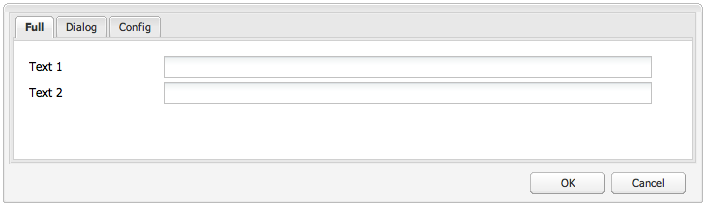
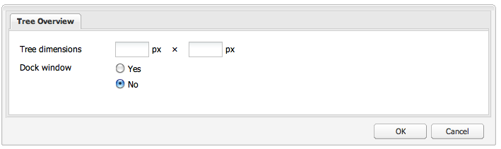

# 使用和扩展构件（经典UI）{#using-and-extending-widgets-classic-ui}

Adobe Experience Manager的基于Web的界面使用AJAX和其他现代浏览器技术，使作者能够直接在网页上对内容进行WYSIWYG编辑和格式化。

Adobe Experience Manager(AEM)使 [用ExtJS](https://www.sencha.com/) widgets库，它提供高度精致的用户界面元素，这些元素可在所有最重要的浏览器上工作，并可创建桌面级UI体验。

这些构件包含在AEM中，除了由AEM本身使用外，还可供使用AEM构建的任何网站使用。

要获得对AEM中所有可用构件的完整参考，您可以参 [阅构件API文档](https://helpx.adobe.com/experience-manager/6-4/sites/developing/using/reference-materials/widgets-api/index.html) ，或查 [看现有xtypes的列表](/help/sites-developing/xtypes.md)。 此外，Sencha站点（框架的所有者）上还提供了许 [多说明](https://www.sencha.com/products/extjs/examples/) 如何使用ExtJS框架的示例。

本页对如何使用和扩展构件提供了一些见解。 它首先介绍如 [何在页面中包含客户端代码](#including-the-client-sided-code-in-a-page)。 然后，它描述了为说明一些基本用途和扩展而创建的一些示例组件。 这些组件在包共享 **上的使用ExtJS** 构件 **包中可用**。

该包包括以下示例：

* [使用现成](#basic-dialogs) 构件构建的基本对话框。
* [使用现成](#dynamic-dialogs) 构件和自定义的javascript逻辑构建的动态对话框。
* 基于自定义构 [件的对话框](#custom-widgets)。
* 在给 [定路径下](#tree-overview) ，显示JCR树的树面板。
* 以表 [格格式](#grid-overview) 显示数据的网格面板。

>[!NOTE]
>
>Adobe Experience Manager的经典UI基于 [ExtJS 3.4.0构建](https://extjs.cachefly.net/ext-3.4.0/docs/)。

>[!NOTE]
>
>本页介绍在经典UI中使用构件的情况。 Adobe建议您基于Coral UI [和Granite UI](/help/sites-developing/touch-ui-concepts.md) ，利 [用新式触](/help/sites-developing/touch-ui-concepts.md#coral-ui) 屏优 [化UI](/help/sites-developing/touch-ui-concepts.md#granite-ui-foundation-components)。

## 在页面中包括客户端代码 {#including-the-client-sided-code-in-a-page}

客户端javascript和样式表代码应放在客户端库中。

要创建客户端库，请执行以下操作：

1. 使用以下属 `/apps/<project>` 性创建一个节点：

   ```
       name="clientlib"
       jcr:mixinTypes="[mix:lockable]"
       jcr:primaryType="cq:ClientLibraryFolder" 
       sling:resourceType="widgets/clientlib" 
       categories="[<category-name>]" 
       dependencies="[cq.widgets]"
   ```

   >[!NOTE]
   >
   >注意： `<category-name>` 是自定义库的名称(例如， “cq.extjtreng”)，用于在页面中包含库。

1. 在下 `clientlib` 面创 `css` 建和 `js` 文件夹(nt:folder)。

1. 在下 `clientlib` 面创 `css.txt` 建 `js.txt` 和文件(nt:files)。 这些。txt文件列表库中包含的文件。

1. 编辑 `js.txt`: 它需要开始“ ” `#base=js`，然后列表将由CQ客户端库服务聚集的文件，例如：

   ```
   #base=js
    components.js
    exercises.js
    CustomWidget.js
    CustomBrowseField.js
    InsertTextPlugin.js
   ```

1. 编辑 `css.txt`: 它需要开始“ ” `#base=css`，然后列表将由CQ客户端库服务聚集的文件，例如：

   ```
   #base=css
    components.css
   ```

1. 在文 `js` 件夹下，放置属于库的javascript文件。

1. 在文 `css` 件夹下，放 `.css` 置css文件使用的文件和资源(例如， `my_icon.png`)。

>[!NOTE]
>
>之前描述的样式表的处理是可选的。

要在页面组件jsp中包含客户端库，请执行以下操作：

* 要同时包括javascript代码和样式表：

   `<ui:includeClientLib categories="<category-name1>, <category-name2>, ..."/>`

   其中 `<category-nameX>` 是客户端库的名称。

* 要仅包含javascript代码，请执行以下操作：

   `<ui:includeClientLib js="<category-name>"/>`

有关详细信息，请参阅&lt;ui:includeClientLib [>标记的说明](/help/sites-developing/taglib.md#amp-lt-ui-includeclientlib) 。

在某些情况下，客户端库应仅在创作模式下可用，并应在发布模式下排除。 具体实现如下：

```xml
    if (WCMMode.fromRequest(request) != WCMMode.DISABLED) {
        %><ui:includeClientLib categories="cq.collab.blog"/><%
    }
```

### 范例入门 {#getting-started-with-the-samples}

要按照本页中的教程操作，请在本 **地AEM实例中安装** “使用ExtJS构件”包，并创建一个包含这些组件的示例页面。 为此，请执行以下操作：

1. 在AEM实例中，从“包共享” **下载名为“使用ExtJS构件** (v01)”的包并安装该包。 它会在存储库 `extjstraining` 中 `/apps` 创建以下项目。

1. 将包含脚本(js)和样式表(css)的客户端库包含在geometrixx页面jsp的head标签中，因为您将在Geometrixx分支的新页面中包含示例组 **件** :

   在 **CRXDE Lite** 中，打开文 `/apps/geometrixx/components/page/headlibs.jsp` 件，并将 `cq.extjstraining` 类别添加到现有标 `<ui:includeClientLib>` 记，如下所示：

   `%><ui:includeClientLib categories="apps.geometrixx-main, cq.extjstraining"/><%`

1. 在下面的Geometrixx分 **支中** ，创建 `/content/geometrixx/en/products` 新页面 **，并将其**&#x200B;命名为“使用ExtJS构件”。

1. 进入设计模式，将名为“使用ExtJS构件”的组 **的所有组件添加** 到Geometrixx设计中
1. 在编辑模式下返回： “使用ExtJS构 **件”组的组** 件可在Sidekick中使用。

>[!NOTE]
>
>本页中的示例基于Geometrixx示例内容，该内容不再随AEM一起提供，而已被We.Retail替换。 有关如何下 [载和安装文档](/help/sites-developing/we-retail.md#we-retail-geometrixx) ，请参阅GeometrixxWe.Retail Reference Implementation。

### 基本对话框 {#basic-dialogs}

对话框通常用于编辑内容，但也只能显示信息。 视图完整对话框的一种简单方法是访问其json格式的表示形式。 为此，请将浏览器指向：

`http://localhost:4502/<path-to-dialog>.-1.json`

在Sidekick中使用 **ExtJS构件** 组的第一个组件称为 **1。 对话框基础** ，包括四个基本对话框，这些基本对话框是使用现成构件构建的，并且没有自定义的javascript逻辑。 对话框存储在下面 `/apps/extjstraining/components/dialogbasics`。 基本对话框包括：

* 完整对话框( `full` 节点): 它显示一个包含3个选项卡的窗口，每个选项卡都包含2个文本字段。

* 单面板对话框( `singlepanel` 节点): 它显示一个窗口，其中包含1个选项卡，其中包含2个文本字段。
* 多面板对话框( `multipanel` 节点): 其显示与“完整”对话框相同，但构建方式不同。
* 设计对话框(节 `design` 点): 它显示一个包含2个选项卡的窗口。 第一个选项卡具有文本字段、下拉菜单和可折叠的文本区域。 第二个选项卡具有一个字段集（4个文本字段）和一个可折叠字段集（2个文本字段）。

包括 **1。 示例页面中** 的对话框基础组件：

1. 添加1 **。 对话框** “基础知识”组件，该组件位于 **Sidekick中使用ExtJS构件** 选项卡 **的示例页面**。

1. 该组件显示标题、一些文本和 **属性** 链接： 单击链接以显示存储在存储库中的段落的属性。 再次单击链接以隐藏属性。

组件显示如下：


#### 示例1: 完整对话框 {#example-full-dialog}

“完 **整”** (Full)对话框显示一个窗口，其中有三个选项卡，每个选项卡都有两个文本字段。 它是对话框基础组件的默 **认对话框** 。 其特点是：

* 由节点定义： 节点类型= `cq:Dialog`, xtype = [`dialog`](/help/sites-developing/xtypes.md#dialog)。

* 显示3个选项卡(节点类型 `cq:Panel`=)。
* 每个选项卡都有2个文本字段(节点类 `cq:Widget`型=,xtype [`textfield`](/help/sites-developing/xtypes.md#textfield)=)。

* 由节点定义：

   `/apps/extjstraining/components/dialogbasics/full`

* 通过请求：

   `http://localhost:4502/apps/extjstraining/components/dialogbasics/full.-1.json`

对话框显示如下：



#### 示例2: 单面板对话框 {#example-single-panel-dialog}

“单 **个面板** ”对话框显示一个窗口，其中一个选项卡具有两个文本字段。 其特点是：

* 显示1个选项卡(节点类 `cq:Dialog`型=, xtype = [`panel`](/help/sites-developing/xtypes.md#panel))

* 选项卡有2个文本字段(节点类 `cq:Widget`型=,xtype = [`textfield`](/help/sites-developing/xtypes.md#textfield))

* 由节点定义：

   `/apps/extjstraining/components/dialogbasics/singlepanel`

* 通过请求以json格式呈现：

   `http://localhost:4502/apps/extjstraining/components/dialogbasics/singlepanel.-1.json`

* 与完整对话框相 **比** ，一个优势是需要的配置更少。
* 建议使用： 用于显示信息或只有几个字段的简单对话框。

要使用“单面板”对话框：

1. 将对话框基础 **组件的对** 话框替换 **为单个面板** :

   1. 在 **CRXDE Lite**，删除节点： `/apps/extjstraining/components/dialogbasics/dialog`
   1. Click **Save All** to save the changes.
   1. 复制节点： `/apps/extjstraining/components/dialogbasics/singlepanel`
   1. 将复制的节点粘贴到以下位置： `/apps/extjstraining/components/dialogbasics`
   1. 选择节点： `/apps/extjstraining/components/dialogbasics/Copy of singlepanel`然后重命名 `dialog`。

1. 编辑组件： 对话框显示如下：


#### 示例3: 多面板对话框 {#example-multi-panel-dialog}

“多 **面板** ”对话框的显示与“完整”对话框的显 **示相同** ，但构建方式不同。 其特点是：

* 由节点定义(节点类型=, `cq:Dialog`xtype = [`tabpanel`](/help/sites-developing/xtypes.md#tabpanel))。

* 显示3个选项卡(节点类型 `cq:Panel`=)。
* 每个选项卡都有2个文本字段(节点类 `cq:Widget`型=,xtype [`textfield`](/help/sites-developing/xtypes.md#textfield)=)。

* 由节点定义：

   `/apps/extjstraining/components/dialogbasics/multipanel`

* 通过请求以json格式呈现：

   `http://localhost:4502/apps/extjstraining/components/dialogbasics/multipanel.-1.json`

* 与“完整对话 **框”相比** ，其优势在于其结构简化。

* 建议使用： 的双曲余切值。

要使用多面板对话框：

1. 将对话框基础 **组件的对话框** 替换为 **多面板对话框** :

   按照示例2中描述的 [步骤操作： 单面板对话框](#example-single-panel-dialog)

1. 编辑组件： 对话框显示如下：


#### 示例4: 富对话框 {#example-rich-dialog}

“ **富** ”对话框显示一个包含两个选项卡的窗口。 第一个选项卡具有文本字段、下拉菜单和可折叠的文本区域。 第二个选项卡具有一个字段集，其中包含四个文本字段，以及一个可折叠字段集，其中包含两个文本字段。 其特点是：

* 由节点定义(节点类型=, `cq:Dialog`xtype = [`dialog`](/help/sites-developing/xtypes.md#dialog))。

* 显示2个选项卡(节点类型 `cq:Panel`=)。
* 第一个选项卡具有 [`dialogfieldset`](/help/sites-developing/xtypes.md#dialogfieldset) 带有一个 [`textfield`](/help/sites-developing/xtypes.md#textfield) 构件和一个 [`selection`](/help/sites-developing/xtypes.md#selection) 带有3个选项的构件，以及带有构件 [`dialogfieldset`](/help/sites-developing/xtypes.md#dialogfieldset) 的可折叠 [`textarea`](/help/sites-developing/xtypes.md#textarea) 构件。

* 第二个选项卡具有 [`dialogfieldset`](/help/sites-developing/xtypes.md#dialogfieldset) 带4个构件 [`textfield`](/help/sites-developing/xtypes.md#textfield) 的构件和带2个构件 `dialogfieldset` 的可折叠 [`textfield`](/help/sites-developing/xtypes.md#textfield) 构件。

* 由节点定义：

   `/apps/extjstraining/components/dialogbasics/rich`

* 通过请求以json格式呈现：

   `http://localhost:4502/apps/extjstraining/components/dialogbasics/rich.-1.json`

要使用“富 **”对话框** :

1. 将对话框基础 **组件的对话** ，替换为 **富对话框** :

   按照示例2中描述的 [步骤操作： 单面板对话框](#example-single-panel-dialog)

1. 编辑组件： 对话框显示如下：


### 动态对话框 {#dynamic-dialogs}

在Sidekick中使用 **ExtJS构件** 组的第二个组件称为 **2。 动态对话框** ，包括三个动态对话框，它们是使用现成的构件和自定义的javascript逻 **辑构建的**。 对话框存储在下面 `/apps/extjstraining/components/dynamicdialogs`。 动态对话框包括：

* 切换选项卡对话框( `switchtabs` 节点): 它显示一个包含两个选项卡的窗口。 第一个选项卡有一个单选按钮选项，其中包含三个选项： 选择某个选项时，将显示与该选项相关的选项卡。 第二个选项卡包含两个文本字段。
* 任意对话框( `arbitrary` 节点): 它显示一个带有一个选项卡的窗口。 该选项卡包含一个用于拖放或上传资产的字段，以及一个用于显示有关包含页面以及资产（如果引用了页面）的某些信息的字段。
* 切换字段对话框( `togglefield` 节点): 它显示一个带有一个选项卡的窗口。 该选项卡包含复选框： 选中后，将显示包含两个文本字段的字段集。

包含2 **。 示例页面上** ，动态对话框组件：

1. 添加2 **。 动态对话** 框组件，该组件位于Sidekick中 **使用ExtJS构件** 选项卡的 **示例页面**。

1. 该组件显示标题、一些文本和 **属性** 链接： 单击以显示存储在存储库中的段落的属性。 再次单击可隐藏属性。

组件显示如下：


#### 示例1: 切换选项卡对话框 {#example-switch-tabs-dialog}

切换 **选项卡** (Switch Tabs)对话框显示一个包含两个选项卡的窗口。 第一个选项卡有一个单选按钮选项，其中包含三个选项： 选择某个选项时，将显示与该选项相关的选项卡。 第二个选项卡包含两个文本字段。

其主要特点是：

* 由节点定义(节点类型=, `cq:Dialog`xtype = [`dialog`](/help/sites-developing/xtypes.md#dialog))。

* 显示2个选项卡(节点类型= `cq:Panel`): 1选项卡，第2个选项卡取决于第1个选项卡（3个选项）中的选择。
* 有3个可选选项卡(节点类 `cq:Panel`型=)，每个选项卡都有2个文本字段(节点类型 `cq:Widget`=,xtype = [`textfield`](/help/sites-developing/xtypes.md#textfield))。 一次只显示一个可选选项卡。

* 由位于以下位置 `switchtabs` 的节点定义：

   `/apps/extjstraining/components/dynamicdialogs/switchtabs`

* 通过请求以json格式呈现：

   `http://localhost:4502/apps/extjstraining/components/dynamicdialogs/switchtabs.-1.json`

该逻辑通过事件监听器和javascript代码实现，如下所示：

* 对话框节点具有一个“ `beforeshow`”侦听器，它在显示对话框之前隐藏所有可选选项卡：

   `beforeshow="function(dialog){Ejst.x2.manageTabs(dialog.items.get(0));}"`

   `dialog.items.get(0)` 获取包含选择面板和3个可选面板的tabpanel。

* 该对 `Ejst.x2` 象在以下位置的 `exercises.js` 文件中定义：

   `/apps/extjstraining/clientlib/js/exercises.js`

* 在方 `Ejst.x2.manageTabs()` 法中，当值 `index` 为-1时，所有可选选项卡都处于隐藏状态（i从1到3）。

* 选择选项卡具有2个监听器： 一个选项卡在加载对话框时显示选定的选项卡( `loadcontent`“事件”)，另一个选项卡在更改选择时显示选定的选项卡(“ `selectionchanged`”事件):

   `loadcontent="function(field,rec,path){Ejst.x2.showTab(field);}"`

   `selectionchanged="function(field,value){Ejst.x2.showTab(field);}"`

* 在方 `Ejst.x2.showTab()` 法中：

   `field.findParentByType('tabpanel')` 获取包含所有选项卡的表面板( `field` 表示选择构件)

   `field.getValue()` 获取选择的值，例如： tab2

   `Ejst.x2.manageTabs()` 显示所选选项卡。

* 每个可选选项卡都有一个监听器，它隐藏“ ”事件 `render`上的选项卡：

   `render="function(tab){Ejst.x2.hideTab(tab);}"`

* 在方 `Ejst.x2.hideTab()` 法中：

   `tabPanel` 是包含所有选项卡的tabpanel

   `index` 是可选选项卡的索引

   `tabPanel.hideTabStripItem(index)` 隐藏选项卡

它显示如下：


#### 示例2: 任意对话框 {#example-arbitrary-dialog}

通常，对话框会显示基础组件中的内容。 此处描述的对话框称 **为“任意** ”对话框，可从其他组件中提取内容。

“任 **意** ”对话框显示一个包含一个选项卡的窗口。 选项卡包含两个字段： 一个用于拖放或上传资产，另一个用于显示有关包含页面以及资产（如果某个页面已被引用）的某些信息。

其主要特点是：

* 由节点定义(节点类型=, `cq:Dialog`xtype = [`dialog`](/help/sites-developing/xtypes.md#dialog))。

* 显示1个Tabpanel构件(节点类 `cq:Widget`型=, xtype = [`tabpanel`](/help/sites-developing/xtypes.md#tabpanel))，带有1个面板(节点类型= `cq:Panel`)

* 该面板有一个smartfile构件(节点类型= `cq:Widget`, xtype = [`smartfile`](/help/sites-developing/xtypes.md#smartfile))和一个ownerdraw构件(节点类型= `cq:Widget`, xtype = [`ownerdraw`](/help/sites-developing/xtypes.md#ownerdraw))

* 由位于以下位置 `arbitrary` 的节点定义：

   `/apps/extjstraining/components/dynamicdialogs/arbitrary`

* 通过请求以json格式呈现：

   `http://localhost:4502/apps/extjstraining/components/dynamicdialogs/arbitrary.-1.json`

该逻辑通过事件监听器和javascript代码实现，如下所示：

* ownerdraw构件有一个“ `loadcontent`”监听器，它显示加载内容时包含组件的页面和智能文件构件引用的资产的相关信息：

   `loadcontent="function(field,rec,path){Ejst.x2.showInfo(field,rec,path);}"`

   `field` 是使用ownerdraw对象设置的

   `path` 设置为组件的内容路径(例如： /content/geometrixx/cn/products/triangle/ui-tutorial/jcr:content/par/dynamicdialogs)

* 该对 `Ejst.x2` 象在以下位置的 `exercises.js` 文件中定义：

   `/apps/extjstraining/clientlib/js/exercises.js`

* 在方 `Ejst.x2.showInfo()` 法中：

   `pagePath` 是包含组件的页面的路径

   `pageInfo` 表示json格式的页面属性

   `reference` 是引用资产的路径

   `metadata` 以json格式表示资产的元数据

   `ownerdraw.getEl().update(html);` 在对话框中显示创建的html

要使用“任意 **”对话框** :

1. 将动态对话框组 **件的对话框** 替换为 **任意对话框** :

   按照示例2中描述的 [步骤操作： 单面板对话框](#example-single-panel-dialog)

1. 编辑组件： 对话框显示如下：


#### 示例3: 切换字段对话框 {#example-toggle-fields-dialog}

“切 **换字段** ”对话框显示一个带有一个选项卡的窗口。 该选项卡包含复选框： 选中后，将显示包含两个文本字段的字段集。

其主要特点是：

* 由节点定义(节点类型=, `cq:Dialog`xtype = [`dialog`](/help/sites-developing/xtypes.md#dialog))。

* 显示1个Tabpanel构件(节点类 `cq:Widget`型=, xtype = [`tabpanel`](/help/sites-developing/xtypes.md#textpanel))，带有1个面板(节点类型= `cq:Panel`)。

* 该面板具有一个选择／复选框构件(节点类型 `cq:Widget`=、xtype [`selection`](/help/sites-developing/xtypes.md#selection)=、类型 [`checkbox`](/help/sites-developing/xtypes.md#checkbox)=)和一个可折叠的对话框字段集构件（节点类型=、xtype =），该构件默认为隐藏，其中有2个文本字段构件(节点类型 `cq:Widget`=、xtype = [`dialogfieldset`](/help/sites-developing/xtypes.md#dialogfieldset)`cq:Widget`[`textfield`](/help/sites-developing/xtypes.md#textfield))。

* 由位于以下位置 `togglefields` 的节点定义：

   `/apps/extjstraining/components/dynamicdialogs/togglefields`

* 通过请求以json格式呈现：

   `http://localhost:4502/apps/extjstraining/components/dynamicdialogs/togglefields.-1.json`

该逻辑通过事件监听器和javascript代码实现，如下所示：

* 选择选项卡具有2个监听器： 一个显示加载内容时的对话框字段集(“ `loadcontent`”事件)，另一个显示更改选择时的对话框字段集(“ `selectionchanged`”事件):

   `loadcontent="function(field,rec,path){Ejst.x2.toggleFieldSet(field);}"`

   `selectionchanged="function(field,value){Ejst.x2.toggleFieldSet(field);}"`

* 该对 `Ejst.x2` 象在以下位置的 `exercises.js` 文件中定义：

   `/apps/extjstraining/clientlib/js/exercises.js`

* 在方 `Ejst.x2.toggleFieldSet()` 法中：

   * `box` 是选择对象
   * `panel` 是包含选定内容和对话框字段集构件的面板
   * `fieldSet` 是dialogfieldset对象
   * `show` 是选择的值（true或false）
   * 显示或不 `show`显示基于“ ”的对话框字段集

要使用“切换字 **段”对话框** :

1. 将动态对话框组 **件的对话框** 替换为 **切换字段对话框** :

   按照示例2中描述的 [步骤操作： 单面板对话框](#example-single-panel-dialog)

1. 编辑组件： 对话框显示如下：


### 自定义构件 {#custom-widgets}

AEM附带的现成构件应涵盖大多数使用案例。 但是，有时可能需要创建自定义构件来满足特定项目的要求。 可通过扩展现有构件来创建自定义构件。 为帮助您开始进行此类自定义，“使 **用ExtJS构件** ”包包含三个使用三个不同自定义构件的对话框：

* 多字段对话框(节 `multifield` 点)显示一个带有一个选项卡的窗口。 该选项卡具有一个自定义的多字段构件，该构件具有两个字段： 包含两个选项的下拉菜单和一个文本字段。 由于它基于现成构件(只 `multifield` 有一个文本字段)，因此具有该构件的所有功 `multifield` 能。

* 树浏览对话框(节 `treebrowse` 点)显示一个窗口，其中一个选项卡包含路径浏览构件： 单击箭头时，将打开一个窗口，您可以在其中浏览层次结构并选择项目。 项目的路径随后会添加到路径字段，并在关闭对话框时保留。
* 一个基于富文本编辑器插件的对话框( `rteplugin` 节点)，它向富文本编辑器中添加一个自定义按钮，以将一些自定义文本插入主文本。 它由构件( `richtext` RTE)和通过RTE插件机制添加的自定义功能组成。

自定义构件和插件包含在名为3的组 **件中。 使用ExtJS** 构件包 **的自定义构件** 。 要将此组件包含到示例页面，请执行以下操作：

1. 添加 **3。 自定义构件** 组件，可从Sidekick中的“使 **用ExtJS构件** ”选项卡将其 **添加到示例页**。

1. 该组件显示标题、一些文本，在单击“属 **性** ”链接时，还显示存储在存储库中的段落的属性。 再次单击会隐藏属性。

   组件显示如下：


#### 示例1: 自定义多字段构件 {#example-custom-multifield-widget}

基于 **自定义多字段** 构件的对话框显示一个包含一个选项卡的窗口。 该选项卡具有自定义的多字段构件，该构件与具有一个字段的标准构件不同，具有两个字段： 包含两个选项的下拉菜单和一个文本字段。

基于 **自定义多字** 段构件的对话框：

* 由节点定义(节点类型=, `cq:Dialog`xtype = [`dialog`](/help/sites-developing/xtypes.md#dialog))。

* 显示1个包含面板(节点类 `cq:Widget`型=, [`tabpanel`](/help/sites-developing/xtypes.md#tabpanel)xtype =)的表面板构件(节点类型 `cq:Widget`=, xtype = [`panel`](/help/sites-developing/xtypes.md#panel))。

* 该面板有一个 `multifield` 构件(节点类型 `cq:Widget`=,xtype = [`multifield`](/help/sites-developing/xtypes.md#multifield))。

* 构 `multifield` 件具有基于自定义xtype &#39; `nt:unstructured`&#39;的fieldconfig(节点类型 `ejstcustom`=, xtype =，选 `Ejst.x3.provideOptions`项提供程序= `ejstcustom`):

   * “ `fieldconfig`”是对象的配置选 [`CQ.form.MultiField`](https://helpx.adobe.com/experience-manager/6-4/sites/developing/using/reference-materials/widgets-api/index.html?class=CQ.form.MultiField) 项。
   * “ `optionsProvider`”是构件的配 `ejstcustom` 置。 它使用在以下 `Ejst.x3.provideOptions` 位置定义的方 `exercises.js` 法设置：

      `/apps/extjstraining/clientlib/js/exercises.js`

      并返回2个选项。

* 由位于以下位置 `multifield` 的节点定义：

   `/apps/extjstraining/components/customwidgets/multifield`

* 通过请求以json格式呈现：

   `http://localhost:4502/apps/extjstraining/components/customwidgets/multifield.-1.json`

自定义多字段构件(xtype = `ejstcustom`):

* 是一个名为javascript的对象 `Ejst.CustomWidget`。

* 在javascript文件中 `CustomWidget.js` 定义，网址为：

   `/apps/extjstraining/clientlib/js/CustomWidget.js`

* 扩展构 [`CQ.form.CompositeField`](https://helpx.adobe.com/experience-manager/6-4/sites/developing/using/reference-materials/widgets-api/index.html?class=CQ.form.CompositeField) 件。

* 包含3个字段： `hiddenField` （文本字段） `allowField` 、（组合框） `otherField` 和（文本字段）

* 添 `CQ.Ext.Component#initComponent` 加3个字段的重写：

   * `allowField` 是类型为 [“select](https://helpx.adobe.com/experience-manager/6-4/sites/developing/using/reference-materials/widgets-api/index.html?class=CQ.form.Selection) ”的CQ.form.Selection对象。 optionsProvider是Selection对象的配置，它使用对话框中定义的CustomWidget的optionsProvider配置进行实例化
   * `otherField` 是 [CQ.Ext.form.TextField对象](https://helpx.adobe.com/experience-manager/6-4/sites/developing/using/reference-materials/widgets-api/index.html?class=CQ.Ext.form.TextField)

* 重写CQ `setValue`.form `getValue` . `getRawValue` CompositeField的方 [法和方法](https://helpx.adobe.com/experience-manager/6-4/sites/developing/using/reference-materials/widgets-api/index.html?class=CQ.form.CompositeField) ，以设置和检索格式为CustomWidget的值：

   `<allowField value>/<otherField value>, e.g.: 'Bla1/hello'`。

* 将自身注册为“ `ejstcustom`” xtype:

   `CQ.Ext.reg('ejstcustom', Ejst.CustomWidget);`

基于 **自定义多字段** 构件的对话框显示如下：


#### 示例2: 自定义树状浏览构件 {#example-custom-treebrowse-widget}

基于树 **状浏览构** 件的自定义对话框显示一个窗口，其中一个选项卡包含一个自定义路径浏览构件： 单击箭头时，将打开一个窗口，您可以在其中浏览层次结构并选择项目。 项目的路径随后会添加到路径字段，并在关闭对话框时保留。

自定义树浏览对话框：

* 由节点定义(节点类型=, `cq:Dialog`xtype = [`dialog`](/help/sites-developing/xtypes.md#dialog))。

* 显示1个包含面板(节点类 `cq:Widget`型=, [`tabpanel`](/help/sites-developing/xtypes.md#tabpanel)xtype =)的表面板构件(节点类型 `cq:Widget`=, xtype = [`panel`](/help/sites-developing/xtypes.md#panel))。

* 该面板具有自定义构件(节点类型 `cq:Widget`=,xtype = `ejstbrowse`)

* 由位于以下位置 `treebrowse` 的节点定义：

   `/apps/extjstraining/components/customwidgets/treebrowse`

* 通过请求以json格式呈现：

   `http://localhost:4502/apps/extjstraining/components/customwidgets/treebrowse.-1.json`

自定义树状浏览构件(xtype = `ejstbrowse`):

* 是一个名为javascript的对象 `Ejst.CustomWidget`。
* 在javascript文件中 `CustomBrowseField.js` 定义，网址为：

   `/apps/extjstraining/clientlib/js/CustomBrowseField.js`

* 扩展 [`CQ.Ext.form.TriggerField`](https://helpx.adobe.com/experience-manager/6-4/sites/developing/using/reference-materials/widgets-api/index.html?class=CQ.Ext.form.TriggerField)。
* 定义一个名为的浏览窗口 `browseWindow`。

* 重写 [`CQ.Ext.form.TriggerField`](https://helpx.adobe.com/experience-manager/6-4/sites/developing/using/reference-materials/widgets-api/index.html?class=CQ.Ext.form.TriggerField#onTriggerClick) 在单击箭头时显示浏览窗口。
* 定义对 [`CQ.Ext.tree.TreePanel`](https://helpx.adobe.com/experience-manager/6-4/sites/developing/using/reference-materials/widgets-api/index.html?class=CQ.Ext.tree.TreePanel) 象：

   * 它通过调用在注册的servlet获取其数据 `/bin/wcm/siteadmin/tree.json`。
   * 其根为“ `apps/extjstraining`”。

* 定义 `window` 对象([`CQ.Ext.Window`](https://helpx.adobe.com/experience-manager/6-4/sites/developing/using/reference-materials/widgets-api/index.html?class=CQ.Ext.Window)):

   * 基于预定义面板。
   * 有一个 **“确定** ”按钮，用于设置选定路径的值并隐藏面板。

* 窗口定位在“路径” **字段下** 。
* 所选路径将从浏览字段传递到事件 `show` 窗口。

* 将自身注册为“ `ejstbrowse`” xtype:

   `CQ.Ext.reg('ejstbrowse', Ejst.CustomBrowseField);`

要使用基于自 **定义树状浏览** 构件的对话框：

1. 将“自定义构件”组 **件的对话框** 替换为“自 **定义树状浏览”对话框** :

   按照示例2中描述的 [步骤操作： 单面板对话框](#example-single-panel-dialog)

1. 编辑组件： 对话框显示如下：


#### 示例3: 富文本编辑器(RTE)插件 {#example-rich-text-editor-rte-plug-in}

基 **于富文本编辑器(RTE)插件的对话框是基于富文本编辑器** (Rich Text Editor)的对话框，它包含一个自定义按钮，用于在方括号内插入一些自定义文本。 自定义文本可由某些服务器端逻辑分析（本例中未实现），例如添加在给定路径中定义的一些文本：

基于 **RTE插件** 的对话框：

* 由返回插件节点在以下位置定义：

   `/apps/extjstraining/components/customwidgets/rteplugin`

* 通过请求以json格式呈现：

   `http://localhost:4502/apps/extjstraining/components/customwidgets/rteplugin.-1.json`

* 节 `rtePlugins` 点有一个以插件 `inserttext` 命名的子节点( `nt:unstructured`节点类型=)。 它有一个名为的 `features`属性，它定义RTE可使用的插件功能。

RTE插件：

* 是一个名为javascript的对象 `Ejst.InsertTextPlugin`。

* 在javascript文件中 `InsertTextPlugin.js` 定义，网址为：

   `/apps/extjstraining/clientlib/js/InsertTextPlugin.js`

* 扩展对 [`CQ.form.rte.plugins.Plugin`](https://helpx.adobe.com/experience-manager/6-4/sites/developing/using/reference-materials/widgets-api/index.html?class=CQ.form.rte.plugins.Plugin) 象。
* 以下方法定义对 [`CQ.form.rte.plugins.Plugin`](https://helpx.adobe.com/experience-manager/6-4/sites/developing/using/reference-materials/widgets-api/index.html?class=CQ.form.rte.plugins.Plugin) 象，并在实现插件中被覆盖：

   * `getFeatures()` 返回插件可用的所有功能的数组。
   * `initializeUI()` 将新按钮添加到RTE工具栏。
   * `notifyPluginConfig()` 悬停按钮时显示标题和文本。
   * `execute()` 在单击按钮时调用，并执行插件操作： 它显示一个窗口，用于定义要包含的文本。

* `insertText()` 使用相应的对话框对象插入文 `Ejst.InsertTextPlugin.Dialog` 本（请参阅之后）。

* `executeInsertText()` 由对话框 `apply()` 的方法调用，单击“确定”按钮 **时** 将触发该方法。

* 将自身注册为“ `inserttext`”插件：

   `CQ.form.rte.plugins.PluginRegistry.register("inserttext", Ejst.InsertTextPlugin);`

* 对 `Ejst.InsertTextPlugin.Dialog` 象定义单击插件按钮时打开的对话框。 该对话框由面板、表单、文本字段和2个按钮(**确定****和取消**)。

要使用基 **于富文本编辑器(RTE)插件的对话框** ，请执行以下操作：

1. 将自定义构件组 **件的对话框****替换为基于富文本编辑器(RTE)插件** 的对话框：

   按照示例2中描述的 [步骤操作： 单面板对话框](#example-single-panel-dialog)

1. 编辑组件。
1. 单击右侧的最后一个图标（带四个箭头的图标）。 输入路径，然后单击“ **确定**”:

   路径显示在括号()`[]`中。

1. 单击 **确定** ，关闭富文本编辑器。

基 **于富文本编辑器(RTE)插件的对话框** ，如下所示：


>[!NOTE]
>
>此示例仅说明如何实现逻辑的客户端部分： 然后，*[必须]*&#x200B;在服务器端显式分析占位符（文本）（例如，在组件JSP中）。

### 树概述 {#tree-overview}

现成对象提供树 [`CQ.Ext.tree.TreePanel`](https://helpx.adobe.com/experience-manager/6-4/sites/developing/using/reference-materials/widgets-api/index.html?class=CQ.Ext.tree.TreePanel) 结构化数据的树结构化UI表示。 使用ExtJS构件包中包 **含的树概述组件** ，显示如 `TreePanel` 何使用对象在给定路径下显示JCR树。 窗口本身可以停靠／取消停放。 在此示例中，窗口逻辑嵌入到组件jsp中的&lt;script>&lt;/script>标签之间。

要将树概 **述组件包含** 到示例页面，请执行以下操作：

1. 添加4 **。 从Sidekick中** “使用ExtJS构件”选 **项卡将“概述** ”组件树 **定义到示例页**。

1. 此时会显示以下组件：

   * 标题，带有一些文本
   * 属性 **链接** : 单击以显示存储在存储库中的段落的属性。 再次单击可隐藏属性。
   * 一个浮动窗口，具有存储库的树形表示，可以展开它。

组件显示如下：


树概述组件：

* 定义于：

   `/apps/extjstraining/components/treeoverview`

* 其对话框用于设置窗口的大小和停靠／取消停靠窗口（请参阅下面的详细信息）。

组件jsp:

* 从存储库中检索宽度、高度和停靠属性。
* 显示有关树概述数据格式的一些文本。
* 在javascript标签之间的组件jsp中嵌入窗口逻辑。
* 定义于：

   `apps/extjstraining/components/treeoverview/content.jsp`

组件jsp中嵌入的javascript代码：

* 通过尝 `tree` 试从页面检索树窗口来定义对象。

* 如果显示树的窗口不存在， `treePanel` 则[会创建(CQ.Ext.tree.TreePanel](https://helpx.adobe.com/experience-manager/6-4/sites/developing/using/reference-materials/widgets-api/index.html?class=CQ.Ext.tree.TreePanel)):

   * `treePanel` 包含用于创建窗口的数据。
   * 通过调用在以下位置注册的servlet来检索数据：
      `/bin/wcm/siteadmin/tree.json`

* 监听 `beforeload` 器确保已加载单击的节点。
* 对 `root` 象将路径设 `apps/extjstraining` 置为树根。
* `tree` ([`CQ.Ext.Window`](https://helpx.adobe.com/experience-manager/6-4/sites/developing/using/reference-materials/widgets-api/index.html?class=CQ.Ext.Window))根据预定义进行设置 `treePanel`，并显示为：

   `tree.show();`

* 如果窗口已存在，则根据从存储库检索到的宽度、高度和停靠属性显示该窗口。

组件对话框：

* 显示1个选项卡，其中包含2个字段，用于设置树概述窗口的大小（宽度和高度）,1个字段用于停放／取消停放窗口
* 由节点定义(节点类型=, `cq:Dialog`xtype = [`panel`](/help/sites-developing/xtypes.md#panel))。

* 该面板有一个大小字段构件(节点类型 `cq:Widget`=, xtype = [`sizefield`](/help/sites-developing/xtypes.md#sizefield))和一个选择构件(节点类型 `cq:Widget`=, xtype = [`selection`](/help/sites-developing/xtypes.md#selection)，类型= `radio`)，其中包含2个选项(true/false)

* 由对话框节点在以下位置定义：

   `/apps/extjstraining/components/treeoverview/dialog`

* 通过请求以json格式呈现：

   `http://localhost:4502/apps/extjstraining/components/treeoverview/dialog.-1.json`

* 显示如下：



### 网格概述 {#grid-overview}

网格面板以行和列的表格格式表示数据。 它由以下几部分组成：

* 商店： 保存数据记录（行）的模型。
* 列模型： 专栏的组成。
* 视图: 封装用户界面。
* 选择模型： 选择行为。

“使用ExtJS构件”包中包 **含的“网格概述** ”组件显示了如何以表格格式显示数据：

* 示例1使用静态数据。
* 示例2使用从存储库检索的数据。

要将“网格概述”组件包含到示例页面，请执行以下操作：

1. 添加 **5。 网格概述** 组件，该组件位于Sidekick中 **使用ExtJS构件** 选项卡的 **示例页面**。

1. 此时会显示以下组件：

   * 带有文本的标题
   * 属性 **链接** : 单击以显示存储在存储库中的段落的属性。 再次单击可隐藏属性。
   * 包含表格格式数据的浮动窗口。

组件显示如下：


#### 示例1: 默认网格 {#example-default-grid}

在现成版本中，网格概述组 **件以表格格式** 显示一个包含静态数据的窗口。 在此示例中，逻辑以两种方式嵌入到组件jsp中：

* 通用逻辑在&lt;script>&lt;/script>标记之间定义
* 特定逻辑在单独的。js文件中可用，并在jsp中链接到。 通过注释所需的&lt;script>标签，此设置可以在两个逻辑（静态／动态）之间轻松切换。

网格概述组件：

* 定义于：

   `/apps/extjstraining/components/gridoverview`

* 其对话框用于设置窗口的大小和停放／取消停放窗口。

组件jsp:

* 从存储库中检索宽度、高度和停靠属性。
* 显示一些文本作为网格概述数据格式的介绍。
* 引用定义GridPanel对象的javascript代码：

   `<script type="text/javascript" src="/apps/extjstraining/components/gridoverview/defaultgrid.js"></script>`

   `defaultgrid.js` 将一些静态数据定义为GridPanel对象的基础。

* 在javascript标签之间嵌入javascript代码，该标签定义使用GridPanel对象的Window对象。
* 定义于：

   `apps/extjstraining/components/gridoverview/content.jsp`

组件jsp中嵌入的javascript代码：

* 通过尝 `grid` 试从页面检索窗口组件来定义对象：

   `var grid = CQ.Ext.getCmp("<%= node.getName() %>-grid");`

* 如 `grid` 果不存在， [则通过调用方法来定义CQ.Ext.grid](https://helpx.adobe.com/experience-manager/6-4/sites/developing/using/reference-materials/widgets-api/index.html?class=CQ.Ext.grid.GridPanel) .GridPanel对 `gridPanel``getGridPanel()` 象（请参阅下文）。 此方法在中定义 `defaultgrid.js`。

* `grid` 是基 [`CQ.Ext.Window`](https://helpx.adobe.com/experience-manager/6-4/sites/developing/using/reference-materials/widgets-api/index.html?class=CQ.Ext.Window)于预定义的GridPanel的对象，并显示： `grid.show();`

* 如果 `grid` 已存在，则根据从存储库检索到的宽度、高度和停靠属性显示该库。

组件jsp中引 `defaultgrid.js`用的javascript文件()定义 `getGridPanel()` 了由嵌入在JSP中的脚本调用的方法，并基于静态 [`CQ.Ext.grid.GridPanel`](https://helpx.adobe.com/experience-manager/6-4/sites/developing/using/reference-materials/widgets-api/index.html?class=CQ.Ext.grid.GridPanel) 数据返回一个对象。 逻辑如下：

* `myData` 是一组静态数据，格式为5列4行的表。
* `store` 是一个 `CQ.Ext.data.Store` 使用的对象 `myData`。

* `store` 加载到内存中：

   `store.load();`

* `gridPanel` 是消 [`CQ.Ext.grid.GridPanel`](https://helpx.adobe.com/experience-manager/6-4/sites/developing/using/reference-materials/widgets-api/index.html?class=CQ.Ext.grid.GridPanel) 耗的对象 `store`:

   * 列宽会随时重新比例：

      `forceFit: true`

   * 一次只能选择一行：

      `singleSelect:true`

#### 示例2: 引用搜索网格 {#example-reference-search-grid}

安装包时，网格概 `content.jsp` 述组 **件会显示** 一个基于静态数据的网格。 可以修改组件以显示具有以下特征的网格：

* 有三列。
* 基于通过调用Servlet从存储库检索的数据。
* 可以编辑最后一列的单元格。 该值将保留在由第 `test` 一列中显示的路径定义的节点下的属性中。

如前面一节所述，窗口对象通过调 [`CQ.Ext.grid.GridPanel`](https://helpx.adobe.com/experience-manager/6-4/sites/developing/using/reference-materials/widgets-api/index.html?class=CQ.Ext.grid.GridPanel) 用文件中定义的 `getGridPanel()` 方法获取 `defaultgrid.js` 其对象 `/apps/extjstraining/components/gridoverview/defaultgrid.js`。 网 **格概述** (Grid Overview)组件为方法提供了一 `getGridPanel()` 个不同的实现，该实现在 `referencesearch.js` 的文件中定义 `/apps/extjstraining/components/gridoverview/referencesearch.js`。 通过切换组件jsp中引用的。js文件，网格将基于从存储库检索到的数据。

切换组件jsp中引用的。js文件：

1. 在 **CRXDE Lite**，在组 `content.jsp` 件的文件中，注释包含该文件的 `defaultgrid.js` 行，使其如下所示：

   `<!-- script type="text/javascript" src="/apps/extjstraining/components/gridoverview/defaultgrid.js"></script-->`

1. 从包含文件的行中删除注 `referencesearch.js` 释，使其如下所示：

   `<script type="text/javascript" src="/apps/extjstraining/components/gridoverview/referencesearch.js"></script>`

1. 保存更改。
1. 刷新示例页。

组件显示如下：


组件jsp()中引用的javascript代`referencesearch.js`码定义从组 `getGridPanel()` 件jsp调用的方法，并根据从存储库动态检索的 [`CQ.Ext.grid.GridPanel`](https://helpx.adobe.com/experience-manager/6-4/sites/developing/using/reference-materials/widgets-api/index.html?class=CQ.Ext.grid.GridPanel) 数据返回一个对象。 中的逻辑 `referencesearch.js` 将一些动态数据定义为GridPanel的基础：

* `reader` 是一个 [`CQ.Ext.data.JsonReader`](https://helpx.adobe.com/experience-manager/6-4/sites/developing/using/reference-materials/widgets-api/index.html?class=CQ.Ext.data.JsonReader) 对象，它以json格式读取3列的servlet响应。

* `cm` 是3 [`CQ.Ext.grid.ColumnModel`](https://helpx.adobe.com/experience-manager/6-4/sites/developing/using/reference-materials/widgets-api/index.html?class=CQ.Ext.grid.ColumnModel) 列的对象。

   可以编辑“测试”列单元格，因为它们是使用编辑器定义的：

   `editor: new `[`CQ.Ext.form.TextField`](https://helpx.adobe.com/experience-manager/6-4/sites/developing/using/reference-materials/widgets-api/index.html?class=CQ.Ext.form.TextField)`({})`

* 列可排序：

   `cm.defaultSortable = true;`

* `store` 是对 [`CQ.Ext.data.GroupingStore`](https://helpx.adobe.com/experience-manager/6-4/sites/developing/using/reference-materials/widgets-api/index.html?class=CQ.Ext.data.GroupingStore) 象：

   * 它通过调用在“”注册的servlet以 `/bin/querybuilder.json`获取其查询，其中使用一些参数来过滤该数据
   * 它基于， `reader`事先定义
   * 表按“jcr:path”列&#x200B;**的升序排序**。

* `gridPanel` 是可 [`CQ.Ext.grid.EditorGridPanel`](https://helpx.adobe.com/experience-manager/6-4/sites/developing/using/reference-materials/widgets-api/index.html?class=CQ.Ext.grid.EditorGridPanel) 以编辑的对象：

   * 它基于预定义的 `store` 列模型 `cm`
   * 一次只能选择一行：

      `sm: new `[`CQ.Ext.grid.RowSelectionModel`](https://helpx.adobe.com/experience-manager/6-4/sites/developing/using/reference-materials/widgets-api/index.html?class=CQ.Ext.grid.RowSelectionModel)`({singleSelect:true})`

   * 监 `afteredit` 听器确保在“测试”列中的单&#x200B;**元格**&#x200B;被编辑后：

      * 在存储库中 `test`设置由“jcr:path”列定义的路&#x200B;**径上节点的属性“**”，其值为单元格
      * 如果POST成功，则值将添加到对 `store` 象，否则将被拒绝

