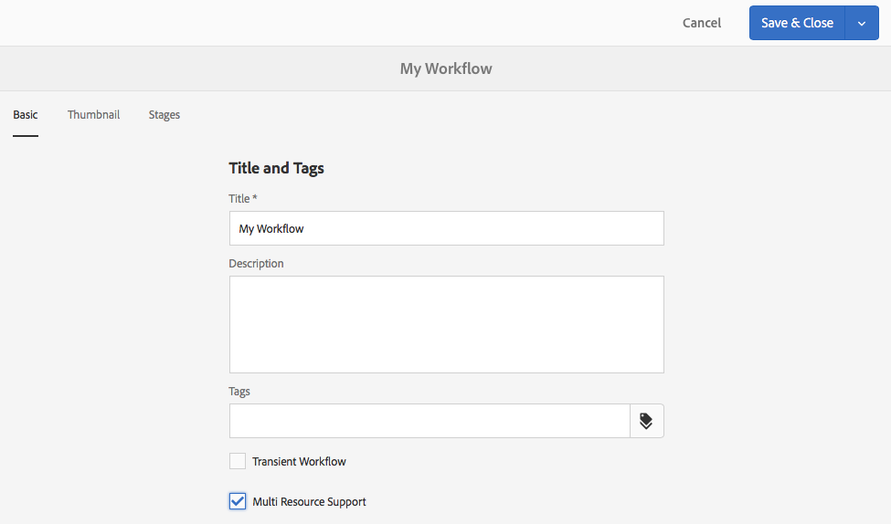
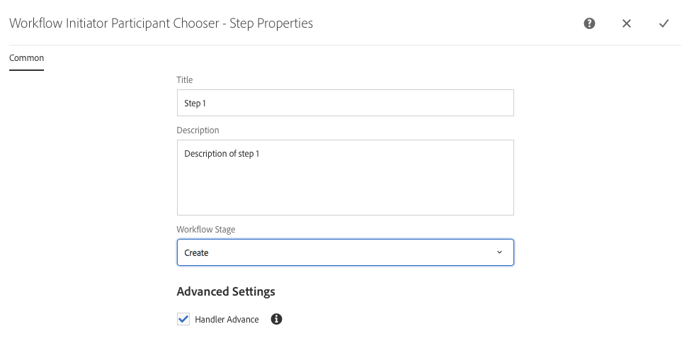

# 创建工作流模型{#creating-workflow-models}

>[!CAUTION]
>
>有关经典UI的使用，请参 [阅AEM 6.3文档](https://helpx.adobe.com/experience-manager/6-3/sites-developing/workflows-models.html) 以供参考。

您可以创建 [工作流模型](/help/sites-developing/workflows.md#model) ，以定义用户开始工作流时执行的一系列步骤。 您还可以定义模型属性，如工作流是临时的还是使用多个资源。

当用户开始工作流时，启动一个实例； 这是相应的运行时模型，在您同步 [更改](#sync-your-workflow-generate-a-runtime-model) 时创建。

## Creating a New Workflow {#creating-a-new-workflow}

首次创建新的工作流模型时，它包含：

* 步骤、流 **[!UICONTROL 开始]****[!UICONTROL 和流结束]**。

   它们表示工作流的开始和结束。 这些步骤是必需的，无法编辑或删除。

* 名为 **Step** 1的参与 **者步骤示例**。

   此步骤配置为将工作项分配给工作流启动器。 编辑或删除此步骤，并根据需要添加步骤。

要使用编辑器创建新工作流，请执行以下操作：

1. 打开“工 **[!UICONTROL 作流模型]** ”控制台； 通过工 **[!UICONTROL 具]**、工 **[!UICONTROL 作流]****** 、模型，或例如：

   [http://localhost:4502/aem/workflow](http://localhost:4502/aem/workflow)

1. Select **[!UICONTROL Create]**, then **[!UICONTROL Create Model]**.
1. 将出 **[!UICONTROL 现“添加工作流模型]** ”(Add Workflow Model)对话框。 在选择 **[!UICONTROL 完成]** 前，输 **[!UICONTROL 入标]** 题 **[!UICONTROL 和名]**&#x200B;称。
1. 新模型将列在“工作流 **[!UICONTROL 模型”控制台]** 。
1. 选择新工作流，然后使用 [**[!UICONTROL 编辑&#x200B;]**将其打开进行配置](#editing-a-workflow):

   

>[!NOTE]
>
>如果以编程方式（使用crx包）创建模型，则还可以在以下位置创建子文件夹：
>
>`/var/workflow/models`
>
>例如，`/var/workflow/models/prototypes`
>
>然后，此文件夹可用 [于管理对该文件夹中的模型的访问权限](/help/sites-administering/workflows-managing.md#create-a-subfolder-in-var-workflow-models-and-apply-the-acl-to-that)。

## 编辑工作流 {#editing-a-workflow}

您可以编辑任何现有的工作流模型以：

* [定义步骤](#adding-a-step-to-a-model) 及其参 [数](#configuring-a-workflow-step)

* 配置工作流属性， [包括](#configuring-workflow-stages-that-show-workflow-progress)[阶段，无论工作流是临时的](#creating-a-transient-workflow) ，还是 [使用多个资源](#configuring-a-workflow-for-multi-resource-support)

编辑 [**默认或旧&#x200B;**（现成）工作流还有一个额外步骤](#editing-a-default-or-legacy-workflow-for-the-first-time)，以确保在进行更[改之前](/help/sites-developing/workflows-best-practices.md#locations-workflow-models)，会先执行安全副本。

完成对工作流的更新后，必须使用 **[!UICONTROL 同步]****[!UICONTROL 生成运行时模型]**。 有关详 [细信息，请参阅](#sync-your-workflow-generate-a-runtime-model) 同步您的工作流。

### 同步工作流——生成运行时模型 {#sync-your-workflow-generate-a-runtime-model}

**同步** （就在编辑器工具栏中）生成一个运 [行时模型](/help/sites-developing/workflows.md#runtime-model)。 运行时模型是用户开始工作流时实际使用的模型。 如果不同步 **[!UICONTROL 更改]** ，则更改在运行时将不可用。

当您（或任何其他用户）对工作流进行任何更改时，您必须使用 **[!UICONTROL Sync]** 生成运行时模型，即使单个对话框（例如，步骤）具有自己的保存选项时也是如此。

当更改与运行时（已保存）模型同步时， **[!UICONTROL 将显示]** “同步”。

某些步骤包含必填字段和／或内置验证。 当这些条件不满足时，当您尝试同步模型时，将显 **[!UICONTROL 示]** 错误。 例如，当没有为参与者步骤定义任何参 **[!UICONTROL 与者]** :


### 首次编辑默认或旧式工作流 {#editing-a-default-or-legacy-workflow-for-the-first-time}

打开默认和/ [或旧模型进行编辑时](/help/sites-developing/workflows.md#workflow-types) :

* 步骤 **[!UICONTROL 浏览器]** （左侧）不可用。
* 工具栏 **[!UICONTROL (右侧]** )中提供了“编辑”操作。
* 最初，模型及其属性以只读模式显示为：

   * 默认工作流位于 `/libs`
   * 旧版工作流位于 `/etc`

选择 **[!UICONTROL 编辑]** :

* 将工作流的副本导入 `/conf`
* 使步骤 **[!UICONTROL 浏览器]** 可用
* 使您能够进行更改

>[!NOTE]
>
>有关 [更多信息，请参阅](/help/sites-developing/workflows-best-practices.md#locations-workflow-models) “工作流模型的位置”。


### 向模型添加步骤 {#adding-a-step-to-a-model}

您需要向模型中添加步骤以表示要执行的活动-每个步骤都执行特定活动。 标准AEM实例中提供一系列步骤组件。

编辑模型时，可用步骤会出现在“步骤”浏览器的各 **[!UICONTROL 组中]** 。 例如：


>[!NOTE]
>
>有关随AEM一起安装的主要步骤组件的信息，请参 [阅工作流步骤参考](/help/sites-developing/workflows-step-ref.md)。

**向模型添加步骤**:

1. 打开现有的工作流模型进行编辑。 从“工作流 **[!UICONTROL 模型]** ”控制台中，选择所需的模型，然后选 **[!UICONTROL 择编辑]**。
1. 打开“步 **[!UICONTROL 骤]** ”浏览器； 使用 **[!UICONTROL “切换侧面板]**”（位于顶部工具栏的最左侧）。 在此对话框中，您可以：

   * **[!UICONTROL 筛选特定步骤]** 。
   * 使用下拉选择器将选择限制为特定的步骤组。
   * 选择“显示说明”  ，以显示有关相应步骤的更多详细信息。

   

1. 将相应的步骤拖动到模型中的所需位置。

   例如，参加 **[!UICONTROL 者步骤]**。

   将其添加到流后，您可以 [配置该步骤](#configuring-a-workflow-step)。

   

1. 根据需要添加任意多个步骤或其他更新。

   在运行时，按步骤在模型中的显示顺序执行步骤。 添加步骤元件后，可以将它们拖动到模型中的其他位置。

   您还可以复制、剪切、粘贴、分组或删除现有步骤； 和页面编辑 [器一样。](/help/sites-authoring/editing-content.md)

   还可以使用工具栏选项折叠／展开拆分步骤： 

1. 使用Sync(编辑 **[!UICONTROL 器]** 工具栏)确认更改以生成运行时模型。

   有关详 [细信息，请参阅](#sync-your-workflow-generate-a-runtime-model) 同步您的工作流。

### 配置工作流步骤 {#configuring-a-workflow-step}

您可以 **使用** “步骤属性”对话框配置和自定义工作流 **[!UICONTROL 步骤的行]** 为。

1. 要打开步骤 **[!UICONTROL 的“步骤属性]** ”对话框，请执行以下操作之一：

   * 点按工作流模型中的步骤，并从组件 **[!UICONTROL 工具栏]** 中选择配置。
   * 多次单击该步骤。

   >[!NOTE]
   >
   >有关随AEM一起安装的主要步骤组件的信息，请参 [阅工作流步骤参考](/help/sites-developing/workflows-step-ref.md)。

1. 根据需要 **[!UICONTROL 配置步骤]** “属性”; 可用的属性取决于步骤类型，也可能有多个可用的选项卡。 例如，新工作流中 **[!UICONTROL 的默认]**“参与者步骤”显示为 `Step 1`:

   

1. 用勾号确认更新。
1. 使用Sync(编辑 **[!UICONTROL 器]** 工具栏)确认更改以生成运行时模型。

   有关详 [细信息，请参阅](#sync-your-workflow-generate-a-runtime-model) 同步您的工作流。

### 创建临时工作流 {#creating-a-transient-workflow}

在创建新模型 [时](/help/sites-developing/workflows.md#transient-workflows) ，或通过编辑现有模型，可以创建临时工作流模型：

1. 打开要编辑的工作流 [模型](#editing-a-workflow)。
1. 从工 **[!UICONTROL 具栏中选择]** “工作流模型属性”。
1. 在对话框中，激活临时工 **[!UICONTROL 作流]** （或根据需要取消激活）:

   

1. 通过保存并关闭 **[!UICONTROL 确认更改]**; 后跟 **[!UICONTROL Sync]** （编辑器工具栏）以生成运行时模型。

   有关详 [细信息，请参阅](#sync-your-workflow-generate-a-runtime-model) 同步您的工作流。

>[!NOTE]
>
>在临时模式下运行工作流 [时](/help/sites-developing/workflows.md#transient-workflows) ,AEM不存储任何工作流历史记录。 因此， [时间轴](/help/sites-authoring/basic-handling.md#timeline) 不显示与该工作流相关的任何信息。 [](/help/sites-authoring/basic-handling.md#timeline)

### 在触屏UI中提供工作流模型 {#make-workflow-models-available-in-touchui}

如果工作流模型在经典UI中存在，但在触屏UI的时间轴边栏的选择弹 **[!UICONTROL 出菜单]** 中缺失，则按照配置进行操作以使其可用。 以下步骤说明了如何使用名为请求 **[!UICONTROL 激活的工作流模型]**。

1. 确认该型号在触屏优化UI中不可用。 使用路径访问 `/assets.html/content/dam` 资产。 选择资产。 在左 **[!UICONTROL 边栏]** 中打开时间轴。 单 **[!UICONTROL 击开始工]** 作流，并确认 **[!UICONTROL 弹出式列表中]** 不存在“请求激活”模型。

1. 在工具> **[!UICONTROL 常规>标记之间导航]**。 选择 **[!UICONTROL 工作流]**。

1. 选择 **[!UICONTROL 创建>创建标记]**。 将标 **[!UICONTROL 题设]** 置为 `DAM` ，将 **[!UICONTROL 名称]** 设置为 `dam`。 选择&#x200B;**[!UICONTROL 提交]**。
   

1. 导航到工 **[!UICONTROL 具>工作流>模型]**。 选择 **[!UICONTROL 请求激活]**，然后选择 **[!UICONTROL 编辑]**。

1. 选择 **[!UICONTROL 编辑]** ，然后打开工 **[!UICONTROL 作流模型属性]**。 转到“基 **[!UICONTROL 本]** ”选项卡。

1. 添加 `Workflow : DAM` 到“ **[!UICONTROL 标记]** ”字段。 用勾号（勾号）确认选择。

1. 确认添加标记并保 **[!UICONTROL 存并关闭]**。
   

1. 使用Sync完成该 **[!UICONTROL 过程]**。 该工作流现在在触屏优化UI中可用。

### 为多资源支持配置工作流 {#configuring-a-workflow-for-multi-resource-support}

在创建新模型或编辑现 [有模型时](/help/sites-developing/workflows.md#multi-resource-support) ，可以为多资源支持配置工作流模型：

1. 打开要编辑的工作流 [模型](#editing-a-workflow)。
1. 从工 **[!UICONTROL 具栏中选择]** “工作流模型属性”。

1. 在对话框中，激活多 **[!UICONTROL 资源支持]** （或根据需要取消激活）:

   

1. 通过保存并关闭 **[!UICONTROL 确认更改]**; 后跟 **[!UICONTROL Sync]** （编辑器工具栏）以生成运行时模型。

   有关详 [细信息，请参阅](#sync-your-workflow-generate-a-runtime-model) 同步您的工作流。

### 配置工作流阶段（显示工作流进度） {#configuring-workflow-stages-that-show-workflow-progress}

[工作流阶段](/help/sites-developing/workflows.md#workflow-stages) ，在处理任务时有助于可视化工作流的进度。

>[!CAUTION]
>
>如果工作流阶段是在页 **[!UICONTROL 面属性中定义]**，但不用于任何工作流步骤，则进度栏将不显示任何进度（无论当前工作流步骤如何）。

可用的阶段在工作流模型中定义； 可以更新现有工作流模型以包含阶段定义。 您可以为工作流模型定义任意数量的阶段。

要为工作 **[!UICONTROL 流定义]** “阶段”，请执行以下操作：

1. 打开要编辑的工作流模型。
1. 从工 **[!UICONTROL 具栏中选择]** “工作流模型属性”。 然后打开“ **[!UICONTROL 阶段]** ”选项卡。
1. 添加（并定位）所需的 **[!UICONTROL 阶段]**。 您可以为工作流模型定义任意数量的阶段。

   例如：

   

1. 单击 **[!UICONTROL 保存并关闭]** ，以保存属性。
1. 为工作流模型中的每个步骤分配一个阶段。 例如：

   

   可以将舞台分配给多个步骤。 例如：

   | **步骤** | **暂存** |
   |---|---|
   | 步骤 1 | 创建 |
   | 步骤 2 | 创建 |
   | 步骤 3 | 审核 |
   | 步骤 4 | 批准 |
   | 步骤 5 | 批准 |
   | 步骤 6 | 完成 |

1. 使用Sync(编辑 **[!UICONTROL 器]** 工具栏)确认更改以生成运行时模型。

   有关详 [细信息，请参阅](#sync-your-workflow-generate-a-runtime-model) 同步您的工作流。

## 导出包中的工作流模型 {#exporting-a-workflow-model-in-a-package}

1. 使用包管理器创建 [新包](/help/sites-administering/package-manager.md#package-manager):

   1. 通过工具、部署、包 **[!UICONTROL 导航]****[!UICONTROL 到]****[!UICONTROL “]**&#x200B;包管理器”。
   1. 单击“ **[!UICONTROL 创建包]**”。
   1. 根据需要 **[!UICONTROL 指定包名]**，以及任何其他详细信息。
   1. 单击&#x200B;**[!UICONTROL 确定]**。

1. 单击 **[!UICONTROL 新包]** （在工具栏上）的“编辑”。

1. Open the **[!UICONTROL Filters]** tab.

1. 选择 **[!UICONTROL “添加筛选]** ”，并指定工作流模型设计的 *路径*:

   `/conf/global/settings/workflow/models/<*your-model-name*>`

   单击&#x200B;**[!UICONTROL 完成]**。

1. 选择 **[!UICONTROL 添加筛选]** ，并指定运行时工作流 *模型的* 路径：

   `/var/workflow/models/<*your-model-name*>`

   单击&#x200B;**[!UICONTROL 完成]**。

1. 为模型使用的任何自定义脚本添加附加过滤器。
1. 单击 **[!UICONTROL 保存]** ，以确认您的筛选器定义。
1. 从包 **[!UICONTROL 定义]** 的工具栏中选择“构建”。
1. 从包 **[!UICONTROL 工具栏]** 中选择“下载”。

## 使用工作流处理表单提交 {#using-workflows-to-process-form-submissions}

您可以配置要由所选工作流处理的表单。 当用户提交表单时，将创建一个新的工作流实例，并将表单提交的数据作为有效负荷。

配置要用于表单的工作流：

1. 创建新页面并打开它进行编辑。
1. Add a **[!UICONTROL Form]** component to the page.
1. 配置在 **[!UICONTROL 页面中显]** 示的表单开始组件。
1. 使用 **[!UICONTROL 开始工作流]** ，从这些可用工作流中选择所需的工作流：

   

1. 使用勾号确认新表单配置。

## 测试工作流 {#testing-workflows}

在测试工作流以使用各种有效负荷类型时，这是一个好做法； 包括不同于已开发的类型。 例如，如果您打算使用工作流处理资产，请通过将页面设置为有效负荷来测试它，并确保它不会抛出错误。

例如，按如下方式测试新工作流：

1. [从控制台开始您](/help/sites-administering/workflows-starting.md) 的工作流模型。
1. 定义有 **[!UICONTROL 效负荷]** ，并进行确认。

1. 根据需要执行操作，以便工作流继续进行。
1. 在工作流运行时监视日志文件。

您还可以配置AEM以在日 **[!UICONTROL 志文件]** 中显示DEBUG消息。 请参 [阅日志](/help/sites-deploying/configure-logging.md) ，以了解详细信息，开发完成后，将日志 **[!UICONTROL 级别设]** 置回 **[!UICONTROL 信息]**。

## 示例 {#examples}

### 示例： 创建一个（简单）工作流以接受或拒绝发布请求 {#example-creating-a-simple-workflow-to-accept-or-reject-a-request-for-publication}

为了说明创建工作流的一些可能性，以下示例创建了工作流的变 `Publish Example` 体。

1. [创建新的工作流模型](#creating-a-new-workflow)。

   新工作流将包含：

   * **[!UICONTROL 流程开始]**
   * `Step 1`
   * **[!UICONTROL 流程结束]**

1. 删 `Step 1` 除（因为此示例的步骤类型错误）:

   * 单击该步骤，然后从组件 **[!UICONTROL 工具栏]** 中选择删除。 确认该操作。

1. 从步骤浏 **[!UICONTROL 览器的]** “工作流”选择中 **[!UICONTROL ，将参与者步骤拖]** 动到工作流上，并将它放在流 **[!UICONTROL 开始和]** **流结束**之间。
1. 要打开属性对话框，请执行以下操作之一：

   * 单击参加者步骤，然后从组件 **[!UICONTROL 工具栏]** 中选择配置。
   * 多次单击参加者步骤。

1. 在“常 **[!UICONTROL 用]** ”选 `Validate Content` 项卡中 **[!UICONTROL ，输入标]** 题和 **[!UICONTROL 说]**&#x200B;明。
1. 打开“ **[!UICONTROL 用户／组]** ”选项卡：

   * Activate **[!UICONTROL Notify user via email]**.
   * 为“ `Administrator` 用 `admin`户／组” **[!UICONTROL 字段选择(]** )。

   >[!NOTE]
   >
   >对于要发送的电子邮件， [需要配置邮件服务和用户帐户详细信息](/help/sites-administering/notification.md)。

1. 用勾号确认更新。

   您将返回到工作流模型的概述，此处参与者步骤将重命名为 `Validate Content`。

1. 将“或 **[!UICONTROL 拆分]** ”拖动到工作流上，并将它放在 `Validate Content` 和“流 **[!UICONTROL 结束”之间]**。
1. 打开或 **[!UICONTROL 拆分]** ，进行配置。
1. 配置:

   * **[!UICONTROL 常见]**: 选择 **[!UICONTROL 2个分支]**
   * **[!UICONTROL 分支1]**: 选择 **[!UICONTROL 默认路由]**。
   * **[!UICONTROL 分支2]**: 确保 **[!UICONTROL 未选择]** “默认路由”。

1. 确认对OR拆 **[!UICONTROL 分的更新]**。
1. 将参 **[!UICONTROL 加者步骤]** 拖到左侧分支，打开属性，指定以下值，然后确认更改：

   * **[!UICONTROL 标题]**: `Reject Publish Request`
   * **[!UICONTROL 用户／组]**: 例如， `projects-administrators`
   * **[!UICONTROL 通过电子邮件通知用户]**: 激活后，通过电子邮件通知用户。

1. 将处理 **[!UICONTROL 步骤拖到]** 右侧的分支，打开属性，指定以下值，然后确认更改：

   * **[!UICONTROL 标题]**: `Publish Page as Requested`
   * **[!UICONTROL 流程]**: 选择 `Activate Page`。 此过程会将所选页面发布到发布者实例。

1. 单击 **[!UICONTROL 同步]** （编辑器工具栏）以生成运行时模型。

   有关详 [细信息，请参阅](#sync-your-workflow-generate-a-runtime-model) 同步您的工作流。

   您的新工作流模型将如下所示：

   

1. 将此工作流应用到您的页面，这样当用户移至“完成 **[!UICONTROL 内容]** ”步 **[!UICONTROL 骤时]** ，他们可以选择是按请求发布页面 **[!UICONTROL ，还]******&#x200B;是按照拒绝发布请求。

   

### 示例： 为OR拆分定义规则 {#example-defining-a-rule-for-an-or-split}

**[!UICONTROL “或者]** ”拆分步骤允许您将条件处理路径引入工作流。

要定义OR规则，请执行以下操作：

1. 创建两个脚本并将其保存到存储库中，例如：

   `/apps/myapp/workflow/scripts`

   >[!NOTE]
   >
   >脚本必须具有 [返回 `check()`](#function-check) 布尔值的函数。

1. 编辑工作流，并将“或 **[!UICONTROL 拆分”(OR]** Split)添加到模型。
1. 编辑OR拆分 **[!UICONTROL 的分支]** 1 **[!UICONTROL 的属性]**:

   * 通过将“值” **[!UICONTROL 设置为]** ，将其定 **[!UICONTROL 义为“默]** 认路由 `true`”。
   * 作 **[!UICONTROL 为规]**&#x200B;则，设置脚本的路径。 例如：

      `/apps/myapp/workflow/scripts/myscript1.ecma`
   >[!NOTE]
   >
   >您可以根据需要切换分支顺序。

1. 编辑OR拆分 **[!UICONTROL 的分支]** 2 **[!UICONTROL 的属性]**。

   * 作为 **[!UICONTROL 规则]**，将路径设置为其他脚本。 例如：

      `/apps/myapp/workflow/scripts/myscript2.ecma`

1. 设置每个分支中各个步骤的属性。 确保已 **[!UICONTROL 设置用户]** /组。
1. 单击 **同步** （编辑器工具栏），将更改保留到运行时模型。

   有关详 [细信息，请参阅](#sync-your-workflow-generate-a-runtime-model) 同步您的工作流。

#### Function Check() {#function-check}

>[!NOTE]
>
>请参 [阅使用ECMAScript](/help/sites-developing/workflows-customizing-extending.md#using-ecmascript)。

如果节点位于 `true` 以下位置，则返回以 `JCR_PATH` 下示例脚本 `/content/we-retail/us/en`:

```
function check() {
    if (workflowData.getPayloadType() == "JCR_PATH") {
      var path = workflowData.getPayload().toString();
      var node = jcrSession.getItem(path);

      if (node.getPath().indexOf("/content/we-retail/us/en") >= 0) {
       return true;
      } else {
       return false;
      } 
     } else {
      return false;
     }
}
```

### 示例： 自定义激活请求 {#example-customized-request-for-activation}

您可以自定义任何现成的工作流。 要进行自定义行为，请叠加相应工作流的详细信息。

例如， **[!UICONTROL 请求激活]**。 此工作流用于在站点内发 **[!UICONTROL 布页]** 面，并在内容作者没有适当的复制权限时自动触发。 有关 [更多详细信息，请参阅自定义页面创作——自定义激活工作流](/help/sites-developing/customizing-page-authoring-touch.md#customizing-the-request-for-activation-workflow) 请求。
