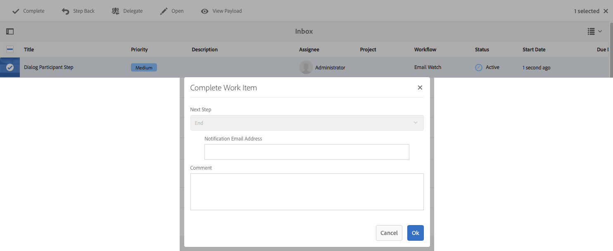

# 工作流步骤参考{#workflow-step-reference}

工作流模型由各种类型的一系列步骤组成。 根据类型，可以使用参数和脚本配置和扩展这些步骤，以提供所需的功能和控制。

>[!NOTE]
>
>本节介绍标准工作流步骤。
>
>有关模块特定步骤，另请参阅：
>
>* [AEM Forms工作流步骤参考](/help/forms/using/aem-forms-workflow-step-reference.md)
>* [使用媒体处理程序和工作流处理资源](/help/assets/media-handlers.md)

>


## 步骤属性 {#step-properties}

每个步骤组件都有一个 **[!UICONTROL “步骤属性]** ”对话框，通过该对话框可以定义和编辑所需的属性。

### 步骤属性——常用选项卡 {#step-properties-common-tab}

属性对话框的“公用”选项卡上的大多数工作流步骤组件都 **[!UICONTROL 可以]** 使用以下属性的组合：

* **[!UICONTROL 标题]**

   步骤的标题。

* **[!UICONTROL 描述]**

   步骤的说明。

* **[!UICONTROL 工作流暂存]**

   一个下拉选择器，用于将 [舞台](/help/sites-developing/workflows.md#workflow-stages) 应用到该步骤。

* **[!UICONTROL 超时]**

   此步骤将在其后“超时”。

   您可以在以下选项之间进行选择： **[!UICONTROL 关闭]****[!UICONTROL ,]**&#x200B;立即 **[!UICONTROL ,]** 1h **[!UICONTROL ,6h]**, 12 ******** h, 24h。

* **[!UICONTROL 超时处理程序]**

   在步骤超时时控制工作流的处理程序； 例如：

   `Auto Advancer`

* **[!UICONTROL 处理程序前进]**

   选择此选项可将工作流自动前进到执行后的下一个步骤。 如果未选择，则实现脚本必须处理工作流进程。

#### 步骤属性-“用户／组”选项卡 {#step-properties-user-group-tab}

属性对话框的用户／组选项卡上有许多工作 **[!UICONTROL 流步骤组件]** ，提供以下属性：

* **[!UICONTROL 通过电子邮件通知用户]**

   * 您可以在工作流到达该步骤时向参与者发送电子邮件，以此通知他们。
   * 如果启用，则将向属性用户／组定义的用户发 **[!UICONTROL 送电子邮件]** ，或向组的每个成员发送电子邮件（如果已定义组）。

* **[!UICONTROL 用户/组]**

   * 下拉选择框将允许您导航并选择用户或用户组。
   * 如果将步骤分配给特定用户，则只有此用户可以对该步骤执行操作。
   * 如果您将步骤分配给整个组，则当工作流到达此步骤时，此组中的所有用户将在其“工作流收件箱”中 **[!UICONTROL 包含操作]**。
   * 有关 [详细信息](/help/sites-authoring/workflows-participating.md) ，请参阅参与工作流。

## AND 拆分 {#and-split}

AND **[!UICONTROL Split]** （与拆分）在工作流中创建一个拆分，之后两个分支都将处于活动状态。 您可以根据需要向每个分支添加工作流步骤。 此步骤允许您在工作流中引入多个处理路径。 例如，您可以允许同时执行某些审阅步骤，从而节省时间。


### 和拆分——配置 {#and-split-configuration}

* 编辑AND **[!UICONTROL 拆分属性]** :

   * **[!UICONTROL 拆分名称]**: 为说明性目的指定名称。
   * 选择所需的分支数量； 2、3、4或5。

* 根据需要向分支添加工作流步骤。

   

## 容器步骤 {#container-step}

容器 **[!UICONTROL 步骤]** ,开始作为子工作流运行的另一个工作流模型。

此 **[!UICONTROL 容器]]允许您重用工作流模型&#x200B;**，以实现常见的步骤序列。 例如，翻译工作流模型可用于多个编辑工作流。


### 容器步骤——配置 {#container-step-configuration}

要配置该步骤，请编辑并使用以下选项卡：

* [**[!UICONTROL 通用]**](#step-properties-common-tab)
* **[!UICONTROL 容器]**

   * **[!UICONTROL 子工作流]**: 选择要开始的工作流。

## 跳转步骤 {#goto-step}

使用 **[!UICONTROL “跳转]** ”(Goto Step)，可以指定要执行的工作流模型中的下一个步骤，具体取决于ECMAScript的结果：

* `true`: 跳转 **[!UICONTROL 步骤完成]** ,工作流引擎将执行指定的步骤。

* `false`: 跳转 **[!UICONTROL 步骤完成]** ，普通路由逻辑确定要执行的下一步。

转 **[!UICONTROL 到步骤]** ，您可以在工作流模型中实现高级路由结构。 例如，要实现循环，可以定 **[!UICONTROL 义跳转]** (Goto Step)以在工作流中执行前一步，脚本将评估循环条件。

### 跳转步骤——配置 {#goto-step-configuration}

要配置该步骤，请编辑并使用以下选项卡：

* [**[!UICONTROL 通用]**](#step-properties-common-tab)
* **[!UICONTROL 进程]**

   * **[!UICONTROL 转到的步骤]]**: 选择要执行的步骤。
   * **[!UICONTROL 脚本路径]**: 确定是否执行跳转步骤的ECMAScript **[!UICONTROL 路径]**。
   * **[!UICONTROL 脚本]**: 确定是否执行跳转步 **[!UICONTROL 骤的ECMAScript]**。

>[!CAUTION]
>
>指定“脚本 **[!UICONTROL 路径]** ”或 **[!UICONTROL “脚本]**”。 两个选项不能同时使用。 如果为这两个属性指定值，则该步骤将使用“脚 **[!UICONTROL 本路径”]**。

#### 模拟for循环 {#simulating-a-for-loop}

模拟for循环需要保持已发生的循环迭代次数的计数：

* 计数通常表示在工作流中执行操作的项的索引。
* 计数作为循环的退出标准进行计算。

例如，要实现在多个JCR节点上执行操作的工作流，可以使用循环计数器作为节点的索引。 要保留计数，请在工 `integer` 作流实例的数据映射中存储一个值。 使用跳转步 **[!UICONTROL 骤的脚本]** ，可以增加计数，并将计数与退出条件进行比较。

```
function check(){
   var count=0;
   var keyname="loopcount"
   try{
      if (workflowData.getMetaDataMap().containsKey(keyname)){ 
        log.info("goto script: found loopcount key");
        count= parseInt(workflowData.getMetaDataMap().get(keyname))+1;
      } 
 
     workflowData.getMetaDataMap().put(keyname,count);
 
     }catch(err) {
         log.info(err.message);
         return false;
    }
   if (parseInt(count) <7){
       return true;
   } else {
      return false;
   }
}
```

## OR 拆分 {#or-split}

OR **[!UICONTROL Split]** （或拆分）在工作流中创建一个拆分，之后只有一个分支处于活动状态。 此步骤允许您将条件处理路径引入工作流。 您可以根据需要向每个分支添加工作流步骤。

>[!NOTE]
>
>有关创建OR拆分的其他信息，请参阅： [https://helpx.adobe.com/experience-manager/using/aem64_workflow_servlet.html](https://helpx.adobe.com/experience-manager/using/aem64_workflow_servlet.html)


### OR拆分——配置 {#or-split-configuration}

* 编辑“ **[!UICONTROL 或拆分]** ”属性：

   * **[!UICONTROL 通用]**

      * 选择所需的分支数量； 2、3、4或5。
   * **[!UICONTROL 分支：*x*>]**

      * **[!UICONTROL 脚本路径]**: 包含脚本的文件的路径。
      * **[!UICONTROL 脚本]**: 在框中添加脚本。
      * **[!UICONTROL 默认路由]**: 当多个分支的计算结果为true时，将遵循默认分支。 您只能指定一个分支作为默认值。

   >[!NOTE]
   >
   >每个分支都有一个单独的选项卡：
   >
   >* 每个分支的脚本一次计算一个。
   >* 将从左到右评估分支。
   >* 执行计算结果为true的第一个脚本。
   >* 如果没有分支的计算结果为true，则工作流不会前进。


   >[!CAUTION]
   >
   >指定“脚本 **[!UICONTROL 路径]** ”或 **[!UICONTROL “脚本]**”。 两个选项不能同时使用。 如果为这两个属性指定值，则该步骤将使用“脚 **[!UICONTROL 本路径”]**。

   >[!NOTE]
   >
   >请参 [阅为OR拆分定义规则](/help/sites-developing/workflows-models.md#example-defining-a-rule-for-an-or-split)。

* 根据需要向分支添加工作流步骤。

## 参加者步骤和选择器 {#participant-steps-and-choosers}

### 参与者步骤 {#participant-step}

参与者 **[!UICONTROL 步骤]** ，您可以为特定操作分配所有权。 仅当用户手动确认该步骤后，工作流才会继续。 当您希望某人对工作流执行操作时，会使用此功能； 例如，审核步骤。

尽管与操作不直接相关，但在分配操作时必须考虑用户授权； 用户必须有权访问作为工作流有效负荷的页面。

#### 参与者步骤——配置 {#participant-step-configuration}

要配置该步骤，请编辑并使用以下选项卡：

* [**[!UICONTROL 通用]**](#step-properties-common-tab)
* [**[!UICONTROL 用户/组]**](#step-properties-user-group-tab)

>[!NOTE]
>
>在以下情况下，始终会通知工作流启动器：
>
>* 工作流已完成（已完成）。
>* 工作流已中止（终止）。

>


>[!NOTE]
>
>需要配置某些属性才能启用电子邮件通知。 您还可以自定义电子邮件模板或为新语言添加电子邮件模板。 See [Configuring Email Notification](/help/sites-administering/notification.md) to configure email notifications in AEM.

### 对话框参与者步骤 {#dialog-participant-step}

使用对 **[!UICONTROL 话框参与者步骤]** ，从为工作项分配的用户收集信息。 此步骤对于收集稍后在工作流中使用的少量数据很有用。

完成该步骤后，“完 **[!UICONTROL 成工作项]** ”对话框将包含您在对话框中定义的字段。 在字段中收集的数据存储在工作流有效负荷的节点中。 随后的工作流步骤随后可以从存储库中读取值。

要配置该步骤，请指定要将工作项分配到的组或用户，以及该对话框的路径。

#### 对话框参与者步骤——配置 {#dialog-participant-step-configuration}

要配置该步骤，请编辑并使用以下选项卡：

* [**[!UICONTROL 通用]**](#step-properties-common-tab)
* [**[!UICONTROL 用户/组]**](#step-properties-user-group-tab)
* **[!UICONTROL 对话框]**

   * **[!UICONTROL对话框路径**: 您创建的对话框的对话框 [节点的路径](#dialog-participant-step-creating-a-dialog)。

#### 对话框参与者步骤——创建对话框{#dialog-participant-step-creating-a-dialog}

要创建对话框，请执行以下操作：

* 确定结果数据将存储在 [有效负荷中的位置](#dialog-participant-step-storing-data-in-the-payload)。
* [定义对话框； 这包括定义用于收集（和保存）数据的字段](#dialog-participant-step-dialog-definition)。

#### 对话框参与者步骤——在有效负荷中存储数据 {#dialog-participant-step-storing-data-in-the-payload}

您可以将构件数据存储在工作流有效负荷或工作项元数据中。 构件节点 `name` 属性的格式决定数据存储的位置。

* **[!UICONTROL 使用有效负荷存储数据]**

   * 要将构件数据存储为工作流有效负荷的属性，请对构件节点的name属性值使用以下格式：

      `./jcr:content/nodename`

   * 数据存储在有效负 `nodename` 荷节点的属性中。 如果节点不包含该属性，则会创建该属性。
   * 当与有效负荷一起存储时，后续使用具有相同有效负荷的对话框会覆盖属性的值。

* **[!UICONTROL 将数据与工作项一起存储]**

   * 要将构件数据存储为工作项元数据的属性，请对name属性的值使用以下格式：

      `nodename`

   * 数据存储在工 `nodename` 作项的属性中 `metadata`。 如果对话框随后与相同的有效负荷一起使用，则保留数据。

#### 对话框参与者步骤——对话框定义 {#dialog-participant-step-dialog-definition}

1. **[!UICONTROL 对话框结构]**

   对话框参与者步骤的对话框与您为创作组件创建的对话框类似。 它们存储在：

   `/apps/myapp/workflow/dialogs`

   标准触屏优化UI的对话框具有以下节点结构：

   ```xml
   newComponent (cq:Component)
     |- cq:dialog (nt:unstructured)
       |- content 
         |- layout 
           |- items 
             |- column 
               |- items 
                 |- component0
                 |- component1
                 |- ...
   ```

   >[!NOTE]
   >
   >有关详细信息，请 [参阅创建和配置对话框](/help/sites-developing/developing-components.md#creating-and-configuring-a-dialog)。

1. **[!UICONTROL 对话框路径属性]**

   对话 **[!UICONTROL 框参加者]****[!UICONTROL 步骤具有对话]** 框路径 [属性(以及参加者](#participant-step)步骤的属性)。 对话框路 **[!UICONTROL 径属性]** 的值是对话 `dialog` 框节点的路径。

   例如，该对话框包含在存储在节点 `EmailWatch` 中的名为的组件中：

   `/apps/myapp/workflows/dialogs`

   对于触屏优化UI,“对话框路径”属性 **[!UICONTROL 使用以]** 下值：

   `/apps/myapp/workflow/dialogs/EmailWatch/cq:dialog`

   

1. **示例对话框定义**

   以下XML代码片断表示一个对话框，它 `String` 在有效负荷内 `watchEmail` 容的节点中存储值。 标题节点表示 [TextField组](https://helpx.adobe.com/experience-manager/6-4/sites/developing/using/reference-materials/granite-ui/api/jcr_root/libs/granite/ui/components/coral/foundation/form/textfield/index.html) 件：

   ```xml
   jcr:primaryType="nt:unstructured" 
       jcr:title="Watcher Email Address Dialog" 
       sling:resourceType="cq/gui/components/authoring/dialog">
       <content jcr:primaryType="nt:unstructured"
           sling:resourceType="granite/ui/components/foundation/container">
           <layout jcr:primaryType="nt:unstructured" 
               margin="false" 
               sling:resourceType="granite/ui/components/foundation/layouts/fixedcolumns"
           />
           <items jcr:primaryType="nt:unstructured">
               <column jcr:primaryType="nt:unstructured"
                   sling:resourceType="granite/ui/components/foundation/container">
                   <items jcr:primaryType="nt:unstructured">
                       <title jcr:primaryType="nt:unstructured" 
                           fieldLabel="Notification Email Address" 
                           name="./jcr:content/watchEmails"
                           sling:resourceType="granite/ui/components/foundation/form/textfield"
                       />
                   </items>
               </column>
           </items>
       </content>
   </cq:dialog>
   ```

   在触屏优化UI中，此示例将生成如下对话框：

   

### 动态参与者步骤 {#dynamic-participant-step}

“动 **[!UICONTROL 态参与者步骤]** ”组件与“参 **[!UICONTROL 加者步骤]** ”类似，不同之处在于参与者在运行时自动选择。

要配置该步骤，请选择一个参 **[!UICONTROL 加者选择器]** ，它标识要将工作项分配到的参与者，并提供一个对话框。

#### 动态参与者步骤——配置 {#dynamic-participant-step-configuration}

要配置该步骤，请编辑并使用以下选项卡：

* [**[!UICONTROL 通用]**](#step-properties-common-tab)
* **[!UICONTROL 参与者选择器]**

   * **[!UICONTROL 参加者选择器]**: 您创建的参 [加者选择器的名称](#dynamic-participant-step-developing-the-participant-chooser)。
   * **[!UICONTROL 参数]**: 任何必需的参数。
   * **[!UICONTROL 电子邮件]**: 是否应向用户发送电子邮件通知。

* **[!UICONTROL 对话框]**

   * **[!UICONTROL 对话框路径]**: 您创建的对话框的对话框 [节点的路径(与对话框参 **加者步骤一样**)](#dialog-participant-step-creating-a-dialog)。

#### 动态参与者步骤——开发参与者选择器 {#dynamic-participant-step-developing-the-participant-chooser}

您创建参加者选择器。 因此，您可以使用任何选择逻辑或条件。 例如，参加者选择器可以选择工作项最少的用户（在组内）。 您可以创建任意数量的参与者选择器，以与工作流模型中“动态参 **加者步骤&#x200B;*”组件的*不同实例一起使用。

创建OSGi服务或ECMAScript，它选择用户将工作项分配给该用户。

* **[!UICONTROL ECMAscript]**

   脚本必须包含一个名为getParticipant的函数，该函数将用户ID返回为 `String` 值。 将自定义脚本存储在文件夹 `/apps/myapp/workflow/scripts` 或子文件夹中。

   标准AEM实例中包含一个示例脚本：

   `/libs/workflow/scripts/initiator-participant-chooser.ecma`

   >[!CAUTION]
   >
   >您 *不得* 更改路径中的任 `/libs` 何内容。
   >
   >
   >这是因为下次升级实 `/libs` 例时，内容会被覆盖（应用修补程序或功能包时可能会被覆盖）。

   此脚本选择工作流发起者作为参加者：

   ```
   function getParticipant() {
       return workItem.getWorkflow().getInitiator();
   }
   ```

   >[!NOTE]
   >
   >工作 **[!UICONTROL 流发起者参与者]** “选择器”组件扩 **[!UICONTROL 展了动态参与者步骤]** ，并将此脚本用作步骤实现。

* **[!UICONTROL OSGi服务]**

   服务必须实 [现com.day.cq.workflow.exec.ParticipantStepChooser](https://helpx.adobe.com/experience-manager/6-4/sites/developing/using/reference-materials/javadoc/com/day/cq/workflow/exec/ParticipantStepChooser.html) 接口。 接口定义以下成员：

   * `SERVICE_PROPERTY_LABEL` 字段： 使用此字段可指定参加者选择器的名称。 该名称显示在“动态参与者步骤”属性中的可用参 **[!UICONTROL 加者选择器列表]** 。
   * `getParticipant` 方法： 将动态解析的主体id返回为 `String` 值。

   >[!CAUTION]
   >
   >该方 `getParticipant` 法返回动态解析的主体ID。 这可以是组ID或用户ID。
   >
   >
   >但是，组ID只能用于返回参 **[!UICONTROL 加者列表]**&#x200B;时的参加者步骤。 对于动 **[!UICONTROL 态参与者步]** ，将返回空列表，这不能用于委派。

   要使您的实施对动态参 **[!UICONTROL 与者步骤组件可用]** ，请将您的Java类添加到导出服务的OSGi捆绑包，并将捆绑包部署到AEM服务器。

   >[!NOTE]
   >
   >**[!UICONTROL “随机参与者]** ”选择器是选择随机用户()的示例 `com.day.cq.workflow.impl.process.RandomParticipantChooser`服务。 随机 **[!UICONTROL 参与者选择器]** 步骤组件范例扩展 **[!UICONTROL 了动态参与者步骤]** ，并将此服务用作步骤实现。

#### 动态参与者步骤——参与者选择器服务示例 {#dynamic-participant-step-example-participant-chooser-service}

以下Java类实现该 `ParticipantStepChooser` 接口。 该类返回启动工作流的参加者的姓名。 代码使用的逻辑与示例脚本()使用的 `initator-participant-chooser.ecma`逻辑相同。

注 `@Property` 释将字段的值 `SERVICE_PROPERTY_LABEL` 设置为 `Workflow Initiator Participant Chooser`。

```java
package com.adobe.example;

import org.apache.felix.scr.annotations.Component;
import org.apache.felix.scr.annotations.Properties;
import org.apache.felix.scr.annotations.Property;
import org.apache.felix.scr.annotations.Service;
import org.osgi.framework.Constants;
import org.slf4j.Logger;
import org.slf4j.LoggerFactory;

import com.adobe.granite.workflow.WorkflowException;
import com.adobe.granite.workflow.WorkflowSession;
import com.adobe.granite.workflow.exec.ParticipantStepChooser;
import com.adobe.granite.workflow.exec.WorkItem;
import com.adobe.granite.workflow.metadata.MetaDataMap;

@Component
@Service
@Properties({
        @Property(name = Constants.SERVICE_DESCRIPTION, value = "An example implementation of a dynamic participant chooser."),
        @Property(name = ParticipantStepChooser.SERVICE_PROPERTY_LABEL, value = "Workflow Initiator Participant Chooser (service)") })
public class InitiatorParticipantChooser implements ParticipantStepChooser {

 private Logger logger = LoggerFactory.getLogger(this.getClass());

 public String getParticipant(WorkItem arg0, WorkflowSession arg1,
   MetaDataMap arg2) throws WorkflowException {

  String initiator = arg0.getWorkflow().getInitiator();
  logger.info("Assigning Dynamic Participant Step work item to {}",initiator);

  return initiator;
 }
}
```

在“动 **[!UICONTROL 态参与者]** ：步骤属性 **[!UICONTROL ”对话框中，“参]** 与者选择器 `Workflow Initiator Participant Chooser (script)`”列表包含表示此服务的项。

“启动工作流模型时，日志会指示启动工作流的用户的ID以及为工作项分配的用户。 在此示例中，用 `admin` 户启动了工作流。

`13.09.2015 15:48:53.037 *INFO* [10.176.129.223 [1347565733037] POST /etc/workflow/instances HTTP/1.1] com.adobe.example.InitiatorParticipantChooser Assigning Dynamic Participant Step work item to admin`

### 表单参与者步骤 {#form-participant-step}

打 **[!UICONTROL 开工作项]** 时，表单参与者步骤显示表单。 当用户填写并提交表单时，字段数据存储在工作流有效负荷的节点中。

要配置该步骤，请指定要将工作项分配给的组或用户，以及表单的路径。

>[!CAUTION]
>
>本节介绍页面创 [作基础组件的“Forms”部分](/help/sites-authoring/default-components-foundation.md#form)。

#### 表单参与者步骤——配置 {#form-participant-step-configuration}

要配置该步骤，请编辑并使用以下选项卡：

* [**[!UICONTROL 通用]**](#step-properties-common-tab)
* [**[!UICONTROL 用户/组]**](#step-properties-user-group-tab)
* **[!UICONTROL 表单]**

   * **[!UICONTROL表单路径**: 创建的表 [单的路径](#form-participant-step-creating-the-form)。

#### 表单参与者步骤——创建表单 {#form-participant-step-creating-the-form}

创建表单以正常与表单参 **[!UICONTROL 加者步骤一起]** 使用。 但是，表单参与者步骤的表单必须具有以下配置：

* 表 **[!UICONTROL 单组件的开始]** ，必须将“操 **[!UICONTROL 作类型]** ”属性设置为 `Edit Workflow Controlled Resource(s)`。

* 表 **[!UICONTROL 单组件的开始]** ，必须为该属性设置一个 `Form Identifier` 值。

* 表单组件必须将元 **素名称** 属性设置为存储字段数据的节点的路径。 路径必须在工作流有效负荷内容中找到节点。 该值使用以下格式：

   `./jcr:content/path_to_node`

* 表单必须包含 **[!UICONTROL 工作流提交按钮组件]** 。 您不配置组件的任何属性。

工作流的要求决定了您应将字段数据存储在何处。 例如，字段数据可用于配置页面内容的属性。 元素名称属性 **[!UICONTROL 的以下值]** ，将字段数据存储为节 `redirectTarget` 点属性的 `jcr:content` 值：

`./jcr:content/redirectTarget`

在以下示例中，字段数据用作有效负荷页面上 **[!UICONTROL 的文本]** 组件的内容：

`./jcr:content/par/text_3/text`

“第一个示例可用于组件渲染的任何 `cq:Page` 页面。 第二个示例仅在有效负荷页面包含ID为 **的** Text组件时才可用 `text_3`。

表单可以位于存储库中的任意位置，但必须授权工作流用户读取表单。

### 随机参与者选择器 {#random-participant-chooser}

随 **[!UICONTROL 机参与者选择器]** (Random Participant Chooser)步骤是一个参与者选择器，它将生成的工作项分配给从列表随机选择的用户。


#### 随机参加者选择器——配置 {#random-participant-chooser-configuration}

要配置该步骤，请编辑并使用以下选项卡：

* [**[!UICONTROL 通用]**](#step-properties-common-tab)
* **[!UICONTROL 参数]**

   * **[!UICONTROL 参加者]**: 指定可供选择的用户的列表。 要将用户添加到列表，请单 **[!UICONTROL 击“添加项]** ”，然后键入用户节点或用户ID的主路径。 用户的顺序不会影响分配工作项的可能性。

### 工作流发起者参与人选择器 {#workflow-initiator-participant-chooser}

工作 **[!UICONTROL 流发起者参与者选择器]** (Workflow Initiator Participant Chooser)步骤是一个参与者选择器，它将生成的工作项分配给启动工作流的用户。 除了“常用”属性之外，没有其他 **[!UICONTROL 属性]** 可配置。

#### Workflow Initiator Participant Chooser - Configuration {#workflow-initiator-participant-chooser-configuration}

要配置该步骤，请使用以下选项卡进行编辑：

* [**[!UICONTROL 通用]**](#step-properties-common-tab)

## 进程步骤 {#process-step}

进 **[!UICONTROL 程步骤]** (Process Step)运行ECMAScript或调用OSGi服务以执行自动处理。


### 流程步骤——配置 {#process-step-configuration}

要配置该步骤，请编辑并使用以下选项卡：

* [**[!UICONTROL 通用]**](#step-properties-common-tab)
* **[!UICONTROL 进程]**

   * **[!UICONTROL 流程]**: 要执行的进程实现。 使用下拉菜单选择ECMAScript或OSGi服务。 有关：

      * 标准ECMAScript和OSGi服务，请参 [阅内置流程流程流程](/help/sites-developing/workflows-process-ref.md)。
      * 为进程步 **[!UICONTROL 骤创]** 建ECMAScript [，请](/help/sites-developing/workflows-customizing-extending.md#using-ecmascript)参阅使用ECMAScript实现进程步骤。
      * 为进程步骤创 **[!UICONTROL 建OSGi]** 服务， [请参阅使用Java类实现进程步骤](/help/sites-developing/workflows-customizing-extending.md#implementing-a-process-step-with-a-java-class)。
   * **[!UICONTROL 处理程序高级]**: 选择此选项可将工作流自动前进到执行后的下一个步骤。 如果未选择，则实现脚本必须处理工作流进程。
   * **[!UICONTROL 参数]**: 要传递给该进程的参数。


