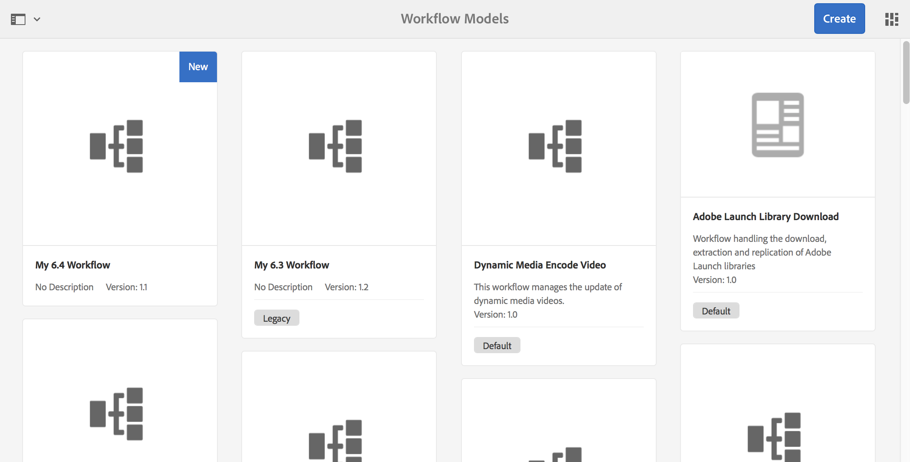

# 开发和扩展工作流{#developing-and-extending-workflows}

AEM提供多种工具和资源，用于创建工作流模型、开发工作流步骤以及与工作流进行有序交互。

工作流使您能够自动处理AEM环境中管理资源和发布内容的流程。 工作流由一系列步骤组成，每个步骤都实现离散任务。 您可以使用逻辑和运行时数据来决定进程何时可以继续，并从多个可能的步骤中选择下一步。

例如，用于创建和发布网页的业务流程包括不同参与者的批准和注销任务。 这些过程可以使用AEM工作流建模并应用于特定内容。

以下主要方面介绍，而以下页面则介绍更多详细信息：

* [创建工作流模型](/help/sites-developing/workflows-models.md)
* [扩展工作流功能](/help/sites-developing/workflows-customizing-extending.md)
* [以编程方式与工作流交互](/help/sites-developing/workflows-program-interaction.md)
* [工作流步骤参考](/help/sites-developing/workflows-step-ref.md)
* [工作流进程参考](/help/sites-developing/workflows-process-ref.md)
* [工作流最佳实践](/help/sites-developing/workflows-best-practices.md)

>[!NOTE]
>
>有关：
>
>* 参与工作流，请参阅 [使用工作流](/help/sites-authoring/workflows.md)。
>* 管理工作流和工作流实例，请参阅 [管理工作流](/help/sites-administering/workflows.md)。
>* 有关端到端社区文章，请参阅使用 [Adobe Experience Manager工作流修改数字资产。](https://helpx.adobe.com/experience-manager/using/modify_asset_workflow.html)
>* 请参阅 [询问AEM专家网络研讨会工作流](https://bit.ly/ATACE218)。
>* 有关端对端社区文章，请参 [阅创建自定义Adobe Experience Manager6.3动态参与者步骤](https://helpx.adobe.com/experience-manager/using/dynamic-steps-aem63.html)。
>* 对信息位置的更改请参阅AEM [6.4中的存储库重](/help/sites-deploying/repository-restructuring.md) 组和工作流 [-](/help/sites-developing/workflows-best-practices.md#locations)最佳实践——位置。

>

## 模型 {#model}

A `WorkflowModel` 表示工作流的定义（模型）。 它由和 `WorkflowNodes` 构成 `WorkflowTransitions`。 过渡连接节点并定义 *流*。 “模型”始终具有开始节点和结束节点。

### 运行时模型 {#runtime-model}

工作流模型版本化。 运行工作流实例时，它将使用（并保留）工作流的运行时模型（在启动工作流时可用）。

当在工作流模型编 [辑器 **中触发** “同步”时，将生成运行时模型](/help/sites-developing/workflows-models.md#sync-your-workflow-generate-a-runtime-model)。

在启动特定实例后对所发生的工作流模型和/ *或生成的* “运行时模型”所做的编辑不会应用于该实例。

>[!CAUTION]
>
>所执行的步骤由运行时模型 [定义](/help/sites-developing/workflows-models.md#sync-your-workflow-generate-a-runtime-model); 在工作流模型编辑器中 **触发** “同步”操作时生成。
>
>如果在此时间点之后工作流模型发生更改( **未触发** Sync)，则运行时实例将不反映这些更改。 只有更新后生成的运行时模型才会反映这些更改。 这些例外是基础ECMA脚本，它们只保留一次，因此会对这些脚本进行更改。

### 步骤 {#step}

每个步骤都可实现离散任务。 工作流步骤有不同类型：

* 参加者（用户／组）: 这些步骤将生成一个工作项并将其分配给用户或用户组。 用户必须完成工作项才能推进工作流。
* 进程（脚本、Java方法调用）: 这些步骤由系统自动执行。 ECMA脚本或Java类实现该步骤。 可以开发服务来监听特殊的工作流事件并根据业务逻辑执行任务。
* 容器（子工作流）: 此类型的步骤开始另一个工作流模型。
* 或拆分／加入： 使用逻辑确定下一步在工作流中执行的步骤。
* 和拆分／加入： 允许同时执行多个步骤。

所有步骤都共享以下通用属性： `Autoadvance` 和 `Timeout` 警报（脚本）。

### 过渡 {#transition}

A表 `WorkflowTransition` 示两个过渡 `WorkflowNodes` 之间的 `WorkflowModel`。

* 它定义两个连续步骤之间的链接。
* 可以应用规则。

### 工作项 {#workitem}

A `WorkItem` 是通过实例 `Workflow` 传递的单 `WorkflowModel`元 它包含实 `WorkflowData` 例所执行的操作以及对描述基础工作流 `WorkflowNode` 步骤的引用。

* 它用于识别任务，并放入相应的收件箱中。
* 工作流实例可以同时具有一个 `WorkItems` 或多个实例（取决于工作流模型）。
* 引 `WorkItem` 用工作流实例。
* 在存储库中， `WorkItem` 该工作流实例存储在下方。

### 有效负荷 {#payload}

引用必须通过工作流进行高级的资源。

有效负荷实现引用存储库中的资源（按路径、UUID或URL）或序列化的java对象。 在存储库中引用资源非常灵活，并且与sling结合起来非常有效； 例如，引用的节点可以呈现为表单。

### 生命周期 {#lifecycle}

在启动新工作流时（通过选择相应的工作流模型并定义有效负荷）创建，在处理结束节点时结束。

可以对工作流实例执行以下操作：

* 终止
* 暂停
* 继续
* 重新启动

已完成和终止的实例已存档。

### 收件箱 {#inbox}

每个用户帐户都有其自己的工作流收件箱，分配的收件 `WorkItems` 箱可在其中访问。

将 `WorkItems` 直接分配给用户帐户或分配给用户帐户所属的组。

### 工作流类型 {#workflow-types}

工作流模型控制台中指明了各种类型的工作流：

* **默认**

   这些是标准AEM实例中附带的现成工作流。

* 自定义工作流（控制台中没有指示器）

   这些是已创建为新工作流的工作流，或者来自已覆盖有自定义项的现成。

* **旧版**

   工作流在AEM的先前版本中创建。 这些组件可以在升级过程中保留，也可以作为上一版本的工作流包导出，然后导入到新版本中。

### 临时工作流 {#transient-workflows}

标准工作流在执行时保存运行时（历史记录）信息。 您还可以将工作流模型定义为“临 **时** ”，以避免此类历史记录被保留。 这用于性能调整，因为它节省／避免了用于保持信息的时间／资源。

临时工作流可用于以下任何工作流:

* 经常运行。
* 不需要工作流历史记录。

引入了临时工作流来加载大量资产，其中资产信息很重要，但工作流运行时历史记录不重要。

>[!NOTE]
>
>有关更 [多详细信息，请参阅](/help/sites-developing/workflows-models.md#creating-a-transient-workflow) “创建临时工作流”。

>[!CAUTION]
>
>当工作流模型被标记为“临时”时，仍有一些情况会保留运行时信息：
>
>* 负载类型（例如，视频）需要外部步骤进行处理； 在这种情况下，需要运行时历史记录才能进行状态确认。
>* 工作流进入 **AND Split**; 在这种情况下，需要运行时历史记录才能进行状态确认。
>* 当临时工作流进入参与者步骤时，它将模式（在运行时）更改为非临时工作流； 当任务被传递给某个人时，历史需要被保留

>

>[!CAUTION]
>
>在临时工作流中，您不应使用跳 **转步骤**。
>
>这是因为跳转 **步骤会** 创建一个sling作业，以便在点继续工作 `goto` 流。 这会破坏使工作流处于临时状态的目的，并在日志文件中生成错误。
>
>要在临时工作流中做出决策，您可以使用“或 **拆分”**。

>[!NOTE]
>
>有关临 [时工作流如何影响资产性能](/help/assets/performance-tuning-guidelines.md#transient-workflows) ，请参阅资产的最佳实践。

### 多资源支持 {#multi-resource-support}

激活 **工作流模型的** “多资源支持”意味着即使您选择多个资源，也会启动单个工作流实例； 这些将作为包附。

如果 **未为工作流模型** 激活多资源支持，并且选择了多个资源，则将为每个资源启动单个工作流实例。

>[!NOTE]
>
>有关更 [多详细信息，请参阅配置多资源支持的工作流](/help/sites-developing/workflows-models.md#configuring-a-workflow-for-multi-resource-support) 。

### 工作流阶段 {#workflow-stages}

工作流阶段可在处理任务时帮助可视化工作流的进度。 它们可用于概述工作流在处理过程中的作用，如运行工作流时，用户可以视图Stage描述的进 **度** （与单个步骤相反）。

由于各个步骤名称可以是特定的和技术性的，因此可以定义阶段名称以提供工作流进度的概念视图。

例如，对于具有六个步骤和四个阶段的工作流：

1. 您可以 [配置工作流阶段（显示工作流进度），然后为工作流中的每个步骤分配相应的阶段](/help/sites-developing/workflows-models.md#configuring-workflow-stages-that-show-workflow-progress):

   * 可以创建多个舞台名称。
   * 然后，单个阶段名称将分配给每个步骤（可以将阶段名称分配给一个或多个步骤）。

   | **步骤名称** | **阶段（分配给步骤）** |
   |---|---|
   | 步骤 1 | 创建 |
   | 步骤 2 | 创建 |
   | 步骤 3 | 审核 |
   | 步骤 4 | 批准 |
   | 步骤 5 | 完成 |
   | 步骤 6 | 完成 |

1. 运行工作流时，用户可以根据阶段名称（而非步骤名称）视图进度。 工作流进度将显示在收件箱 [中列出的工作项的任务详细信息窗口的](/help/sites-authoring/workflows-participating.md#opening-a-workflow-item-to-view-details-and-take-actions) “工作流信息” [选项卡中](/help/sites-authoring/inbox.md)。

### 工作流和Forms {#workflows-and-forms}

通常，工作流用于处理AEM中的表单提交。 这可以与标准AEM [实例中提供的核心组件](https://helpx.adobe.com/experience-manager/core-components/using/form-container.html) （表单组件）一起使用 [，也可以与AEM Forms解决](/help/forms/using/aem-forms-workflow.md)方案一起使用。

创建新表单时，表单提交可轻松与工作流模型关联； 例如，将内容存储在存储库的特定位置，或向用户通知表单提交及其内容。

### 工作流和翻译 {#workflows-and-translation}

工作流也是翻译流程的一 [个组成部分](/help/sites-administering/translation.md) 。
